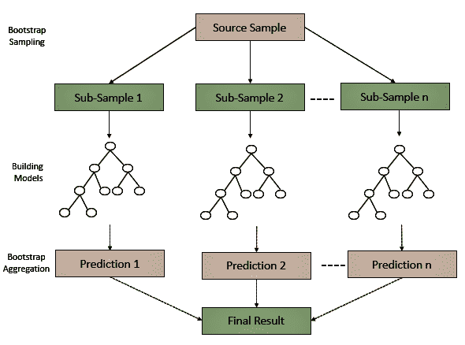
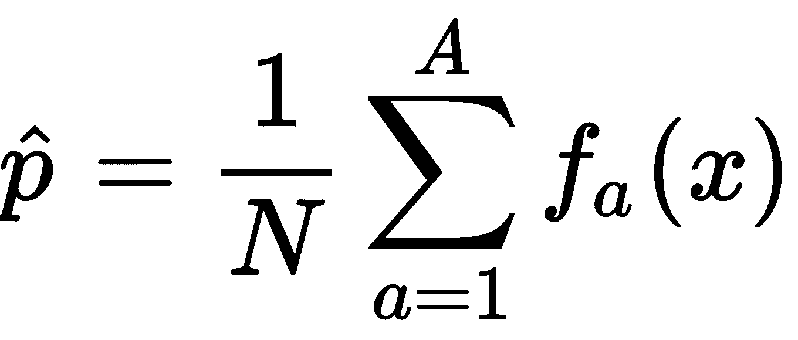
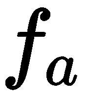
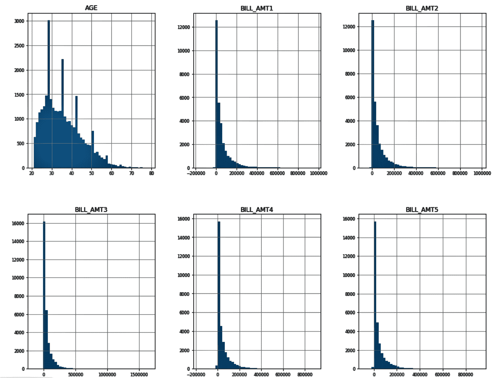
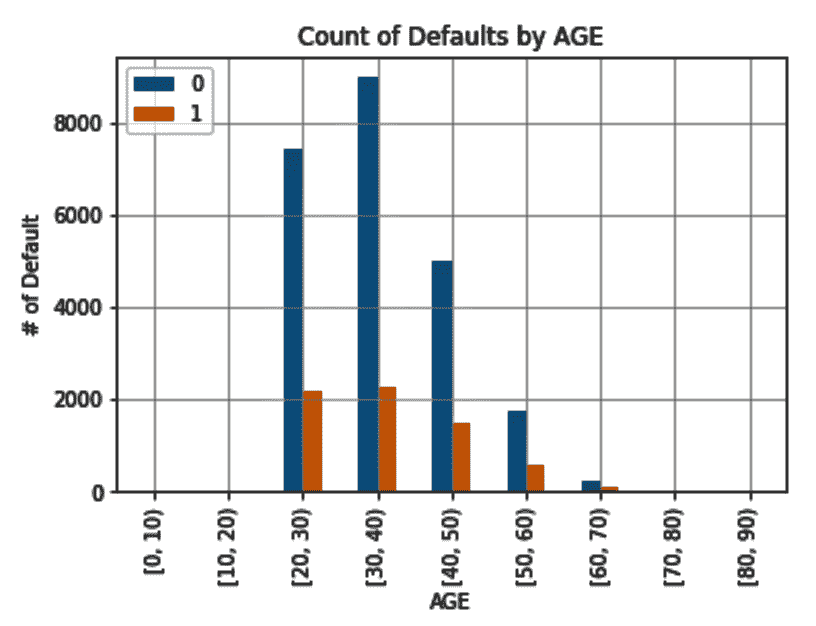
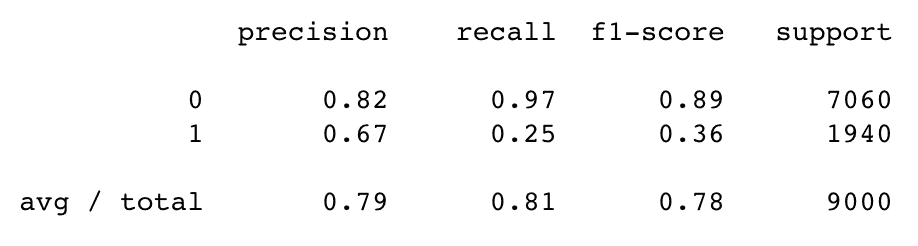
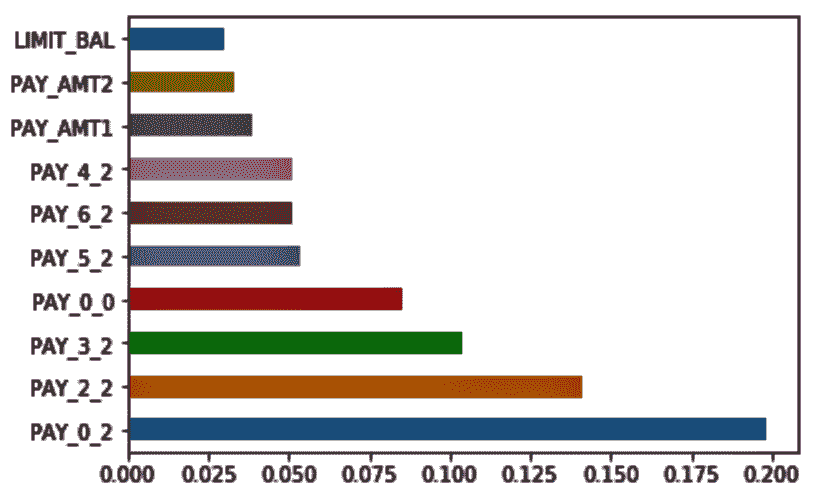
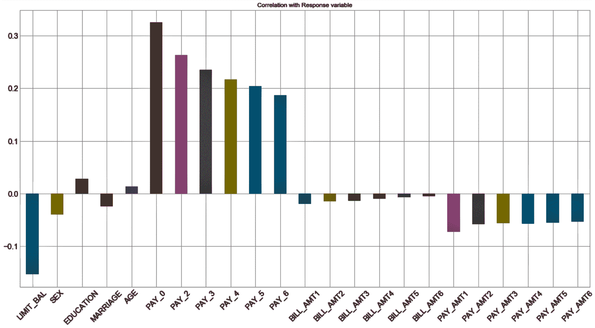
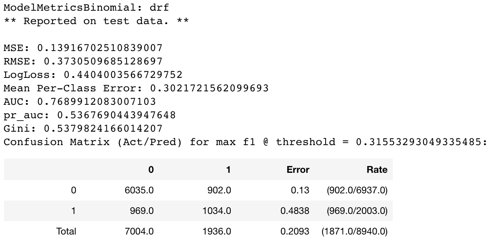
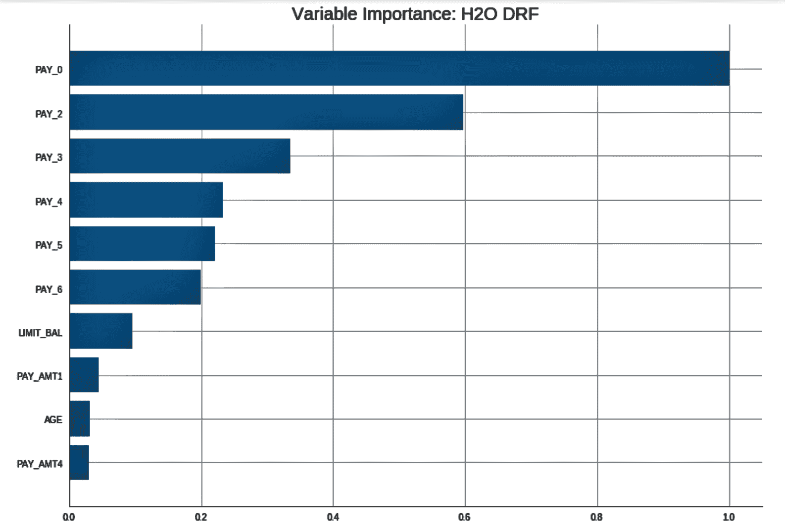

<title>When in Doubt, Use Random Forests</title>  

# 如果有疑问，使用随机森林

在本章中，我们将介绍以下配方:

*   随机森林简介
*   使用 scikit-learn 实现预测信用卡违约的随机森林
*   使用 H2O 实现预测信用卡违约的随机森林

<title>Introduction to random forests</title>  

# 随机森林简介

随机森林是一种基于集成学习的监督机器学习算法。它用于回归和分类问题。随机森林背后的一般思想是构建多个决策树，并聚合它们以获得准确的结果。决策树是一种确定性算法，这意味着如果向它提供相同的数据，每次都会生成相同的树。他们有过度拟合的倾向，因为他们用给定的数据建立了可能的最佳树，但当提供了看不见的数据时，可能无法进行归纳。组成随机森林的所有决策树都是不同的，因为我们在数据的不同随机子集上构建每棵树。随机森林往往比单一决策树更准确，因为它最大限度地减少了过度拟合。

下图演示了从源样本进行的引导抽样。在每个样本上建立模型，然后将预测组合起来，以得出最终结果:



随机森林中的每棵树都使用以下步骤构建，其中 A 代表整个森林，A 代表单棵树，对于 *a = 1* 到 *A* :

1.  创建一个带有替换的引导样本， *D* 训练来自 *x* ， *y* 标注这些 *X [a]* [，] *Y [a]*
2.  在*X[a]，*Y[a]上训练树*f[a]***
3.  对预测进行平均，或采用多数投票来得出最终预测

在回归问题中，对测试实例的预测是通过对所有树的预测取平均值来进行的。这可以表示如下:



这里， *N* 是随机森林中的总树数。 *a=1* 代表森林中的第一棵树，而森林中的最后一棵树是 *A* 。 ( )代表来自单个树的预测。

如果我们有一个分类问题，多数表决或最常见的答案被使用。

<title>Implementing a random forest for predicting credit card defaults using scikit-learn</title>  

# 使用 scikit-learn 实现预测信用卡违约的随机森林

scikit-learn 库通过提供两个估算器来实现随机森林:`RandomForestClassifier` 和`RandomForestRegressor`。它们采用各种参数，其中一些参数解释如下:

*   ` n_estimators` : 该参数是算法在进行最大投票或平均预测之前构建的树的数量。一般来说，树的数量越多，预测的性能和准确性就越好，但是在计算方面也花费更多。
*   `max_features`:该参数是允许随机森林在单个树中尝试的最大功能数量。
*   `min_sample_leaf` : 该参数决定了分割一个内部节点所需的最少叶子数。
*   `n_jobs`:这个超参数告诉引擎，为了拟合模型和预测新实例，要并行运行多少个作业。如果它的值为`None`或`1`，那么它只运行一个作业。值`-1`意味着它将使用所有的处理器。
*   `random_state` : 当该参数有一个确定值`random_state`时，如果给定了相同的超参数和相同的训练数据，该参数将总是产生相同的结果。
*   `oob_score`:该参数也称为****抽样**，是一种随机森林交叉验证方法。在这种采样方法中，大约有三分之一的数据不用于训练模型，而可用于评估其性能。这些样品被称为**开箱**样品**样品**。**

**<title>Getting ready</title>  

# 做好准备

在这个例子中，我们使用了一个来自 UCI ML 数据库的关于信用卡违约的数据集。该数据集包含以下信息:

*   违约付款
*   人口因素
*   信用数据
*   付款历史
*   信用卡客户账单

GitHub 文件夹中提供了数据和数据描述:

我们将从加载所需的库和读取数据集开始:

```
import os
import numpy as np
import pandas as pd
import matplotlib.pyplot as plt
%matplotlib inline
import seaborn as sns
```

我们将工作文件夹设置如下:

```
# Set your working directory according to your requirement
os.chdir(".../Chapter 6/Random Forest")
os.getcwd()
```

现在让我们来读取数据。我们将以`df_`作为数据帧名称的前缀，以便于理解:

```
df_creditcarddata = pd.read_csv("UCI_Credit_Card.csv")
```

我们检查数据集的形状:

```
df_creditcarddata.shape
```

我们检查数据类型:

```
df_creditcarddata.dtypes
```

我们删除了`ID`列，因为这不是必需的:

```
df_creditcarddata = df_creditcarddata.drop("ID", axis= 1) 
```

我们可以用各种方式探索我们的数据。让我们来看看几种不同的方法:

```
selected_columns = df_creditcarddata[['AGE','BILL_AMT1','BILL_AMT2','BILL_AMT3','BILL_AMT4','BILL_AMT5','BILL_AMT6', 'LIMIT_BAL']]

selected_columns.hist(figsize=(16, 20), bins=50, xlabelsize=8, ylabelsize=8);
```

注意，我们在前面代码块的最后一行使用了分号。分号有助于隐藏 Matplotlib 生成的详细信息。`xlabelsize`和`ylabelsize`用于调整 x 轴和 y 轴的字体大小。

下图显示了数值变量的分布:



我们现在将探讨按年龄组的付款默认值。我们存储`age`变量，并将存储的值存储在`df_creditcarddata`中的新变量`age_group`中:

```
df_creditcarddata['agegroup'] = pd.cut(df_creditcarddata['AGE'], range(0, 100, 10), right=False)
df_creditcarddata.head()
```

然后，我们使用新的`age_group`变量来绘制每个年龄组的违约数量:

```
# Default vs Age
pd.crosstab(df_creditcarddata.age_group, \
           df_creditcarddata["default.payment.next.month"]).plot(kind='bar',stacked=False, grid=True) 

plt.title('Count of Defaults by AGE')
plt.xlabel('AGE')
plt.ylabel('# of Default')
plt.legend(loc='upper left')
```

下面的屏幕截图显示了每个年龄段的违约数量:



我们可以从`df_creditcarddata`中删除`age_group`变量，因为我们不再需要它了:

```
df_creditcarddata = df_creditcarddata.drop(columns = ['age_group'])
df_creditcarddata.head()
```

我们现在将根据帐户持有人的信用限额来查看付款违约情况:

```
fig_facetgrid = sns.FacetGrid(df_creditcarddata, hue='default.payment.next.month', aspect=4)
fig_facetgrid.map(sns.kdeplot, 'LIMIT_BAL', shade=True)
max_limit_bal = df_creditcarddata['LIMIT_BAL'].max()
fig_facetgrid.set(xlim=(0,max_limit_bal));
fig_facetgrid.set(ylim=(0.0,0.000007));
fig_facetgrid.set(title='Distribution of limit balance by default.payment')
fig_facetgrid.add_legend()
```

前面的代码给出了下面的情节:


我们也可以给我们的一些变量分配标签，以使解释更好。我们为`Gender`、`Marriage`和`Education`变量分配标签。

我们还将`pay`变量的数据类型改为字符串:

```
GenderMap = {2:'female', 1:'male'}
MarriageMap = {1:'married', 2:'single', 3:'other', 0: 'other'}
EducationMap = {1:'graduate school', 2:'university', 3:'high school', 4:'others', 5:'unknown', 6:'unknown', 0:'unknown'}

df_creditcarddata['SEX'] = df_creditcarddata.SEX.map(GenderMap)
df_creditcarddata['MARRIAGE'] = df_creditcarddata.MARRIAGE.map(MarriageMap) 
df_creditcarddata['EDUCATION'] = df_creditcarddata.EDUCATION.map(EducationMap)
df_creditcarddata['PAY_0'] = df_creditcarddata['PAY_0'].astype(str) 
df_creditcarddata['PAY_2'] = df_creditcarddata['PAY_2'].astype(str) 
df_creditcarddata['PAY_3'] = df_creditcarddata['PAY_3'].astype(str) 
df_creditcarddata['PAY_4'] = df_creditcarddata['PAY_4'].astype(str) 
df_creditcarddata['PAY_5'] = df_creditcarddata['PAY_5'].astype(str) 
df_creditcarddata['PAY_6'] = df_creditcarddata['PAY_6'].astype(str) 
```

本书提供的代码包中有更多的探索。我们现在继续训练我们的随机森林模型。

<title>How to do it...</title>  

# 怎么做...

我们现在将看看如何使用随机森林来训练我们的模型:

1.  我们从分割目标变量和特征变量开始:

```
predictor= df_creditcarddata.iloc[:, df_creditcarddata.columns != 'default.payment.next.month']
target= df_creditcarddata.iloc[:, df_creditcarddata.columns == 'default.payment.next.month']
```

2.  我们在我们的特征集中分离数值和非数值变量:

```
# save all categorical columns in list
categorical_columns = [col for col in predictor.columns.values if predictor[col].dtype == 'object']

# dataframe with categorical features
df_categorical = predictor[categorical_columns]

# dataframe with numerical features
df_numeric = predictor.drop(categorical_columns, axis=1)
```

3.  我们对分类变量进行虚拟编码:

```
dummy_code_cat_vars = pd.get_dummies(df_categorical,drop_first=True)
```

4.  我们将伪代码变量连接到数据帧:

```
df_predictor = pd.concat([df_numeric, dummy_code_cat_vars], axis=1)
df_predictor.head()
```

5.  我们将数据集分成训练和测试子集:

```
from sklearn.model_selection import train_test_split
X_train,X_test, y_train, y_test = train_test_split(df_predictor, target, test_size = 0.30, random_state=0)
print("x_train ",X_train.shape)
print("x_test ",X_test.shape)
print("y_train ",y_train.shape)
print("y_test ",y_test.shape)
```

6.  我们用`StandardScaler()`来缩放特性:

```
from sklearn.preprocessing import StandardScaler
scaler = StandardScaler()
```

7.  我们可能会注意到列名已经被改成了数字。我们将列名和索引值赋回缩放后的数据帧:

```
X_train_scaled.columns = X_train.columns.values
X_test_scaled.columns = X_test.columns.values
X_train_scaled.index = X_train.index.values
X_test_scaled.index = X_test.index.values

X_train = X_train_scaled
X_test = X_test_scaled
```

8.  我们从`sklearn.ensemble`进口`RandomForestClassifier()`。然后，我们将构建随机森林分类器模型:

```
from sklearn.ensemble import RandomForestClassifier

classifier = RandomForestClassifier(random_state = 0, n_estimators = 100,\
 criterion = 'entropy', max_leaf_nodes= 20,oob_score = True, n_jobs = -1 )

# fit the model
model_RF = classifier.fit(X_train, y_train)
```

9.  之后，我们计算训练模型的准确性:

```
acc_random_forest = round(classifier.score(X_train, y_train) * 100, 2)
print(round(acc_random_forest,2,), "%")
```

10.  我们通过传递`y_test`和`y_pred_proba`到`roc_curve()`得到**f**假阳性率 ( **FPR** )和 **t** **假阳性率** ( **TPR** )。我们还使用`roc_auc_score()`得到`auc `值。使用 FPR、TPR 和 AUC 值，我们绘制 ROC 曲线，并在图上标注 AUC 值:

```
from sklearn import metrics

y_pred_proba = model_RF.predict_proba(X_test)[::,1]
fpr, tpr, _ = metrics.roc_curve(y_test, y_pred_proba)
auc = metrics.roc_auc_score(y_test, y_pred_proba)
plt.plot(fpr,tpr,label="AUC="+str(auc))
plt.legend(loc=4)
plt.show()
```

下图显示了标有 AUC 值的 ROC 曲线:


11.  我们还可以评估其他分数，如下所示:

```
# predict the model
y_pred_RF = model_RF.predict(X_test)

# evaluate other scores
evaluation_scores = pd.Series({'Model': " Random Forest Classifier ",
'ROC Score' : metrics.roc_auc_score(y_test, y_pred_RF),
'Precision Score': metrics.precision_score(y_test, y_pred_RF),
'Recall Score': metrics.recall_score(y_test, y_pred_RF),
'Accuracy Score': metrics.accuracy_score(y_test, y_pred_RF),
'Kappa Score':metrics.cohen_kappa_score(y_test, y_pred_RF)})

print(evaluation_scores)
```

上述代码产生以下评估分数:


12.  我们还可以基于目标变量的类别评估一些统计数据，在本例中是`0`或`1`:

```
from sklearn.metrics import classification_report
print(classification_report(y_test, y_pred_RF))
```

`sklearn.metrics`中的`classification_report`根据目标变量的每个类别给出了以下分数:



13.  我们可以根据特征重要性绘制前 10 个变量，以了解哪些变量对模型很重要:

```
feature_importances = pd.Series(classifier.feature_importances_, index=X_train.columns)
feature_importances.nlargest(10).plot(kind='barh') #top 10 features
```

以下截图显示了前 10 个变量及其相对重要性:



我们可以改变超参数，看看模型如何表现得更好。我们还可以对超参数值的组合进行网格搜索，以微调我们的模型。

<title>How it works...</title>  

# 它是如何工作的...

在*步骤 1* 中，我们分割了目标和特征变量。在*步骤 2* 中，在我们的特性集中，我们分离了数字和非数字变量。在*步骤 3* 和*步骤 4* 中，我们将非数字变量转换为虚拟编码变量，并将它们添加回数据帧。在*步骤 5* 中，我们将数据集分成训练和测试子集，在*步骤 6* 中，我们从`sklearn.preprocessing`导入`StandardScaler()`并对我们的特征应用相同的比例。

在执行了*步骤 6* 中的命令后，我们注意到列名已经变成了序列号。出于这个原因，在*步骤 7* 中，我们将列名和索引值赋回缩放后的数据帧。在*步骤 8* 中，我们从`sklearn.ensemble`导入了`RandomForestClassifier()`，并构建了我们的第一个随机森林分类器模型。之后，在*第 9 步*和*第 10 步*中，我们使用我们的模型来计算我们的训练模型的准确性，并分别绘制 ROC 曲线。我们还用 AUC 值标注了 ROC 曲线。

在*步骤 11* 中，我们评估了其他分数，包括 kappa 值、精确度、召回率和准确度。

在*第 12 步*中，我们还根据目标变量的每一类评估了这些分数，在本例中，目标变量是`0`或`1`，使用`sklearn.metrics`中的`classification_report`。在那里，`classification_report()`为我们提供了每个类的精度、召回率和 f1 值等指标，以及每个指标的平均值。

`classification_report()`报告平均值，包括平均总真阳性、假阴性和假阳性，平均每个标签的未加权平均值，以及平均每个标签的支持加权平均值。它还报告多标签分类的样本平均值。

最后，在*步骤 13* 中，我们查看了前 10 项功能的相对可变重要性。这有助于选择特征以构建具有正确特征的模型。

有各种可用的特征选择方法，例如平均变量、重要性、Boruta、递归特征选择和使用 RF 的变量选择。

<title>There's more...</title>  

# 还有更多...

隔离森林是另一种建立在决策树基础上的算法，用于异常和离群点检测。该算法基于异常数据点很少的假设。

该算法的工作方式与随机森林略有不同。它创建一组决策树，然后计算隔离树中的观察所需的路径长度。这个想法是，孤立的观察或异常更容易分离，因为区分它们与正常情况所需的条件更少。因此，异常将具有比正常观察更短的路径，并且因此将更靠近树根。当几个决策树被创建时，分数被平均，这给了我们一个好主意，哪些观察是真正异常的。因此，隔离林用于异常值和异常检测。

此外，隔离林不利用任何距离或密度测量来检测异常。与基于距离和基于密度的方法相比，这显著降低了计算成本。

在 scikit-learn 中，`sklearn.ensemble.IsolationForest`提供了隔离森林算法的实现。

<title>See also</title>  

# 请参见

*   隔离森林算法的 scikit-learn 实现可以在这里找到:[https://bit.ly/2DCjGGF](https://bit.ly/2DCjGGF)

<title>Implementing random forest for predicting credit card defaults using H2O</title>  

# 使用 H2O 实现预测信用卡违约的随机森林

H2O 是一个开源的分布式机器学习平台，允许你在大型数据集上建立机器学习模型。H2O 支持监督和非监督算法，速度极快，可扩展，易于实现。H2O 的 REST API 允许我们从外部程序(如 R 和 Python)访问它的所有功能。Python 中的 H2O 被设计成非常类似于 scikit-learn。在写这本书的时候，H2O 的最新版本是 H2O v3。

H2O 之所以给企业带来快如闪电的机器学习，有以下解释:

“H2O 的核心代码是用 Java 写的。在 H2O 内部，分布式键/值存储用于跨所有节点和机器访问和引用数据、模型、对象等。这些算法是在 H2O 的分布式 Map/Reduce 框架之上实现的，并利用 Java fork/join 框架实现多线程。数据被并行读取，分布在整个集群中，并以压缩的方式以列格式存储在内存中。H2O 的数据解析器具有内置智能，可以猜测传入数据集的模式，并支持以各种格式从多个来源接收数据”

-来自 h2o.ai

H2O 为我们提供了分布式随机森林，这是一个用于分类和回归任务的强大工具。这会生成多个树，而不是单个树。在分布式随机森林中，我们使用分类和回归模型的平均预测来得出最终结果。

<title>Getting ready</title>  

# 做好准备

Java 是 H2O 运行的必备软件。确保在 Jupyter 中使用以下命令安装了 Java:

```
! apt-get install default-jre
! java -version
```

你现在需要安装 H2O。要从 Jupyter 安装它，请使用以下命令:

```
! pip install h2o
```

导入所需的库:

```
import h2o
import seaborn as sns
import numpy as np
import pandas as pd
import seaborn
import matplotlib.pyplot as plt
%matplotlib inline

from h2o.estimators.random_forest import H2ORandomForestEstimator
from sklearn import metrics
```

要使用 H2O，我们需要初始化一个实例并连接到它。我们可以这样做:

```
h2o.init()
```

默认情况下，前面的命令尝试连接到实例。如果失败，它将尝试启动一个实例，然后连接到该实例。一旦连接到实例，我们将看到该实例的详细信息，如下所示:


我们将数据读入`pandas`数据帧:

```
df_creditcarddata = pd.read_csv("UCI_Credit_Card.csv")
```

我们使用`h2o.H2OFrame()`将我们的`pandas`数据帧更改为 H2O 数据帧。我们将`df_creditcarddata` H2O 数据帧命名为:

```
hf_creditcarddata = h2o.H2OFrame(df_creditcarddata)
```

检查 H2O 数据框中的数据是否正确加载，如下所示:

```
hf_creditcarddata.head()
```

我们可以用`describe()`方法看到汇总统计:

```
hf_creditcarddata.describe()
```

我们删除了 ID 列，因为我们的模型构建练习不需要它:

```
hf_creditcarddata = hf_creditcarddata.drop(["ID"], axis = 1) 
```

我们现在将继续探索我们的数据并构建我们的模型。

<title>How to do it...</title>  

# 怎么做...

在前一节中，我们已经对我们的数据进行了各种探索。我们探索数据的方式没有限制。在这一节中，我们将学习更多的技巧:

1.  我们检查每个特征变量与目标变量的相关性:

```
df_creditcarddata.drop(['default.payment.next.month'], \
     axis = 1).corrwith(df_creditcarddata['default.payment.next.month']).\
     plot.bar(figsize=(20,10), \
     title = 'Correlation with Response variable', \
     fontsize = 15, rot = 45, grid = True)
```

下图显示了每个特征如何与目标变量相关联:



2.  我们检查 H2O 数据框架中的数据类型。注意，对于`pandas`数据帧，我们使用了`dtypes`。对于 H2O 数据框架，我们使用类型:

```
hf_creditcarddata.types
```

3.  我们注意到它们都是整数数据类型。我们将把它们转换成因素类型，这在本质上是绝对的:

```
hf_creditcarddata['SEX'] = hf_creditcarddata['SEX'].asfactor()
hf_creditcarddata['EDUCATION'] = hf_creditcarddata['EDUCATION'].asfactor()
hf_creditcarddata['MARRIAGE'] = hf_creditcarddata['MARRIAGE'].asfactor()
hf_creditcarddata['PAY_0'] = hf_creditcarddata['PAY_0'].asfactor()
hf_creditcarddata['PAY_2'] = hf_creditcarddata['PAY_2'].asfactor()
hf_creditcarddata['PAY_3'] = hf_creditcarddata['PAY_3'].asfactor()
hf_creditcarddata['PAY_4'] = hf_creditcarddata['PAY_4'].asfactor()
hf_creditcarddata['PAY_5'] = hf_creditcarddata['PAY_5'].asfactor()
hf_creditcarddata['PAY_6'] = hf_creditcarddata['PAY_6'].asfactor()
```

我们可以用`hf_creditcarddata.types`检查数据类型，看看数据类型转换是否已经发生。

4.  我们将二进制目标变量编码为因子类型变量:

```
hf_creditcarddata['default.payment.next.month'] = \
             hf_creditcarddata['default.payment.next.month'].asfactor() 
hf_creditcarddata['default.payment.next.month'].levels() 
```

5.  我们选择特征和`target`变量:

```
predictors = ['LIMIT_BAL','SEX','EDUCATION','MARRIAGE','AGE','PAY_0','PAY_2','PAY_3','PAY_4','PAY_5','PAY_6','BILL_AMT1','BILL_AMT2','BILL_AMT3','BILL_AMT4','BILL_AMT5','BILL_AMT6','PAY_AMT1','PAY_AMT2','PAY_AMT3','PAY_AMT4','PAY_AMT5','PAY_AMT6']

target = 'default.payment.next.month'
```

6.  我们现在将 H2O 数据帧分成训练和测试子集。我们使用 70%的数据来训练模型，剩下的 30%用于验证:

```
splits = hf_creditcarddata.split_frame(ratios=[0.7], seed=123) 
train = splits[0]
test = splits[1] 
```

7.  我们用默认设置构建我们的随机森林模型。您可以使用以下命令检查测试数据的模型性能:

```
from h2o.estimators.random_forest import H2ORandomForestEstimator

RF_D = H2ORandomForestEstimator(model_id = 'RF_D',seed = 123)
RF_D.train(x = predictors, y = target, training_frame = train)

print(RF_D.model_performance(test))
```

这为我们提供了以下性能指标:



<title>How it works...</title>  

# 它是如何工作的...

在*准备*部分，我们安装了 JRE 和 H2O。我们用`h2o.init()`初始化并连接到一个 H2O 实例。然后，我们使用`pandas`读取数据，并将其转换为 H2O 数据帧。我们在 H2O 数据框架上使用了`head()`和`describe()`方法，就像我们在`pandas`数据框架上使用它们一样。然后我们从 H2O 数据框架中删除了`ID`列。

在*准备就绪*部分完成这些数据探索后，我们继续下一步。在*步骤 1 中，*我们检查了每个特征与`target`变量的相关性。在*步骤 2* 中，我们使用了`h2o`数据帧并检查了数据类型。

注意，对于`pandas`数据帧，我们使用了`dtypes`，而对于`h2o `数据帧，我们使用了`types`。

在*步骤 3* 中，我们使用`asfactor()`将数字变量转换为分类类型。我们对应该是分类类型但却显示为数字的变量执行了此操作。

在前面的例子中，我们在一个`pandas`数据帧上使用了`astype()`方法。对于 H2O 数据框架，我们使用了`asfactor()`方法。

在*步骤 4* 中，我们在`target`变量上使用了`asfactor()`将其转换为分类变量。

在*步骤 5* 中，我们分离了我们的特征和`target`变量。在*步骤* 6 中，我们在 H2O 数据帧上使用`split_frame()`将 H2O 数据帧分成训练和测试子集。我们使用`ratios`参数，并将其设置为`split_frame()`的`ratios=[0.7]`，将 70%的数据分配给训练集，30%的数据分配给测试集。

在*第 7 步*中，我们从`h2o.estimators.random_forest`导入了`H2ORandomForestEstimator`。我们传递了`model_id`，然后引用它来调用`train()`函数，并传递预测器和`target`变量。然后，我们通过将测试子集传递给`model_performance()`来查看性能指标。

<title>There's more...</title>  

# 还有更多...

在前面的例子中，我们有一个 AUC 为`0.76`和 log loss 为`0.44`:

1.  我们可以通过将`nfolds`作为参数传递给`H2ORandomForestEstimator()`来应用交叉验证:

```
RF_cv = H2ORandomForestEstimator(model_id = 'RF_cv', 
                                 seed = 12345, 
                                 ntrees = 500, 
                                 sample_rate = 0.9, 
                                 col_sample_rate_per_tree = 0.9, 
                                 nfolds = 10)

RF_cv.train(x = predictors, y = target, training_frame = train)
print(RF_cv.model_performance(test))
```

我们注意到 AUC 略微提高到`0.77`，原木损失下降到`0.43`:


2.  我们还可以应用网格搜索从给定的选项中提取最佳模型。我们将选项设置如下:

```
search_criteria = {'strategy': "RandomDiscrete"}

hyper_params = {'sample_rate': [0.5, 0.6, 0.7],\
                'col_sample_rate_per_tree': [0.7, 0.8, 0.9],\
                'max_depth': [3, 5, 7]}
```

3.  我们使用前面的搜索参数构建模型:

```
from h2o.grid.grid_search import H2OGridSearch

RF_Grid = H2OGridSearch(
                    H2ORandomForestEstimator(
                        model_id = 'RF_Grid', 
                        ntrees = 200, 
                        nfolds = 10,
                        stopping_metric = 'AUC', 
                        stopping_rounds = 25), 
                    search_criteria = search_criteria, # full grid search
                    hyper_params = hyper_params)
RF_Grid.train(x = predictors, y = target, training_frame = train)
```

4.  我们现在按 AUC 降序排列所有模型，然后选择 AUC 最高的第一个模型:

```
RF_Grid_sorted = RF_Grid.get_grid(sort_by='auc',decreasing=True)
print(RF_Grid_sorted)

best_RF_model = RF_Grid_sorted.model_ids[0]
best_RF_from_RF_Grid = h2o.get_model(best_RF_model)
```

5.  我们为测试数据应用最佳模型:

```
best_RF_from_RF_Grid.model_performance(test)
```

6.  我们可以从迄今为止已经实现的最佳模型中绘制出变量重要性:

```
best_RF_from_RF_G
rid.varimp_plot()
```

这给了我们以下的情节:



<title>See also</title>  

# 请参见

您可能希望研究极度随机化的树，它们的实现略有不同，但有时比随机森林的性能更好。

在集成方法中，每个模型在数据集子集和用于训练的特征向量子集方面进行不同的学习。这些子集是随机选取的。极度随机化的树在计算分割和所选特征子集的方式上具有很高的随机性。与随机森林不同，在随机森林中，分裂阈值是随机选择的，在极度随机化的树中，使用区别阈值作为分裂规则。由于这个原因，整体的总体方差减小，并且总体性能可能更好。

极度随机化树的 scikit-learn 实现可以在以下链接找到:【https://bit.ly/2zWsNNS[。H2O 也支持极度随机化的树。](https://bit.ly/2zWsNNS)**