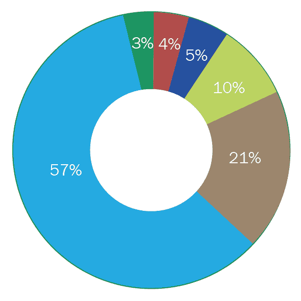
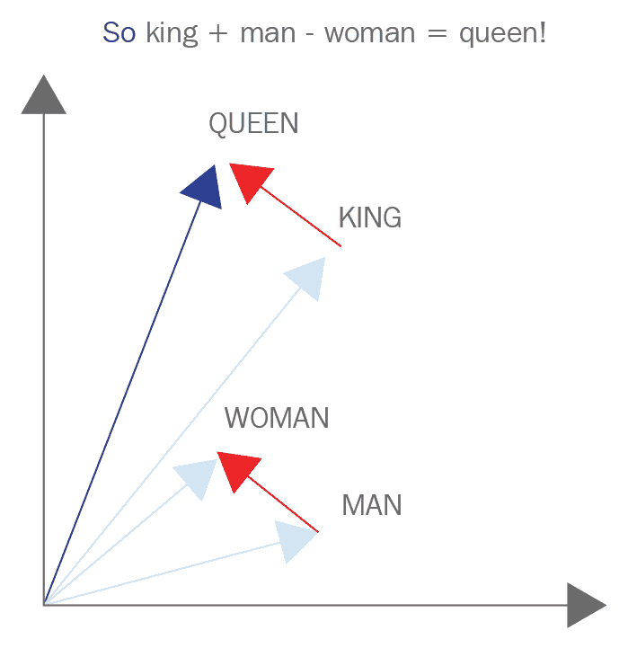

# 特征工程导论

近年来，工程师和高管们一直试图实现**机器学习** ( **ML** )和**人工智能** ( **AI** )来解决大部分问题，这些问题一直是使用相当人工的方法来解决的。一个很好的例子是自然语言处理的进步，更具体地说是自然语言生成和理解的进步。更具体地说，我们指出人工智能系统能够从用户(可能是最新智能手机的不满用户)那里读取原始文本，并能够以人类的散文和机器的速度清晰准确地做出回应。在本章中，我们将介绍特征工程的主题，例如:

*   为什么特征工程很重要的激励性例子
*   对机器学习有基本的了解，包括性能、评估
*   本书包含的章节的详细列表


# 激励人心的例子——人工智能驱动的通信

认识一下 Arty，我们的人工智能聊天系统，它能够处理和响应传入的客户支持请求，就像我们的任何人类员工一样。Arty 对我们公司了如指掌，一接到通知就准备出发。

下面是一个人类和人工智能客户支持系统之间对话的例子:

| **人类** | **艾** |
| 你好，我的电话坏了。 | 很遗憾听到这个消息，它是怎么坏的？ |
| 它被冻结了，我不能重置它。 | 是什么手机？ |
| 新的 iDroid 28 | 啊，我明白了。按住电源和音量按钮 20 秒，它应该会重置。 |
| 成功了，谢谢！ | 没问题，祝你愉快。 |

这些类型的系统令人兴奋并扰乱主要市场的原因是这样一个复杂系统的简单性。让我们来分解一下。从表面上看，你可能会想，*这是一个多么简单的问题啊！这个人有一个简单的问题和简单的解决方案。一个请求进来，一个响应出来。*你好，我的手机死机了，我该怎么办？很简单，重置一下就行了。当然，从表面上看，这就是这里正在发生的事情:**

```
from Arty import AI
AI.respond_to("my phone froze, what should I do?")
>> "reset it."
```

当你从人工智能的角度来看时，困难的部分就来了。它没有我们人类所拥有的全部经历。它还没有机会阅读伊利亚德甚至大红狗克利福德，并学会将它们的信息内化。关键是，人工智能没有很多阅读东西的经验。这个人工智能可能已经被给了几十万(甚至几百万)过去人们的聊天对话，并被告知去弄清楚它。

以下是根据之前的聊天记录提供给我们的人工智能系统的数据示例:

| **请求** | **响应** |
| 你好 | 嗨，有什么问题吗？ |
| 我的电话坏了！！！！ | 哦不！！！！这是怎么回事？ |
| 等一下，我得去遛狗。BRB。 | 好的。我会等的。 |
| 嘿。 | 你好。我叫马克，有什么可以帮忙的吗？ |

数据被组织成两列，其中`Request`列表示终端用户在聊天支持对话中输入的内容。下一列`Response`表示客户支持代理对传入消息的响应。

当阅读成千上万的错别字、愤怒的消息和断开的聊天时，人工智能开始认为它已经停止了客户支持。一旦发生这种情况，人类就会释放人工智能，让新的聊天进来。人类没有意识到他们的错误，开始注意到人工智能还没有完全掌握这一点。人工智能似乎不能识别甚至简单的消息，并不断返回无意义的响应。人们很容易认为人工智能只是需要更多的时间或更多的数据，但这些解决方案只是解决更大问题的权宜之计，往往甚至没有在第一时间解决问题。

潜在的问题很可能是以原始文本形式提供给人工智能的数据不够好，人工智能无法理解英语的细微差别。例如，一些问题可能包括:

*   错别字无缘无故地人为扩大了人工智能的词汇量。*hello*和 *hello* 是两个不同的词，彼此没有联系。
*   同义词对人工智能毫无意义。像*你好*和*嘿*这样的词没有相似性，因此人为地增加了问题的难度。


# 为什么特征工程很重要

数据科学家和机器学习工程师经常收集数据以解决问题。因为他们试图解决的问题通常是高度相关的，并且在这个混乱的世界中自然地存在和发生，所以旨在代表问题的数据也可能最终变得非常混乱和未经过滤，并且通常是不完整的。

这就是为什么在过去的几年里，像*数据工程师*这样的职位不断出现。这些工程师的独特工作是设计管道和架构，以处理原始数据并将其转化为公司其他人可用的东西，特别是数据科学家和机器学习工程师。这项工作不仅与机器学习专家创建机器学习管道的工作一样重要，而且经常被忽视和低估。

数据科学家在该领域进行的一项调查显示，他们 80%以上的时间都花在了捕获、清理和组织数据上。剩下不到 20%的时间花在创建这些机器学习管道上，最终主导了对话。而且，这些数据科学家大部分时间都在准备数据；超过 75%的人还表示，准备数据是他们工作过程中最不愉快的部分。

以下是前面提到的调查结果:

下图显示了数据科学家花费最多时间做的事情:


如上图所示，我们将数据科学家的任务划分为以下百分比:

*   **建立训练集** : 3%
*   **清洁整理数据** : 60%
*   **收集集合数据** : 19%
*   **挖掘模式数据** : 9%
*   **细化算法** : 5%

数据科学中最不愉快的部分也有类似的饼图:



从图中可以看出，对数据科学中最不愉快的部分进行的类似调查显示:

*   建立训练集 : 10 %
*   **清理整理数据** : 57%
*   **收集数据集** : 21%
*   **数据模式挖掘** : 3%
*   **提炼算法** : 4%
*   **其他** : 5%

最上面的图表显示了数据科学家在流程的不同部分花费的时间百分比。数据科学家 80%以上的时间都花在准备供进一步使用的数据上。下方的图表显示了被调查者报告数据科学过程中最不愉快部分的百分比。超过 75%的人表示准备数据是他们最不喜欢的部分。

数据来源:[https://whatshebigdata . com/2016/05/01/data-scientists-spend-most-their-time-cleaning-data/](https://whatsthebigdata.com/2016/05/01/data-scientists-spend-most-of-their-time-cleaning-data/)。

恒星数据科学家知道，准备数据不仅如此重要，以至于占用了他们的大部分时间，他们还知道这是一个艰巨的过程，可能是不愉快的。太多时候，我们认为机器学习竞赛和学术来源给我们的干净数据是理所当然的。超过 90%的数据，有趣的和最有用的数据，以这种原始格式存在，就像前面描述的 AI 聊天系统一样。

**准备数据**可以是一个模糊的短语。准备工作包括捕获数据、存储数据、清理数据等等。正如前面的图表所示，数据科学家花在清理和组织数据上的时间较少，但仍占大部分。正是在这个过程中，我们的数据工程师对我们最有用。清理是指将数据转换为我们的云系统和数据库可以轻松解释的格式的过程。组织通常是指更彻底的转变。组织往往涉及到将数据集的整个格式转换成更整洁的格式，例如将原始聊天日志转换成表格行/列结构。

下面是**打扫**和**组织**的图示:

 

顶部的转换表示清理服务器日志的样本，包括数据和服务器上正在发生的事情的文本说明。注意，清洁时， **&放大器；**字符是一个 Unicode 字符，被转换成可读性更好的&符号( **&** )。清理阶段留下的文档几乎和以前的格式一模一样。底层组织的转变更加激进。它将原始文档转换为行/列结构，其中每一行代表服务器采取的单个操作，列代表服务器操作的属性。在本例中，这两个属性是**D**ate 和 **Text** 。

清理和组织都属于更大的数据科学范畴，而这恰好是本书《特性工程》的主题。


# 什么是特征工程？

最后是书名。

是的，伙计们，特征工程将是这本书的主题。我们将把重点放在为机器学习管道的目的而清理和组织数据的过程上。我们还将超越这些概念，以数学公式和神经理解的形式来看待更复杂的数据转换，但我们已经超越了自己。让我们开始一个高水平。

**Feature engineering** is the process of transforming data into features that better represent the underlying problem, resulting in improved machine learning performance.

为了进一步分解这个定义，让我们来看看特征工程到底需要什么:

*   **转换数据的过程**:注意我们没有指定原始数据、未过滤的数据等等。特征工程可以应用于任何阶段的数据。通常，我们会将特征工程技术应用于数据分发者眼中已经*处理过的*数据。还有一点很重要，那就是我们将要处理的数据通常是表格格式的。数据将被组织成行(观察值)和列(属性)。有时候，我们会从最原始的数据开始，比如前面提到的服务器日志示例，但在大多数情况下，我们会处理已经清理和组织过的数据。
*   **特色**:特色这个词显然会在本书中大量使用。在最基本的层面上，特征是对机器学习过程有意义的数据属性。很多时候，我们会诊断表格数据，并识别哪些列是特性，哪些只是属性。
*   更好地代表潜在的问题:我们将要处理的数据总是用来代表特定领域中的特定问题。重要的是要确保我们在执行这些技术的同时，不会忽略更大的画面。我们希望转换数据，以便它更好地代表手头的更大问题。
*   **提高机器学习性能**:特征工程作为数据科学过程的一部分存在。正如我们所看到的，这是一个重要的，但往往被低估的部分。特征工程的最终目标是获得我们的学习算法能够从中提取模式并使用的数据，以便获得更好的结果。我们将在本书的后面深入讨论机器学习指标和结果，但现在，我们知道我们执行特征工程不仅是为了获得更干净的数据，而且最终在我们的机器学习管道中使用这些数据。

我们知道你在想什么，*为什么我要花时间去读那些人们说他们不喜欢做的事情呢？我们认为，许多人不喜欢特征工程的过程，因为他们通常不了解他们所做工作的结果。*

大多数公司都同时雇佣数据工程师和机器学习工程师。数据工程师主要关注数据的准备和转换，而机器学习工程师通常具有学习算法的工作知识，以及如何从已经清理的数据中挖掘模式。

他们的工作通常是独立的，但又是相互交织和重复的。数据工程师将为机器学习工程师提供一个数据集，他们会声称他们无法从中获得良好的结果，并要求数据工程师尝试进一步转换数据，等等。这个过程不仅单调重复，还会损害大局。

如果没有特征和机器学习工程的知识，整个过程可能不会尽如人意。这就是这本书的由来。我们将讨论特征工程以及它如何与机器学习直接相关。这将是一种以结果为导向的方法，当且仅当技术能够带来绩效的提升时，我们才会认为技术是有帮助的。现在有必要深入研究一下数据、数据结构和机器学习的基础知识，以确保术语的标准化。


# 了解数据和机器学习的基础知识

当我们谈论数据时，我们通常是在处理表格数据，即组织成行和列的数据。可以把它想象成可以在 Microsoft Excel 等电子表格技术中打开。每行数据，也称为**观察**，代表一个问题的单个实例/例子。如果我们的数据属于股票市场日内交易的范围，一次观察可能代表整个市场和价格一小时的变化。

例如，在处理网络安全领域时，观察可能代表可能的攻击或通过无线系统发送的数据包。

下面显示了网络安全领域(更具体地说是网络入侵)的样本表格数据:

| **日期时间** | **协议** | **紧急** | **恶意** |
| 2018 年 6 月 2 日 | 传输控制协议（Transmission Control Protocol） | 错误的 | 真实的 |
| 2018 年 6 月 2 日 | 超文本传送协议 | 真实的 | 真实的 |
| 2018 年 6 月 2 日 | 超文本传送协议 | 真实的 | 错误的 |
| 2018 年 6 月 3 日 | 超文本传送协议 | 错误的 | 真实的 |

我们看到每一行或观察由一个网络连接组成，我们有观察的四个属性:`DateTime`、`Protocol`、`Urgent`和`Malicious`。虽然我们不会深入研究这些特定的属性，但我们会简单地注意到以表格形式提供给我们的数据的结构。

因为在大多数情况下，我们会认为我们的数据是表格形式的，所以我们也可以查看数据矩阵只有一个列/属性的特定实例。例如，如果我们正在构建一个软件，它能够获取一个房间的单一图像，并输出该房间中是否有人。输入的数据可以表示为一列的矩阵，其中这一列只是一个房间照片的 URL，除此之外别无其他。

例如，考虑下面的表，其中只有一个标题为`Photo URL`的列。该表的值是与数据科学家相关的照片的 URL(这些是假的，不会指向任何地方，纯粹是示例):

| 照片 URL |
| [http://photo-storage.io/room/1](http://photo-storage.io/room/1) |
| [http://photo-storage.io/room/2](http://photo-storage.io/room/2) |
| 【http://photo-storage.io/room/3】 |
| [http://photo-storage.io/room/4](http://photo-storage.io/room/4) |

输入到系统中的数据可能只有一列，就像这样。在我们创建一个可以分析图像的系统的能力中，输入可能只是一个到所讨论图像的 URL。这将取决于我们作为数据科学家来设计 URL 的特征。

作为数据科学家，我们必须准备好接收和处理数据，这些数据可能是大的、小的、宽的、窄的(就属性而言)、稀疏的(可能有丢失的值)，并准备好利用这些数据进行机器学习。现在是时候多谈谈这个了。机器学习算法属于一类算法，这些算法根据其提取和利用数据中的模式来完成基于历史训练数据的任务的能力来定义。含糊不清，对不对？机器学习可以处理许多类型的任务，因此我们将保持机器学习的定义不变，并深入一点。

我们通常将机器学习分为两种主要类型，监督学习和非监督学习。每种类型的机器学习算法都可以从特征工程中受益，因此我们理解每种类型是很重要的。


# 监督学习

我们经常在监督学习的特定环境中听到特征工程，也称为预测分析。监督学习算法专门处理使用数据的其他属性来预测值(通常是数据的属性之一)的任务。以表示网络入侵的数据集为例:

| **日期时间** | **协议** | **紧急** | **恶意** |
| 2018 年 6 月 2 日 | 传输控制协议（Transmission Control Protocol） | 错误的 | 真实的 |
| 2018 年 6 月 2 日 | 超文本传送协议 | 真实的 | 真实的 |
| 2018 年 6 月 2 日 | 超文本传送协议 | 真实的 | 错误的 |
| 2018 年 6 月 3 日 | 超文本传送协议 | 错误的 | 真实的 |

这是与之前相同的数据集，但让我们在预测分析的上下文中进一步剖析它。

注意，我们有这个数据集的四个属性:`DateTime`、`Protocol`、`Urgent`和`Malicious`。现在假设恶意属性包含表示观察是否是恶意入侵尝试的值。因此，在我们非常小的四个网络连接的数据集中，第一个、第二个和第四个连接是恶意入侵网络的尝试。

进一步假设给定这个数据集，我们的任务是能够接受三个属性(`datetime`、`protocol`和`urgent`)，并且能够准确预测恶意的值。用外行人的话来说，我们想要一个可以将`datetime`、`protocol`和`urgent`的值映射到恶意中的值的系统。监督学习问题就是这样建立的:

```
Network_features = pd.DataFrame({'datetime': ['6/2/2018', '6/2/2018', '6/2/2018', '6/3/2018'], 'protocol': ['tcp', 'http', 'http', 'http'], 'urgent': [False, True, True, False]})
Network_response = pd.Series([True, True, False, True])
Network_features
>>
 datetime protocol  urgent

0  6/2/2018      tcp   False

1  6/2/2018     http    True

2  6/2/2018     http    True

3  6/3/2018     http   False
Network_response
>>
 0     True

1     True

2    False

3     True

dtype: bool
```

当我们使用监督学习时，我们通常调用我们试图预测其响应的数据集的属性(通常只有其中之一，但这不是必需的)。数据集的其余属性称为**特征**。

监督学习也可以被认为是一类试图利用数据结构的算法。通过这一点，我们的意思是机器学习算法试图从通常非常好和整洁的数据中提取模式。如前所述，我们不应该总是期望数据整齐地出现；这就是特征工程的用武之地。

但是如果我们不预测什么，你可能会问机器学习有什么用？我很高兴你这么做了。在机器学习可以利用数据结构之前，有时我们必须改变甚至创建结构。这就是无监督学习成为一个有价值的工具的地方。


# 无监督学习

监督学习就是做预测。我们利用数据的特征，并使用它们来对数据的响应做出信息性的预测。如果我们不是通过探索结构来做出预测，我们是试图从我们的数据中提取结构。我们通常通过将数学变换应用于数据的数值矩阵表示或迭代过程来获得新的特征集。

这个概念可能比监督学习更难理解，因此我将给出一个激励性的例子来帮助阐明这一切是如何工作的。


# 无监督学习示例——市场细分

假设我们有一个大型(一百万行)数据集，其中每一行/观察都是一个人，具有基本的人口统计信息(年龄、性别等)以及购买的商品数量，这表示此人从特定商店购买了多少商品:

| **年龄** | **性别** | **购买的商品数量** |
| 25 | F | 一 |
| 28 | F | 23 |
| 61 | F | 3 |
| 54 | M | 17 |
| 51 | M | 8 |
| 47 | F | 3 |
| 27 | M | 22 |
| 31 | F | 14 |

这是我们营销数据集的一个示例，其中每行代表一个客户，每个人都有三个基本属性。我们的目标是将这个数据集分成不同类型或不同人群**群**,以便执行分析的公司能够更好地了解客户概况。

当然，现在我们只显示了一百万行中的 8 行，这可能会令人望而生畏。当然，我们可以对这个数据集执行基本的描述性统计，并获得我们的数字列的平均值、标准偏差等等；然而，如果我们希望将这 100 万人分成不同的**类型**，以便营销部门能够更好地了解购物人群的类型，并为每个细分市场制作更合适的广告，会怎么样呢？

每一种类型的顾客都表现出独特的品质，使该细分市场独一无二。例如，他们可能会发现 20%的客户属于他们喜欢称之为年轻和富有的类别，他们通常更年轻，并购买多种商品。

这种类型的分析和这些类型的创建可以归入一种特定类型的无监督学习，称为**聚类**。我们将在本书的后面更详细地讨论这种机器学习算法，但现在，聚类将创建一个新的功能，将人们分成不同的类型或聚类:

| **年龄** | **性别** | **购买的商品数量** | **集群** |
| 25 | F | 一 | 6 |
| 28 | F | 23 | 一 |
| 61 | F | 3 | 3 |
| 54 | M | 17 | 2 |
| 51 | M | 8 | 3 |
| 47 | F | 3 | 8 |
| 27 | M | 22 | 5 |
| 31 | F | 14 | 一 |

这显示了应用聚类算法后的客户数据集。请注意末尾名为`cluster`的新列，它表示算法已经识别的人的类型。这个想法是，属于相似集群*的人在数据方面表现*相似(具有相似的年龄、性别、购买行为)。或许集群六可以被重新命名为*年轻买家*。

这个聚类的例子向我们展示了为什么有时我们不关心预测什么，而是希望通过添加新的有趣的特征，甚至删除不相关的特征来更深层次地理解我们的数据。

注意，我们将每一列称为一个特征，因为在无监督学习中没有响应，因为没有预测发生。

现在一切都开始有意义了，不是吗？我们反复谈论的这些特征是本书主要关注的。特征工程涉及与无监督和有监督学习相关的特征的理解和转换。


# 机器学习算法和特征工程程序的评估

值得注意的是，在文献中，术语*特征*和*属性*之间经常存在鲜明的对比。术语**属性**通常用于表格数据中的列，而术语**特征**通常仅用于有助于机器学习算法成功的属性。也就是说，有些属性对我们的机器学习系统可能是无益的，甚至是有害的。例如，当预测一辆二手车在需要维修之前可以使用多长时间时，汽车的颜色可能并不能很好地反映这一价值。

在这本书里，我们一般会把所有的专栏都称为特性，直到它们被证明是无益的或者有害的。当这种情况发生时，我们通常会在代码中忽略这些属性。因此，考虑这一决定的依据是极其重要的。如何评估一个机器学习系统，然后使用这个评估来执行特征工程？


# 特征工程程序示例——真的有人能预测天气吗？

考虑一个用来预测天气的机器学习管道。为了简单起见，在我们的介绍章节中，假设我们的算法直接从传感器获取大气数据，并设置为预测两个值之间的一个，即*太阳*或*雨*。这个管道显然是一个分类管道，只能给出两个答案中的一个。我们会在每天开始的时候运行这个算法。如果算法输出*太阳*并且当天大部分时间是晴天，那么算法是正确的，同样，如果算法预测*下雨*并且当天大部分时间是雨天，那么算法是正确的。在任何其他情况下，该算法将被认为是不正确的。如果我们连续一个月每天运行该算法，我们将获得近 30 个预测天气和实际观测天气的值。我们可以计算算法的精确度。也许该算法在 30 天中有 20 天预测正确，这使我们认为该算法的准确率为三分之二，即大约 67%。使用这个标准化的值或精确度，我们可以调整我们的算法，看看精确度是上升还是下降。

当然，这是一种过度简化，但其思想是，对于任何机器学习管道，如果我们不能使用一组标准度量来评估其性能，它基本上是无用的，因此，如果没有所述评估过程，应用于机器学习改进的特征工程是不可能的。在本书中，我们将重温这种评估的思想；然而，让我们简单地谈谈，一般来说，我们将如何处理这个想法。

当提出特征工程中的一个主题时，通常会涉及到转换我们的数据集(根据特征工程的定义)。为了明确地说明某个特定的特征工程过程是否对我们的机器学习算法有所帮助，我们将遵循下一节中详述的步骤。


# 评估特征工程程序的步骤

以下是评估特征工程程序的步骤:

1.  在应用任何特征工程程序之前，获得机器学习模型的基线性能
2.  应用特征工程和特征工程程序的组合
3.  对于特征工程的每一个应用，获取一个性能度量，并将其与我们的基线性能进行比较
4.  如果增量(变化)性能领先于阈值(通常由人类定义)，我们认为该过程是有帮助的，并将其应用于我们的机器学习管道
5.  这种性能上的变化通常以百分比来衡量(如果基线从 40%的准确率提高到 76%，那就是 90%的提高)

在性能方面，这种想法在机器学习算法之间有所不同。大多数关于机器学习的好入门书籍会告诉你，在实践数据科学时，有几十种公认的度量标准。

在我们的案例中，因为本书的重点不一定是机器学习，而是对功能的理解和转换，我们将使用基线机器学习算法和相关的基线度量来评估功能工程程序。


# 评估监督学习算法

当执行预测建模(也称为**监督学习**)时，性能直接取决于模型利用数据结构并使用该结构进行适当预测的能力。一般来说，我们可以将监督学习进一步细分为两种更具体的类型，**分类**(预测定性响应)和**回归**(预测定量响应)。

当我们评估分类问题时，我们将使用五重交叉验证直接计算逻辑回归模型的准确性:

```
# Example code for evaluating a classification problem
from sklearn.linear_model import LogisticRegression
from sklearn.model_selection import cross_val_score
X = some_data_in_tabular_format
y = response_variable
lr = LinearRegression()
scores = cross_val_score(lr, X, y, cv=5, scoring='accuracy')
scores
>> [.765, .67, .8, .62, .99]
```

同样，在评估回归问题时，我们将使用五重交叉验证的线性回归的**均方误差** ( **MSE** ):

```
# Example code for evaluating a regression problem
from sklearn.linear_model import LinearRegression
from sklearn.model_selection import cross_val_score
X = some_data_in_tabular_format
y = response_variable
lr = LinearRegression()
scores = cross_val_score(lr, X, y, cv=5, scoring='mean_squared_error')
scores
>> [31.543, 29.5433, 32.543, 32.43, 27.5432]
```

我们将使用这两个线性模型，而不是更新，更先进的模型，因为它们的速度和低方差。这样，我们可以确信，性能的任何提高都与特征工程过程直接相关，而不是与模型提取模糊和隐藏模式的能力相关。


# 评估无监督学习算法

这有点棘手。因为无监督学习与预测无关，所以我们不能根据模型预测值的好坏来直接评估性能。也就是说，如果我们正在执行聚类分析，例如在前面的市场细分示例中，那么我们通常会利用**剪影系数**(衡量-1 和 1 之间聚类的分离和内聚性)和一些人为分析来确定特征工程程序是否提高了模型性能，或者我们是否只是在浪费时间。

下面是一个使用 Python 和 scikit 的例子——学习导入和计算一些假数据的剪影系数:

```
attributes = tabular_data
cluster_labels = outputted_labels_from_clustering

from sklearn.metrics import silhouette_score
silhouette_score(attributes, cluster_labels)
```

我们将在本书的后面花更多的时间在无监督学习上，因为它变得更加相关。我们的大多数例子将围绕预测分析/监督学习。

重要的是要记住，我们标准化算法和度量的原因是为了展示功能工程的力量，以便您可以成功地重复我们的过程。实际上，可以想象您正在优化准确性以外的东西(例如真正的阳性率)，并且希望使用决策树而不是逻辑回归。这不仅很好，而且受到鼓励。但是，您应该始终记住按照步骤评估特征工程程序，并比较基线和工程后性能。

有可能你读这本书不是为了提高机器学习性能。特征工程在其他领域也很有用，比如假设检验和一般统计。在本书的几个例子中，我们将会看到应用于各种统计测试的统计显著性的特征工程和数据转换。我们将探索 R ² 和 p 值等指标，以判断我们的程序有什么帮助。

一般来说，我们将在三个类别的上下文中量化特征工程的好处:

*   **监督学习**:也称为**预测分析**
    *   回归分析——预测一个*定量*变量:
        *   将利用 MSE 作为我们的主要衡量指标
    *   分类分析—预测一个*定性*变量
        *   将准确性作为我们的主要衡量标准
*   **无监督学习**:聚类——由数据行为表示的元属性的分配；
    *   将利用轮廓系数作为我们的主要衡量标准
*   **统计测试**:使用相关系数、t 检验、卡方检验和其他方法来评估和量化原始数据和转换数据的有用性

在接下来的几个章节中，我们将会看到本书所涵盖的内容。


# 特征理解-我的数据集中有什么？

在我们的第一个副题中，我们将开始建立处理数据的基础。通过了解我们面前的数据，我们可以开始对下一步的方向有更好的想法。我们将开始探索不同类型的数据，以及如何识别数据集中的数据类型。我们将查看来自几个领域的数据集，并确定它们之间的不同之处和相似之处。一旦我们能够轻松地检查数据并识别不同属性的特征，我们就可以开始理解允许的转换类型，并承诺改善我们的机器学习算法。

在不同的理解方法中，我们将探讨:

*   结构化与非结构化数据
*   数据的四个层次
*   识别缺失的数据值
*   探索性数据分析
*   描述统计学
*   数据可视化

我们将从识别的结构开始，然后是我们面前的数据类型。一旦我们能够理解数据是什么，我们就可以开始解决数据问题。例如，我们必须知道我们的数据丢失了多少，以及当我们有丢失的数据时该怎么办。

毫无疑问，数据可视化、描述性统计和探索性数据分析都是特征工程的一部分。我们将从机器学习工程师的角度来探索这些过程。这些程序中的每一个都有能力增强我们的机器学习管道，我们将使用它们来测试和改变关于我们数据的假设。


# 功能改进–清理数据集

在本主题中，我们利用我们对数据的理解结果来清理数据集。这本书的大部分将以这种方式流动，使用前几节的结果，以便能够在当前几节中工作。在特性改进方面，我们的理解将允许我们开始对数据集的第一次操作。我们将使用数学转换来增强给定的数据，但不会删除或插入任何新的属性(这将在下一章中介绍)。

我们将在这一部分探讨几个主题，包括:

*   结构化非结构化数据
*   数据输入—在以前没有数据的地方插入数据(丢失数据)
*   数据标准化:

    *   标准化(也称为 z 分数标准化)
    *   最小-最大缩放
    *   L1 和 L2 标准化(投射到不同的空间，有趣的东西)

到书的这一点，我们将能够识别我们的数据是否有一个*结构*。也就是说，我们的数据是否是一个好的表格格式。如果不是，本章将为我们提供将数据转换成表格格式的工具。当试图创建机器学习管道时，这是必要的。

数据输入是一个特别有趣的话题。在以前丢失的数据中填充数据的能力比听起来要复杂。我们将提出各种各样的解决方案，从非常非常简单的，只需完全删除该列，boom 不再有丢失的数据，到有趣的复杂，使用机器学习其余的功能来填补丢失的点。一旦我们填充了大量缺失的数据，我们就可以测量这如何影响我们的机器学习算法。

标准化使用(通常简单的)数学工具来改变数据的比例。同样，这从简单的将英里转换为英尺或磅转换为千克，到更困难的，例如将我们的数据投影到单位球上(后面会有更多)。

本章和其余章节将更侧重于我们的定量特征工程过程评估流程。几乎每次我们看到一个新的数据集或特征工程程序，我们都会对它进行测试。我们将根据机器学习性能、速度和其他指标对各种特征工程方法的性能进行评级。该文本应仅用作参考，而不是作为使用特征工程选择程序的指南，根据难度和性能变化，您可以**忽略**。每个新的数据任务都有自己的注意事项，可能需要与前一个数据任务不同的过程。


# 功能选择–对不好的属性说不

通过这一章，我们在处理新的数据集时会有一定的把握。我们将有能力理解和清理我们面前的数据。一旦我们能够处理提供给我们的数据，我们就可以开始做出重大决策，例如，*在什么时候一个特征实际上是一个属性*。回想一下，通过特性与属性的区别，问题实际上是，*哪些列对我的 ML 管道没有帮助，因此损害了我的管道，应该被删除？*本章重点介绍用于决定从数据集中删除哪些属性的技术。我们将探讨几个统计和迭代过程，这将有助于我们在这个决定。

这些过程包括:

*   相关系数
*   识别和消除多重共线性
*   卡方检验
*   方差分析测试
*   p 值的解释
*   迭代特征选择
*   使用机器学习测量熵和信息增益

所有这些过程都将试图建议删除特征，并给出这样做的不同原因。最终，将由我们这些数据科学家做出最终决定，哪些功能将被允许保留并为我们的机器学习算法做出贡献。


# 特征构建——我们能构建它吗？

在前几章中，我们重点关注删除对我们的机器学习管道没有帮助的特征，而本章将研究创建全新特征并将它们正确放置在我们的数据集中的技术。这些新特性将理想地保存新信息并生成新模式，ML 管道将能够利用这些新模式来提高性能。

这些创建的特征可以来自许多地方。通常，我们会从现有的特性中创造出新的特性。我们可以通过对现有要素应用变换来创建新要素，并将生成的矢量与之前的矢量放在一起。我们还将考虑从不同的政党系统中添加新功能。例如，如果我们正在处理试图根据购物行为对人们进行聚类的数据，那么我们可能会从添加独立于公司及其购买数据的人口普查数据中受益。然而，这将带来一些问题:

*   如果人口普查知道有 1700 个 Jon，而公司只知道 13 个，我们怎么知道 1700 人中哪一个符合这 13 个呢？这叫做*实体匹配*
*   普查数据将非常庞大，实体匹配将需要很长时间

这些问题以及更多的问题导致了一个相当困难的过程，但是经常会产生一个非常密集和数据丰富的环境。

在本章中，我们将花一些时间来讨论通过高度非结构化的数据手动创建特征。两个很大的例子是文本和图像。这些数据本身对于机器学习和人工智能管道来说是不可理解的，所以由我们来手动创建代表图像/文本的特征。举个简单的例子，假设我们正在制造一辆无人驾驶汽车的基本部件，首先，我们想制造一个模型，它可以接收汽车在它面前看到的图像，并决定它是否应该停下来。原始图像不够好，因为机器学习算法不知道如何处理它。我们必须手动从中构建特征。给定这张原始图像，我们可以用几种方式将其拆分:

*   我们可以考虑每个像素的颜色强度，并将每个像素视为一个属性:
    *   例如，如果汽车的照相机产生 2，048 x 1，536 像素的图像，我们将有 3，145，728 列
*   我们可以将每行像素视为一个属性，每行的平均颜色值为:
    *   在这种情况下，只有 1，536 行
*   我们可以将这个图像投射到空间中，在空间中特征代表图像中的目标。这是三个中最难的，看起来像这样:

| **停车标志** | **猫** | **天空** | **道路** | **片片草地** | **潜艇** |
| 一 | 0 | 一 | 一 | 四 | 0 |

其中每个特征是可能在或可能不在图像内的对象，并且该值表示该对象在图像中出现的次数。如果一个模特得到了这些信息，最好停下来！


# 特征转换–输入数学人

这一章是事情变得数学化和有趣的地方。我们将会谈到理解特征和清理它们。我们还将了解如何删除和添加新功能。在我们的特征构造章节中，我们必须手动创建这些新特征。我们人类不得不开动脑筋，想出三种方法来分解停车标志的图像。当然，我们可以创建自动生成特性的代码，但是我们最终选择了我们想要使用的特性。

本章将开始研究这些特征的自动创建，因为它适用于数学维度。如果我们将我们的数据视为 n 空间中的向量(n 是列的数量)，我们会问自己，*我们能否在 k 空间(其中 k < n)中创建一个新的数据集，它完全或几乎代表原始数据，但可能会给我们带来机器学习的速度提升或性能增强？*这里的目标是创建一个维度更小的数据集，它在维度更大的情况下比我们的原始数据集表现得更好。

这里的第一个问题是，*在我们选择特征之前，我们不是在更小的维度上创建数据吗？如果我们从 17 个特征开始，去掉 5 个，我们就把维度减少到了 12 个，对吗？*是的，当然！然而，我们不是简单地谈论在这里删除列，我们是在谈论使用复杂的数学变换(通常取自我们的线性代数研究)并将它们应用到我们的数据集。

我们将要花一些时间讨论的一个著名例子叫做**主成分分析** ( **PCA** ) *。*这是一种将我们的数据分解为三个不同数据集的转换，我们可以使用这些结果来创建全新的数据集，这些数据集可以超越我们的原始数据集！

这里有一个直观的例子，取自普林斯顿大学的一项研究实验，该实验使用主成分分析来探索基因表达的模式。这是降维的一个很好的应用，因为有如此多的基因和基因组合，即使是世界上最复杂的算法也需要大量的时间来处理它们:


在前面的截图中， **A** 表示原始数据集，其中 **U** 、 **W** 和 **V ^T** 表示奇异值分解的结果。然后将结果放在一起，形成一个全新的数据集，在一定程度上可以取代**和**。


# 特征学习——利用人工智能改善我们的人工智能

顶端的樱桃，由当今用于自动构建特征以改善机器学习和人工智能管道的最复杂算法驱动的樱桃。

上一章讨论了使用数学公式的自动特征创建，但是最终，还是我们人类选择了公式并从中获益。本章将概述算法，这些算法本身并不是数学公式，而是一种架构，它试图以一种利用数据中的模式来创建新数据的方式来理解和建模数据。这可能听起来很模糊，但我们希望能让你对此感到兴奋！

我们将主要关注专门设计用于神经网络设计(节点和权重)的神经算法。这些算法然后会以一种有时人类无法理解但对机器极其有用的方式将特征强加给数据。我们将探讨的一些主题包括:

*   受限玻尔兹曼机器
*   Word2Vec/GLoVe 用于词嵌入

Word2Vec 和 GLoVe 是向文本中看似单词的标记添加大维度数据的两种方式。例如，如果我们查看 Word2Vec 算法结果的可视化表示，我们可能会看到以下内容:



通过将单词表示为欧几里得空间中的向量，我们可以获得类似数学的结果。在前面的例子中，通过添加这些自动生成的特征，我们可以*添加*和*减去*单词，方法是添加和减去 Word2Vec 给我们的矢量表示。然后我们可以得出有趣的结论，比如**国王+男人-女人=王后**。酷！


# 摘要

特征工程是一项由数据科学家和机器学习工程师承担的巨大任务。这是一项任务，对于成功的和生产就绪的机器学习管道来说是必不可少的。在接下来的七章中，我们将探讨特征工程的六个主要方面:

*   特征理解:学习如何根据数据的质量和数量状态来识别数据
*   功能改进:清理和输入缺失的数据值，以最大化数据集的价值
*   特征选择——统计地选择特征集并对其进行子集化，以减少数据中的噪声
*   特征构建——构建新的特征，目的是利用特征交互
*   特征转换——提取数据集中潜在的(隐藏的)结构，以便用数学方法将数据集转换成新的(通常更好的)东西
*   特征学习——利用深度学习的力量以全新的视角来看待数据，这将带来新的问题需要解决。

在本书中，我们将探索特征工程，因为它与我们的机器学习工作有关。通过将这个大主题分解成我们的子主题，并在单独的章节中深入研究每一个子主题，我们将能够对这些过程如何工作以及如何在 Python 中应用每一个过程获得更广泛、更有用的理解。

在下一章，我们将直接进入第一小节，*特性理解*。我们将最终得到一些真实的数据，所以让我们开始吧！