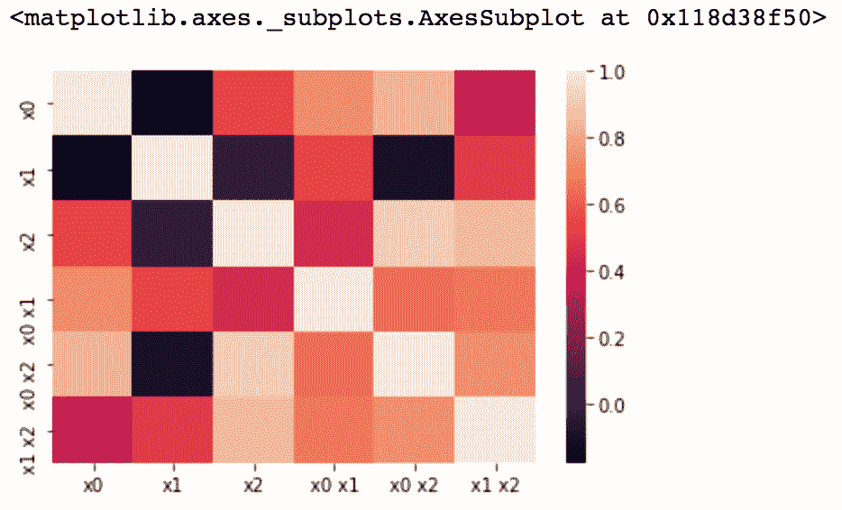

# 四、特征构造

在前一章中，我们使用了`Pima Indian Diabetes Prediction`数据集，以更好地了解数据集中哪些给定的要素最有价值。通过使用我们可用的特征，我们确定了列中缺失的值，并采用了丢弃缺失值、输入和规范化/标准化数据的技术来提高我们的机器学习模型的准确性。

值得注意的是，到目前为止，我们只处理了定量的特征。现在，除了丢失值的定量数据之外，我们还将处理分类数据。我们的主要焦点将是使用我们给定的特征来构建全新的特征供我们的模型学习。

我们可以利用各种方法来构建要素，最基本的方法是从 Python 中的 pandas 库开始，将现有要素放大倍数。我们将深入到一些数学上更密集的方法中，并将通过 scikit-learn 库使用各种可用的包；我们还将创建自己的自定义类。当我们进入代码的时候，我们将详细地检查这些类。

我们将在讨论中涉及以下主题:

*   检查我们的数据集
*   输入分类特征
*   编码分类变量
*   扩展数字特征
*   特定文本特征构造


# 检查我们的数据集

出于演示的目的，在本章中，我们将利用我们已经创建的数据集，以便我们可以展示各种数据级别和类型。让我们建立我们的数据框架，并深入我们的数据。

我们将使用 pandas 来创建我们将使用的数据框架，因为这是 pandas 中的主要数据结构。pandas 数据框架的优点是有几个属性和方法可供我们在数据上执行。这使我们能够从逻辑上操纵数据，以彻底了解我们正在处理的内容，以及如何最好地构建我们的机器学习模型:

1.  首先，我们来导入`pandas`:

```
# import pandas as pd
```

2.  现在，我们可以建立我们的`DataFrame X`。为此，我们将利用 pandas 中的`DataFrame`方法，它创建一个表格数据结构(包含行和列的表)。这个方法可以接受几种类型的数据(比如 NumPy 数组或字典)。这里，我们将传入一个字典，其中键作为列标题，值作为列表，每个列表代表一列:

```
X = pd.DataFrame({'city':['tokyo', None, 'london', 'seattle', 'san francisco', 'tokyo'], 

                  'boolean':['yes', 'no', None, 'no', 'no', 'yes'], 

                  'ordinal_column':['somewhat like', 'like', 'somewhat like', 'like', 'somewhat like', 'dislike'], 

                  'quantitative_column':[1, 11, -.5, 10, None, 20]})
```

3.  这将给我们一个四列六行的数据帧。让我们打印出我们的数据图表`X`，看看这些数据:

```
print X
```

我们得到如下输出:

|  | **布尔型** | **城市** | **序数 _ 列** | **量化 _ 栏目** |
| **0** | 是 | 东京 | 有点像 | 1.0 |
| **1** | 不 | 没有人 | 喜欢 | 11.0 |
| **2** | 没有人 | 伦敦 | 有点像 | -0.5 |
| **3** | 不 | 西雅图 | 喜欢 | 10.0 |
| **4** | 不 | 旧金山 | 有点像 | 圆盘烤饼 |
| **5** | 是 | 东京 | 不喜欢 | 20.0 |

让我们看看我们的列，并确定我们的数据级别和类型:

*   `boolean`:该列由二进制分类数据表示(是/否)，处于名义水平
*   `city`:该列由分类数据表示，也在名义级别
*   `ordinal_column`:正如您可能已经从列名中猜到的那样，这个列由序数数据表示，在序数级别上
*   `quantitative_column`:该列在比率级别用整数表示


# 输入分类特征

现在我们已经了解了我们正在处理的数据，让我们来看看我们缺少的值:

*   为此，我们可以使用 pandas 中的`isnull`方法来处理数据帧。该方法返回一个大小相同的对象，指示值是否为空。
*   然后我们将`sum`查看哪些列缺少数据:

```
X.isnull().sum()
>>>>
boolean                1

city                   1

ordinal_column         0

quantitative_column    1

dtype: int64
```

在这里，我们可以看到有三列缺少值。我们的行动方针将是估算这些缺失的值。

如果您还记得，我们在前一章中实现了 scikit-learn 的`Imputer`类来填充数字数据。`Imputer`有一个分类选项`most_frequent`，但是它只对编码为整数的分类数据有效。

我们可能并不总是希望以这种方式转换我们的分类数据，因为它会改变我们解释分类信息的方式，所以我们将构建自己的转换器。对于 transformer，我们指的是一种方法，通过这种方法，一个列将估算缺失值。

事实上，我们将在这一章中构建几个自定义的转换器，因为它们对于转换我们的数据非常有用，并为我们提供了 pandas 或 scikit-learn 中不容易提供的选项。

让我们从分类专栏`city`开始。正如我们有输入平均值来填充数值数据的缺失行的策略一样，我们对分类数据也有类似的方法。要估算分类数据的值，请用最常见的类别填充缺失的行。

为此，我们需要找出`city`栏中最常见的类别:

注意，我们需要指定我们正在使用的列，以采用一种叫做`value_counts`的方法。这将返回一个降序排列的对象，因此第一个元素是出现频率最高的元素。

我们将只获取对象中的第一个元素:

```
# Let's find out what our most common category is in our city column
X['city'].value_counts().index[0]

>>>>
'tokyo'
```

我们可以看到`tokyo`似乎是最常见的城市。现在我们知道了用哪个值来估算缺失的行，让我们填充这些槽。有一个`fillna`函数，它允许我们精确地指定我们想要如何填充缺失值:

```
# fill empty slots with most common category
X['city'].fillna(X['city'].value_counts().index[0])

```

`city`列现在看起来像这样:

```
0            tokyo

1            tokyo

2           london

3          seattle

4    san francisco

5            tokyo

Name: city, dtype: object
```

很好，现在我们的`city`列不再有缺失值了。然而，我们的另一个分类列`boolean`仍然如此。与其使用同样的方法，不如让我们构建一个自定义的估算器，它将能够处理所有分类数据的估算。


# 自定义估算器

在开始编写代码之前，让我们快速回顾一下管道:

*   流水线允许我们顺序地应用一系列转换和一个最终估计器
*   管道的中间步骤必须是**转换**，这意味着它们必须实现`fit`和`transform`方法
*   最终的估计器只需要实现`fit`

管道的目的是组装几个步骤，这些步骤可以在设置不同参数的同时进行交叉验证。一旦我们为每个需要输入的列构建了自定义转换器，我们将通过管道传递它们，这样我们的数据就可以一次转换完毕。让我们开始构建我们的自定义类别估算器。


# 自定义类别估算器

首先，我们将利用 scikit-learn `TransformerMixin`基类来创建我们自己的自定义分类估算器。该转换器(以及本章中的所有其他定制转换器)将作为管道中的一个元素，使用 fit 和`transform`方法工作。

下面的代码块在本章中将变得非常熟悉，所以我们将详细检查每一行:

```
from sklearn.base import TransformerMixin

class CustomCategoryImputer(TransformerMixin):

    def __init__(self, cols=None):

        self.cols = cols

    def transform(self, df):

        X = df.copy()

        for col in self.cols:

            X[col].fillna(X[col].value_counts().index[0], inplace=True)

        return X

    def fit(self, *_):

        return self
```

这个代码块中发生了很多事情，所以让我们按行分解它:

1.  首先，我们有了一个新的`import`语句:

```
from sklearn.base import TransformerMixin
```

2.  我们将从 scikit-learn 继承`TransformerMixin`类，它包括一个`.fit_transform`方法，该方法调用我们将创建的`.fit`和`.transform`方法。这允许我们在我们的转换器中维护一个类似于 scikit-learn 的结构。让我们初始化我们的自定义类:

```
class CustomCategoryImputer(TransformerMixin):

    def __init__(self, cols=None):

        self.cols = cols
```

3.  我们现在已经实例化了我们的自定义类，并且有了初始化属性的`__init__`方法。在我们的例子中，我们只需要初始化一个实例属性，`self.cols`(这将是我们作为参数指定的列)。现在，我们可以构建我们的`fit`和`transform`方法:

```
def transform(self, df):

        X = df.copy()

        for col in self.cols:

            X[col].fillna(X[col].value_counts().index[0], inplace=True)

        return X
```

4.  在这里，我们有我们的`transform`方法。它接收一个数据帧，第一步是复制数据帧并将其重命名为`X`。然后，我们将迭代我们在`cols`参数中指定的列，以填充缺失的槽。`fillna`部分可能感觉很熟悉，因为它是我们在第一个例子中使用的函数。我们使用相同的函数并对其进行设置，以便我们的自定义分类估算器可以一次跨几列工作。在缺失值被填充后，我们返回填充的数据帧。接下来是我们的`fit`方法:

```
def fit(self, *_):

        return self
```

我们将我们的`fit`方法设置为简单的`return self`，这是 scikit-learn 中`.fit`方法的标准。

5.  现在我们有了一个自定义的方法，允许我们估算我们的分类数据！让我们用两个分类列`city`和`boolean`来看看它的作用:

```
# Implement our custom categorical imputer on our categorical columns.

cci = CustomCategoryImputer(cols=['city', 'boolean'])

```

6.  我们已经初始化了我们的自定义分类估算器，现在我们需要`fit_transform`这个估算器到我们的数据集:

```
cci.fit_transform(X)
```

我们的数据集现在看起来像这样:

|  | **布尔型** | **城市** | **序数 _ 列** | **定量 _ 列** |
| **0** | 是 | 东京 | 有点像 | 1.0 |
| **1** | 不 | 东京 | 喜欢 | 11.0 |
| **2** | 不 | 伦敦 | 有点像 | -0.5 |
| **3** | 不 | 西雅图 | 喜欢 | 10.0 |
| **4** | 不 | 旧金山 | 有点像 | 圆盘烤饼 |
| **5** | 是 | 东京 | 不喜欢 | 20.0 |

太好了！我们的`city`和`boolean`列不再是缺失值。然而，我们的定量列仍然有空值。因为默认的估算器不能选择列，所以让我们再定制一个。


# 自定义定量估算器

我们将使用与自定义类别估算器相同的结构。这里的主要区别是，我们将利用 scikit-learn 的`Imputer`类在我们的列上实际进行转换:

```
# Lets make an imputer that can apply a strategy to select columns by name

from sklearn.preprocessing import Imputer
class CustomQuantitativeImputer(TransformerMixin):

    def __init__(self, cols=None, strategy='mean'):

        self.cols = cols

        self.strategy = strategy

    def transform(self, df):

        X = df.copy()

        impute = Imputer(strategy=self.strategy)

        for col in self.cols:

            X[col] = impute.fit_transform(X[[col]])

        return X

    def fit(self, *_):

        return self
```

对于我们的`CustomQuantitativeImputer`，我们添加了一个`strategy`参数，它将允许我们精确地指定我们希望如何估算定量数据的缺失值。这里，我们选择了`mean`来替换丢失的值，并且仍然使用`transform`和`fit`方法。

同样，为了估算我们的数据，我们将调用`fit_transform`方法，这次指定用于估算的列和`strategy`:

```
cqi = CustomQuantitativeImputer(cols=['quantitative_column'], strategy='mean')

cqi.fit_transform(X)
```

或者，除了分别调用我们的`CustomCategoryImputer`和`CustomQuantitativeImputer`之外，我们还可以在管道中设置它们，这样我们就可以一次性转换数据集。让我们看看如何:

1.  从我们的`import`陈述开始:

```
# import Pipeline from sklearn
from sklearn.pipeline import Pipeline
```

2.  现在，我们可以通过我们的自定义估算器:

```
imputer = Pipeline([('quant', cqi), ('category', cci)]) imputer.fit_transform(X)
```

让我们看看管道转换后数据集的样子:

|  | **布尔型** | **城市** | **序数 _ 列** | **定量 _ 列** |
| **0** | 是 | 东京 | 有点像 | 1.0 |
| **1** | 不 | 东京 | 喜欢 | 11.0 |
| **2** | 不 | 伦敦 | 有点像 | -0.5 |
| **3** | 不 | 西雅图 | 喜欢 | 10.0 |
| **4** | 不 | 旧金山 | 有点像 | 8.3 |
| **5** | 是 | 东京 | 不喜欢 | 20.0 |

现在我们有一个没有丢失值的数据集可以使用了！


# 编码分类变量

概括地说，到目前为止，我们已经成功地估算了我们的数据集——我们的分类列和定量列。在这一点上，你可能想知道，*我们如何利用机器学习算法的分类数据？*

简单地说，我们需要将这种分类数据转换成数字数据。到目前为止，我们已经确保使用最常见的类别来填充缺失的值。现在已经完成了，我们需要更进一步。

任何机器学习算法，无论是线性回归还是利用欧几里德距离的 KNN，都需要数字输入特征来学习。有几种方法可以将我们的分类数据转换成数字数据。


# 标称级别的编码

让我们从名义水平的数据开始。我们的主要方法是将分类数据转换成虚拟变量。为此，我们有两种选择:

*   利用 pandas 自动找到分类变量并对它们进行虚拟编码
*   使用虚拟变量在管道中创建我们自己的定制转换器

在我们深入研究这些选项之前，让我们回顾一下虚拟变量到底是什么。

虚拟变量取值 0 或 1 来表示类别的存在或不存在。它们是定性数据的代理变量或数字替代品。

考虑一个简单的回归分析来确定工资。假设我们被给定性别，这是定性的，受教育年限，这是定量的。为了看看性别是否对工资有影响，当人是女性时，我们将虚拟代码设为女性= 1，当人是男性时，虚拟代码设为女性= 0。

使用虚拟变量时，了解并避免虚拟变量陷阱非常重要。虚拟变量陷阱是当你有多重共线性或高度相关的独立变量时。简单来说，这些变量可以互相预测。因此，在我们的性别示例中，如果我们同时包含女性 as (0|1)和男性 as (0|1 ),虚拟变量陷阱将是，实质上创建了一个重复的类别。可以推断 0 女性值表示男性。

为了避免虚拟变量陷阱，只需省去常数项或虚拟类别之一。被排除在外的假人可以成为与其他假人进行比较的基本类别。

让我们回到我们的数据集，使用一些方法将我们的分类数据编码成虚拟变量。pandas 有一个方便的`get_dummies`方法，它实际上找到了所有的分类变量，并为我们编写了虚拟代码:

```
pd.get_dummies(X, 

               columns = ['city', 'boolean'],  # which columns to dummify

               prefix_sep='__')  # the separator between the prefix (column name) and cell value

```

我们必须确保指定我们要将它应用到哪些列，因为它还会对序号列进行伪编码，这没有多大意义。我们将很快更深入地研究为什么哑编码序数数据没有意义。

我们的数据，包括我们的虚拟编码列，现在看起来像这样:

|  | **序数 _ 列** | **定量 _ 列** | **城市 _ _ 伦敦** | **三藩市** | **西雅图城市** | **城市 _ 东京** | **布尔 _ 否** | **布尔 _ 是** |
| **0** | 有点像 | 1.0 | 0 | 0 | 0 | 一 | 0 | 一 |
| **1** | 喜欢 | 11.0 | 0 | 0 | 0 | 0 | 一 | 0 |
| **2** | 有点像 | -0.5 | 一 | 0 | 0 | 0 | 0 | 0 |
| **3** | 喜欢 | 10.0 | 0 | 0 | 一 | 0 | 一 | 0 |
| **4** | 有点像 | 圆盘烤饼 | 0 | 一 | 0 | 0 | 一 | 0 |
| **5** | 不喜欢 | 20.0 | 0 | 0 | 0 | 一 | 0 | 一 |

我们对数据进行虚拟编码的另一个选择是创建我们自己的自定义虚拟器。创建这个允许我们建立一个管道来一次性转换我们的整个数据集。

同样，我们将使用与前面两个自定义估算器相同的结构。这里，我们的`transform`方法将使用方便的 pandas `get_dummies`方法为指定的列创建虚拟变量。在这个定制的虚拟器中，我们唯一的参数是`cols`:

我们的定制虚拟器模仿 scikit-learn 的`OneHotEncoding`，但是具有在我们的整个数据框架上工作的额外优势。

```
# create our custom dummifier
class CustomDummifier(TransformerMixin):

    def __init__(self, cols=None):

        self.cols = cols

    def transform(self, X):

        return pd.get_dummies(X, columns=self.cols)

    def fit(self, *_):

        return self

```

序数级编码


# 现在，让我们看看我们的序数列。这里仍然有有用的信息，但是，我们需要将字符串转换成数字数据。在序数层次上，由于数据具有特定的顺序，所以使用虚拟变量没有意义。为了维持秩序，我们将使用标签编码器。

对于标签编码器，我们的意思是序数数据中的每个标签都有一个与之相关的数值。在我们的示例中，这意味着顺序列值(`dislike`、`somewhat like`和`like`)将被表示为`0`、`1`和`2`。

最简单的代码如下所示:

在这里，我们建立了一个订购标签的列表。这是关键，因为我们将利用列表的索引将标签转换成数字数据。

```
# set up a list with our ordinal data corresponding the list index
ordering = ['dislike', 'somewhat like', 'like']  # 0 for dislike, 1 for somewhat like, and 2 for like
# before we map our ordering to our ordinal column, let's take a look at the column

print X['ordinal_column']
>>>>
0 somewhat like 
1 like 
2 somewhat like 
3 like 
4 somewhat like 
5 dislike 
Name: ordinal_column, dtype: object
```

这里，我们将在我们的列上实现一个名为`map`的函数，它允许我们指定我们想要在列上实现的函数。我们使用一个名为`lambda`的构造来指定这个函数，它本质上允许我们创建一个匿名函数，或者一个不绑定到名称的函数:

这个特定的代码创建了一个函数，这个函数将我们的列表索引`ordering`应用到每个元素。现在，我们将其映射到序号列:

```
lambda x: ordering.index(x)
```

我们的序号列现在表示为带标签的数据。

```
# now map our ordering to our ordinal column:
print X['ordinal_column'].map(lambda x: ordering.index(x))
>>>>
0    1

1    2

2    1

3    2

4    1

5    0

Name: ordinal_column, dtype: int64
```

请注意，scikit-learn 有一个`LabelEncoder`，但是我们没有使用这个方法，因为它不包括像我们之前所做的那样对类别进行排序的能力(`0`表示不喜欢，`1`表示有点喜欢，`2`表示喜欢)。相反，缺省值是一个排序方法，这不是我们在这里想要使用的。

再一次，让我们制作一个适合我们管道的定制标签编码器:

在本章中，我们保留了其他自定义转换器的结构。这里，我们利用了前面详述的`map`和`lambda`函数来转换指定的列。注意关键参数`ordering`，它将决定标签将被编码成哪些数值。

```
class CustomEncoder(TransformerMixin):

    def __init__(self, col, ordering=None):

        self.ordering = ordering

        self.col = col

    def transform(self, df):

        X = df.copy()

        X[self.col] = X[self.col].map(lambda x: self.ordering.index(x))

        return X

    def fit(self, *_):

        return self
```

让我们称我们的定制编码器为:

经过这些转换后，我们的数据集如下所示:

```
ce = CustomEncoder(col='ordinal_column', ordering = ['dislike', 'somewhat like', 'like'])

ce.fit_transform(X)
```

Our dataset after these transformations looks like the following:

| **布尔** | **城市** | **序数 _ 列** | **定量 _ 列** | **0** |
| 是 | 东京 | 一 | 1.0 | **1** |
| 不 | 没有人 | 2 | 11.0 | **2** |
| 没有人 | 伦敦 | 一 | -0.5 | **3** |
| 不 | 西雅图 | 2 | 10.0 | **4** |
| 不 | 旧金山 | 一 | 圆盘烤饼 | **5** |
| 是 | 东京 | 0 | 20.0 | 20.0 |

我们的序数列现在被标记。

到目前为止，我们已经相应地转换了以下各列:

`boolean`、`city`:虚拟编码

*   `ordinal_column`:标签编码
*   将连续要素分类


# 有时，当您有连续的数字数据时，将连续变量转换为分类变量可能是有意义的。例如，假设您有年龄，但是使用年龄范围会更有用。

熊猫有一个叫做`cut`的有用特征，可以帮你绑定数据。通过宁滨，我们的意思是它将为您的数据创建范围。

让我们看看这个函数如何在我们的`quantitative_column`上工作:

我们的定量列的`cut`函数的输出如下所示:

```
# name of category is the bin by default

pd.cut(X['quantitative_column'], bins=3)
```

当我们指定`bins`为整数(`bins = 3`时，它定义了`X`范围内的等宽面元的数量。然而，在这种情况下，`X`的范围在每一侧扩展了. 1%,以包括`X`的最小值或最大值。

```
0     (-0.52, 6.333]

1    (6.333, 13.167]

2     (-0.52, 6.333]

3    (6.333, 13.167]

4                NaN

5     (13.167, 20.0]

Name: quantitative_column, dtype: category

Categories (3, interval[float64]): [(-0.52, 6.333] < (6.333, 13.167] < (13.167, 20.0]]
```

我们也可以将标签设置为`False`，它将只返回`bins`的整数指标:

以下是我们的`quantitative_column`的整数指标:

```
# using no labels

pd.cut(X['quantitative_column'], bins=3, labels=False)
```

看到我们用`cut`函数的选项，我们也可以为我们的管道构建我们自己的`CustomCutter`。我们将再次模仿我们的变压器的结构。我们的`transform`方法将使用`cut`函数，因此我们需要将`bins`和`labels`设置为参数:

```
0    0.0

1    1.0

2    0.0

3    1.0

4    NaN

5    2.0

Name: quantitative_column, dtype: float64
```

请注意，我们已经将默认标签参数设置为`False`。初始化我们的`CustomCutter`，指定要转换的列和要使用的箱数:

```
class CustomCutter(TransformerMixin):

    def __init__(self, col, bins, labels=False):

        self.labels = labels

        self.bins = bins

        self.col = col

    def transform(self, df):

        X = df.copy()

        X[self.col] = pd.cut(X[self.col], bins=self.bins, labels=self.labels)

        return X

    def fit(self, *_):

        return self
```

随着我们的`CustomCutter`转换我们的`quantitative_column`，我们的数据现在看起来像这样:

```
cc = CustomCutter(col='quantitative_column', bins=3)

cc.fit_transform(X)
```

With our `CustomCutter` transforming our `quantitative_column`, our data now looks like this:

| **布尔型** | **城市** | **序数 _ 栏目** | **定量 _ 列** | **0** |
| 是 | 东京 | 有点像 | 1.0 | **1** |
| 不 | 没有人 | 喜欢 | 11.0 | **2** |
| 没有人 | 伦敦 | 有点像 | -0.5 | **3** |
| 不 | 西雅图 | 喜欢 | 10.0 | **4** |
| 不 | 旧金山 | 有点像 | 圆盘烤饼 | **5** |
| 是 | 东京 | 不喜欢 | 20.0 | 20.0 |

注意，我们的`quantitative_column`现在是有序的，因此没有必要对数据进行虚拟化。

创建我们的渠道


# 回顾一下，到目前为止，我们已经通过以下方式转换了数据集中的列:

`boolean, city`:虚拟编码

*   `ordinal_column`:标签编码
*   `quantitative_column`:序数级数据
*   因为我们现在对所有的列都进行了转换，所以让我们把所有的东西放在一个管道中。

从从 scikit-learn 导入我们的`Pipeline`类开始:

我们将汇集我们创建的每个自定义变形金刚。以下是我们在渠道中将遵循的顺序:

```
from sklearn.pipeline import Pipeline

```

首先，我们将利用`imputer`来填充缺失的值

1.  接下来，我们将虚拟化我们的分类列
2.  然后，我们将对`ordinal_column`进行编码
3.  最后，我们来斗一斗`quantitative_column`
4.  让我们如下设置我们的管道:

为了查看使用管道的数据的完整转换，让我们看一下零转换的数据:

```
pipe = Pipeline([("imputer", imputer), ('dummify', cd), ('encode', ce), ('cut', cc)])

# will use our initial imputer

# will dummify variables first

# then encode the ordinal column

# then bucket (bin) the quantitative column
```

这是我们的数据在进行任何转换之前的样子:

```
# take a look at our data before fitting our pipeline
print X 
```

This is what our data looked like in the beginning before any transformations were made:

| **布尔型** | **城市** | **序数 _ 列** | **定量 _ 列** | **0** |
| 是 | 东京 | 有点像 | 1.0 | **1** |
| 不 | 没有人 | 喜欢 | 11.0 | **2** |
| 没有人 | 伦敦 | 有点像 | -0.5 | **3** |
| 不 | 西雅图 | 喜欢 | 10.0 | **4** |
| 不 | 旧金山 | 有点像 | 圆盘烤饼 | **5** |
| 是 | 东京 | 不喜欢 | 20.0 | 20.0 |

我们现在可以`fit`我们的管道:

我们已经创建了我们的管道对象，让我们转换我们的数据框架:

```
# now fit our pipeline
pipe.fit(X)

>>>>
Pipeline(memory=None,

     steps=[('imputer', Pipeline(memory=None,

     steps=[('quant', <__main__.CustomQuantitativeImputer object at 0x128bf00d0>), ('category', <__main__.CustomCategoryImputer object at 0x13666bf50>)])), ('dummify', <__main__.CustomDummifier object at 0x128bf0ed0>), ('encode', <__main__.CustomEncoder object at 0x127e145d0>), ('cut', <__main__.CustomCutter object at 0x13666bc90>)])
```

下面是我们的最终数据集在经过所有适当的列转换后的样子:

```
pipe.transform(X)
```

Here is what our final dataset looks like after undergoing all of the appropriate transformations by column:

| **序数 _ 列** | **定量 _ 列** | **布尔 _ 否** | **布尔 _ 是** | **伦敦城市** | **城市 _ 旧金山** | **西雅图城市** | **城市 _ 东京** | **0** |
| 一 | 0 | 0 | 一 | 0 | 0 | 0 | 一 | **1** |
| 2 | 一 | 一 | 0 | 0 | 0 | 0 | 一 | **2** |
| 一 | 0 | 一 | 0 | 一 | 0 | 0 | 0 | **3** |
| 2 | 一 | 一 | 0 | 0 | 0 | 一 | 0 | **4** |
| 一 | 一 | 一 | 0 | 0 | 一 | 0 | 0 | **5** |
| 0 | 2 | 0 | 一 | 0 | 0 | 0 | 一 | 扩展数字特征 |


# 数字特征可以通过各种方法来创建扩展特征。之前，我们看到了如何将连续的数字数据转换成有序的数据。现在，我们将进一步扩展我们的数字特征。

在我们深入研究这些方法之前，我们将引入一个新的数据集。

从单个胸戴式加速度计数据集进行活动识别


# 该数据集从安装在胸部的可穿戴加速度计收集数据，这些数据是从进行七项活动的十五名参与者收集的。加速度计的采样频率为 52 Hz，加速度计数据未经校准。

数据集由参与者分隔，包含以下内容:

顺序号

*   x 加速度
*   y 加速度
*   z 加速度
*   标签
*   标签由数字编码，代表一项活动，如下所示:

在电脑前工作

*   站立、行走和上下楼梯
*   直立的
*   步行
*   上楼/下楼
*   与某人散步和交谈
*   站着说话
*   有关该数据集的更多信息，请访问 UCI *机器学习知识库*，网址为:

[https://archive . ics . UCI . edu/ml/datasets/Activity+Recognition+from+Single+胸装+加速计](https://archive.ics.uci.edu/ml/datasets/Activity+Recognition+from+Single+Chest-Mounted+Accelerometer)

让我们来看看我们的数据。首先，我们需要加载 CSV 文件并设置列标题:

现在，让我们用`.head`方法检查前几行，这将默认为前五行，除非我们指定要显示多少行:

```
df = pd.read_csv('../data/activity_recognizer/1.csv', header=None)

df.columns = ['index', 'x', 'y', 'z', 'activity']
```

这向我们展示了:

```
df.head()
```

This shows us:

| **索引** | **x** | **y** | **z** | **活动** | **0** |
| 0.0 | 1502 | 2215 | 2153 | 一 | **1** |
| 1.0 | 1667 | 2072 | 2047 | 一 | **2** |
| 2.0 | 1611 | 1957 | 1906 | 一 | **3** |
| 3.0 | 1601 | 1939 | 1831 | 一 | **4** |
| 4.0 | 1643 | 1965 | 1879 | 一 | 该数据集旨在训练模型在给定加速度计在智能手机等设备上的`x`、`y`和`z`位置的情况下识别用户当前的身体活动。根据该网站,`activity`栏的选项有: |

**1** :在电脑前工作

*   **2** :站立上下楼梯

*   **3** :站立

*   **4** :行走

*   **5** :上下楼梯

*   **6** :与人行走交谈

*   **7** :站着说话

*   `activity`列将是我们试图使用其他列预测的目标变量。让我们确定在我们的机器学习模型中要达到的零精度。为此，我们将调用`value_counts`方法，并将`normalize`选项设置为`True`，以百分比的形式给出最常发生的活动:

要击败的零精度是 51.53%，这意味着如果我们猜 7(站着说话)，那么我们将有一半以上的时间是正确的。现在，让我们做一些机器学习！让我们一步一步地建立我们的模型。

```
df['activity'].value_counts(normalize=True)

7    0.515369

1    0.207242

4    0.165291

3    0.068793

5    0.019637

6    0.017951

2    0.005711

0    0.000006

Name: activity, dtype: float64
```

首先，我们有我们的`import`声明:

你可能熟悉上一章的这些重要陈述。我们将再次利用 scikit-learn 的 **K 近邻** ( **KNN** )分类模型。我们还将使用网格搜索模块，该模块自动为 KNN 模型找到最佳参数组合，在交叉验证准确性方面最符合我们的数据。接下来，我们为我们的预测模型创建特征矩阵(`X`)和响应变量(`y`):

```
from sklearn.neighbors import KNeighborsClassifier

from sklearn.model_selection import GridSearchCV
```

一旦我们的`X`和`y`设置完毕，我们就可以引入成功运行网格搜索所需的变量和实例:

```
X = df[['x', 'y', 'z']]

# create our feature matrix by removing the response variable

y = df['activity']
```

接下来，我们将实例化 KNN 模型和网格搜索模块，并使其适合我们的特征矩阵和响应变量:

```
# our grid search variables and instances

# KNN parameters to try

knn_params = {'n_neighbors':[3, 4, 5, 6]}
```

现在，我们可以`print`了解用于学习的最佳精度和参数:

```
knn = KNeighborsClassifier()

grid = GridSearchCV(knn, knn_params)

grid.fit(X, y)
```

使用五个邻居作为参数，我们的 KNN 模型能够达到 72.07%的准确度，比我们的大约 51.53%的零准确度好得多！也许我们可以利用另一种方法来提高我们的精确度。

```
print grid.best_score_, grid.best_params_

0.720752487677 {'n_neighbors': 5}
```

多项式特征


# 处理数字数据和创建更多特征的一个关键方法是通过 scikit-learn 的`PolynomialFeatures`类。在其最简单的形式中，这个构造函数将创建新的列，这些列是现有列的产品，以捕获特征交互。

更具体地说，该类将生成一个新的特征矩阵，其中包含所有次数小于或等于指定次数的特征的多项式组合。这意味着，如果您的输入样本是二维的，像这样:[a，b]，那么 2 次多项式特征如下:[1，a，b，a^2，ab，b^2].

因素


# 实例化多项式要素时，需要记住三个参数:

程度

*   `interaction_only`
*   `include_bias`
*   阶数对应于多项式要素的阶数，默认值设置为 2。

`interaction_only`是一个布尔值，当它为真时，只产生交互特征，意味着这些特征是不同程度特征的产物。`interaction_only`的默认值为假。

`include_bias`也是一个布尔值，当它为真(默认)时，包含一个`bias`列，该特性中所有多项式的幂都为零，增加一列全 1。

让我们通过首先导入类并用我们的参数实例化来设置一个多项式特征实例。首先，让我们看看当设置`interaction_only`为`False`时，我们得到了什么特性:

现在，我们可以将这些多项式特征`fit_transform`添加到我们的数据集，并查看扩展数据集的`shape`:

```
from sklearn.preprocessing import PolynomialFeatures

poly = PolynomialFeatures(degree=2, include_bias=False, interaction_only=False)
```

我们的数据集现在已经扩展到了`162501`行和`9`列。

```
X_poly = poly.fit_transform(X)

X_poly.shape

(162501, 9)
```

让我们将数据放入 DataFrame，将列标题设置为`feature_names`，并查看前几行:

这向我们展示了:

```
pd.DataFrame(X_poly, columns=poly.get_feature_names()).head()
```

This shows us:

| **x0** | **x1** | **x2** | **x0^2** | **x0 x1** | **x0 x2** | **x1^2** | **x1 x2** | **x2^2** | **0** |
| 1502.0 | 2215.0 | 2153.0 | 2256004.0 | 3326930.0 | 3233806.0 | 4906225.0 | 4768895.0 | 4635409.0 | **1** |
| 1667.0 | 2072.0 | 2047.0 | 2778889.0 | 3454024.0 | 3412349.0 | 4293184.0 | 4241384.0 | 4190209.0 | **2** |
| 1611.0 | 1957.0 | 1906.0 | 2595321.0 | 3152727.0 | 3070566.0 | 3829849.0 | 3730042.0 | 3632836.0 | **3** |
| 1601.0 | 1939.0 | 1831.0 | 2563201.0 | 3104339.0 | 2931431.0 | 3759721.0 | 3550309.0 | 3352561.0 | **4** |
| 1643.0 | 1965.0 | 1879.0 | 2699449.0 | 3228495.0 | 3087197.0 | 3861225.0 | 3692235.0 | 3530641.0 | 探索性数据分析 |


# 现在我们可以进行一些探索性的数据分析。由于多项式特征的目的是更好地理解原始数据中的特征交互，因此可视化的最佳方式是通过相关性`heatmap`。

我们需要导入一个数据可视化工具来创建一个`heatmap`:

Matplotlib 和 Seaborn 是流行的数据可视化工具。我们现在可以将我们的相关性`heatmap`可视化如下:

```
%matplotlib inline

import seaborn as sns
```

`.corr`是一个我们可以在数据帧上调用的函数，它给出了我们特征的相关矩阵。让我们来看看我们的特征交互:

```
sns.heatmap(pd.DataFrame(X_poly, columns=poly.get_feature_names()).corr())
```

`heatmap`上的颜色是基于纯色值；颜色越深，特征的相关性越大。


到目前为止，我们已经查看了将`interaction_only`参数设置为`False`的多项式特征。让我们将它设置为`True`，看看没有重复变量时我们的特性是什么样的。

我们将像之前一样设置此多项式要素实例。注意，唯一的区别是`interaction_only`现在是`True`:

我们现在有了`162501`行和`6`列。让我们来看看:

```
poly = PolynomialFeatures(degree=2, include_bias=False, interaction_only=True) X_poly = poly.fit_transform(X) print X_poly.shape
 (162501, 6)
```

数据帧现在看起来如下:

```
pd.DataFrame(X_poly, columns=poly.get_feature_names()).head()
```

The DataFrame now looks as follows:

| **x0** | **x1** | **x2** | **x0 x1** | **x0 x2** | **x1 x2** | **0** |
| 1502.0 | 2215.0 | 2153.0 | 3326930.0 | 3233806.0 | 4768895.0 | **1** |
| 1667.0 | 2072.0 | 2047.0 | 3454024.0 | 3412349.0 | 4241384.0 | **2** |
| 1611.0 | 1957.0 | 1906.0 | 3152727.0 | 3070566.0 | 3730042.0 | **3** |
| 1601.0 | 1939.0 | 1831.0 | 3104339.0 | 2931431.0 | 3550309.0 | **4** |
| 1643.0 | 1965.0 | 1879.0 | 3228495.0 | 3087197.0 | 3692235.0 | 3692235.0 |

由于这次`interaction_only`被设置为`True`，`x0^2`，`x1^2`，`x2^2`因为是重复变量而消失。现在让我们看看我们的相关矩阵是什么样的:

我们得到以下结果:

```
sns.heatmap(pd.DataFrame(X_poly,
columns=poly.get_feature_names()).corr())
```

我们能够看到这些特征是如何相互作用的。我们还可以使用新的多项式特征对我们的 KNN 模型执行网格搜索，这也可以在管道中进行网格搜索:



让我们首先设置我们的管道参数:

1.  现在，实例化我们的`Pipeline`:

```
pipe_params = {'poly_features__degree':[1, 2, 3], 'poly_features__interaction_only':[True, False], 'classify__n_neighbors':[3, 4, 5, 6]}
```

2.  从这里，我们可以设置网格搜索并打印最佳分数和参数以供学习:

```
pipe = Pipeline([('poly_features', poly), ('classify', knn)])
```

3.  我们的准确度现在是 72.12%，这是在没有使用多项式特征扩展我们的特征的情况下从我们的准确度的改进！

```
grid = GridSearchCV(pipe, pipe_params)

grid.fit(X, y)

print grid.best_score_, grid.best_params_

0.721189408065 {'poly_features__degree': 2, 'poly_features__interaction_only': True, 'classify__n_neighbors': 5}
```

特定文本特征构造


# 到目前为止，我们一直在处理分类数据和数字数据。虽然我们的分类数据是以字符串的形式出现的，但文本是单一类别的一部分。我们现在将更深入地研究更长形式的文本数据。这种形式的文本数据比单一类别的文本要复杂得多，因为我们现在有了一系列类别或标记。

在我们进一步使用文本数据之前，让我们确保对我们提到的文本数据有一个很好的理解。考虑像 Yelp 这样的服务，用户写下餐馆和企业的评论，分享他们对自己体验的想法。这些评论都是以文本格式编写的，包含大量对机器学习有用的信息，例如，在预测最佳餐馆时。

总的来说，在当今世界中，我们沟通的很大一部分是通过书面文本，无论是在消息服务、社交媒体还是电子邮件中。因此，通过建模可以从这些信息中获得很多信息。例如，我们可以从 Twitter 数据中进行情感分析。

这类工作可以简称为**自然语言处理** ( **NLP** )。这是一个主要与计算机和人类之间的交互有关的领域，特别是计算机可以被编程来处理自然语言的领域。

现在，正如我们之前提到的，需要注意的是，所有的机器学习模型都需要数字输入，所以当我们处理文本并将这些数据转换为数字特征时，我们必须具有创造性和战略性。这样做有几种选择，所以让我们开始吧。

单词包表示法


# scikit-learn 有一个名为`feature_extraction`的便捷模块，顾名思义，它允许我们以机器学习算法支持的格式提取文本等数据的特征。这个模块为我们提供了处理文本的方法。

接下来，我们可以将我们的文本数据称为语料库，特指文本内容或文档的集合。

将语料库转换成数字表示的最常见方法，即所谓的矢量化过程，是通过一种叫做**单词袋**的方法。单词包方法背后的基本思想是通过单词出现来描述文档，而完全忽略单词在文档中的位置。在其最简单的形式中，文本被表示为一个**包**、而不考虑语法或词序，并且被维护为一个集合，重视多样性。单词包表示通过以下三个步骤实现:

符号化

*   包括…在内
*   常化
*   让我们从标记化开始。这个过程使用空格和标点符号将单词彼此分开，将它们转换成记号。每个可能的令牌都有一个整数 ID。

接下来是数数。这一步只是统计文档中出现的标记。

最后是规范化，这意味着当标记出现在大多数文档中时，它们的重要性会递减。

让我们考虑更多的矢量化方法。

计数矢量器


# `CountVectorizer`是将文本数据转换成矢量表示的最常用方法。它类似于虚拟变量，因为`CountVectorizer`将文本列转换成矩阵，其中列是标记，单元格值是每个文档中每个标记出现的次数。得到的矩阵被称为**文档术语矩阵**，因为每一行代表一个**文档**(在本例中，是一条 tweet)，每一列代表一个**术语**(一个单词)。

让我们来看看一个新的数据集，看看`CountVectorizer`是如何工作的。Twitter 情绪分析数据集包含 1，578，627 条分类推文，每行标记为 1 表示积极情绪，0 表示消极情绪。

关于这个数据集的更多信息可以在[http://thinknook . com/Twitter-opinion-analysis-training-corpus-dataset-2012-09-22/找到。](http://thinknook.com/twitter-sentiment-analysis-training-corpus-dataset-2012-09-22/)

让我们使用 pandas 的`read_csv`方法加载我们的数据。请注意，我们将一个`encoding`指定为可选参数，以确保我们正确处理推文中的所有特殊字符:

这允许我们以特定的格式加载数据，并适当地映射文本字符。

```
tweets = pd.read_csv('../data/twitter_sentiment.csv', encoding='latin1')
```

看一下前几行数据:

我们得到以下数据:

```
tweets.head()
```

We get the following data:

| **ItemID** | **感悟** | **感知文本** | **0** |
| 一 | 0 | 为我的 APL 朋友感到难过... | **1** |
| 2 | 0 | 我错过了新月步道... | **2** |
| 3 | 一 | omg 已经 7:30 了 | **3** |
| 四 | 0 | ..Omgaga。我哭了。我... | **4** |
| 5 | 0 | 我觉得 mi bf 出轨了！！！... | i think mi bf is cheating on me!!! ... |

我们只关心`Sentiment`和`SentimentText`列，所以现在我们将删除`ItemID`列:

我们的数据如下所示:

```
del tweets['ItemID']
```

Our data looks as follows:

| **感悟** | **感知文本** | **0** |
| 0 | 为我的 APL 朋友感到难过... | **1** |
| 0 | 我错过了新月步道... | **2** |
| 一 | omg 已经 7:30 了 | **3** |
| 0 | ..Omgaga。我哭了。我... | **4** |
| 0 | 我觉得 mi bf 出轨了！！！... | i think mi bf is cheating on me!!! ... |

现在，我们可以导入`CountVectorizer`并更好地理解我们正在处理的文本:

让我们设置我们的`X`和`y`:

```
from sklearn.feature_extraction.text import CountVectorizer
```

`CountVectorizer`类的工作方式非常类似于我们到目前为止一直在使用的定制转换器，并且有一个`fit_transform`函数来操作数据:

```
X = tweets['SentimentText']

y = tweets['Sentiment']
```

在我们的`CountVectorizer`转换了我们的数据之后，我们有 99，989 行和 105，849 列。

```
vect = CountVectorizer()

_ = vect.fit_transform(X)

print _.shape

(99989, 105849)
```

`CountVectorizer`有许多不同的参数，可以改变所构建的特征数量。让我们回顾一下这些参数，以便更好地理解这些特征是如何创建的。

计数矢量器参数


# 我们将讨论的几个参数包括:

`stop_words`

*   `min_df`
*   `max_df`
*   `ngram_range`
*   `analyzer`
*   `stop_words`是`CountVectorizer`中经常使用的参数。您可以将字符串`english`传递给该参数，并使用一个内置的英语停用词表。你也可以自己指定一个单词列表。这些单词将从令牌中移除，不会作为要素出现在数据中。

这里有一个例子:

您可以看到，特征列从未使用停用词时的 105，849 列下降到设置了英文停用词时的 105，545 列。使用停用词的目的是去除要素中的噪声，并去掉那些经常出现但在模型中没有太多意义的词。

```
vect = CountVectorizer(stop_words='english')  # removes a set of english stop words (if, a, the, etc)

_ = vect.fit_transform(X)

print _.shape

(99989, 105545)
```

另一个参数叫做`min_df`。此参数用于通过忽略文档频率低于给定阈值或截止值的术语来略读特征的数量。

下面是我们的`CountVectorizer`与`min_df`的一个实现:

这是一种用于显著减少创建的特征数量的方法。

```
vect = CountVectorizer(min_df=.05)  # only includes words that occur in at least 5% of the corpus documents

# used to skim the number of features

_ = vect.fit_transform(X)

print _.shape

(99989, 31)
```

还有一个参数叫`max_df`:

这类似于试图理解文档中存在哪些停用词。

```
vect = CountVectorizer(max_df=.8)  # only includes words that occur at most 80% of the documents

# used to "Deduce" stop words

_ = vect.fit_transform(X)

print _.shape

(99989, 105849)
```

接下来，我们来看一下`ngram_range`参数。此参数接受一个元组，其中 n 值范围的上下边界指示要提取的不同 n 元语法的数量。n 元语法表示短语，因此值 1 将表示一个记号，然而值 2 将一起表示两个记号。可以想象，这将极大地扩展我们的特征集:

看，我们现在有 3219557 个特征。由于一组单词(短语)有时可能有更多的含义，因此使用 n 元语法范围对于建模非常有用。

```
vect = CountVectorizer(ngram_range=(1, 5))  # also includes phrases up to 5 words

_ = vect.fit_transform(X)

print _.shape  # explodes the number of features

(99989, 3219557)
```

您也可以在`CountVectorizer`中将分析仪设置为参数。分析器确定特征是否应该由单词或字符 n 元语法组成。Word 是默认设置:

假设 word 是默认的，我们的特性列号与原始的没有太大的变化。

```
vect = CountVectorizer(analyzer='word')  # default analyzer, decides to split into words

_ = vect.fit_transform(X)

print _.shape

(99989, 105849)
```

我们甚至可以创建自己的定制分析器。从概念上讲，单词是由词根或词干构成的，我们可以构建一个自定义分析器来解决这个问题。

词干提取是一种常见的自然语言处理方法，它允许我们对词汇进行词干提取，或者通过将单词转换为其词根来缩小词汇量。有一个自然语言工具包，称为 NLTK，它有几个包，允许我们对文本数据执行操作。一个这样的包是`stemmer`。

让我们看看它是如何工作的:

首先，导入我们的`stemmer`，然后初始化它:

1.  现在，让我们看看一些单词是如何词干化的:

```
from nltk.stem.snowball import SnowballStemmer

stemmer = SnowballStemmer('english')
```

2.  所以，`interesting`这个词可以简化为词根。我们现在可以用它来创建一个函数，允许我们将单词标记到词干中:

```
stemmer.stem('interesting')
u'interest'
```

3.  让我们看看我们的函数输出了什么:

```
# define a function that accepts text and returns a list of lemmas

def word_tokenize(text, how='lemma'):

    words = text.split(' ')  # tokenize into words

    return [stemmer.stem(word) for word in words]
```

4.  我们现在可以将这个记号赋予器函数放入我们的分析器参数中:

```
word_tokenize("hello you are very interesting")

[u'hello', u'you', u'are', u'veri', u'interest']
```

5.  这给我们带来了更少的特征，这在直觉上是有意义的，因为我们的词汇量随着词干的减少而减少。

```
vect = CountVectorizer(analyzer=word_tokenize)

_ = vect.fit_transform(X)

print _.shape  # fewer features as stemming makes words smaller

(99989, 154397)
```

`CountVectorizer`是一个非常有用的工具，可以帮助我们扩展我们的特征，将文本转换成数字特征。我们将研究另一种常见的矢量器。

Tf-idf 矢量器


# 一个`Tf-idfVectorizer`可以分解成两个组件。首先是 *tf* 部分，代表**词频**和 *idf* 部分，意为**逆文档频**。这是一种应用于信息检索和聚类的术语加权方法。

给定权重来评估一个单词对语料库中的文档有多重要。让我们更深入地了解每一部分:

**tf:术语频率**:衡量一个术语在文档中出现的频率。由于文档的长度可能不同，一个术语在较长的文档中出现的次数可能比较短的文档多得多。因此，作为一种标准化方法，术语频率通常除以文档长度或文档中的术语总数。

*   IDF:I**n 反转文档频率**:衡量一个术语的重要性。在计算术语频率时，所有术语都被视为同等重要。但是某些术语，比如*是*、的*、那个*的*，可能会出现很多次但重要性不大。因此，我们需要减少常用词的权重，而增加不常用词的权重。*
*   再次强调一下，`TfidfVectorizer`和`CountVectorizer`是一样的，因为它从标记中构造特征，但是它更进一步，将计数标准化为语料库中出现的频率。让我们来看一个实际例子。

首先，我们的进口:

为了调出以前的一些代码，一个普通的`CountVectorizer`将输出一个文档术语矩阵:

```
from sklearn.feature_extraction.text import TfidfVectorizer
```

我们的`TfidfVectorizer`可以设置如下:

```
vect = CountVectorizer()
_ = vect.fit_transform(X)
print _.shape, _[0,:].mean()

(99989, 105849) 6.61319426731e-05
```

我们可以看到，两个矢量器输出相同数量的行和列，但是在每个单元格中产生不同的值。这是因为`TfidfVectorizer`和`CountVectorizer`都用于将文本数据转换为定量数据，但它们填充单元格值的方式不同。

```
vect = TfidfVectorizer()
_ = vect.fit_transform(X)
print _.shape, _[0,:].mean() # same number of rows and columns, different cell values

(99989, 105849) 2.18630609758e-05
```

在机器学习管道中使用文本


# 当然，我们的矢量器的最终目标是使用它们来使我们的机器学习管道可以接收文本数据。因为`CountVectorizer`和`TfidfVectorizer`的行为就像我们在本书中使用的任何其他转换器一样，我们将不得不利用 scikit-learn 管道来确保我们的机器学习管道的准确性和诚实性。在我们的示例中，我们将处理大量的列(成千上万)，因此我将使用一个已知在这种情况下更有效的分类器，即朴素贝叶斯模型:

在我们开始构建管道之前，让我们获得响应列的空精度，它可以是零(负)或一(正):

```
from sklearn.naive_bayes import MultinomialNB # for faster predictions with large number of features...
```

使准确率达到 56.5%。现在，让我们分两步创建一个管道:

```
# get the null accuracy
 y.value_counts(normalize=True)

 1 0.564632 0 0.435368 Name: Sentiment, dtype: float64
```

`CountVectorizer`将推文特征化

*   `MultiNomialNB`朴素贝叶斯模型对积极情绪和消极情绪进行分类
*   首先，让我们从如下设置管道参数开始，然后如下实例化我们的网格搜索:

而我们得了 75.6%，太棒了！现在，让我们加快速度，加入`TfidfVectorizer`。不要使用 tf-idf 而不是`CountVectorizer`来重建管道，让我们尝试使用稍微不同的东西。scikit-learn 有一个`FeatureUnion`模块，便于特征的水平堆叠(并排)。这允许我们在同一管道中使用多种类型的文本特征。

```
# set our pipeline parameters
 pipe_params = {'vect__ngram_range':[(1, 1), (1, 2)], 'vect__max_features':[1000, 10000], 'vect__stop_words':[None, 'english']}

 # instantiate our pipeline
 pipe = Pipeline([('vect', CountVectorizer()), ('classify', MultinomialNB())])

 # instantiate our gridsearch object
 grid = GridSearchCV(pipe, pipe_params)
 # fit the gridsearch object
 grid.fit(X, y)

 # get our results
 print grid.best_score_, grid.best_params_

 0.755753132845 {'vect__ngram_range': (1, 2), 'vect__stop_words': None, 'vect__max_features': 10000}
```

例如，我们可以构建一个`featurizer`，在我们的 tweets 上运行一个`TfidfVectorizer`和一个`CountVectorizer`，并水平连接它们(保持相同的行数，但增加列数):

一旦我们构建了`featurizer`，我们就可以用它来看看它是如何影响我们的数据形状的:

```
from sklearn.pipeline import FeatureUnion
# build a separate featurizer object
featurizer = FeatureUnion([('tfidf_vect', TfidfVectorizer()), ('count_vect', CountVectorizer())])
```

我们可以看到，联合这两个特征会产生一个具有相同行数的数据集，但是会使`CountVectorizer`或`TfidfVectorizer`的数量翻倍。这是因为生成的数据集实际上是两个并排的数据集。这样，我们的机器学习模型可以同时从两组数据中学习。让我们稍微改变一下我们的`featurizer`对象的`params`，看看会有什么不同:

```
_ = featurizer.fit_transform(X)
 print _.shape # same number of rows , but twice as many columns as either CV or TFIDF

 (99989, 211698)
```

让我们构建一个更加全面的管道，将我们两个矢量器的特性结合起来:

```
featurizer.set_params(tfidf_vect__max_features=100, count_vect__ngram_range=(1, 2),
 count_vect__max_features=300)
 # the TfidfVectorizer will only keep 100 words while the CountVectorizer will keep 300 of 1 and 2 word phrases 
 _ = featurizer.fit_transform(X)
 print _.shape # same number of rows , but twice as many columns as either CV or TFIDF
 (99989, 400)
```

好看，甚至比仅仅`CountVectorizer`一个人还要好看！有趣的是，对于`CountVectorizer`来说最好的`ngram_range`是`(1, 2)`，而对于`TfidfVectorizer`来说是`(1, 1)`，这意味着单词的出现没有两个单词的短语的出现重要。

```
pipe_params = {'featurizer__count_vect__ngram_range':[(1, 1), (1, 2)], 'featurizer__count_vect__max_features':[1000, 10000], 'featurizer__count_vect__stop_words':[None, 'english'],
 'featurizer__tfidf_vect__ngram_range':[(1, 1), (1, 2)], 'featurizer__tfidf_vect__max_features':[1000, 10000], 'featurizer__tfidf_vect__stop_words':[None, 'english']}
 pipe = Pipeline([('featurizer', featurizer), ('classify', MultinomialNB())])
 grid = GridSearchCV(pipe, pipe_params)
 grid.fit(X, y)
 print grid.best_score_, grid.best_params_
 0.758433427677 {'featurizer__tfidf_vect__max_features': 10000, 'featurizer__tfidf_vect__stop_words': 'english', 'featurizer__count_vect__stop_words': None, 'featurizer__count_vect__ngram_range': (1, 2), 'featurizer__count_vect__max_features': 10000, 'featurizer__tfidf_vect__ngram_range': (1, 1)}
```

至此，很明显我们可以通过
让我们的管道变得更加复杂

By this point, it should be obvious that we could have made our pipeline much more complicated by:

*   对每个矢量器的几十个参数进行网格搜索
    *   Grid searching across dozens of parameters for each vectorizer

*   在我们的管道中增加更多的步骤，例如多项式特征构造
    *   唷，太多了。文字可能很难处理。在讽刺、拼写错误和词汇量之间，数据科学家和机器学习工程师忙得不可开交。这篇关于处理文本的介绍将允许读者用自己的大型文本数据集进行实验，并获得自己的结果！

But this would have been very cumbersome for this text and would take hours to run on most commercial laptops. Feel free to expand on this pipeline and beat our score!

摘要


# 到目前为止，我们已经讨论了几种在分类数据和数值数据中输入缺失值、对分类变量进行编码以及创建适合管道的自定义转换器的方法。我们还深入研究了数字数据和基于文本的数据的几种特征构造方法。

在下一章中，我们将看看我们已经构建的特征，并考虑选择正确的特征用于我们的机器学习模型的适当方法。

In the next chapter, we will take a look at the features we have constructed, and consider appropriate methods of selecting the right features to use for our machine learning models.