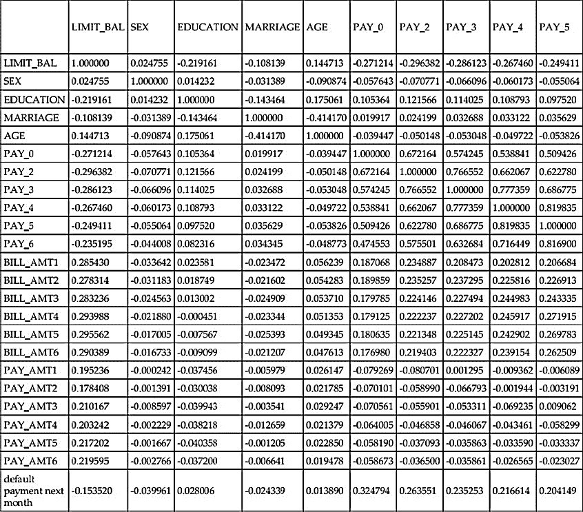
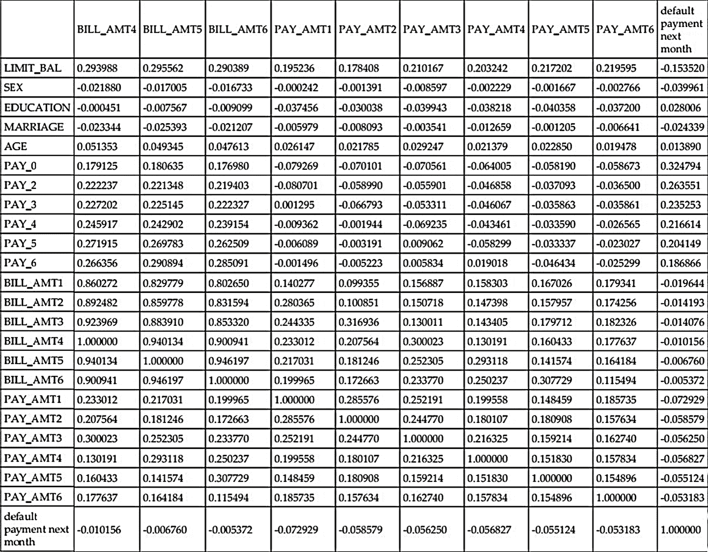
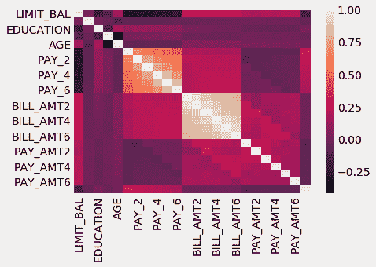
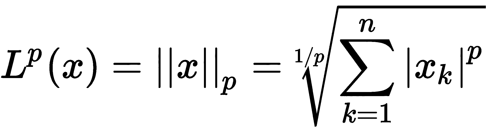

<title>Feature Selection</title>  

# 特征选择

我们已经学了一半，已经接触了十几个数据集，也看到了大量的特征选择方法，作为数据科学家和机器学习工程师，我们可以在工作和生活中使用这些方法，以确保我们从预测建模中获得最大收益。到目前为止，在处理数据时，我们使用的方法包括:

*   通过识别数据级别来理解特征
*   功能改进和输入缺失值
*   特征标准化和规范化

前面提到的每种方法在我们的数据管道中都有一席之地，而且通常情况下，两种或两种以上的方法会相互串联使用。

本文的剩余部分将集中在其他的特征工程方法上，这些方法本质上比本书的前半部分更加数学化和复杂。随着前面的工作流程的发展，我们将尽最大努力让读者了解我们调用的每一个统计测试的内部工作，而是传达测试试图实现的更广泛的画面。作为作者和指导者，我们总是乐意回答你关于这部作品的任何内在机制的问题。

在讨论特性时，我们经常会遇到一个问题，那就是**噪音**。通常，我们不得不处理那些对反应预测性不高的特征，有时，这些特征甚至会妨碍我们的模型预测反应的性能。我们使用标准化和规范化等工具来试图减轻这种损害，但归根结底，噪音是必须处理的。

在这一章中，我们将讨论一个称为**特征选择**的特征工程子集，这是从最初的一批特征中选择哪些特征在模型预测管道中是*最好的*的过程。更正式地说，给定 *n* 个特征，我们搜索 *k* 个特征的子集，其中 *k < n* 个特征改进了我们的机器学习管道。这通常可以归结为这样一句话:

*Feature Selection attempts to weed out the noise in our data and remove it.*

特征选择的定义涉及到必须解决的两个要点:

*   我们可以找到 *k* 特征子集的方法
*   机器学习背景下的*更好的定义*

这一章的大部分致力于我们可以找到这些特征子集的方法，以及这些方法工作的基础。本章将把特征选择的方法分成两大部分:**基于统计的**和**基于模型的**特征选择。这种分离可能无法 100%捕捉特征选择的科学和艺术的复杂性，但将有助于在我们的机器学习管道中推动真实和可操作的结果。

在我们深入研究这些方法之前，让我们先讨论一下我们如何更好地理解和定义*更好地*的概念，因为它将构成本章的其余部分，以及本文的其余部分。

我们将在本章中讨论以下主题:

*   在特征工程中实现更好的性能
*   创建基线机器学习管道
*   特征选择的类型
*   选择正确的特征选择方法

<title>Achieving better performance in feature engineering</title>  

# 在特征工程中实现更好的性能

在整本书中，当谈到我们实施的各种特征工程方法时，我们依赖于一个更好的基本定义。我们的隐含目标是实现更好的预测性能，这纯粹是根据简单的指标来衡量的，例如分类任务的准确性和回归任务的 RMSE(主要是准确性)。我们还可以测量和跟踪其他指标来衡量预测性能。例如，我们将使用以下指标进行分类:

*   真假阳性率
*   灵敏度(亦称真阳性率)和特异性
*   假阴性和假阳性率

对于回归，将应用的指标有:

*   绝对平均误差
*   R ²

这些列表还在继续，虽然我们不会放弃通过前面列出的指标来量化性能的想法，但我们也可以测量其他*元指标*，或与模型预测性能不直接相关的指标，相反，所谓的**元指标**试图测量预测前后的性能*，并包括以下想法:*

*   模型需要适应/训练数据的时间
*   拟合模型预测新数据实例所需的时间
*   数据的大小，以防数据必须持久化(存储以备后用)

这些想法将增加我们对*更好的*机器学习的定义，因为它们有助于包含我们在模型预测性能之外的更大的机器学习管道。为了帮助我们跟踪这些指标，让我们创建一个足够通用的函数来评估几个模型，但又足够具体来给出每个模型的指标。我们将调用我们的函数`get_best_model_and_accuracy`，它将完成许多工作，例如:

*   它将搜索所有给定的参数，以优化机器学习管道
*   它将给出一些度量标准，帮助我们评估进入管道的质量

让我们借助下面的代码来定义这样一个函数:

```
# import out grid search module
from sklearn.model_selection import GridSearchCV

def get_best_model_and_accuracy(model, params, X, y):
    grid = GridSearchCV(model, # the model to grid search
                        params, # the parameter set to try 
                        error_score=0.) # if a parameter set raises an error, continue and set the performance as a big, fat 0
    grid.fit(X, y) # fit the model and parameters
    # our classical metric for performance
    print "Best Accuracy: {}".format(grid.best_score_)
    # the best parameters that caused the best accuracy
    print "Best Parameters: {}".format(grid.best_params_)
    # the average time it took a model to fit to the data (in seconds)
    print "Average Time to Fit (s): {}".format(round(grid.cv_results_['mean_fit_time'].mean(), 3))
    # the average time it took a model to predict out of sample data (in seconds)
    # this metric gives us insight into how this model will perform in real-time analysis
    print "Average Time to Score (s): {}".format(round(grid.cv_results_['mean_score_time'].mean(), 3))
```

这个函数的总体目标是作为一个基础事实，因为我们将使用它来评估本章中的每个特性选择方法，以给我们一种评估标准化的感觉。这与我们已经在做的事情没有什么不同，但我们现在正在将我们的工作正式化为一个功能，并且还使用除准确性之外的其他指标来对我们的特征选择模块和机器学习管道进行评级。

<title>A case study – a credit card defaulting dataset</title>  

# 案例研究——信用卡违约数据集

通过智能地从数据中提取最重要的信号并忽略噪声，特征选择算法实现了两个主要结果:

*   **改进的模型性能**:通过删除冗余数据，我们不太可能根据嘈杂和不相关的数据做出决策，这也使我们的模型能够专注于重要特征，从而改进模型管道预测性能
*   **减少训练和预测时间**:通过将管道拟合到更少的数据，这通常会缩短模型拟合和预测时间，使我们的管道整体速度更快

为了真实地了解噪声数据如何以及为什么会碍事，让我们介绍一下我们最新的数据集，一个信用卡违约数据集。我们将使用 23 个特征和一个响应变量。该响应变量将是一个布尔值，这意味着它要么为真，要么为假。我们正在研究 23 个特征的原因是，我们想看看我们是否可以找到 23 个特征中的哪些将在我们的机器学习管道中帮助我们，哪些将伤害我们。我们可以使用以下代码导入数据集:

```
import pandas as pd
import numpy as np

# we will set a random seed to ensure that whenever we use random numbers 
# which is a good amount, we will achieve the same random numbers
np.random.seed(123)
```

首先，让我们引入两个公共模块，`numpy`和`pandas`，并设置一个随机种子，这样您和我们将获得相同的一致性结果。现在，让我们使用以下代码引入最新的数据集:

```
# archive.ics.uci.edu/ml/datasets/default+of+credit+card+clients
# import the newest csv
credit_card_default = pd.read_csv('../data/credit_card_default.csv')
```

让我们继续做一些强制性的 EDA。让我们首先使用以下代码检查我们正在处理的数据集有多大:

```
# 30,000 rows and 24 columns
credit_card_default.shape 
```

因此，我们有`30,000 rows`(观察)和`24 columns` (1 个响应和 23 个特征)。此时我们不会深入描述这些列的含义，但是我们鼓励读者查看数据的来源([http://archive . ics . UCI . edu/ml/datasets/default+of+credit+card+clients #](http://archive.ics.uci.edu/ml/datasets/default+of+credit+card+clients#))。目前，我们将依靠优秀的老式统计数据来告诉我们更多信息:

```
# Some descriptive statistics
# We invoke the .T to transpose the matrix for better viewing
credit_card_default.describe().T
```

输出如下所示:

|  | **计数** | **表示** | **标准** | **最小值** | **25%** | **50%** | **75%** | **最大** |
| **限额 _ 余额** | 30000.0 | 167484.322667 | 129747.661567 | 10000.0 | 50000.00 | 140000.0 | 240000.00 | 1000000.0 |
| **性** | 30000.0 | 1.603733 | 0.489129 | 1.0 | 1.00 | 2.0 | 2.00 | 2.0 |
| **教育** | 30000.0 | 1.853133 | 0.790349 | 0.0 | 1.00 | 2.0 | 2.00 | 6.0 |
| **结婚** | 30000.0 | 1.551867 | 0.521970 | 0.0 | 1.00 | 2.0 | 2.00 | 3.0 |
| **年龄** | 30000.0 | 35.485500 | 9.217904 | 21.0 | 28.00 | 34.0 | 41.00 | 79.0 |
| **PAY_0** | 30000.0 | -0.016700 | 1.123802 | -2.0 | -1.00 | 0.0 | 0.00 | 8.0 |
| **PAY_2** | 30000.0 | -0.133767 | 1.197186 | -2.0 | -1.00 | 0.0 | 0.00 | 8.0 |
| **支付 _3** | 30000.0 | -0.166200 | 1.196868 | -2.0 | -1.00 | 0.0 | 0.00 | 8.0 |
| **支付 _4** | 30000.0 | -0.220667 | 1.169139 | -2.0 | -1.00 | 0.0 | 0.00 | 8.0 |
| **支付 _5** | 30000.0 | -0.266200 | 1.133187 | -2.0 | -1.00 | 0.0 | 0.00 | 8.0 |
| **支付 _6** | 30000.0 | -0.291100 | 1.149988 | -2.0 | -1.00 | 0.0 | 0.00 | 8.0 |
| **BILL_AMT1** | 30000.0 | 51223.330900 | 73635.860576 | -165580.0 | 3558.75 | 22381.5 | 67091.00 | 964511.0 |
| **BILL_AMT2** | 30000.0 | 49179.075167 | 71173.768783 | -69777.0 | 2984.75 | 21200.0 | 64006.25 | 983931.0 |
| **BILL_AMT3** | 30000.0 | 47013.154800 | 69349.387427 | -157264.0 | 2666.25 | 20088.5 | 60164.75 | 1664089.0 |
| **BILL_AMT4** | 30000.0 | 43262.948967 | 64332.856134 | -170000.0 | 2326.75 | 19052.0 | 54506.00 | 891586.0 |
| **BILL_AMT5** | 30000.0 | 40311.400967 | 60797.155770 | -81334.0 | 1763.00 | 18104.5 | 50190.50 | 927171.0 |
| **BILL_AMT6** | 30000.0 | 38871.760400 | 59554.107537 | -339603.0 | 1256.00 | 17071.0 | 49198.25 | 961664.0 |
| **PAY_AMT1** | 30000.0 | 5663.580500 | 16563.280354 | 0.0 | 1000.00 | 2100.0 | 5006.00 | 873552.0 |
| **PAY_AMT2** | 30000.0 | 5921.163500 | 23040.870402 | 0.0 | 833.00 | 2009.0 | 5000.00 | 1684259.0 |
| **PAY_AMT3** | 30000.0 | 5225.681500 | 17606.961470 | 0.0 | 390.00 | 1800.0 | 4505.00 | 891586.0 |
| **PAY_AMT4** | 30000.0 | 4826.076867 | 15666.159744 | 0.0 | 296.00 | 1500.0 | 4013.25 | 621000.0 |
| **PAY_AMT5** | 30000.0 | 4799.387633 | 15278.305679 | 0.0 | 252.50 | 1500.0 | 4031.50 | 426529.0 |
| **PAY_AMT6** | 30000.0 | 5215.502567 | 17777.465775 | 0.0 | 117.75 | 1500.0 | 4000.00 | 528666.0 |
| **下月违约付款** | 30000.0 | 0.221200 | 0.415062 | 0.0 | 0.00 | 0.0 | 0.00 | 1.0 |

下个月的**违约付款**是我们的回应栏，其他一切都是违约的特征/潜在预测因素。非常清楚的是，我们的特征存在于非常不同的尺度上，所以这将是我们如何处理数据和选择模型的一个因素。在之前的章节中，我们使用`StandardScalar`和标准化等解决方案来处理不同比例的数据和特征，以缓解其中的一些问题；然而，在这一章中，我们将在很大程度上选择忽略此类问题，以便专注于更相关的问题。

在本书的最后一章，我们将关注几个案例研究，这些案例研究将结合本书中关于数据集长期分析的几乎所有技术。

正如我们在前面的章节中看到的，我们知道在处理机器学习时，空值是一个大问题，所以让我们快速检查一下，以确保我们没有任何问题要处理:

```
# check for missing values, none in this dataset
credit_card_default.isnull().sum()
LIMIT_BAL                     0

SEX                           0

EDUCATION                     0

MARRIAGE                      0

AGE                           0

PAY_0                         0

PAY_2                         0

PAY_3                         0

PAY_4                         0

PAY_5                         0

PAY_6                         0

BILL_AMT1                     0

BILL_AMT2                     0

BILL_AMT3                     0

BILL_AMT4                     0

BILL_AMT5                     0

BILL_AMT6                     0

PAY_AMT1                      0

PAY_AMT2                      0

PAY_AMT3                      0

PAY_AMT4                      0

PAY_AMT5                      0

PAY_AMT6                      0

default payment next month    0

dtype: int64
```

唷！此处没有缺失值。同样，我们将在未来的案例研究中再次处理缺失值，但现在，我们有更重要的事情要做。让我们继续为我们的机器学习管道设置一些变量，使用以下代码:

```
# Create our feature matrix
X = credit_card_default.drop('default payment next month', axis=1)

# create our response variable
y = credit_card_default['default payment next month']
```

像往常一样，我们创建了我们的`X`和`y`变量。我们的`X`矩阵将有 30，000 行和 23 列，我们的`y`一如既往，是一个 30，000 长的熊猫系列。因为我们将执行分类，我们将像往常一样，需要确定一个零精度，以确保我们的机器学习模型比基线执行得更好。我们可以使用下面的代码获得零准确率:

```
# get our null accuracy rate
y.value_counts(normalize=True)

0    0.7788

1    0.2212
```

所以，在这种情况下，beat 的准确度是 **77.88%** ，这是没有违约的人的百分比(0 表示 false 表示违约)。

<title>Creating a baseline machine learning pipeline</title>  

# 创建基线机器学习管道

在前面的章节中，我们为读者提供了一个机器学习模型，可以在整个章节中使用。在本章中，我们将做一些工作来找到满足我们需求的最佳机器学习模型，然后通过特征选择来增强该模型。我们将从导入四种不同的机器学习模型开始:

*   逻辑回归
*   k-最近邻
*   决策图表
*   随机森林

导入学习模型的代码如下所示:

```
# Import four machine learning models
from sklearn.linear_model import LogisticRegression
from sklearn.neighbors import KNeighborsClassifier
from sklearn.tree import DecisionTreeClassifier
from sklearn.ensemble import RandomForestClassifier
```

一旦我们完成了这些模块的导入，我们将通过我们的`get_best_model_`和`_accuracy`函数运行它们，以获得每个模块如何处理原始数据的基线。为此，我们必须首先建立一些变量。我们将使用以下代码来实现这一点:

```
# Set up some parameters for our grid search
# We will start with four different machine learning model parameters

# Logistic Regression
lr_params = {'C':[1e-1, 1e0, 1e1, 1e2], 'penalty':['l1', 'l2']}

# KNN
knn_params = {'n_neighbors': [1, 3, 5, 7]}

# Decision Tree
tree_params = {'max_depth':[None, 1, 3, 5, 7]}

# Random Forest
forest_params = {'n_estimators': [10, 50, 100], 'max_depth': [None, 1, 3, 5, 7]}
```

如果您对上面列出的任何模型感到不舒服，我们建议阅读文档，或者参考 Packt 的书，*The Principles of Data Science*，[https://www . packtpub . com/big-Data-and-business-intelligence/Principles-Data-Science](https://www.packtpub.com/big-data-and-business-intelligence/principles-data-science)，以获得算法的更详细解释。

因为我们将通过调用网格搜索模块的函数发送每个模型，所以我们只需要创建没有定制参数集的空白状态模型，如下面的代码所示:

```
# instantiate the four machine learning models
lr = LogisticRegression()
knn = KNeighborsClassifier()
d_tree = DecisionTreeClassifier()
forest = RandomForestClassifier()
```

我们现在将通过我们的评估函数运行四个机器学习模型中的每一个，以查看它们相对于我们的数据集做得如何。回想一下，我们目前要攻克的数字是 0.7788，基线零精度。我们将使用以下代码来运行模型:

```
get_best_model_and_accuracy(lr, lr_params, X, y)

Best Accuracy: 0.809566666667

Best Parameters: {'penalty': 'l1', 'C': 0.1}

Average Time to Fit (s): 0.602

Average Time to Score (s): 0.002
```

我们可以看到，使用原始数据，逻辑回归已经击败了零精度，平均而言，用 6/10 秒来拟合训练集，只用了 20 毫秒来评分。如果我们知道为了拟合，scikit-learn 中的逻辑回归必须在内存中创建一个大矩阵，那么这是有意义的，但是为了预测，它只需要将标量彼此相乘和相加。

现在，让我们用下面的代码对 KNN 模型做同样的事情:

```
get_best_model_and_accuracy(knn, knn_params, X, y)

Best Accuracy: 0.760233333333

Best Parameters: {'n_neighbors': 7}

Average Time to Fit (s): 0.035

Average Time to Score (s): 0.88
```

正如所料，我们的 KNN 模型在拟合时间上做得更好。这是因为，为了适应数据，KNN 只需以一种在预测时易于检索的方式存储数据，这样就能及时检索到数据。同样值得一提的是一个痛苦而明显的事实，精度甚至不如零精度！你可能想知道为什么，如果你说*嘿，等一下，KNN 不是利用欧几里德距离来进行预测吗，这可能会被非标准化数据抛弃，这是其他三个机器学习模型都没有的缺陷？那么你 100%正确。*

KNN 是一个基于距离的模型，因为它使用空间接近度的度量，假设所有要素都在相同的比例上，而我们已经知道我们的数据不在这个比例上。因此，对于 KNN，我们必须使用以下代码构建一个更复杂的管道来更准确地评估其基线性能:

```
# bring in some familiar modules for dealing with this sort of thing
from sklearn.pipeline import Pipeline
from sklearn.preprocessing import StandardScaler

# construct pipeline parameters based on the parameters
# for KNN on its own
knn_pipe_params = {'classifier__{}'.format(k): v for k, v in knn_params.iteritems()}

# KNN requires a standard scalar due to using Euclidean distance # as the main equation for predicting observations
knn_pipe = Pipeline([('scale', StandardScaler()), ('classifier', knn)])

# quick to fit, very slow to predict
get_best_model_and_accuracy(knn_pipe, knn_pipe_params, X, y)

print knn_pipe_params  # {'classifier__n_neighbors': [1, 3, 5, 7]} 

Best Accuracy: 0.8008 
Best Parameters: {'classifier__n_neighbors': 7} 
Average Time to Fit (s): 0.035 
Average Time to Score (s): 6.723
```

首先要注意的是，我们修改后的代码管道，现在包括了一个`StandardScalar`(z-score 标准化我们的特征)现在至少击败了空精度，但也严重影响了我们的预测时间，因为我们增加了一个预处理步骤。到目前为止，逻辑回归是领先的，具有最好的准确性和更好的管道整体时间安排。让我们继续我们的两个基于树的模型，在下面代码的帮助下，从两个模型中较简单的决策树开始:

```
get_best_model_and_accuracy(d_tree, tree_params, X, y)

Best Accuracy: 0.820266666667

Best Parameters: {'max_depth': 3}

Average Time to Fit (s): 0.158

Average Time to Score (s): 0.002
```

太神奇了！我们在准确性方面已经有了新的领先优势，决策树在拟合和预测方面也很快。事实上，它在拟合时间上胜过逻辑回归，在预测时间上胜过 KNN。让我们通过使用以下代码评估一个随机森林来结束我们的测试:

```
get_best_model_and_accuracy(forest, forest_params, X, y)

Best Accuracy: 0.819566666667

Best Parameters: {'n_estimators': 50, 'max_depth': 7}

Average Time to Fit (s): 1.107

Average Time to Score (s): 0.044
```

比逻辑回归或 KNN 好得多，但不比决策树好。让我们汇总这些结果，看看在使用功能选择进行优化时，我们应该继续使用哪个模型:

| **车型名称** | **准确率(%)** | **适应时间** | **预测时间** |
| 逻辑回归 | .8096 | .602 | **.002** |
| KNN(带刻度) | .8008 | **.035** | 6.72 |
| 决策图表 | **.8203** | .158 | **.002** |
| 随机森林 | .8196 | 1.107 | .044 |

决策树在准确性方面排名第一，在使用逻辑回归预测时间方面并列第一，而使用缩放的 KNN 因最快拟合我们的数据而获奖。总的来说，决策树似乎是向前发展的最佳模型，因为它在我们最重要的两个指标中排名第一:

*   我们肯定想要最好的准确性，以确保样本外预测是准确的
*   考虑到模型正被用于实时生产用途，拥有预测时间是很有用的

我们采取的方法是在选择任何特性之前选择一个模型。不要求以这种方式工作，但是我们发现在时间紧迫的情况下工作通常会节省最多的时间。出于您的目的，我们建议您同时试验许多模型，不要将自己局限于一个模型。

知道我们将在本章的剩余部分使用决策树，我们还知道两件事:

*   要达到的新基线精度是. 8203，这是树在拟合整个数据集时获得的精度
*   我们不再需要使用我们的`StandardScaler`，因为决策树在建模性能时不受它的影响

<title>The types of feature selection</title>  

# 特征选择的类型

回想一下，我们的特征选择目标是通过增加预测能力和减少时间成本来提高我们的机器学习能力。为此，我们引入两大类特征选择:基于统计的和基于模型的。基于统计的特征选择将严重依赖于独立于我们的机器学习模型的统计测试，以便在我们管道的训练阶段选择特征。基于模型的选择依赖于预处理步骤，该步骤涉及训练二级机器学习模型，并使用该模型的预测能力来选择特征。

这两种类型的特征选择都试图通过从我们的原始特征中只选择具有最高预测能力的最佳特征来减少我们的数据量。我们可能会明智地选择哪种功能选择方法最适合我们，但实际上，在这个领域中，一种非常有效的工作方式是研究每种方法的示例，并测量最终管道的性能。

首先，让我们看看依赖统计测试从数据集中选择可行特征的特征选择模块的子类。

<title>Statistical-based feature selection</title>  

# 基于统计的特征选择

统计学为我们提供了相对快速简单的方法来解释定量和定性数据。我们在之前的章节中使用了一些统计方法来获得关于数据的新知识和观点，特别是我们将均值和标准差作为度量标准，使我们能够计算 z 分数和调整数据。在本章中，我们将依靠两个新概念来帮助我们选择特性:

*   皮尔逊相关
*   假设检验

这两种方法都被称为特征选择的**单变量**方法，这意味着当问题是一次选择出*单个*特征以便为我们的机器学习管道创建更好的数据集时，它们是快速和方便的。

<title>Using Pearson correlation to select features</title>  

# 使用 Pearson 相关性选择特征

我们实际上已经在本书中看到了相关性，但不是在特征选择的背景下。我们已经知道，我们可以通过调用以下方法在 pandas 中调用相关计算:

```
credit_card_default.corr()
```

上述代码产生的输出如下:



作为上表的延续，我们有:



Pearson 相关系数(这是 pandas 的默认值)测量列之间的线性关系。系数的值在-1 和+1 之间变化，其中 0 表示它们之间没有相关性。更接近-1 或+1 的相关性意味着非常强的线性关系。

值得注意的是，皮尔逊相关一般要求每一列都是正态分布的(我们并不假设)。我们也可以在很大程度上忽略这一要求，因为我们的数据集很大(超过 500 是阈值)。

`pandas .corr()`方法计算每列相对于每隔一列的皮尔逊相关系数。这个 24 列 24 行的矩阵很难理解，过去，我们使用`heatmaps`试图让信息更容易理解:

```
# using seaborn to generate heatmaps
import seaborn as sns
import matplotlib.style as style
# Use a clean stylizatino for our charts and graphs
style.use('fivethirtyeight')

sns.heatmap(credit_card_default.corr())
```

生成的`heatmap`如下:



请注意，`heatmap`函数会自动选择最相关的特性向我们展示。也就是说，我们目前关心的是与响应变量相关的特征。我们将假设一个特征与反应越相关，它就越有用。任何相关性不强的特征对我们来说都不会有用。

相关系数也用于确定特征的相互作用和冗余。在机器学习中减少过度拟合的一个关键方法是发现并移除这些冗余。我们将在基于模型的选择方法中解决这个问题。

让我们使用下面的代码隔离特性和响应变量之间的相关性:

```
# just correlations between every feature and the response
credit_card_default.corr()['default payment next month'] 

LIMIT_BAL                    -0.153520

SEX                          -0.039961

EDUCATION                     0.028006

MARRIAGE                     -0.024339

AGE                           0.013890

PAY_0                         0.324794

PAY_2                         0.263551

PAY_3                         0.235253

PAY_4                         0.216614

PAY_5                         0.204149

PAY_6                         0.186866

BILL_AMT1                    -0.019644

BILL_AMT2                    -0.014193

BILL_AMT3                    -0.014076

BILL_AMT4                    -0.010156

BILL_AMT5                    -0.006760

BILL_AMT6                    -0.005372

PAY_AMT1                     -0.072929

PAY_AMT2                     -0.058579

PAY_AMT3                     -0.056250

PAY_AMT4                     -0.056827

PAY_AMT5                     -0.055124

PAY_AMT6                     -0.053183

default payment next month    1.000000
```

我们可以忽略最后一行，因为它是与自身完全相关的响应变量。我们正在寻找相关系数值接近-1 或+1 的特征。这些是我们可能会认为有用的特性。让我们使用熊猫过滤来隔离至少具有 0.2 相关性(正或负)的特征。

让我们首先定义一个熊猫*遮罩*，它将作为我们的过滤器，使用下面的代码:

```
# filter only correlations stronger than .2 in either direction (positive or negative)

credit_card_default.corr()['default payment next month'].abs() > .2

LIMIT_BAL                     False

SEX                           False

EDUCATION                     False

MARRIAGE                      False

AGE                           False

PAY_0                          True

PAY_2                          True

PAY_3                          True

PAY_4                          True

PAY_5                          True

PAY_6                         False

BILL_AMT1                     False

BILL_AMT2                     False

BILL_AMT3                     False

BILL_AMT4                     False

BILL_AMT5                     False

BILL_AMT6                     False

PAY_AMT1                      False

PAY_AMT2                      False

PAY_AMT3                      False

PAY_AMT4                      False

PAY_AMT5                      False

PAY_AMT6                      False

default payment next month     True
```

前面的熊猫系列中的每个`False`代表相关值在-2 和. 2 之间的特征，而`True`值对应于前面的相关值为. 2 或小于-0.2 的特征。让我们使用下面的代码将这个掩码插入到我们的熊猫过滤中:

```
# store the features
highly_correlated_features = credit_card_default.columns[credit_card_default.corr()['default payment next month'].abs() > .2]

highly_correlated_features

Index([u'PAY_0', u'PAY_2', u'PAY_3', u'PAY_4', u'PAY_5',

       u'default payment next month'],

      dtype='object')
```

变量`highly_correlated_features`应该保存与响应高度相关的数据帧的特征；然而，我们必须去掉 response 列的名称，因为在我们的机器学习管道中包含这个名称是欺骗:

```
# drop the response variable
highly_correlated_features = highly_correlated_features.drop('default payment next month')

highly_correlated_features

Index([u'PAY_0', u'PAY_2', u'PAY_3', u'PAY_4', u'PAY_5'], dtype='object')
```

现在，我们从原始数据集中获得了五个用于预测响应变量的特征，让我们在以下代码的帮助下尝试一下:

```
# only include the five highly correlated features
X_subsetted = X[highly_correlated_features]

get_best_model_and_accuracy(d_tree, tree_params, X_subsetted, y) 

# barely worse, but about 20x faster to fit the model
Best Accuracy: 0.819666666667 
Best Parameters: {'max_depth': 3} 
Average Time to Fit (s): 0.01 
Average Time to Score (s): 0.002
```

我们的精度肯定比 beat . 8203 的精度差，但也注意到拟合时间增加了大约 20 倍。我们的模型能够在只有五个特征的整个数据集上学习得几乎一样好。此外，它能够在更短的时间内学到更多的东西。

让我们带回我们的 scikit-learn 管道，并将我们的相关性选择方法作为预处理阶段的一部分。要做到这一点，我们必须创建一个定制的转换器来调用我们刚刚经历过的逻辑，作为一个管道就绪类。

我们将我们的类称为`CustomCorrelationChooser`，它必须实现 fit 和 transform 逻辑，它们是:

*   拟合逻辑将从特征矩阵中选择高于指定阈值的列
*   转换逻辑将子集化任何未来的数据集，以便只包括那些被认为重要的列

```
from sklearn.base import TransformerMixin, BaseEstimator

class CustomCorrelationChooser(TransformerMixin, BaseEstimator):
    def __init__(self, response, cols_to_keep=[], threshold=None):
        # store the response series
        self.response = response
        # store the threshold that we wish to keep
        self.threshold = threshold
        # initialize a variable that will eventually
        # hold the names of the features that we wish to keep
        self.cols_to_keep = cols_to_keep

    def transform(self, X):
        # the transform method simply selects the appropiate
        # columns from the original dataset
        return X[self.cols_to_keep]

    def fit(self, X, *_):
        # create a new dataframe that holds both features and response
        df = pd.concat([X, self.response], axis=1)
        # store names of columns that meet correlation threshold
        self.cols_to_keep = df.columns[df.corr()[df.columns[-1]].abs() > self.threshold]
        # only keep columns in X, for example, will remove response variable
        self.cols_to_keep = [c for c in self.cols_to_keep if c in X.columns]
        return self
```

让我们在下面代码的帮助下，用我们新的相关性特征选择器来分析一下:

```
# instantiate our new feature selector
ccc = CustomCorrelationChooser(threshold=.2, response=y)
ccc.fit(X)

ccc.cols_to_keep

['PAY_0', 'PAY_2', 'PAY_3', 'PAY_4', 'PAY_5']
```

我们的类选择了与我们之前找到的相同的五列。让我们使用下面的代码，通过在我们的`X`矩阵上调用来测试转换功能:

```
ccc.transform(X).head()
```

上述代码生成下表作为输出:

|  | **PAY_0** | **支付 _2** | **薪 _3** | **PAY_4** | **PAY_5** |
| **0** | 2 | 2 | -1 | -1 | -2 |
| **1** | -1 | 2 | 0 | 0 | 0 |
| **2** | 0 | 0 | 0 | 0 | 0 |
| **3** | 0 | 0 | 0 | 0 | 0 |
| **4** | -1 | 0 | -1 | 0 | 0 |

我们看到`transform`方法已经删除了其他列，只保留了满足`.2`相关性阈值的特性。现在，让我们在下面代码的帮助下，将所有这些放到我们的管道中:

```
# instantiate our feature selector with the response variable set
ccc = CustomCorrelationChooser(response=y)

# make our new pipeline, including the selector
ccc_pipe = Pipeline([('correlation_select', ccc), 
 ('classifier', d_tree)])

# make a copy of the decisino tree pipeline parameters
ccc_pipe_params = deepcopy(tree_pipe_params)

# update that dictionary with feature selector specific parameters
ccc_pipe_params.update({
 'correlation_select__threshold':[0, .1, .2, .3]})

print ccc_pipe_params  #{'correlation_select__threshold': [0, 0.1, 0.2, 0.3], 'classifier__max_depth': [None, 1, 3, 5, 7, 9, 11, 13, 15, 17, 19, 21]}

# better than original (by a little, and a bit faster on 
# average overall
get_best_model_and_accuracy(ccc_pipe, ccc_pipe_params, X, y) 

Best Accuracy: 0.8206
Best Parameters: {'correlation_select__threshold': 0.1, 'classifier__max_depth': 5}
Average Time to Fit (s): 0.105
Average Time to Score (s): 0.003
```

哇！我们在特性选择上的第一次尝试，我们已经超过了我们的目标(尽管有一点点)。我们的管道向我们显示，如果我们在`0.1`设定阈值，我们已经消除了足够的噪声以提高精度，并且还减少了拟合时间(从没有选择器的 0.158 秒开始)。让我们看看选择器决定保留哪些列:

```
# check the threshold of .1
ccc = CustomCorrelationChooser(threshold=0.1, response=y)
ccc.fit(X)

# check which columns were kept
ccc.cols_to_keep
['LIMIT_BAL', 'PAY_0', 'PAY_2', 'PAY_3', 'PAY_4', 'PAY_5', 'PAY_6']
```

似乎我们的选择器已经决定保留我们找到的五列，以及另外两列，即`LIMIT_BAL`和`PAY_6`列。太好了！这就是 scikit-learn 中自动管道网格搜索的美妙之处。它允许我们的模型做他们最擅长的事情，并凭直觉感知我们自己无法做到的事情。

<title>Feature selection using hypothesis testing</title>  

# 使用假设检验的特征选择

假设检验是统计学中的一种方法，允许对个别特征进行稍微复杂一点的统计检验。通过假设测试进行的特征选择将尝试从数据集中仅选择最佳特征，就像我们使用自定义相关性选择器一样，但这些测试更依赖于形式化的统计方法，并通过所谓的 **p 值**进行解释。

假设检验是一种统计检验，用于确定在给定数据样本的情况下，我们是否可以对整个人群应用某个条件。假设检验的结果告诉我们，我们是应该相信这个假设，还是拒绝接受另一个假设。基于来自总体的样本数据，假设检验确定是否拒绝零假设。我们通常用一个 **p 值** (一个上界为 1 的非负小数，基于我们的显著性水平)来得出这个结论。

在特征选择的情况下，我们希望测试的假设是这样的:*对或错:这个特征与响应变量无关。我们想要为每个特征测试这个假设，并且决定这些特征是否在响应的预测中具有一些意义。在某种程度上，这就是我们处理关联逻辑的方式。我们基本上说，如果一列与响应的相关性太弱，那么我们说特征没有相关性的假设是真的。如果相关系数足够强，那么我们可以拒绝该特征没有相关性的假设，而支持另一个假设，即该特征确实有一些相关性。*

要开始将它用于我们的数据，我们必须引入两个新模块:`SelectKBest`和`f_classif`，使用以下代码:

```
# SelectKBest selects features according to the k highest scores of a given scoring function
from sklearn.feature_selection import SelectKBest

# This models a statistical test known as ANOVA
from sklearn.feature_selection import f_classif

# f_classif allows for negative values, not all do
# chi2 is a very common classification criteria but only allows for positive values
# regression has its own statistical tests
```

`SelectKBest`基本上只是一个包装器，它保存了一定数量的根据某种标准排名最高的特性。在这种情况下，我们将使用已完成假设检验的 p 值作为排名。

<title>Interpreting the p-value</title>  

# 解读 p 值

p 值是一个介于 0 和 1 之间的小数，代表在假设检验下给我们的数据偶然发生的概率。简单地说，p 值越低，我们拒绝零假设的机会就越大。就我们的目的而言，p 值越小，该特征与我们的响应变量有一定相关性的机会就越大，我们应该保留它。

要更深入地了解统计测试，请查看 Packt Publishing 出版的*数据科学原理*、[https://www . packtpub . com/big-Data-and-business-intelligence/Principles-Data-Science](https://www.packtpub.com/big-data-and-business-intelligence/principles-data-science)。

最重要的一点是，`f_classif`函数将对每个特性单独执行 ANOVA 测试(一种假设测试)(因此称为单变量测试),并为该特性分配一个 p 值。`SelectKBest`将根据 p 值对特征进行排序(越低越好),只保留最好的 k(人类输入)特征。让我们用 Python 来试试这个。

<title>Ranking the p-value</title>  

# p 值排名

让我们从实例化一个`SelectKBest`模块开始。我们将手动输入一个`k`值`5`，这意味着我们希望根据得到的 p 值仅保留五个最佳特征:

```
# keep only the best five features according to p-values of ANOVA test
k_best = SelectKBest(f_classif, k=5)
```

然后，我们可以拟合并转换我们的`X`矩阵，以选择我们想要的特性，就像我们之前使用自定义选择器所做的那样:

```
# matrix after selecting the top 5 features
k_best.fit_transform(X, y)

# 30,000 rows x 5 columns
array([[ 2,  2, -1, -1, -2],

       [-1,  2,  0,  0,  0],

       [ 0,  0,  0,  0,  0],

       ..., 

       [ 4,  3,  2, -1,  0],

       [ 1, -1,  0,  0,  0],

       [ 0,  0,  0,  0,  0]])
```

如果我们想直接检查`p-values`并查看选择了哪些列，我们可以深入选择`k_best`变量:

```
# get the p values of columns
k_best.pvalues_

# make a dataframe of features and p-values
# sort that dataframe by p-value
p_values = pd.DataFrame({'column': X.columns, 'p_value': k_best.pvalues_}).sort_values('p_value')

# show the top 5 features
p_values.head()
```

上述代码生成下表作为输出:

|  | **栏** | **p_value** |
| **5** | 支付 _0 | 0.000000e+00 |
| **6** | 支付 _2 | 0.000000e+00 |
| **7** | 支付 _3 | 0.000000e+00 |
| **8** | 支付 _4 | 1.899297e-315 |
| **9** | 支付 _5 | 1.126608e-279 |

我们可以看到，我们的选择器再次选择了最重要的`PAY_X`列。如果我们看一下我们的`p-value`列，我们会注意到我们的值非常小，接近于零。p 值的一个常见阈值是`0.05`，这意味着小于 0.05 的任何值都可能被认为是显著的，根据我们的测试，这些列是极其显著的。我们还可以使用 pandas 筛选方法直接查看哪些列满足阈值 0.05:

上述代码生成下表作为输出:

```
# features with a low p value
p_values[p_values['p_value'] < .05]
```

The preceding code produces the following table as the output:

| **栏** | **p_value** | **5** |
| 支付 _0 | 0.000000e+00 | **6** |
| 支付 _2 | 0.000000e+00 | **7** |
| 支付 _3 | 0.000000e+00 | **8** |
| 支付 _4 | 1.899297e-315 | **9** |
| 支付 _5 | 1.126608e-279 | **10** |
| 支付 _6 | 7.296740e-234 | **0** |
| 限额 _ 余额 | 1.302244e-157 | 17 |
| PAY_AMT1 | 1.146488e-36 | **18** |
| PAY_AMT2 | 3.166657e-24 | **20** |
| PAY_AMT4 | 6.830942e-23 | **19** |
| PAY_AMT3 | 1.841770e-22 | **21** |
| PAY_AMT5 | 1.241345e-21 | **22** |
| PAY_AMT6 | 3.033589e-20 | **1** |
| 性 | 4.395249e-12 | **2** |
| 教育 | 1.225038e-06 | **3** |
| 结婚 | 2.485364e-05 | **11** |
| BILL_AMT1 | 6.673295e-04 | **12** |
| BILL_AMT2 | 1.395736e-02 | **13** |
| BILL_AMT3 | 1.476998e-02 | **4** |
| 年龄 | 1.613685e-02 | 1.613685e-02 |

大多数列都有一个低的`p-value`，但不是全部。使用下面的代码，让我们看看具有更高`p_value`的列:

上述代码生成下表作为输出:

```
# features with a high p value
p_values[p_values['p_value'] >= .05]
```

The preceding code produces the following table as the output:

| **栏** | **p_value** | **14** |
| BILL_AMT4 | 0.078556 | **15** |
| 比尔 _AMT5 | 0.241634 | **16** |
| BILL_AMT6 | 0.352123 | 0.352123 |

这三列都有相当高的`p-value`。让我们在一个管道中使用我们的`SelectKBest`,看看我们是否可以使用下面的代码，在一个更好的机器学习管道中进行网格搜索:

看起来我们的`SelectKBest`模块和我们定制的变压器的精度差不多，但是速度更快！借助下面的代码，让我们看看测试为我们选择了哪些列:

```
k_best = SelectKBest(f_classif)

# Make a new pipeline with SelectKBest
select_k_pipe = Pipeline([('k_best', k_best), 
 ('classifier', d_tree)])

select_k_best_pipe_params = deepcopy(tree_pipe_params)
# the 'all' literally does nothing to subset
select_k_best_pipe_params.update({'k_best__k':range(1,23) + ['all']})

print select_k_best_pipe_params # {'k_best__k': [1, 2, 3, 4, 5, 6, 7, 8, 9, 10, 11, 12, 13, 14, 15, 16, 17, 18, 19, 20, 21, 22, 'all'], 'classifier__max_depth': [None, 1, 3, 5, 7, 9, 11, 13, 15, 17, 19, 21]}

# comparable to our results with correlationchooser
get_best_model_and_accuracy(select_k_pipe, select_k_best_pipe_params, X, y)

Best Accuracy: 0.8206

Best Parameters: {'k_best__k': 7, 'classifier__max_depth': 5}

Average Time to Fit (s): 0.102

Average Time to Score (s): 0.002
```

上述代码生成下表作为输出:

```
k_best = SelectKBest(f_classif, k=7)

# lowest 7 p values match what our custom correlationchooser chose before
# ['LIMIT_BAL', 'PAY_0', 'PAY_2', 'PAY_3', 'PAY_4', 'PAY_5', 'PAY_6']

p_values.head(7)
```

The preceding code produces the following table as the output:

| **栏** | **p_value** | **5** |
| 支付 _0 | 0.000000e+00 | **6** |
| 支付 _0 | 0.000000e+00 | **7** |
| 支付 _0 | 0.000000e+00 | **8** |
| 支付 _0 | 1.899297e-315 | **9** |
| 支付 _0 | 1.126608e-279 | **10** |
| 支付 _0 | 7.296740e-234 | **0** |
| 限额 _ 余额 | 1.302244e-157 | 1.302244e-157 |

它们似乎与我们用其他统计方法选择的列相同。有可能我们的统计方法仅限于连续选择这七列。

对于回归任务，除了方差分析还有其他可用的测试，如 Chi ² 等。它们都包含在 scikit-learn 的文档中。有关通过单变量测试进行特性选择的更多信息，请查看 scikit-learn 文档，此处:
[http://scikit-learn . org/stable/modules/feature _ selection . html # univariate-feature-selection](http://scikit-learn.org/stable/modules/feature_selection.html#univariate-feature-selection)

在我们继续进行基于模型的特性选择之前，做一个快速的健全性检查以确保我们在正确的轨道上是有帮助的。到目前为止，我们已经看到了两种用于特征选择的统计方法，这两种方法为我们提供了相同的七列以获得最佳的准确性。但是如果我们把除了那七列之外的每一列都拿走呢？我们应该期待一个更低的准确性和更差的总体管道，对不对？让我们确认一下。以下代码帮助我们实现健全性检查:

好的，那么通过选择除了这七列之外的列，我们不仅看到了更差的精度(几乎和空精度一样差)，而且平均拟合时间也更慢。有了这个，我相信我们可以继续我们的下一个子集的特征选择技术，基于模型的方法。

```
# sanity check
# If we only the worst columns
the_worst_of_X = X[X.columns.drop(['LIMIT_BAL', 'PAY_0', 'PAY_2', 'PAY_3', 'PAY_4', 'PAY_5', 'PAY_6'])]

# goes to show, that selecting the wrong features will 
# hurt us in predictive performance
get_best_model_and_accuracy(d_tree, tree_params, the_worst_of_X, y)

Best Accuracy: 0.783966666667

Best Parameters: {'max_depth': 5}

Average Time to Fit (s): 0.21

Average Time to Score (s): 0.002
```

基于模型的特征选择

<title>Model-based feature selection</title>  

# 我们的最后一节讨论了使用统计方法和测试，以便从原始数据集中选择特征，从而在预测性能和时间复杂性方面改进我们的机器学习管道。通过这样做，我们能够看到使用特征选择的第一手效果。

自然语言处理的简要回顾

<title>A brief refresher on natural language processing</title>  

# 如果从本章一开始就谈论特征选择听起来很熟悉，就好像我们甚至在开始相关系数和统计测试之前就在做一样，那么，你没有错。在[第 4 章](430d621e-7ce6-48c0-9990-869e82a0d0c6.xhtml)、*特征构造*中，在处理特征构造时，我们引入了`CountVectorizer`的概念，这是 scikit-learn 中的一个模块，用于从文本列构造特征，并在机器学习管道中使用它们。

在寻找最佳管道的过程中，我们可以改变许多参数。具体来说，有几个内置的特性选择参数:

`max_features`:这个整数设置了一个硬限制，即特征能够记住的最大特征数。记住的特征是基于排序系统决定的，其中标记的排序是语料库中标记的计数。

*   `min_df`:这个 float 通过强加一条规则来限制特征的数量，这条规则规定，只有当一个标记以严格大于`min_df`的值的比率出现在语料库中时，它才可以出现在数据集中。
*   `max_df`:与`min_df`类似，这个 float 限制了特征的数量，只允许出现在语料库中的标记的频率严格低于为`max_df`设置的值。
*   `stop_words`:通过将令牌与静态令牌列表进行匹配来限制允许的令牌类型。如果发现令牌存在于`stop_words`集合中，则忽略该字，不管它是否以`min_df`和`max_df`允许的正确数量出现。
*   在前一章中，我们简要介绍了一个数据集，旨在纯粹基于推文中的单词来预测推文的情绪。让我们花些时间来回忆一下如何使用这些参数。让我们借助以下代码，从引入我们的`tweet`数据集开始:

为了刷新我们的记忆，让我们用下面的代码来看看前五个`tweets`:

```
# bring in the tweet dataset
tweets = pd.read_csv('../data/twitter_sentiment.csv', 
 encoding='latin1')
```

上述代码生成下表作为输出:

```
tweets.head()
```

The preceding code produces the following table as the output:

| **ItemID** | **感悟** | **感知文本** | 0 |
| 一 | 0 | 为我的 APL 朋友感到难过... | 一 |
| 2 | 0 | 我错过了新月步道... | 2 |
| 3 | 一 | omg 已经 7:30 了 | 3 |
| 四 | 0 | ..Omgaga。我哭了。我... | 四 |
| 5 | 0 | 我觉得 mi bf 出轨了！！！... | i think mi bf is cheating on me!!! ... |

让我们创建一个特性和一个响应变量。回想一下，因为我们处理的是文本，所以我们的特征变量只是文本列，而不是通常的二维矩阵:

让我们设置一个管道，并使用我们在本章中使用的相同函数，借助于以下代码来评估它:

```
tweets_X, tweets_y = tweets['SentimentText'], tweets['Sentiment']
```

一个不错的分数(回想一下，零精度是 0.564)，但是在上一章中，我们通过使用一个`FeatureUnion`模块来组合来自`TfidfVectorizer`和`CountVectorizer`的特性，能够击败这个分数。

```
from sklearn.feature_extraction.text import CountVectorizer
# import a naive bayes to help predict and fit a bit faster 
from sklearn.naive_bayes import MultinomialNB

featurizer = CountVectorizer()

text_pipe = Pipeline([('featurizer', featurizer), 
                 ('classify', MultinomialNB())])

text_pipe_params = {'featurizer__ngram_range':[(1, 2)], 
               'featurizer__max_features': [5000, 10000],
               'featurizer__min_df': [0., .1, .2, .3], 
               'featurizer__max_df': [.7, .8, .9, 1.]}

get_best_model_and_accuracy(text_pipe, text_pipe_params, 
                            tweets_X, tweets_y)

Best Accuracy: 0.755753132845

Best Parameters: {'featurizer__min_df': 0.0, 'featurizer__ngram_range': (1, 2), 'featurizer__max_df': 0.7, 'featurizer__max_features': 10000}

Average Time to Fit (s): 5.808

Average Time to Score (s): 0.957
```

为了试验我们在本章中看到的技术，让我们继续在带有`CountVectorizer`的管道中应用`SelectKBest`。让我们看看是否可以不依赖内置的`CountVectorizer`特性选择参数，而是依靠统计测试:

To try out the techniques we've seen in this chapter, let's go ahead and apply a `SelectKBest` in a pipeline with a `CountVectorizer`. Let's see if we can rely not on the built-in `CountVectorizer` feature selection parameters, but instead, on statistical testing:

```
# Let's try a more basic pipeline, but one that relies on SelectKBest as well
featurizer = CountVectorizer(ngram_range=(1, 2))

select_k_text_pipe = Pipeline([('featurizer', featurizer), 
                      ('select_k', SelectKBest()),
                      ('classify', MultinomialNB())])

select_k_text_pipe_params = {'select_k__k': [1000, 5000]}

get_best_model_and_accuracy(select_k_text_pipe, 
                            select_k_text_pipe_params, 
                            tweets_X, tweets_y)

Best Accuracy: 0.755703127344

Best Parameters: {'select_k__k': 10000}

Average Time to Fit (s): 6.927

Average Time to Score (s): 1.448
```

看起来`SelectKBest`在文本标记方面做得并不好，没有`FeatureUnion`，我们无法与前一章的准确度分数相抗衡。无论哪种方式，对于两种管道，值得注意的是，拟合和预测所需的时间都非常少。这是因为统计单变量方法对于大量的特征不是最佳的，例如从文本矢量化获得的特征。

使用机器学习来选择特征

<title>Using machine learning to select features</title>  

# 当你处理文本时，使用`CountVectorizer`内置的特征选择工具是很棒的；然而，我们通常处理的是已经构建到行/列结构中的数据。我们已经看到了使用纯粹的统计方法进行特征选择的强大功能，现在让我们看看如何调用机器学习的强大功能，希望能做得更多。我们将在本节中使用的用于特征选择的两个主要机器学习模型是基于树的模型和线性模型。它们都有一个特性排序的概念，这在子集化特性集时很有用。

在我们进一步深入之前，我们认为值得再次提及的是，这些方法虽然在选择方法上有所不同，但都试图找到最佳的特征子集来改善我们的机器学习管道。我们将深入探讨的第一种方法将涉及决策树和随机森林模型等算法在拟合训练数据时生成的内部重要性度量。

基于树的模型特征选择度量

<title>Tree-based model feature selection metrics</title>  

# 当拟合决策树时，树从根节点开始，并贪婪地在每个结点选择优化某个节点纯度度量的最优分裂。默认情况下，scikit-learn 在每一步都针对**基尼**指标进行优化。在创建每个拆分时，模型会跟踪每个拆分对整体优化目标的帮助程度。在这样做的时候，基于这样的度量标准选择分割的基于树的模型具有**特征重要性**的概念。

为了进一步说明这一点，让我们在下面代码的帮助下，对我们的数据拟合一个决策树，并输出特征重要性。

一旦我们的树适合数据，我们就可以调用`feature_importances_ attribute`来捕捉特征相对于树的适合度的重要性:

```
# create a brand new decision tree classifier
tree = DecisionTreeClassifier()

tree.fit(X, y)
```

上述代码生成下表作为输出:

```
# note that we have some other features in play besides what our last two selectors decided for us

importances = pd.DataFrame({'importance': tree.feature_importances_, 'feature':X.columns}).sort_values('importance', ascending=False)

importances.head()
```

The preceding code produces the following table as the output:

| **功能** | **重要性** | 5 |
| 支付 _0 | 0.161829 | 四 |
| 年龄 | 0.074121 | 11 |
| BILL_AMT1 | 0.064363 | 0 |
| 限额 _ 余额 | 0.058788 | 19 |
| PAY_AMT3 | 0.054911 | 0.054911 |

该表告诉我们的是，拟合时最重要的特征是列`PAY_0`，它与我们的统计模型在本章早些时候告诉我们的相匹配。更值得注意的是第二、第三和第五个最重要的特性，因为它们在使用我们的统计测试之前并没有真正显示出来。这是一个很好的指标，表明这种特征选择方法可能会为我们带来一些新的结果。

回想一下，之前，我们依赖一个名为 SelectKBest 的内置 scikit-learn 包装器，根据 ANOVA p 值等排序函数来捕获前 *k* 个特征。我们将介绍另一种类似风格的包装器，叫做`SelectFromModel`，它和`SelectKBest`一样，将捕获前 k 个最重要的特性。然而，它将通过听取机器学习模型对特征重要性的内部度量而不是统计测试的 p 值来做到这一点。我们将使用下面的代码来定义`SelectFromModel`:

`SelectFromModel`和`SelectKBest`在用法上的最大区别在于`SelectFromModel`不接受整数 k，它代表要保留的特征的数量，而是`SelectFromModel`使用一个选择阈值，作为要选择的重要程度的硬最小值。以这种方式，本章的基于模型的选择器能够远离人工输入的要保留的特征数量，而是依赖于相对重要性来仅包括管道所需数量的特征。让我们如下实例化我们的类:

```
# similar to SelectKBest, but not with statistical tests
from sklearn.feature_selection import SelectFromModel
```

让我们将这个`SelectFromModel`类与我们的数据相匹配，并调用 transform 方法来观察我们的数据得到子集化，借助于下面的代码:

```
# instantiate a class that choses features based
# on feature importances according to the fitting phase
# of a separate decision tree classifier
select_from_model = SelectFromModel(DecisionTreeClassifier(), 
 threshold=.05)
```

现在我们知道了模块的基本机制，让我们用它来选择管道中的特性。回想一下，beat 的精度是. 8206，这是我们从相关性选择器和 ANOVA 测试中获得的(因为它们返回了相同的特征):

```
selected_X = select_from_model.fit_transform(X, y)
selected_X.shape

(30000, 9)
```

首先注意，作为 threshold 参数的一部分，我们可以包含一些保留字，而不是表示最低重要性的浮点数。例如，`mean`的阈值仅选择重要性高于平均值的特征。类似地，作为阈值的中值仅选择比中值更重要的特征。我们也可以包括这些保留字的倍数，这样`2.*mean`将只包括比两倍平均重要性值更重要的特征。

```
# to speed things up a bit in the future
tree_pipe_params = {'classifier__max_depth': [1, 3, 5, 7]}

from sklearn.pipeline import Pipeline

# create a SelectFromModel that is tuned by a DecisionTreeClassifier
select = SelectFromModel(DecisionTreeClassifier())

select_from_pipe = Pipeline([('select', select),
                             ('classifier', d_tree)])

select_from_pipe_params = deepcopy(tree_pipe_params)

select_from_pipe_params.update({
 'select__threshold': [.01, .05, .1, .2, .25, .3, .4, .5, .6, "mean", "median", "2.*mean"],
 'select__estimator__max_depth': [None, 1, 3, 5, 7]
 })

print select_from_pipe_params  # {'select__threshold': [0.01, 0.05, 0.1, 'mean', 'median', '2.*mean'], 'select__estimator__max_depth': [None, 1, 3, 5, 7], 'classifier__max_depth': [1, 3, 5, 7]}

get_best_model_and_accuracy(select_from_pipe, 
 select_from_pipe_params, 
 X, y)

# not better than original
Best Accuracy: 0.820266666667
Best Parameters: {'select__threshold': 0.01, 'select__estimator__max_depth': None, 'classifier__max_depth': 3} 
Average Time to Fit (s): 0.192 
Average Time to Score (s): 0.002
```

让我们看看基于决策树的选择器为我们选择了哪些特性。我们可以通过调用`SelectFromModel`中名为`get_support()`的方法来实现这一点。它将返回一个布尔值数组，每个原始特性列一个，并告诉我们它决定保留哪些特性，如下所示:

哇！所以树决定保留除了两个特征之外的所有特征，并且仍然和没有选择任何特征的树一样好:

```
# set the optimal params to the pipeline
select_from_pipe.set_params(**{'select__threshold': 0.01, 
 'select__estimator__max_depth': None, 
 'classifier__max_depth': 3})

# fit our pipeline to our data
select_from_pipe.steps[0][1].fit(X, y)

# list the columns that the SVC selected by calling the get_support() method from SelectFromModel
X.columns[select_from_pipe.steps[0][1].get_support()]

[u'LIMIT_BAL', u'SEX', u'EDUCATION', u'MARRIAGE', u'AGE', u'PAY_0', u'PAY_2', u'PAY_3', u'PAY_6', u'BILL_AMT1', u'BILL_AMT2', u'BILL_AMT3', u'BILL_AMT4', u'BILL_AMT5', u'BILL_AMT6', u'PAY_AMT1', u'PAY_AMT2', u'PAY_AMT3', u'PAY_AMT4', u'PAY_AMT5', u'PAY_AMT6']
```

有关决策树以及如何使用基尼或熵来拟合决策树的更多信息，请查看 scikit-learn 文档或更深入地处理该主题的其他文本。

我们可以继续尝试其他几种基于树的模型，如 RandomForest、ExtraTreesClassifier 等，但是通过使用基于树的模型之外的模型，我们可能会做得更好。

线性模型和正则化

<title>Linear models and regularization</title>  

# `SelectFromModel`选择器能够处理任何暴露`feature_importances_`或 **` coef_ attribute`** 后置拟合的机器学习模型。基于树的模型公开了前者，而线性模型公开了后者。拟合后，线性模型(如线性回归、逻辑回归、支持向量机等)都将系数放在特征前面，表示该特征的斜率/该特征改变时对响应的影响程度。`SelectFromModel`可将其等同于特征重要性，并在拟合时基于赋予特征的系数选择特征。

然而，在我们使用这些模型之前，我们必须引入一个叫做**正则化**的概念，它将帮助我们真正只选择最重要的特征。

正则化简介

<title>A brief introduction to regularization</title>  

# 在线性模型中，**正则化**是一种对学习模型施加额外约束的方法，其目标是防止过度拟合并提高数据的泛化能力。这是通过向正在优化的*损失函数*添加额外的项来实现的，这意味着，在拟合时，正则化的线性模型可能会严重减少，甚至破坏沿途的特征。有两种广泛使用的正则化方法，称为 L1 和 L2 正则化。这两种正则化技术都依赖于 L-p 范数，对于向量，L-p 范数定义为:



**L1** 如果一个特征的系数下降到 0，那么这个特征在新数据观察的预测中将没有任何发言权，并且肯定不会被`SelectFromModel`选择器选择。

*   **L2 正则化**，也被称为**岭**正则化，施加 L2 范数作为惩罚(向量项的平方和)，使得系数不能下降到 0，但是它们可以变得非常非常小。
*   正则化还有助于解决多重共线性问题，即数据集中存在多个彼此线性相关的要素的问题。套索惩罚(L1)将强制从属要素的系数为 0，确保它们不会被选择器模块选择，有助于防止过度拟合。

作为另一个特征重要性度量的线性模型系数

<title>Linear model coefficients as another feature importance metric</title>  

# 我们可以使用 L1 和 L2 正则化来为我们的特征选择找到最佳系数，就像我们对基于树的模型所做的那样。让我们使用逻辑回归模型作为基于模型的选择器，并在 L1 和 L2 两个标准中进行网格搜索:

终于！我们得到了比统计测试选择器更好的准确度。让我们通过再次调用`SelectFromModel`的`get_support()`方法来看看基于模型的选择器决定保留哪些特性:

```
# a new selector that uses the coefficients from a regularized logistic regression as feature importances
logistic_selector = SelectFromModel(LogisticRegression())

# make a new pipeline that uses coefficients from LogistisRegression as a feature ranker
regularization_pipe = Pipeline([('select', logistic_selector), 
 ('classifier', tree)])

regularization_pipe_params = deepcopy(tree_pipe_params)

# try l1 regularization and l2 regularization
regularization_pipe_params.update({
 'select__threshold': [.01, .05, .1, "mean", "median", "2.*mean"],
 'select__estimator__penalty': ['l1', 'l2'],
 })

print regularization_pipe_params  # {'select__threshold': [0.01, 0.05, 0.1, 'mean', 'median', '2.*mean'], 'classifier__max_depth': [1, 3, 5, 7], 'select__estimator__penalty': ['l1', 'l2']}

get_best_model_and_accuracy(regularization_pipe, 
 regularization_pipe_params, 
 X, y)

# better than original, in fact the best so far, and much faster on the scoring side
Best Accuracy: 0.821166666667 Best Parameters: {'select__threshold': 0.01, 'classifier__max_depth': 5, 'select__estimator__penalty': 'l1'} 
Average Time to Fit (s): 0.51 
Average Time to Score (s): 0.001
```

太棒了。我们基于逻辑回归的选择器保留了大多数`PAY_X`列，但也能够计算出该人的性别、教育和婚姻状况将在预测中发挥作用。让我们继续我们的冒险，使用一个带有`SelectFromModel`选择器模块的模型，一个支持向量机分类器。

```
# set the optimal params to the pipeline
regularization_pipe.set_params(**{'select__threshold': 0.01, 
 'classifier__max_depth': 5, 
 'select__estimator__penalty': 'l1'})

# fit our pipeline to our data
regularization_pipe.steps[0][1].fit(X, y)

# list the columns that the Logisti Regression selected by calling the get_support() method from SelectFromModel
X.columns[regularization_pipe.steps[0][1].get_support()]

[u'SEX', u'EDUCATION', u'MARRIAGE', u'PAY_0', u'PAY_2', u'PAY_3', u'PAY_4', u'PAY_5']
```

如果你不熟悉支持向量机，它们是试图在空间中绘制线性边界以分隔二进制标签的分类模型。这些线性边界被称为支持向量。目前，逻辑回归和支持向量分类器之间最重要的区别是，支持向量分类器通常能够更好地优化系数，以最大限度地提高二元分类任务的准确性，而逻辑回归更擅长建模二元分类任务的概率属性。让我们从 scikit-learn 实现一个线性 SVC 模型，就像我们对决策树和逻辑回归所做的那样，并使用以下代码来看看它的效果如何:

太好了！目前为止我们得到的最高精度。我们可以看到，拟合时间受到了影响，但如果我们对此没有问题，将迄今为止最好的准确性与非常快的预测时间结合起来，我们就有了一个很好的机器学习管道；一种是在支持向量分类的上下文中利用正则化的能力将重要的特征输入到决策树分类器中。让我们看看我们的选择器选择了哪些功能来提供我们迄今为止最好的准确性:

```
# SVC is a linear model that uses linear supports to 
# seperate classes in euclidean space
# This model can only work for binary classification tasks
from sklearn.svm import LinearSVC

# Using a support vector classifier to get coefficients
svc_selector = SelectFromModel(LinearSVC())

svc_pipe = Pipeline([('select', svc_selector), 
 ('classifier', tree)])

svc_pipe_params = deepcopy(tree_pipe_params)

svc_pipe_params.update({
 'select__threshold': [.01, .05, .1, "mean", "median", "2.*mean"],
 'select__estimator__penalty': ['l1', 'l2'],
 'select__estimator__loss': ['squared_hinge', 'hinge'],
 'select__estimator__dual': [True, False]
 })

print svc_pipe_params  # 'select__estimator__loss': ['squared_hinge', 'hinge'], 'select__threshold': [0.01, 0.05, 0.1, 'mean', 'median', '2.*mean'], 'select__estimator__penalty': ['l1', 'l2'], 'classifier__max_depth': [1, 3, 5, 7], 'select__estimator__dual': [True, False]}

get_best_model_and_accuracy(svc_pipe, 
 svc_pipe_params, 
 X, y) 

# better than original, in fact the best so far, and much faster on the scoring side
Best Accuracy: 0.821233333333

Best Parameters: {'select__estimator__loss': 'squared_hinge', 'select__threshold': 0.01, 'select__estimator__penalty': 'l1', 'classifier__max_depth': 5, 'select__estimator__dual': False}

Average Time to Fit (s): 0.989

Average Time to Score (s): 0.001
```

这些特性和我们的逻辑回归得到的唯一区别是`PAY_4`列。但是我们可以看到，即使删除单个列也会影响整个管道的性能。

```
# set the optimal params to the pipeline
svc_pipe.set_params(**{'select__estimator__loss': 'squared_hinge', 
 'select__threshold': 0.01, 
 'select__estimator__penalty': 'l1', 
 'classifier__max_depth': 5, 
 'select__estimator__dual': False})

# fit our pipeline to our data
svc_pipe.steps[0][1].fit(X, y)

# list the columns that the SVC selected by calling the get_support() method from SelectFromModel
X.columns[svc_pipe.steps[0][1].get_support()]

[u'SEX', u'EDUCATION', u'MARRIAGE', u'PAY_0', u'PAY_2', u'PAY_3', u'PAY_5']
```

选择正确的特征选择方法

<title>Choosing the right feature selection method</title>  

# 在这一点上，你可能会对本章的信息感到有点不知所措。我们已经介绍了几种执行特征选择的方法，一些基于纯统计，另一些基于二级机器学习模型的输出。想知道如何决定哪种特征选择方法适合您的数据是很自然的。理论上，如果你能够尝试多种选择，就像我们在本章中所做的那样，那将是理想的，但是我们知道这样做可能是不可行的。以下是一些经验法则，当您尝试确定哪个功能选择模块更有可能提供更好的结果时，可以遵循这些法则:

如果你的特性大部分是分类的，你应该从尝试实现一个带有 Chi ² 排序器的`SelectKBest`或者一个基于树的模型选择器开始。

*   如果你的特征很大程度上是定量的(就像我们的一样)，使用线性模型作为基于模型的选择器并依赖相关性往往会产生更好的结果，如本章所示。
*   如果您正在解决二进制分类问题，使用支持向量分类模型和`SelectFromModel`选择器可能会非常合适，因为 SVC 试图找到系数来优化二进制分类任务。
*   一点点 EDA 在手动特性选择方面大有帮助。拥有数据来源领域的领域知识的重要性不可低估。
*   也就是说，这些只是用来作为指导方针。作为一名数据科学家，最终由您决定希望保留哪些特性来优化您选择的指标。我们在本文中提供的方法旨在帮助您发现被噪声和多重共线性隐藏的潜在功能。

摘要

<title>Summary</title>  

# 在这一章中，我们学习了很多关于选择特征子集的方法，以提高我们的机器学习管道在预测能力和时间复杂度方面的性能。

我们选择的数据集具有相对较少的要素。然而，如果从一个非常大的特性集合(超过 100 个)中进行选择，那么本章中的方法可能会变得非常麻烦。我们在本章中看到，当试图优化一个`CountVectorizer`管道时，对每个特性进行单变量测试所花费的时间不仅是天文数字；由于纯粹的巧合，我们将冒更大的风险体验要素中的多重共线性。

在下一章，我们将介绍纯粹的数学变换，我们可以应用到我们的数据矩阵，以减轻处理大量特征，甚至一些高度不可解释的特征的麻烦。我们将开始处理偏离我们之前所见的数据集，例如图像数据、主题建模数据等等。

In the next chapter, we will introduce purely mathematical transformations that we may apply to our data matrices in order to alleviate the trouble of working with vast quantities of features, or even a few highly uninterpretable features. We will begin to work with datasets that stray away from what we have seen before, such as image data, topic modeling data, and more.