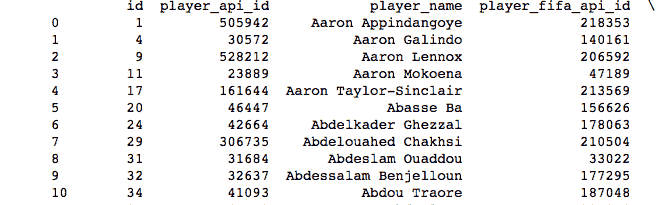
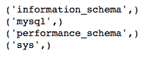
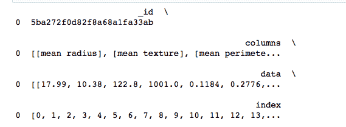

# 二、物联网的数据访问和分布式处理

数据无处不在:图像、语音、文本、天气信息、汽车速度、最近一次电磁干扰、不断变化的股票价格。随着**物联网** ( **IoT** )系统的整合，产生的数据量成倍增长；传感器读数就是一个例子，可以用来测量室温、土壤碱度等等。这些数据以各种格式存储和提供。在本章中，我们将学习如何读取、保存和处理一些流行格式的数据。具体来说，您将执行以下操作:

*   以 TXT 格式访问数据
*   通过 csv、pandas 和 NumPy 模块读写 CSV 格式的数据
*   使用 JSON 和 pandas 访问 JSON 数据
*   学习使用 PyTables、pandas 和 h5py 处理 HDF5 格式
*   使用 SQLite 和 MySQL 处理 SQL 数据库
*   使用 MongoDB 处理 NoSQL
*   使用 Hadoop 的分布式文件系统


# TXT 格式

用于存储数据的最简单和常见的格式之一是 TXT 格式；许多物联网传感器以简单的`.txt`文件格式记录带有不同时间戳的传感器读数。Python 提供了创建、读取和写入 TXT 文件的内置函数。

我们可以在 Python 本身不使用任何模块的情况下访问 TXT 文件；在这种情况下，数据是字符串类型，您需要将其转换为其他类型才能使用。或者，我们可以使用 NumPy 或熊猫。


# 在 Python 中使用 TXT 文件

Python 内置了读写 TXT 文件的函数。使用四组功能提供完整的功能:`open()`、`read()`、`write()`和`close()`。顾名思义，它们用于打开文件、读取文件、写入文件，最后关闭文件。如果您正在处理字符串数据(文本)，这是最佳选择。本节我们将使用 TXT 形式的`Shakespeare`播放；该文件可从麻省理工学院网站下载:[https://OCW . MIT . edu/ans 7870/6/6.006/s08/lecture notes/files/t8 . Shakespeare . txt](https://ocw.mit.edu/ans7870/6/6.006/s08/lecturenotes/files/t8.shakespeare.txt)。

我们定义以下变量来访问数据:

```
data_folder = '../../data/Shakespeare'
data_file = 'alllines.txt'
```

这里的第一步是打开文件:

```
f = open(data_file)
```

接下来，我们读取整个文件；我们可以使用`read `函数，它将整个文件作为一个单独的字符串读取:

```
contents = f.read()
```

这会将整个文件(由 4，583，798 个字符组成)读入`contents`变量。让我们探索一下`contents`变量的内容；以下命令将打印第一个`1000`字符:

```
print(contents[:1000])
```

前面的代码将输出如下:

```
"ACT I"
"SCENE I. London. The palace."
"Enter KING HENRY, LORD JOHN OF LANCASTER, the EARL of WESTMORELAND, SIR WALTER BLUNT, and others"
"So shaken as we are, so wan with care,"
"Find we a time for frighted peace to pant,"
"And breathe short-winded accents of new broils"
"To be commenced in strands afar remote."
"No more the thirsty entrance of this soil"
"will daub her lips with her own children's blood,"
"Nor more will trenching war channel her fields,"
"Nor bruise her flowerets with the armed hoofs"
"Of hostile paces: those opposed eyes,"
"Which, like the meteors of a troubled heaven,"
"All of one nature, of one substance bred,"
"Did lately meet in the intestine shock"
"And furious close of civil butchery"
"will now, in mutual well-beseeming ranks,"
"March all one way and be no more opposed"
"Against acquaintance, kindred and allies:"
"The edge of war, like an ill-sheathed knife,"
"No more will cut his master. Therefore, friends,"
"As far as to the sepulchre of Christ,"
"Whose
```

如果 TXT 文件包含数值型数据，最好使用 NumPy 如果数据是混合的，熊猫是最好的选择。


# 逗号分隔值（csv）文件格式

**C**omma 分隔值 ( **CSV** )文件是存储物联网系统生成的表格数据最流行的格式。在一个`.csv `文件中，记录的值存储在纯文本行中，每行包含由分隔符分隔的字段的值。默认情况下，分隔符是逗号，但可以配置为任何其他字符。在本节中，我们将学习如何通过 Python 的`csv`、`numpy`和`pandas`模块使用 CSV 文件中的数据。我们将使用`household_power_consumption`数据文件。该文件可从以下 GitHub 链接下载:[https://GitHub . com/a hanse/mach learning/blob/master/household _ power _ consumption . CSV](https://github.com/ahanse/machlearning/blob/master/household_power_consumption.csv)。为了访问数据文件，我们定义了以下变量:

```
data_folder = '../../data/household_power_consumption' 
data_file = 'household_power_consumption.csv'
```

一般来说，要快速读取 CSV 文件中的数据，使用 Python `csv`模块；但是，如果需要将数据解释为日期和数字数据字段的混合，最好使用 pandas 包。如果数据只是数字，NumPy 是最合适的包。


# 使用 csv 模块处理 CSV 文件

在 Python 中，`csv`模块提供了读取和写入 CSV 文件的类和方法。`csv.reader`方法创建一个 reader 对象，从中可以迭代地读取行。每次从文件中读取一行时，reader 对象都返回一个字段列表。例如，下面的代码演示了读取数据文件和打印行:

```
import csv
import os

with open(os.path.join(data_folder,data_file),newline='') as csvfile:
   csvreader = csv.reader(csvfile)
   for row in csvreader:
     print(row)
```

这些行被打印为字段值列表:

```
['date', 'time', 'global_active_power', 'global_reactive_power', 'voltage', 'global_intensity', 'sub_metering_1', 'sub_metering_2', 'sub_metering_3'] ['0007-01-01', '00:00:00', '2.58', '0.136', '241.97', '10.6', '0', '0', '0'] ['0007-01-01', '00:01:00', '2.552', '0.1', '241.75', '10.4', '0', '0', '0'] ['0007-01-01', '00:02:00', '2.55', '0.1', '241.64', '10.4', '0', '0', '0']
```

`csv.writer`方法返回一个可以用来将行写入文件的对象。例如，以下代码将文件的前 10 行写入临时文件，然后打印出来:

```
# read the file and write first ten rows
with open(os.path.join(data_folder, data_file), newline='') as csvfile, \
        open(os.path.join(data_folder, 'temp.csv'), 'w', newline='') as tempfile:
    csvreader = csv.reader(csvfile)
    csvwriter = csv.writer(tempfile)
    for row, i in zip(csvreader, range(10)):
        csvwriter.writerow(row)

# read and print the newly written file
with open(os.path.join(data_folder, 'temp.csv'), newline='') as tempfile:
    csvreader = csv.reader(tempfile)
    for row in csvreader:
        print(row)
```

`delimiter`字段和`quoting `字段字符是创建`reader`和`writer`对象时可以设置的重要属性。

默认情况下，`delimiter`字段为`,`，其他分隔符由`reader`或`writer`函数的`delimiter`参数指定。例如，下面的代码将带有`|`的文件保存为`delimiter`:

```
    # read the file and write first ten rows with '|' delimiter
with open(os.path.join(data_folder, data_file), newline='') as csvfile, \
        open(os.path.join(data_folder, 'temp.csv'), 'w', newline='') as tempfile:
    csvreader = csv.reader(csvfile)
    csvwriter = csv.writer(tempfile, delimiter='|')
    for row, i in zip(csvreader, range(10)):
        csvwriter.writerow(row)

# read and print the newly written file
with open(os.path.join(data_folder, 'temp.csv'), newline='') as tempfile:
    csvreader = csv.reader(tempfile, delimiter='|')
    for row in csvreader:
        print(row)
```

如果在读取文件时没有指定`delimiter`字符，这些行将作为一个字段读取并打印如下:

```
['0007-01-01|00:00:00|2.58|0.136|241.97|10.6|0|0|0']
```

`quotechar`指定包围字段的字符。`quoting`参数指定哪种字段可以用`quotechar`包围。`quoting`参数可以是下列值之一:

*   `csv.QUOTE_ALL`:所有字段都被引用
*   `csv.QUOTE_MINIMAL`:仅引用包含特殊字符的字段
*   `csv.QUOTE_NONNUMERIC`:所有非数值字段都被引用
*   `csv.QUOTE_NONE`:没有字段被引用

例如，让我们首先打印临时文件:

```
0007-01-01|00:00:00|2.58|0.136|241.97|10.6|0|0|0
0007-01-01|00:01:00|2.552|0.1|241.75|10.4|0|0|0
0007-01-01|00:02:00|2.55|0.1|241.64|10.4|0|0|0
0007-01-01|00:03:00|2.55|0.1|241.71|10.4|0|0|0
0007-01-01|00:04:00|2.554|0.1|241.98|10.4|0|0|0
0007-01-01|00:05:00|2.55|0.1|241.83|10.4|0|0|0
0007-01-01|00:06:00|2.534|0.096|241.07|10.4|0|0|0
0007-01-01|00:07:00|2.484|0|241.29|10.2|0|0|0
0007-01-01|00:08:00|2.468|0|241.23|10.2|0|0|0
```

现在让我们保存它，并引用所有字段:

```
# read the file and write first ten rows with '|' delimiter, all quoting and * as a quote charachetr.
with open(os.path.join(data_folder, data_file), newline='') as csvfile, \
        open('temp.csv', 'w', newline='') as tempfile:
    csvreader = csv.reader(csvfile)
    csvwriter = csv.writer(tempfile, delimiter='|', quotechar='*',quoting=csv.QUOTE_ALL)
    for row, i in zip(csvreader, range(10)):
        csvwriter.writerow(row)
```

文件用指定的引号字符保存:

```
*0007-01-01*|*00:00:00*|*2.58*|*0.136*|*241.97*|*10.6*|*0*|*0*|*0*
*0007-01-01*|*00:01:00*|*2.552*|*0.1*|*241.75*|*10.4*|*0*|*0*|*0*
*0007-01-01*|*00:02:00*|*2.55*|*0.1*|*241.64*|*10.4*|*0*|*0*|*0*
*0007-01-01*|*00:03:00*|*2.55*|*0.1*|*241.71*|*10.4*|*0*|*0*|*0*
*0007-01-01*|*00:04:00*|*2.554*|*0.1*|*241.98*|*10.4*|*0*|*0*|*0*
*0007-01-01*|*00:05:00*|*2.55*|*0.1*|*241.83*|*10.4*|*0*|*0*|*0*
*0007-01-01*|*00:06:00*|*2.534*|*0.096*|*241.07*|*10.4*|*0*|*0*|*0*
*0007-01-01*|*00:07:00*|*2.484*|*0*|*241.29*|*10.2*|*0*|*0*|*0*
*0007-01-01*|*00:08:00*|*2.468*|*0*|*241.23*|*10.2*|*0*|*0*|*0*
```

记得用相同的参数读取文件；否则，`*`引号字符将被视为字段值的一部分，并打印如下:

```
['*0007-01-01*', '*00:00:00*', '*2.58*', '*0.136*', '*241.97*', '*10.6*', '*0*', '*0*', '*0*']
```

对`reader`对象使用正确的参数会打印以下内容:

```
['0007-01-01', '00:00:00', '2.58', '0.136', '241.97', '10.6', '0', '0', '0']
```

现在让我们看看如何用 pandas 读取 CSV 文件，pandas 是另一个流行的 Python 库。


# 使用熊猫模块处理 CSV 文件

在 pandas 中，`read_csv()`函数在读取 CSV 文件后返回一个数据帧:

```
df = pd.read_csv('temp.csv')
print(df)
```

数据帧打印如下:

```
         date      time  global_active_power  global_reactive_power  voltage  \
0  0007-01-01  00:00:00                2.580                  0.136   241.97   
1  0007-01-01  00:01:00                2.552                  0.100   241.75   
2  0007-01-01  00:02:00                2.550                  0.100   241.64   
3  0007-01-01  00:03:00                2.550                  0.100   241.71   
4  0007-01-01  00:04:00                2.554                  0.100   241.98   
5  0007-01-01  00:05:00                2.550                  0.100   241.83   
6  0007-01-01  00:06:00                2.534                  0.096   241.07   
7  0007-01-01  00:07:00                2.484                  0.000   241.29   
8  0007-01-01  00:08:00                2.468                  0.000   241.23   

   global_intensity  sub_metering_1  sub_metering_2  sub_metering_3  
0              10.6               0               0               0  
1              10.4               0               0               0  
2              10.4               0               0               0  
3              10.4               0               0               0  
4              10.4               0               0               0  
5              10.4               0               0               0  
6              10.4               0               0               0  
7              10.2               0               0               0  
8              10.2               0               0               0  
```

我们在前面的输出中看到，pandas 自动将`date`和`time`列解释为它们各自的数据类型。熊猫数据帧可以用`to_csv()`功能保存为 CSV 文件:

```
df.to_csv('temp1.cvs')
```

熊猫在读写 CSV 文件时，提供了大量的论据。下面是其中的一些，以及它们的使用方法:

*   `header`:定义用作标题的行号，如果文件不包含任何标题，则不定义。
*   `sep`:定义行中分隔字段的字符。默认情况下，`sep`的值被设置为`,`。
*   `names`:定义文件中每一列的列名。
*   `usecols`:定义需要从 CSV 文件中提取的列。不读取此参数中未提及的列。
*   `dtype`:定义数据帧中各列的数据类型。

许多其他可用选项记录在以下链接中:[https://pandas . pydata . org/pandas-docs/stable/generated/pandas . read _ CSV . html](https://pandas.pydata.org/pandas-docs/stable/generated/pandas.read_csv.html)和[https://pandas . pydata . org/pandas-docs/stable/generated/pandas。DataFrame.to_csv.html](https://pandas.pydata.org/pandas-docs/stable/generated/pandas.DataFrame.to_csv.html) 。

现在让我们看看如何使用 NumPy 模块从 CSV 文件中读取数据。


# 使用 NumPy 模块处理 CSV 文件

NumPy 模块提供了两个从 CSV 文件中读取值的函数:`np.loadtxt()`和`np.genfromtxt()`。

`np.loadtxt`的一个例子如下:

```
arr = np.loadtxt('temp.csv', skiprows=1, usecols=(2,3), delimiter=',')
arr
```

前面的代码从我们之前创建的文件中读取列`3`和`4`，并将它们保存在一个 9 × 2 数组中，如下所示:

```
array([[2.58 , 0.136],
       [2.552, 0.1  ],
       [2.55 , 0.1  ],
       [2.55 , 0.1  ],
       [2.554, 0.1  ],
       [2.55 , 0.1  ],
       [2.534, 0.096],
       [2.484, 0\.   ],
       [2.468, 0\.   ]])
```

`np.loadtxt()`功能无法处理丢失数据的 CSV 文件。对于数据缺失的情况，可以使用`np.genfromtxt()`。这两个函数都提供了更多的参数；详细信息可以在 NumPy 文档中找到。可使用`np.genfromtxt()`编写上述代码，如下所示:

```
arr = np.genfromtxt('temp.csv', skip_header=1, usecols=(2,3), delimiter=',')
```

将 AI 应用于物联网数据而产生的 NumPy 数组可以用`np.savetxt()`保存。例如，我们之前加载的数组可以保存如下:

```
np.savetxt('temp.csv', arr, delimiter=',')
```

`np.savetxt()`函数也接受各种其他有用的参数，比如保存的字段和标题的格式。关于这个函数的更多细节，请查阅 NumPy 文档。

CSV 是物联网平台和设备上最流行的数据格式。在本节中，我们学习了如何使用 Python 中的三个不同的包来读取 CSV 数据。让我们在下一节了解另一种流行的格式 XLSX。


# XLSX 格式

Excel 是 Microsoft Office pack 的一个组件，是存储和可视化数据的常用格式之一。从 2010 年开始，Office 已经支持`.xlsx`格式。我们可以使用 OpenPyXl 和 pandas 函数读取 XLSX 文件。


# 对 XLSX 文件使用 OpenPyXl

OpenPyXl 是一个用于读写 Excel 文件的 Python 库。这是一个开源项目。使用以下命令创建一个新的`workbook`:

```
wb = Workbook()
```

我们可以使用以下命令访问当前的`active`表:

```
ws = wb.active()
```

要更改工作表名称，使用`title`命令:

```
ws.title = "Demo Name"
```

使用`append`方法，可在板材上添加一行:

```
ws.append()
```

可以使用`create_sheet()`方法创建一个新的工作表。可使用`column`和`row`值创建活动工作表中的单个单元格:

```
# Assigns the cell corresponding to 
# column A and row 10 a value of 5
ws.['A10'] = 5  
#or
ws.cell(column=1, row=10, value=5)
```

可以使用`save`方法保存工作簿。要加载一个现有的工作簿，我们可以使用`load_workbook`方法。使用`get_sheet_names()`可以访问 Excel 工作簿中不同工作表的名称。

下面的代码创建一个包含三张工作表的 Excel 工作簿并保存它；稍后，它加载工作表并访问单元格。代码可以从 GitHub 的`OpenPyXl_example.ipynb`处获得:

```
# Creating and writing into xlsx file
from openpyxl import Workbook
from openpyxl.compat import range
from openpyxl.utils import get_column_letter
wb = Workbook()
dest_filename = 'empty_book.xlsx'
ws1 = wb.active
ws1.title = "range names"
for row in range(1, 40):
 ws1.append(range(0,100,5))
ws2 = wb.create_sheet(title="Pi")
ws2['F5'] = 2 * 3.14
ws2.cell(column=1, row=5, value= 3.14)
ws3 = wb.create_sheet(title="Data")
for row in range(1, 20):
 for col in range(1, 15):
 _ = ws3.cell(column=col, row=row, value="\
 {0}".format(get_column_letter(col)))
print(ws3['A10'].value)
wb.save(filename = dest_filename)

# Reading from xlsx file
from openpyxl import load_workbook
wb = load_workbook(filename = 'empty_book.xlsx')
sheet_ranges = wb['range names']
print(wb.get_sheet_names())
print(sheet_ranges['D18'].value)
```

你可以从它的文档中了解更多关于 OpenPyXL 的信息，可以在[https://openpyxl.readthedocs.io/en/stable/](https://openpyxl.readthedocs.io/en/stable/)找到。


# 使用带有 XLSX 文件的熊猫

我们可以在熊猫的帮助下加载现有的`.xlsx`文件。`read_excel`方法用于将 Excel 文件作为数据帧读取。这个方法使用了一个参数`sheet_name`，它用于指定我们想要加载的工作表。工作表名称可以指定为字符串或从 0 开始的数字。`to_excel`方法可以用来写入 Excel 文件。

下面的代码读取一个 Excel 文件，操作它，并保存它。代码可从 GitHub 的`Pandas_xlsx_example.ipynb`处获得:

```
import pandas as pd
df = pd.read_excel("empty_book.xlsx", sheet_name=0)
df.describe()
result = df * 2
result.describe()
result.to_excel("empty_book_modified.xlsx")
```


# 使用 JSON 格式

**JavaScript****Object****Notation**(**JSON**)是物联网系统中另一种流行的数据格式。在这一节中，我们将学习如何用 Python 的 JSON、NumPy 和 pandas 包读取 JSON 数据。

对于这一部分，我们将使用`zips.json`文件，它包含美国邮政编码、城市代码、地理位置详细信息和州代码。该文件包含以下列格式记录的 JSON 对象:

```
{ "_id" : "01001", "city" : "AGAWAM", "loc" : [ -72.622739, 42.070206 ], "pop" : 15338, "state" : "MA" }
```


# 通过 JSON 模块使用 JSON 文件

要加载和解码 JSON 数据，使用`json.load()`或`json.loads() `函数。例如，下面的代码从`zips.json`文件中读取前 10 行，并很好地打印出来:

```
import os
import json
from pprint import pprint

with open(os.path.join(data_folder,data_file)) as json_file:
    for line,i in zip(json_file,range(10)):
        json_data = json.loads(line)
        pprint(json_data)
```

对象打印如下:

```
{'_id': '01001',
 'city': 'AGAWAM',
 'loc': [-72.622739, 42.070206],
 'pop': 15338,
 'state': 'MA'}
```

`json.loads()`函数将字符串对象作为输入，而`json.load()`函数将文件对象作为输入。两个函数都对 JSON 对象进行解码，并将其作为 Python 字典对象加载到`json_data`文件中。

`json.dumps()`函数接受一个对象并产生一个 JSON 字符串，而`json.dump()`函数接受一个对象并将 JSON 字符串写入文件。因此，这两个功能与`json.loads()`和`json.load()`功能相反。


# 带有熊猫模块的 JSON 文件

JSON 字符串或文件可以用`pandas.read_json()`函数读取，该函数返回一个 DataFrame 或 series 对象。例如，以下代码读取`zips.json`文件:

```
df = pd.read_json(os.path.join(data_folder,data_file), lines=True)
print(df)
```

我们设置`lines=True`是因为每行包含一个 JSON 格式的单独对象。没有这个参数设置为`True`，熊猫会养`ValueError`。数据帧打印如下:

```
         _id             city                               loc    pop state
0       1001           AGAWAM           [-72.622739, 42.070206]  15338    MA
1       1002          CUSHMAN            [-72.51565, 42.377017]  36963    MA
...      ...              ...                               ...    ...   ...
29351  99929         WRANGELL          [-132.352918, 56.433524]   2573    AK
29352  99950        KETCHIKAN           [-133.18479, 55.942471]    422    AK

[29353 rows x 5 columns]
```

要将 pandas 数据帧或系列对象保存到 JSON 文件或字符串，使用`Dataframe.to_json() `功能。

关于这两个函数的更多信息可以在以下链接中找到:[https://pandas . pydata . org/pandas-docs/stable/generated/pandas . read _ JSON . html](https://pandas.pydata.org/pandas-docs/stable/generated/pandas.read_json.html)和[https://pandas . pydata . org/pandas-docs/stable/generated/pandas。DataFrame.to_json.html](https://pandas.pydata.org/pandas-docs/stable/generated/pandas.DataFrame.to_json.html) 。

虽然 CSV 和 JSON 仍然是最受欢迎的物联网数据格式，但由于其较大的大小，通常需要分发数据。有两种流行的分布式数据存储和访问机制:HDF5 和 HDFS。我们先来了解一下 HDF5 格式。


# HDF5 格式

**分层数据格式**(**https://support.hdfgroup.org/HDF5/**)是由学术和行业组织组成的联盟 HDF 集团()制定的规范。在 HDF5 文件中，数据被组织成组和数据集。一个组是**组**或**数据集**的集合。数据集是一个多维同构数组。

在 Python 中，PyTables 和 h5py 是处理 HDF5 文件的两个主要库。这两个库都需要安装 HDF5。对于 HDF5 的并行版本，还需要安装 MPI 版本。HDF5 和 MPI 的安装超出了本书的范围。并行 HDF5 的安装说明可以在以下链接找到:[https://support . hdf group . org/FTP/HD F5/current/src/unpacked/release _ docs/INSTALL _ parallel](https://support.hdfgroup.org/ftp/HDF5/current/src/unpacked/release_docs/INSTALL_parallel)。


# 将 HDF5 用于 PyTables

让我们首先根据`temp.csv`文件中的数字数据创建一个 HDF5 文件，步骤如下:

1.  获取数字数据:

```
import numpy as np
arr = np.loadtxt('temp.csv', skiprows=1, usecols=(2,3), delimiter=',')
```

2.  打开 HDF5 文件:

```
import tables
h5filename = 'pytable_demo.hdf5'
with tables.open_file(h5filename,mode='w') as h5file:
```

3.  获取`root`节点:

```
    root = h5file.root
```

4.  用`create_group()`创建一个组或用`create_array()`创建一个数据集，重复此操作直到所有数据都被存储:

```
    h5file.create_array(root,'global_power',arr)
```

5.  关闭文件:

```
    h5file.close()
```

让我们读取文件并打印数据集，以确保它被正确写入:

```
with tables.open_file(h5filename,mode='r') as h5file:
    root = h5file.root
    for node in h5file.root:
        ds = node.read()
        print(type(ds),ds.shape)
        print(ds)
```

我们拿回 NumPy 数组。


# 对熊猫使用 HDF5

我们还可以用熊猫读写 HDF5 文件。要用 pandas 读取 HDF5 文件，必须先用它创建文件。例如，让我们使用 pandas 创建一个包含全局功率值的 HDF5 文件:

```
import pandas as pd
import numpy as np
arr = np.loadtxt('temp.csv', skiprows=1, usecols=(2,3), delimiter=',')
import pandas as pd
store=pd.HDFStore('hdfstore_demo.hdf5')
print(store)
store['global_power']=pd.DataFrame(arr)
store.close()
```

现在，让我们读取我们创建的 HDF5 文件，并将阵列打印出来:

```
import pandas as pd
store=pd.HDFStore('hdfstore_demo.hdf5')
print(store)
print(store['global_power'])
store.close()
```

数据帧的值可以通过三种不同的方式读取:

*   `store['global_power']`
*   `store.get('global_power')`
*   `store.global_power`

pandas 还提供了高级的`read_hdf()`函数和用于读写 HDF5 文件的`to_hdf()` DataFrame 方法。

更多关于熊猫 HDF5 的文献可从以下链接获得:[http://pandas.pydata.org/pandas-docs/stable/io.html#io-hdf5](http://pandas.pydata.org/pandas-docs/stable/io.html#io-hdf5)。


# 配合 h5py 使用 HDF5

`h5py`模块是 Python 中处理 HDF5 文件最流行的方式。可以使用`h5py.File()`功能打开新的或现有的 HDF5 文件。文件打开后，只需在文件对象上加上下标就可以访问它的组，就好像它是一个字典对象一样。例如，以下代码使用`h5py`打开一个 HDF5 文件，然后打印存储在`/global_power `组中的数组:

```
import h5py
hdf5file = h5py.File('pytable_demo.hdf5')
ds=hdf5file['/global_power']
print(ds)
for i in range(len(ds)):
    print(arr[i])
hdf5file.close()
```

`arr`变量打印一个`HDF5 dataset`类型:

```
<HDF5 dataset "global_power": shape (9, 2), type "<f8">
[2.58  0.136]
[2.552 0.1  ]
[2.55 0.1 ]
[2.55 0.1 ]
[2.554 0.1  ]
[2.55 0.1 ]
[2.534 0.096]
[2.484 0\.   ]
[2.468 0\.   ]
```

对于新的`hdf5file`，可以通过使用`hdf5file.create_dataset()`函数创建数据集和组，返回数据集对象，使用`hdf5file.create_group()`函数创建文件夹对象。`hdf5file`文件对象也是代表根文件夹`/`的文件夹对象。数据集对象支持数组样式切片和切割，以设置或读取其中的值。例如，以下代码创建一个 HDF5 文件并存储一个数据集:

```
import numpy as np
arr = np.loadtxt('temp.csv', skiprows=1, usecols=(2,3), delimiter=',')

import h5py
hdf5file = h5py.File('h5py_demo.hdf5')
dataset1 = hdf5file.create_dataset('global_power',data=arr)
hdf5file.close()
```

`h5py`提供了一个`attrs`代理对象，它有一个类似字典的接口来存储和检索关于文件、文件夹和数据集的元数据。例如，下面的代码设置并打印数据集和文件属性:

```
dataset1.attrs['owner']='City Corp.'
print(dataset1.attrs['owner'])

hdf5file.attrs['security_level']='public'
print(hdf5file.attrs['security_level'])
```

有关`h5py`库的更多信息，请参考以下链接的文档:[http://docs.h5py.org/en/latest/index.html](http://docs.h5py.org/en/latest/index.html)。

到目前为止，我们已经了解了不同的数据格式。通常，大型数据是存储在数据库中的，因此我们接下来将探讨如何访问 SQL 和 NoSQL 数据库。


# SQL 数据

大多数数据库是用关系模型组织的。关系数据库由一个或多个相关的信息表组成，不同表中的信息之间的关系用键来描述。通常，这些数据库使用**数据库管理系统** ( **DBMS** )进行管理，该软件与最终用户、不同的应用程序以及数据库本身进行交互，以捕获和分析数据。商用数据库管理系统使用结构化查询语言来访问和操作数据库。我们还可以使用 Python 访问关系数据库。在这一节中，我们将探索 SQLite 和 MySQL，这是两个非常流行的使用 Python 的数据库引擎。


# SQLite 数据库引擎

根据 SQLite 主页([https://sqlite.org/index.html](https://sqlite.org/index.html))*SQLite 是一个自包含、高可靠性、嵌入式、全功能、公共领域的 SQL 数据库引擎*。

SQLite 针对嵌入式应用进行了优化。这是简单的使用和相当快。我们需要使用`sqlite3` Python 模块来集成 SQLite 和 Python。`sqlite3`模块是 Python 3 捆绑的，不需要安装。

我们将使用来自欧洲足球数据库([https://github.com/hugomathien/football-data-collection](https://github.com/hugomathien/football-data-collection))的数据进行演示。我们假设您已经安装并启动了一台 SQL server:

1.  导入`sqlite3`后的第一步是使用`connect`方法创建一个到数据库的连接:

```
import sqlite3 
import pandas as pd
connection = sqlite3.connect('database.sqlite')
print("Database opened successfully")
```

2.  欧洲足球数据库由八个表组成。我们可以使用`read_sql`将数据库表或 SQL 查询读入 DataFrame。这将打印数据库中所有表的列表:

```
tables = pd.read_sql("SELECT * FROM sqlite_master WHERE 
        type='table';", connection)
print(tables)
```


3.  让我们从`Country`表中读取数据:

```
countries = pd.read_sql("SELECT * FROM Country;", connection)
countries.head()
```


4.  我们可以在表上使用 SQL 查询。在下面的例子中，我们选择了身高大于等于`180`，体重大于等于`170`的玩家:

```
selected_players = pd.read_sql_query("SELECT * FROM Player WHERE
         height >= 180 AND weight >= 170 ", connection)
print(selected_players)
```



5.  最后，不要忘记使用`close`方法关闭连接:

```
connection.close()
```

如果您对数据库进行了任何更改，您将需要使用`commit()`方法。


# MySQL 数据库引擎

虽然我们可以对大型数据库使用 SQLite，但 MySQL 通常是首选。除了对大型数据库的可伸缩性，MySQL 在数据安全至关重要的地方也很有用。在使用 MySQL 之前，您需要安装 Python MySQL 连接器。有许多可能的 Python MySQL 连接器，如 MySQLdb、PyMySQL 和 MySQL；我们将使用`mysql-connector-python`。

在这三个例子中，在使用`connect`方法建立连接之后，我们定义了`cursor`元素，并使用`execute`方法运行不同的 SQL 查询。要安装 MySQL，我们使用以下代码:

```
pip install mysql-connector-python 
```

1.  现在已经安装了 Python MySQL 连接器，我们可以开始连接 SQL server 了。用您的 SQL server 配置替换`host`、`user`和`password`配置:

```
import mysql.connector 
connection = mysql.connector.connect(host="127.0.0.1", # your host 
        user="root", # username
        password="**********" ) # password
```

2.  让我们检查服务器中现有的数据库并列出它们。为此，我们使用`cursor`方法:

```
mycursor = connection.cursor()
mycursor.execute("SHOW DATABASES")
for x in mycursor:
    print(x)
```



3.  我们可以进入一个现有的数据库。让我们列出其中一个数据库中的表:

```
connection = mysql.connector.connect(host="127.0.0.1", # your host 
user="root", # username
password="**********" ,  #replace with your password
database = 'mysql')
mycursor = connection.cursor()
mycursor.execute("SHOW TABLES")
for x in mycursor:
    print(x)
```


# NoSQL 数据

**不仅结构化查询语言** ( **NoSQL** )数据库不是关系数据库；相反，数据可以以键值、JSON、文档、列或图形格式存储。它们经常用于大数据和实时应用。我们将在这里学习如何使用 MongoDB 访问 NoSQL 数据，我们假设您已经正确配置了 MongoDB 服务器，并且在:

1.  我们需要使用`MongoClient`对象建立与 Mongo 守护进程的连接。以下代码建立了到默认主机`localhost`和端口`27017`的连接。它让我们可以访问数据库:

```
from pymongo import MongoClient
client = MongoClient()
db = client.test
```

2.  在本例中，我们尝试将 scikit-learn 中可用的`cancer`数据集加载到 Mongo 数据库中。所以，我们首先获得乳腺癌数据集，并将其转换成熊猫数据帧:

```
from sklearn.datasets import load_breast_cancer
import pandas as pd

cancer = load_breast_cancer()
data = pd.DataFrame(cancer.data, columns=[cancer.feature_names])

data.head()
```

3.  接下来，我们将其转换为 JSON 格式，使用`json.loads()`函数对其进行解码，并将解码后的数据插入到开放数据库中:

```
import json
data_in_json = data.to_json(orient='split')
rows = json.loads(data_in_json)
db.cancer_data.insert(rows)
```

4.  这将创建一个包含数据的名为`cancer_data`的集合。我们可以使用`cursor`对象查询刚刚创建的文档:

```
cursor = db['cancer_data'].find({})
df = pd.DataFrame(list(cursor))
print(df)
```



谈到物联网上的分布式数据， **Hadoop 分布式文件系统** ( **HDFS** )是另一种在物联网系统中提供分布式数据存储和访问的流行方法。在下一节中，我们将学习如何在 HDFS 中访问和存储数据。


# HDFS

HDFS 是一种流行的存储和访问方法，用于存储和检索物联网解决方案的数据文件。HDFS 格式可以以可靠和可扩展的方式保存大量数据。它的设计基于**谷歌文件系统**([https://ai.google/research/pubs/pub51](https://ai.google/research/pubs/pub51))。HDFS 将单个文件分割成固定大小的块，存储在集群中的计算机上。为了确保可靠性，它复制文件块并将其分布到整个群集；默认情况下，复制因子为 3。HDFS 有两个主要的架构组件:

*   第一个是 **NodeName** ，存储整个文件系统的元数据，比如文件名、它们的权限以及每个文件的每个块的位置。
*   第二个， **DataNode** (一个或多个)，是存储文件块的地方。它使用 protobufs 执行**远程过程调用** ( **RPCs** )。

RPC 是一种协议，一个程序可以用它向网络上另一台计算机上的程序请求服务，而不必知道网络的细节。程序调用有时也被称为**功能调用**或**子程序调用**。

Python 中编程访问 HDFS 有很多选项，比如`snakebite`、`pyarrow`、`hdfs3`、`pywebhdfs`、`hdfscli`等等。在这一节中，我们将主要关注提供本地 RPC 客户端接口并使用 Python 3 的库。

Snakebite 是一个纯 Python 模块和 CLI，允许您从 Python 程序访问 HDFS。目前只对 Python 2 有效；不支持 Python 3。此外，它还不支持写操作，所以我们没有把它包括在书中。不过，如果你有兴趣了解更多这方面的内容，可以参考 Spotify 的 GitHub:[https://github.com/spotify/snakebite](https://github.com/spotify/snakebite)。


# 将 hdfs3 与 hdfs 配合使用

`hdfs3`是围绕 C/C++ `libhdfs3`库的轻量级 Python 包装器。它允许我们从 Python 中本地使用 HDFS。首先，我们需要连接 HDFS 的 NameNode 这是使用`HDFileSystem`类完成的:

```
from hdfs3 import HDFileSystem
hdfs = HDFileSystem(host = 'localhost', port=8020)
```

这将自动建立与 NameNode 的连接。现在，我们可以使用以下代码访问目录列表:

```
print(hdfs.ls('/tmp')) 
```

这将列出`tmp`文件夹中的所有文件和目录。你可以使用`mkdir`来创建一个目录，使用`cp`来将文件从一个位置复制到另一个位置。为了写入一个文件，我们首先使用`open`方法打开它，并使用`write`:

```
with hdfs.open('/tmp/file1.txt','wb') as f:
    f.write(b'You are Awesome!')
```

可以从文件中读取数据:

```
with hdfs.open('/tmp/file1.txt') as f:
    print(f.read())
```

你可以从它的文档中了解更多关于`hdfs3`的信息:[https://media.readthedocs.org/pdf/hdfs3/latest/hdfs3.pdf](https://media.readthedocs.org/pdf/hdfs3/latest/hdfs3.pdf)。


# 为 HDFS 使用 PyArrow 的文件系统接口

PyArrow 有一个基于 C++的 HDFS 接口。默认情况下，它使用`libhdfs`，一个基于 JNI 的接口，用于 Java Hadoop 客户端。或者，我们也可以使用 HDFS 的 C++库`libhdfs3`。我们使用`hdfs.connect`连接到 NameNode:

```
import pyarrow as pa
hdfs = pa.hdfs.connect(host='hostname', port=8020, driver='libhdfs')
```

如果我们将驱动程序更改为`libhdfs3`，我们将使用 Pivotal Labs 的 HDFS c++库。一旦与 NameNode 建立了连接，就可以使用与 hdfs3 相同的方法访问文件系统。

当数据非常大时，首选 HDFS。它允许我们成块地读写数据；这有助于访问和处理流数据。下面这篇博文对三种本地 RPC 客户端接口做了一个很好的比较:【http://wesmckinney.com/blog/python-hdfs-interfaces/。


# 摘要

本章讨论了许多不同的数据格式，并且在这个过程中，讨论了许多不同的数据集。我们从最简单的 TXT 数据开始，访问`Shakespeare`播放数据。我们学习了如何使用`csv`、`numpy`和`pandas`模块从 CSV 文件中读取数据。我们转向了 JSON 格式；我们使用 Python 的 JSON 和 pandas 模块来访问 JSON 数据。从数据格式，我们进展到访问数据库，并涵盖了 SQL 和 NoSQL 数据库。接下来，我们学习了如何在 Python 中使用 Hadoop 文件系统。

访问数据是第一步。在下一章中，我们将了解机器学习工具，这些工具将帮助我们设计、建模和对数据做出明智的预测。