# 面向物联网的深度学习

在上一章中，我们学习了不同的**机器学习** ( **ML** )算法。本章的重点是基于多层模型的神经网络，也称为深度学习模型。在过去几年中，它们已经成为一个时髦词，也是基于人工智能的初创公司领域投资者的绝对最爱。在目标检测任务中达到高于人类水平的精度，击败世界丹九围棋高手，这些都是**深度** **学习** ( **DL** )可能实现的一些壮举。在本章和后续几章中，我们将了解不同的 DL 模型，以及如何对物联网生成的数据使用 DL。在这一章中，我们将从一瞥 DL 的旅程开始，并了解四种流行的模型，即**多层感知器**(**MLP**)**卷积神经网络**(**CNN**)**循环神经网络** ( **RNN** )和自编码器。具体来说，您将了解以下内容:

*   数字图书馆的历史及其目前成功的因素
*   人工神经元以及如何将它们连接起来解决非线性问题
*   反向传播算法及其在 MLP 模型训练中的应用
*   TensorFlow 中可用的不同优化器和激活函数
*   CNN 如何工作以及内核、填充和步长背后的概念
*   使用 CNN 模型进行分类和识别
*   RNNs 和改良 RNN 和长短期记忆和门控循环单位
*   自编码器的结构和功能


# 深度学习 101

哲学家、科学家和工程师总是对人类的思维感兴趣。人类模仿和复制人脑智力的愿望已经写了很多年了；希腊神话中的皮格马利翁笔下的加拉太亚，犹太民间传说中的假人，印度教神话中的玛雅悉多，只是几个例子。具有人工智能的机器人自古以来就是科幻作家的最爱。

正如我们今天所知，人工智能是与计算机的概念同时产生的。麦卡洛克和皮茨在 1943 年发表的开创性论文《神经活动中固有思想的逻辑演算》提出了第一个神经网络模型——可以执行逻辑运算(如 and、OR 和-NOT)的阈值设备。艾伦·图灵在 1950 年出版的开创性著作*计算机械与智能*中提出了一个**图灵测试**；鉴定机器是否有智能的一种测试。罗森布拉特于 1957 年在他的报告*中为可以从经验中学习的网络奠定了基础，该报告名为感知机——一种感知和识别自动机*。这些想法远远领先于他们的时代；虽然这些概念在理论上看起来是可能的，但当时的计算资源严重限制了你通过这些可以进行逻辑和学习的模型获得的性能。

虽然这些论文看起来很旧而且不相关，但它们非常值得一读，并对这些最初的思想家的愿景提供了很好的见解。以下是这些论文的链接，供感兴趣的读者参考:

*   *神经活动中固有观念的逻辑演算*，https://link.springer.com/article/10.1007%2FBF02478259[，
    ，](https://link.springer.com/article/10.1007%2FBF02478259)
*   *计算机械与智能*，艾伦·图灵:[http://phil415.pbworks.com/f/TuringComputing.pdf](http://phil415.pbworks.com/f/TuringComputing.pdf) 
*   *The Perceptron——一个感知和识别的自动机*，Rosenblatt:[https://blogs . umass . edu/brain-wars/files/2016/03/Rosenblatt-1957 . pdf](https://blogs.umass.edu/brain-wars/files/2016/03/rosenblatt-1957.pdf)

    另一篇有趣的论文一篇是卡内基梅隆大学的王和 Raj 关于深度学习起源的*；这份 72 页的论文详细介绍了 DL 的历史，从麦卡洛克·皮茨车型到最新的关注车型:[https://arxiv.org/pdf/1702.07800.pdf](https://arxiv.org/pdf/1702.07800.pdf)。*

 *两个人工智能冬天和后来的几次成功(随着 2012 年的突破，当时 Alex Krizhvesky、Ilya Sutskever 和 Geoffrey Hinton 的 AlexNet 参赛作品在年度 ImageNet 挑战赛中取得了 16%的错误率)，今天我们站在了 DL 胜过大多数现有人工智能技术的地方。以下来自 Google Trends 的截图显示，大约在 2014 年左右，**深度** **学习**开始流行，并从那时起一直在增长:

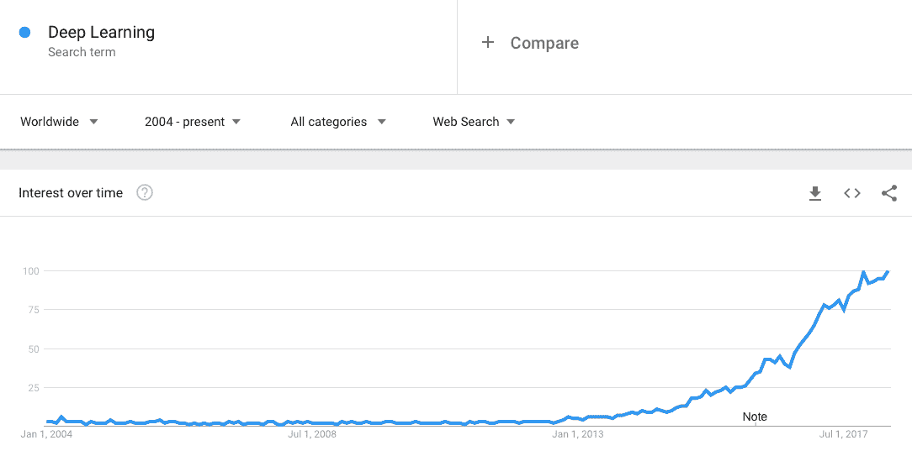

2004 年至 2018 年 4 月谷歌趋势中的深度学习

让我们看看这种增长趋势背后的原因，并分析这是炒作还是另有隐情。


# 深度学习——为什么是现在？

DL 领域的大多数核心概念在 80 年代和 90 年代已经存在，因此，问题出现了，为什么我们突然看到 DL 的应用增加，以解决从图像分类和图像修复到自动驾驶汽车和语音生成的不同问题。主要原因有两方面，概述如下:

*   **大型高质量数据集的可用性**:互联网产生了大量的图像、视频、文本和音频数据集。虽然其中大部分是未标记的，但通过许多领先研究人员的努力(例如，费创建了 ImageNet 数据集)，我们终于可以访问大型标记数据集。如果说 DL 是点燃你想象力的火炉，那么数据就是燃烧它的燃料。数据的数量和种类越多，模型的性能就越好。
*   **使用图形处理单元进行并行计算的可用性**:在 DL 模型中，主要有两种数学矩阵运算起着至关重要的作用，即矩阵乘法和矩阵加法。在**图形处理单元**(**GPU**)的帮助下，为一层中的所有神经元并行化这些过程的可能性使得在合理的时间内训练 DL 模型成为可能。

一旦对 DL 的兴趣增加，人们提出了进一步的改进，如更好的梯度下降优化器(DL 模型中用于计算权重和偏差更新的必要算法)，例如 Adam 和 RMSprop 新的正则化技术，如 dropout 和 batch normalization，不仅有助于过度拟合，还可以减少训练时间，最后但并非最不重要的是，DL 库(如 TensorFlow、Theano、Torch、MxNet 和 Keras)的可用性，这使得定义和训练复杂的架构变得更容易。

根据 [deeplearning.ai](https://www.deeplearning.ai/) 的创始人吴恩达的说法，尽管有大量的宣传和疯狂的投资，我们不会看到另一个人工智能的冬天，因为计算设备*的改进将在可预见的未来保持性能的进步和突破*，吴恩达在 2016 年的 EmTech Digital 上说过这一点，正如他的预测，我们已经看到了谷歌**张量处理单元** ( **TPUs** )、英特尔 Movidius 和英伟达在处理硬件方面的进步此外，现在有每小时低至 0.40 美分的云计算 GPU，让所有人都能负担得起。

可以阅读完整文章*AI Winter is not Coming*，发表在《麻省理工科技评论》上:[https://www . Technology Review . com/s/603062/AI-Winter-not-Coming/](https://www.technologyreview.com/s/603062/ai-winter-isnt-coming/)。在这里，吴恩达回答了关于人工智能未来的不同问题。

对于 DL 来说，GPU 处理能力是必须的；有大量的公司提供同样的云计算服务。但是，如果您是从现场开始，您可以使用以下方法之一:

*   谷歌合作实验室:它提供了一个基于浏览器、支持 GPU 的 Jupyter 笔记本式界面。它可以连续 12 小时免费使用 GPU 计算能力。
*   Kaggle 也提供了一个 Jupyter 笔记本风格的界面，具有 GPU 计算能力，可以免费使用大约六个小时。


# 人工神经元

所有 DL 模型的基本组件是人工神经元。人工神经元是受生物神经元工作的启发。它由一些通过权重连接的输入(也称为**突触连接**)组成，所有输入的加权和经过一个处理函数(称为**激活函数**)并产生一个非线性输出。

下面的截图显示了**一个生物神经元**和**一个人工神经元**:

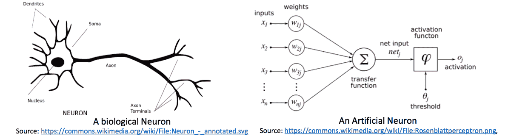

生物神经元和人工神经元

如果 *X [i]* 是通过突触连接 *w [ij]* 连接的人工神经元 *j* 的第 *i* ^(th) 个输入，则该神经元的净输入，通常称为神经元的**活动，可以定义为其所有包含的加权和，由下式给出:**


在上式中， *N* 是第 *j* ^第个神经元的输入总数， *θ [j]* 是第 *j* ^第个神经元的阈值；神经元的输出由下式给出:

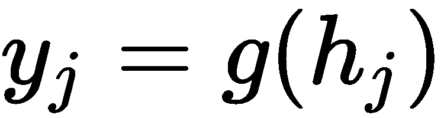

在前面， *g* 是激活功能。以下列出了不同 DL 模型中使用的不同激活函数，以及它们的数学和图形表示:

*   乙状结肠:


*   双曲正切:*g(h[j])= tanh(h[j])*


*   ReLU:*g(h[j])= max(0，h [j] )*


*   Softmax: 


*   泄漏的 ReLU: 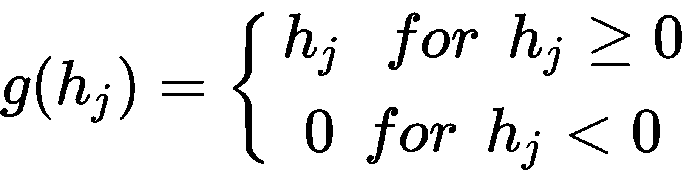


*   ELU: 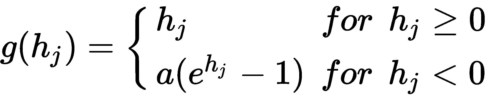

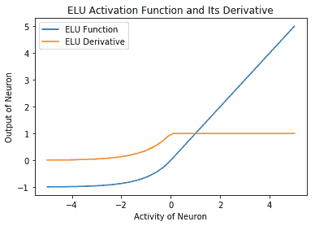

*   阈值:


# TensorFlow中单个神经元的建模

我们能使用这个单个神经元并让它学习吗？答案是肯定的，学习过程包括调整权重，使得预定义的损失函数( *L* )减小。如果我们在与损失函数相对于权重的梯度相反的方向上更新权重，将确保损失函数随着每次更新而减小。这种算法被称为**梯度下降**算法，是所有 DL 模型的核心。数学上，如果 *L* 是损失函数并且 *η* 是学习率，那么权重 *w [ij]* 被更新并表示为:


如果我们必须对单个人工神经元进行建模，我们首先需要确定以下参数:

*   **学习率参数**:学习率参数决定我们下降梯度的速度。通常位于 *0* 和 *1* 之间。如果学习速率太高，网络可能会在正确的解附近振荡，或者完全偏离该解。另一方面，当学习率过低时，最终收敛到解需要很长时间。
*   **激活函数**:激活函数决定神经元的输出如何随其活动而变化。由于权重更新方程涉及损失函数的导数，而损失函数的导数又取决于激活函数的导数，所以我们更喜欢使用连续可微函数作为神经元的激活函数。最初，使用了 sigmoid 和双曲线正切，但它们的收敛速度慢，梯度消失(梯度变为零，因此没有学习，同时还没有找到解决方案)。近年来，**整流线性单元** ( **ReLU** )及其变体，如泄漏 ReLU 和 eLU 是首选，因为它们提供快速收敛，同时有助于克服消失梯度问题。在 ReLU 中，我们有时会遇到**死亡神经元**的问题，也就是说，一些神经元永远不会触发，因为它们的活动总是小于零，因此，它们永远不会学习。leaky ReLU 和 eLU 都通过确保非零神经元输出来克服死亡神经元的问题，即使活动是负的。本节之前解释了常用激活函数的列表及其数学和图形表示。(您可以使用`activation_functions.ipynb`代码，它使用 TensorFlow 定义的激活函数。)
*   **损失函数**:损失函数是我们的网络试图最小化的参数，因此选择正确的损失函数对学习至关重要。随着你对 DL 的深入钻研，你会发现许多巧妙定义的损失函数。你将会看到，通过正确定义损失函数，我们可以让我们的 DL 模型创建新的图像，可视化的梦，或者给图像加标题，等等。按照惯例，根据任务回归或分类的类型，人们使用**均方误差** ( **MSE** )或**分类交叉熵**损失函数。随着本书的深入，你会学到这些损失函数。

既然我们知道了模拟人工神经元所需的基本要素，让我们从编码开始。我们将假设一个回归任务，因此我们将使用 MSE 损失函数。如果*y[j]是我们单个神经元对于输入向量 *X* 的输出，而是我们期望输出神经元 *j* 的输出，那么 MSE 误差在数学上表示为(误差的平方的平均值，如下所示:*


在前面， *M* 是训练样本(输入输出对)的总数。

请注意，如果您要在不使用 TensorFlow 的情况下实现这个人工神经元(具体来说，不使用前面提到的任何 DL 库)，那么您将需要自己计算梯度，例如，您将编写一个函数或代码，首先计算损失函数的梯度，然后您将必须编写一个代码来更新所有的权重和偏差。对于具有 MSE 损失函数的单个神经元，计算导数仍然是简单的，但是随着网络复杂性的增加，计算特定损失函数的梯度，在代码中实现它，然后最终更新权重和偏差可能会变得非常麻烦。

TensorFlow 通过使用自动微分使整个过程变得更容易。TensorFlow 指定了 TensorFlow 图中的所有操作；这允许它使用链规则，并在分配梯度的图形中变得复杂。

因此，在 TensorFlow 中，我们构建执行图，并定义我们的损失函数，然后它自动计算梯度，它支持许多不同的梯度计算算法(优化器)，我们可以方便地使用。

你可以通过这个链接了解更多关于自动微分的概念:[http://www.columbia.edu/~ahd2125/post/2015/12/5/](http://www.columbia.edu/~ahd2125/post/2015/12/5/)。

现在有了所有这些基本信息，我们通过以下步骤在 TensorFlow 中构建我们的单个神经元:

1.  在每一个 Python 代码中，第一步总是导入程序其余部分需要的模块。我们将导入 TensorFlow 来构建单个人工神经元。Numpy 和 pandas 用于任何支持数学计算和读取数据文件。除此之外，我们还从 scikit-learn 中导入了一些有用的函数(用于数据的规范化、将数据拆分为训练、验证和重排数据),我们已经在前面的章节中使用了这些函数，并且知道规范化和重排是任何人工智能管道中的重要步骤:

```
import tensorflow as tf
import numpy as np
import pandas as pd
import matplotlib.pyplot as plt
from sklearn.utils import shuffle
from sklearn.preprocessing import MinMaxScaler
from sklearn.model_selection import train_test_split
% matplotlib inline
```

如前所述，验证有助于了解模型是已经学习了，还是过拟合或欠拟合

2.  在 TensorFlow 中，我们首先建立一个模型图，然后执行它。开始时，这可能看起来很复杂，但是一旦你掌握了它，它就非常方便，并且允许我们为生产优化代码。所以，我们先来定义一下我们的单神经元图。我们将`self.X`和`self.y`定义为占位符，将数据传递给图表，如以下代码所示:

```
class ArtificialNeuron:
    def __init__(self,N=2, act_func=tf.nn.sigmoid, learning_rate= 0.001):
        self.N = N # Number of inputs to the neuron
        self.act_fn = act_func

        # Build the graph for a single neuron
        self.X = tf.placeholder(tf.float32, name='X', shape=[None,N])
        self.y = tf.placeholder(tf.float32, name='Y')
```

3.  权重和偏差被定义为变量，以便自动微分自动更新它们。TensorFlow 提供了一个图形界面，支持 TensorBoard 查看图形结构，以及不同的参数，以及它们在训练过程中如何变化。这有利于调试和理解您的模型是如何工作的。因此，在下面的代码中，我们添加代码行来创建权重和偏差的直方图汇总:

```
self.W = tf.Variable(tf.random_normal([N,1], stddev=2, seed = 0), name = "weights")
        self.bias = tf.Variable(0.0, dtype=tf.float32, name="bias")
        tf.summary.histogram("Weights",self.W)
        tf.summary.histogram("Bias", self.bias)
```

4.  接下来，我们执行数学运算，即输入和权重之间的矩阵乘法，加上偏差，并计算神经元的活动及其输出，由如下所示的`self.y_hat`表示:

```
activity = tf.matmul(self.X, self.W) + self.bias
self.y_hat = self.act_fn(activity)
```

5.  我们定义了希望模型最小化的损失函数，并使用 TensorFlow 优化器将其最小化，然后使用梯度下降优化器更新权重和偏差，如以下代码所示:

```
error = self.y - self.y_hat

self.loss = tf.reduce_mean(tf.square(error))
self.opt = tf.train.GradientDescentOptimizer(learning_rate=learning_rate).minimize(self.loss)

```

6.  我们通过定义一个 TensorFlow 会话并初始化所有变量来完成`init`函数。我们还添加了代码，以确保 TensorBoard 在指定位置写入所有摘要，如下所示:

```
tf.summary.scalar("loss",self.loss)
init = tf.global_variables_initializer()

self.sess = tf.Session()
self.sess.run(init)

self.merge = tf.summary.merge_all()
self.writer = tf.summary.FileWriter("logs/",graph=tf.get_default_graph())
```

7.  我们定义了`train`函数，在这里执行我们之前构建的图形，如下面的代码所示:

```
def train(self, X, Y, X_val, Y_val, epochs=100):
epoch = 0
X, Y = shuffle(X,Y)
loss = []
loss_val = []
while epoch &amp;lt; epochs:
            # Run the optimizer for the whole training set batch wise (Stochastic Gradient Descent)     
            merge, _, l = self.sess.run([self.merge,self.opt,self.loss], feed_dict={self.X: X, self.y: Y})    
            l_val = self.sess.run(self.loss, feed_dict={self.X: X_val, self.y: Y_val})    

            loss.append(l)
            loss_val.append(l_val)
            self.writer.add_summary(merge, epoch)    

            if epoch % 10 == 0:
                print("Epoch {}/{} training loss: {} Validation loss {}".\    
                    format(epoch,epochs,l, l_val ))    

            epoch += 1
        return loss, loss_val
```

8.  为了进行预测，我们还包含了一个`predict`方法，如下面的代码所示:

```
    def predict(self, X):
        return self.sess.run(self.y_hat, feed_dict={self.X: X})
```

9.  接下来，像上一章一样，我们读取数据，使用 scikit-learn 函数对其进行规范化，并将其分成训练集和验证集，如下所示:

```
filename = 'Folds5x2_pp.xlsx'
df = pd.read_excel(filename, sheet_name='Sheet1')
X, Y = df[['AT', 'V','AP','RH']], df['PE']
scaler = MinMaxScaler()
X_new = scaler.fit_transform(X)
target_scaler = MinMaxScaler()
Y_new = target_scaler.fit_transform(Y.values.reshape(-1,1))
X_train, X_val, Y_train, y_val = \
        train_test_split(X_new, Y_new, test_size=0.4, random_state=333)
```

10.  我们使用我们创造的人工神经元进行能量输出预测。`Training Loss`和`Validation Loss`随着人工神经元的学习而绘制，如下所示:

```
_, d = X_train.shape
model = ArtificialNeuron(N=d)

loss, loss_val = model.train(X_train, Y_train, X_val, y_val, 30000)

plt.plot(loss, label="Taining Loss")
plt.plot(loss_val, label="Validation Loss")
plt.legend()
plt.xlabel("Epochs")
plt.ylabel("Mean Square Error")
```

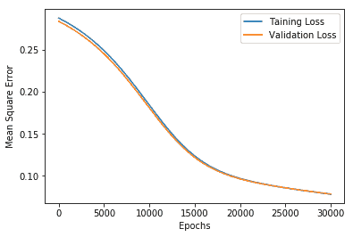

当单个人工神经元学习预测能量输出时，训练和验证数据的均方误差

在`single_neuron_tf.ipynb` Jupyter 笔记本中给出了数据读取、数据标准化、训练等的完整代码。


# 用于回归和分类的多层感知器

在上一节中，您了解了单个人工神经元，并使用它来预测能量输出。如果我们将其与[第三章](09538353-bf5b-4035-8b98-cc131bcfcf24.xhtml)、*物联网的机器学习*的线性回归结果进行比较，我们可以看到，虽然单个神经元做得很好，但不如线性回归。与线性回归的 0.01 相比，单神经元架构在验证数据集上具有 0.078 的 MSE 值。我们能让它变得更好吗，也许有更多的时代，或不同的学习率，或也许更多的单个神经元。不幸的是，单个神经元只能解决线性可分的问题，例如，只有当存在一条直线来分隔类别/决策时，它们才能提供解决方案。

具有单层神经元的网络称为**简单感知器**。感知器模型是 Rosenblatt 在 1958 年给出的([HTT](http://citeseerx.ist.psu.edu/viewdoc/download?doi=10.1.1.335.3398&rep=rep1&type=pdf)[p://citese erx . ist . PSU . edu/view doc/download？doi = 10 . 1 . 1 . 335 . 3398&amp；rep = re P1&amp；type=pdf](http://citeseerx.ist.psu.edu/viewdoc/download?doi=10.1.1.335.3398&rep=rep1&type=pdf) )。这篇论文在科学界引起了很大的反响，在这个领域也开始了很多研究。它首先在硬件中实现，用于图像识别任务。虽然感知器最初看起来很有前途，但马文·明斯基和西蒙·派珀特的《感知器》一书证明了简单的感知器只能解决线性可分问题([https://books.google.co.in/books?hl=en&amp；ampid = plq 5d waaqbaj&amp；oi = fnd&amp；pg = PR5&amp；dq =感知器:+An+入门+to+计算+几何&amp；ots = zyEDwMrl _ _&amp；SIG = dfddbbj 3 es 52 hbju 9 zncercxj 3m # v = one page&amp；q =感知器% 3A % 20An %简介% 20to %计算% 20 几何&amp；f=false](https://books.google.co.in/books?hl=en&lr=&id=PLQ5DwAAQBAJ&oi=fnd&pg=PR5&dq=Perceptrons:+An+Introduction+to+Computational+Geometry&ots=zyEDwMrl__&sig=DfDDbbj3es52hBJU9znCercxj3M#v=onepage&q=Perceptrons%3A%20An%20Introduction%20to%20Computational%20Geometry&f=false) )。

那我们该怎么办？我们可以使用多层单个神经元，换句话说，使用 MLP。就像在现实生活中，我们通过将复杂的问题分解成小问题来解决，MLP 第一层中的每个神经元将问题分解成小的线性可分的问题。由于信息通过隐藏层从输入层向输出层单向流动，这个网络也被称为**前馈**网络。在下图中，我们看到如何使用第一层中的两个神经元和输出层中的一个神经元来解决**异或**问题。该网络将非线性可分问题分解成三个线性可分问题:


之前的图表可以解释为使用 MLP 的 XOR 求解，其中一个隐藏层具有神经元，一个神经元在输出层。红点代表零，蓝点代表一。我们可以看到，隐藏的神经元将问题分成两个线性可分的问题(AND 和 OR)，然后输出神经元实现另一个线性可分的逻辑 AND-NOT 逻辑，将它们组合在一起，我们能够解决 XOR，这不是线性可分的

隐藏的神经元将问题转换成输出层可以使用的形式。麦卡洛克和皮茨早些时候提出了多层神经元的概念，但罗森布拉特给出了简单感知机的学习算法，但他没有办法训练多层感知机。主要的困难是，虽然对于输出神经元，我们知道什么应该是期望的输出，因此可以计算误差，并因此使用梯度下降更新损失函数和权重，但是没有办法知道隐藏神经元的期望输出。因此，在没有任何学习算法的情况下，MLP 从来没有被研究过。这在 1982 年发生了变化，当时 Hinton 提出了反向传播算法([https://www . research gate . net/profile/Yann _ le Cun/publication/2360531 _ A _ theory _ Framework _ for _ Back-Propagation/links/0 deec 519 DFA 297 EAC 1000000/A-Theoretical-Framework-for-Back-Propagation . pdf](https://www.researchgate.net/profile/Yann_Lecun/publication/2360531_A_Theoretical_Framework_for_Back-Propagation/links/0deec519dfa297eac1000000/A-Theoretical-Framework-for-Back-Propagation.pdf))，该算法可用于计算误差，从而计算隐藏神经元的权重更新。他们采用了一种简洁明了的数学技巧，利用链式法则进行微分，解决了将输出层的错误传递回隐藏神经元的问题，进而促进了神经网络的发展。今天，反向传播算法是几乎所有 DL 模型的核心。


# 反向传播算法

让我们首先对反向传播算法背后的技术有一点了解。如果您还记得上一节，输出神经元的损失函数如下:


你可以看到它是不变的，因此连接隐藏神经元 *k* 到输出神经元 *j* 的权重将如下给出:


应用微分的链式法则，这归结为以下内容:

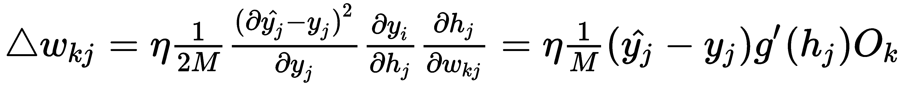

在上式中，*O[k]是隐藏神经元 *k* 的输出。现在将输入神经元 *i* 连接到隐藏层 *n* 的隐藏神经元 *k* 的权重更新可以写成如下:*

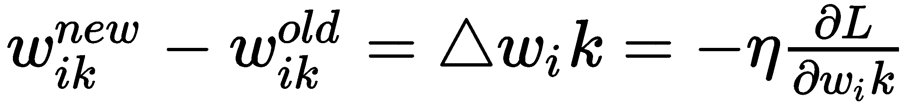

再次应用链式法则，它简化为:


这里， *O [i]* 是第 *n-1 ^(th)* 隐层中隐神经元 *i* 的输出。由于我们使用TensorFlow，我们不需要计算这些梯度，但知道表达式仍然是一个好主意。从这些表达式中，你可以看出为什么激活函数是可微的是重要的。权重更新严重依赖于激活函数的导数以及神经元的输入。因此，类似于 ReLU 和 eLU 的平滑导数函数会导致更快的收敛。如果导数变得太大，我们就有梯度爆炸的问题，如果导数变得几乎为零，我们就有梯度消失的问题。在这两种情况下，网络都不会以最佳方式学习。

通用逼近定理:1989 年 Hornik 等人和 George Cybenko 独立证明了通用逼近定理。该定理，以其最简单的形式，陈述了一个足够大的前馈多层感知器，在关于激活函数的温和假设下，具有单个隐藏层，能够以我们期望的任何精度逼近任何 Borel 可测函数。

用更简单的话来说，就是神经网络是一个通用的逼近器，我们可以逼近任何函数，列举如下:

*   我们可以使用单个隐藏层前馈网络来做到这一点。

*   如果网络足够大，我们可以做到这一点(也就是说，如果需要，可以添加更多的隐藏神经元)。

*   Cybenko 证明了在隐层的 sigmoid 激活函数和在输出层的线性激活函数。后来，Hornik 等人证明了这实际上是 MLPs 的特性，并且也可以被证明适用于其他激活函数

The theorem gives a guarantee that MLP can solve any problem, but does not give any measure on how large the network should be. Also, it does not guarantee learning and convergence.

You can refer to the papers using the following links:

*   霍尼克等人:[https://www . science direct . com/science/article/pii/0893608089900208](https://www.sciencedirect.com/science/article/pii/0893608089900208)
*   cybenko:[https://pdfs . semantic scholar . org/05ce/b 32839 c 26 c 8 D2 CB 38d 5529 cf 7720 a 68 C3 fab . pdf](https://pdfs.semanticscholar.org/05ce/b32839c26c8d2cb38d5529cf7720a68c3fab.pdf)

现在我们可以描述反向传播算法中涉及的步骤，如下所列:

1.  将输入应用于网络
2.  向前传播输入并计算网络的输出
3.  计算输出端的损失，然后使用前面的表达式，计算输出层神经元的权重更新

4.  使用输出图层的加权误差，计算隐藏图层的权重更新
5.  更新所有权重
6.  对其他训练示例重复这些步骤


# TensorFlow中 MLPs 的能量输出预测

现在让我们看看 MLP 在预测能量输出方面有多好。这将是一个回归问题。我们将使用单隐层 MLP，并预测联合循环发电厂每小时的净电能输出。数据集的描述在[第 1 章](fa0444a6-ce5c-4bed-8d9d-ddab846fe571.xhtml)、*物联网和人工智能的原理和基础*中提供。由于这是一个回归问题，我们的损失函数保持不变。实现`MLP`类的完整代码如下所示:

```
class MLP:
    def __init__(self,n_input=2,n_hidden=4, n_output=1, act_func=[tf.nn.elu, tf.sigmoid], learning_rate= 0.001):
        self.n_input = n_input # Number of inputs to the neuron
        self.act_fn = act_func
        seed = 123

        self.X = tf.placeholder(tf.float32, name='X', shape=[None,n_input])
        self.y = tf.placeholder(tf.float32, name='Y')

        # Build the graph for a single neuron
        # Hidden layer
        self.W1 = tf.Variable(tf.random_normal([n_input,n_hidden],\
                 stddev=2, seed = seed), name = "weights")    
        self.b1 = tf.Variable(tf.random_normal([1, n_hidden], seed = seed),\
                    name="bias")    
        tf.summary.histogram("Weights_Layer_1",self.W1)
        tf.summary.histogram("Bias_Layer_1", self.b1)

        # Output Layer
        self.W2 = tf.Variable(tf.random_normal([n_hidden,n_output],\
                stddev=2, seed = 0), name = "weights")
        self.b2 = tf.Variable(tf.random_normal([1, n_output], seed = seed),\
                name="bias")
        tf.summary.histogram("Weights_Layer_2",self.W2)
        tf.summary.histogram("Bias_Layer_2", self.b2)

        activity = tf.matmul(self.X, self.W1) + self.b1
        h1 = self.act_fn[0](activity)

        activity = tf.matmul(h1, self.W2) + self.b2
        self.y_hat = self.act_fn[1](activity)

        error = self.y - self.y_hat

        self.loss = tf.reduce_mean(tf.square(error))\
                 + 0.6*tf.nn.l2_loss(self.W1) 
        self.opt = tf.train.GradientDescentOptimizer(learning_rate\
                    =learning_rate).minimize(self.loss)        

        tf.summary.scalar("loss",self.loss)
        init = tf.global_variables_initializer()

        self.sess = tf.Session()
        self.sess.run(init)

        self.merge = tf.summary.merge_all()
        self.writer = tf.summary.FileWriter("logs/",\
                graph=tf.get_default_graph())

     def train(self, X, Y, X_val, Y_val, epochs=100):
        epoch = 0
        X, Y = shuffle(X,Y)
        loss = []
        loss_val = []
        while epoch &amp;lt; epochs:
            # Run the optimizer for the training set 
            merge, _, l = self.sess.run([self.merge,self.opt,self.loss],\
                     feed_dict={self.X: X, self.y: Y})
            l_val = self.sess.run(self.loss, feed_dict=\
                    {self.X: X_val, self.y: Y_val})

            loss.append(l)
            loss_val.append(l_val)
            self.writer.add_summary(merge, epoch)

            if epoch % 10 == 0:
                print("Epoch {}/{} training loss: {} Validation loss {}".\
                    format(epoch,epochs,l, l_val ))

            epoch += 1
        return loss, loss_val

    def predict(self, X):
        return self.sess.run(self.y_hat, feed_dict={self.X: X})
```

在使用它之前，让我们看看前面的代码和我们之前为单个人工神经元编写的代码之间的区别。这里隐含层的权值尺寸为`#inputUnits × #hiddenUnits`；隐藏层的偏差将等于隐藏单元的数量(`#hiddenUnits`)。输出层权重的尺寸为`#hiddenUnits × #outputUnits`；输出层的偏差是输出层单元数的维数(`#outputUnits`)。

在定义偏差时，我们只使用了列维度，而没有使用行。这是因为像`numpy`这样的 TensorFlow 根据要执行的操作来广播矩阵。通过不固定偏差的行维度，我们能够保持向网络提供的输入训练样本数量(批量)的灵活性。

以下屏幕截图显示了计算活动时的矩阵乘法和加法维度:


计算活动时的矩阵乘法和加法维度

您应该注意的第二个区别是损失的定义，我们在这里添加了`l2`正则化项，以减少过度拟合，如第 3 章、*IoT 的机器学习*中所述，如下所示:

```
self.loss = tf.reduce_mean(tf.square(error)) + 0.6*tf.nn.l2_loss(self.W1) 
```

在从`csv`文件中读取数据并像前面一样将其分为训练和验证之后，我们用输入层的`4`神经元、隐藏层的`15`神经元和输出层的`1`神经元来定义`MLP`类对象:

```
_, d = X_train.shape
_, n = Y_train.shape
model = MLP(n_input=d, n_hidden=15, n_output=n)
```

在以下代码中，我们在`6000`时期的训练数据集上训练模型:

```
loss, loss_val = model.train(X_train, Y_train, X_val, y_val, 6000)
```

这个经过训练的网络给出了 0.016 的 MSE 和 0.67 的 *R ²* 值。这两种方法都比我们从单个神经元中获得的要好，并且与我们在[第 3 章](09538353-bf5b-4035-8b98-cc131bcfcf24.xhtml)、*物联网的机器学习*中研究的 ML 方法相当。可以在名为`MLP_regresssion.ipynb`的文件中访问完整的代码。

您可以试验超参数，即:隐藏神经元的数量、激活函数、学习速率、优化器和正则化系数，并且可以获得更好的结果。


# TensorFlow 中基于 MLPs 的葡萄酒质量分类

MLP 也可以用来完成分类任务。我们可以重用前一节中的 MLP 类，只需稍加修改就可以执行分类任务。

我们需要做出以下两项重大改变:

*   在分类的情况下，目标将被一次性编码
*   损失函数现在将是分类交叉熵损失:`tf.reduce_mean(tf.nn.softmax_cross_entropy_with_logits(logits=self.y_hat, labels=self.y))`

现在让我们看看完整的代码，它也可以在 GitHub 的文件`MLP_classification`中找到。我们将对红酒的质量进行分类，为了方便起见，我们只使用两种酒类:

1.  我们从 scikit-learn 导入必要的模块，即 TensorFlow、Numpy、Matplotlib 和某些函数，如以下代码所示:

```
import tensorflow as tf
import numpy as np
import pandas as pd
import matplotlib.pyplot as plt
from sklearn.utils import shuffle
from sklearn.preprocessing import MinMaxScaler
from sklearn.model_selection import train_test_split
% matplotlib inline
```

2.  我们定义了我们的`MLP`类，它与你之前看到的`MLP`类非常相似，唯一的区别在于损失函数的定义:

```
class MLP:
    def __init__(self,n_input=2,n_hidden=4, n_output=1, act_func=[tf.nn.relu, tf.nn.sigmoid], learning_rate= 0.001):
        self.n_input = n_input # Number of inputs to the neuron
        self.act_fn = act_func
        seed = 456

        self.X = tf.placeholder(tf.float32, name='X', shape=[None,n_input])
        self.y = tf.placeholder(tf.float32, name='Y')

        # Build the graph for a single neuron
        # Hidden layer
        self.W1 = tf.Variable(tf.random_normal([n_input,n_hidden],\
             stddev=2, seed = seed), name = "weights")
        self.b1 = tf.Variable(tf.random_normal([1, n_hidden],\
             seed = seed), name="bias")
        tf.summary.histogram("Weights_Layer_1",self.W1)
        tf.summary.histogram("Bias_Layer_1", self.b1)

        # Output Layer
        self.W2 = tf.Variable(tf.random_normal([n_hidden,n_output],\
            stddev=2, seed = seed), name = "weights")
        self.b2 = tf.Variable(tf.random_normal([1, n_output],\
             seed = seed), name="bias")    
        tf.summary.histogram("Weights_Layer_2",self.W2)
        tf.summary.histogram("Bias_Layer_2", self.b2)

        activity1 = tf.matmul(self.X, self.W1) + self.b1
        h1 = self.act_fn[0](activity1)

        activity2 = tf.matmul(h1, self.W2) + self.b2
        self.y_hat = self.act_fn[1](activity2)

        self.loss = tf.reduce_mean(tf.nn.softmax_cross_entropy_with_logits(\
                logits=self.y_hat, labels=self.y))
        self.opt = tf.train.AdamOptimizer(learning_rate=\
                learning_rate).minimize(self.loss)

        tf.summary.scalar("loss",self.loss)
        init = tf.global_variables_initializer()

        self.sess = tf.Session()
        self.sess.run(init)

        self.merge = tf.summary.merge_all()
        self.writer = tf.summary.FileWriter("logs/",\
             graph=tf.get_default_graph())

    def train(self, X, Y, X_val, Y_val, epochs=100):
        epoch = 0
        X, Y = shuffle(X,Y)
        loss = []
        loss_val = []
        while epoch &amp;lt; epochs:
            # Run the optimizer for the training set 
            merge, _, l = self.sess.run([self.merge,self.opt,self.loss],\
                 feed_dict={self.X: X, self.y: Y})        
            l_val = self.sess.run(self.loss, feed_dict={self.X: X_val, self.y: Y_val})

            loss.append(l)
            loss_val.append(l_val)
            self.writer.add_summary(merge, epoch)

            if epoch % 10 == 0:
                print("Epoch {}/{} training loss: {} Validation loss {}".\
                    format(epoch,epochs,l, l_val ))

            epoch += 1
        return loss, loss_val

    def predict(self, X):
        return self.sess.run(self.y_hat, feed_dict={self.X: X})
```

3.  接下来，我们读取数据，将其标准化，并对其进行预处理，以便用两个标签对葡萄酒质量进行一次性编码。我们还将数据分为训练集和验证集，如下所示:

```
filename = 'winequality-red.csv' 
#Download the file from https://archive.ics.uci.edu/ml/datasets/wine+quality
df = pd.read_csv(filename, sep=';')
columns = df.columns.values
# Preprocessing and Categorizing wine into two categories
X, Y = df[columns[0:-1]], df[columns[-1]]
scaler = MinMaxScaler()
X_new = scaler.fit_transform(X)
#Y.loc[(Y&amp;lt;3.5)]=3
Y.loc[(Y&amp;lt;5.5) ] = 2
Y.loc[(Y&amp;gt;=5.5)] = 1
Y_new = pd.get_dummies(Y) # One hot encode
X_train, X_val, Y_train, y_val = \
 train_test_split(X_new, Y_new, test_size=0.2, random_state=333)
```

4.  我们定义一个`MLP`对象并训练它，如以下代码所示:

```
_, d = X_train.shape
_, n = Y_train.shape
model = MLP(n_input=d, n_hidden=5, n_output=n)
loss, loss_val = model.train(X_train, Y_train, X_val, y_val, 10000)
```

5.  下面，你可以看到训练的结果，交叉熵损失随着网络的学习而减少:

```
plt.plot(loss, label="Taining Loss")
plt.plot(loss_val, label="Validation Loss")
plt.legend()
plt.xlabel("Epochs")
plt.ylabel("Cross Entropy Loss")
```


6.  当在验证数据集上测试时，训练的网络提供了 77.8%的准确度。验证集上的`confusion_matrix`如下所示:

```
from sklearn.metrics import confusion_matrix, accuracy_score
import seaborn as sns
cm = confusion_matrix(np.argmax(np.array(y_val),1), np.argmax(Y_pred,1))
sns.heatmap(cm,annot=True,fmt='2.0f')
```


这些结果再次与我们使用 ML 算法获得的结果相当。我们可以通过调整超参数来做得更好。


# 卷积神经网络

MLP 很有趣，但是正如你在前面部分玩 MLP 码时所观察到的，学习的时间随着输入空间复杂性的增加而增加；此外，MLPs 的性能仅次于 ML 算法。无论你能用 MLP 做什么，使用你在第 3 章[、*物联网机器学习*中学到的 ML 算法，你很有可能会做得稍微好一点。正是因为这个原因，尽管反向传播算法在 20 世纪 80 年代就已经存在，我们还是观察到了大约从 1987 年到 1993 年的第二次人工智能寒冬。](09538353-bf5b-4035-8b98-cc131bcfcf24.xhtml)

这一切都改变了，在 2010 年代，随着深度神经网络的发展，神经网络不再扮演 ML 算法的次要角色。今天，DL 已经在计算机视觉的各种任务中实现了人类水平或超过人类水平的性能，如识别交通信号(【http://people.idsia.ch/~juergen/cvpr2012.pdf】)、人脸([https://www . cv-foundation . org/open access/content _ cvpr _ 2014/papers/Taigman _ deep face _ Closing _ the _ 2014 _ CVPR _ paper . pdf](https://www.cv-foundation.org/openaccess/content_cvpr_2014/papers/Taigman_DeepFace_Closing_the_2014_CVPR_paper.pdf))、手写数字([https://cs.nyu.edu/~wanli/dropc/dropc.pdf](https://cs.nyu.edu/~wanli/dropc/dropc.pdf))等等。这个名单还在不断增加。

CNN 是这个成功故事的主要部分。在这一部分，你将了解 CNN，CNN 背后的数学，以及一些流行的 CNN 架构。


# CNN 的不同层次

CNN 由三种主要类型的神经元层组成:卷积层、池层和全连接层。完全连接的层只不过是 MLP 的层，它们总是 CNN 的最后几层，并执行分类或回归的最终任务。让我们看看卷积层和最大池层是如何工作的。


# 卷积层

这是 CNN 的核心组成部分。它对其输入(通常是 3D 图像)执行类似于卷积(准确地说是互相关)的数学运算。它是由内核(过滤器)定义的。基本思想是这些滤波器跨越整个图像并从图像中提取特定特征。

在深入讨论细节之前，为了简单起见，我们先来看看二维矩阵上的卷积运算。下图显示了放置在 5×5 **2D 图像**矩阵的位置[2，2]的一个像素与 3×3 滤波器进行卷积时的操作:

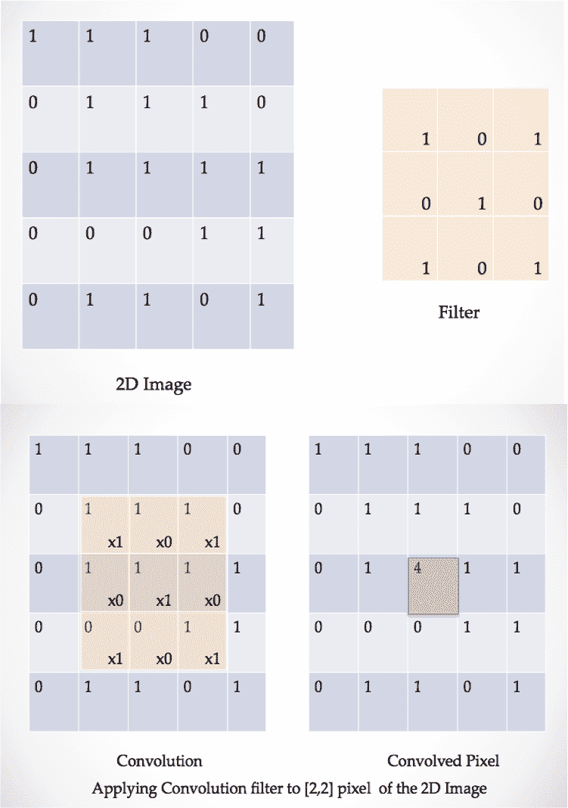

单像素卷积运算

卷积运算包括将像素置于滤镜中心，然后在滤镜元素和像素及其相邻像素之间执行逐元素乘法。最后，对乘积求和。由于卷积运算是在像素上执行的，因此滤波器通常为奇数大小，如 5×5、3×3 或 7×7 等。过滤器的大小决定了它覆盖了多少邻近区域。

设计卷积层时的重要参数如下:

*   滤镜的大小(k×k)。
*   层中过滤器的数量，也称为**通道**。输入彩色图像存在于三个 RGB 通道中。信道的数量通常在较高层中增加。从而在更高层中产生更深的信息。
*   滤镜穿过图像的像素数。传统上，步幅是一个像素，使得滤波器从左上到右下覆盖整个图像。
*   卷积时要使用的填充。传统上，有两种选择，要么有效，要么相同。在**有效**填充中，根本没有填充，因此卷积图像的大小小于原始图像的大小。在 **same** 中，在边界像素周围填充零，使得卷积图像的大小与原始图像的大小相同。下面的截图显示了完整的**卷积图像**。大小为 3×3 的绿色方块是填充有效时的结果，右侧完整的 5×5 矩阵将是填充相同时的结果:

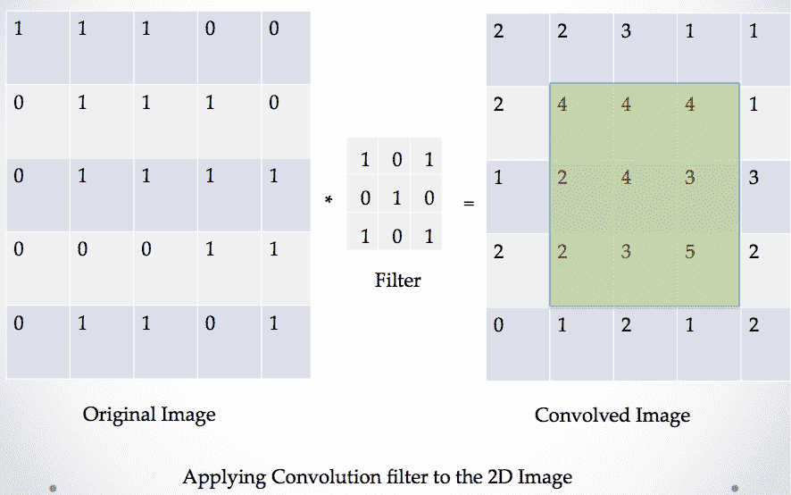

卷积运算在 5×5 图像上的应用

右边的绿色方块将是**有效**填充的结果。对于**相同的**填充，我们将得到右侧所示的完整的 5×5 矩阵。


# 汇集层

卷积层之后通常是汇集层。池层的目的是逐渐减小表示的大小，从而减少网络中的参数和计算的数量。因此，当信息以前馈方式在网络中传播时，它对信息进行下采样。

这里，我们有一个滤波器，传统上人们更喜欢 2×2 大小的滤波器，它在两个方向上以两个像素的步幅移动。汇集过程用四个元素的最大值(**最大汇集**)或四个元素的平均值(**平均汇集**)来替换 2×2 过滤器下的四个元素。在下图中，您可以看到对图像的 **2D 单通道切片进行合并操作的结果:**


对图像的二维单深度切片的最大池化和平均池化操作

多个卷积池层堆叠在一起，形成一个深度 CNN。当图像通过 CNN 传播时，每个卷积层提取特定的特征。较低层提取总体特征，如形状、曲线、线条等，而较高层提取更抽象的特征，如眼睛、嘴唇等。当图像通过网络传播时，其尺寸减小，但深度增加。最后一个卷积层的输出被展平并传递给完全连接的层，如下图所示:


CNN 网络的基本架构

滤波器矩阵的值也被称为**权重**，它们被整个图像共享。这种共享减少了训练参数的数量。网络使用反向传播算法来学习权重。由于我们将使用 TensorFlow 的自动微分功能，因此我们不会计算卷积层权重更新的精确表达式。


# 一些流行的 CNN 模型

以下是一些流行的 CNN 模型列表:

*   LeNet 是第一个成功应用于识别手写数字的 CNN。它是由 Yann LeCun 在 20 世纪 90 年代开发的。你可以在 Yann LeCun 的主页([http://yann.lecun.com/exdb/lenet/](http://yann.lecun.com/exdb/lenet/))了解更多关于 LeNet 建筑及其相关出版物的信息。
*   **VGGNet** :这是 2014 年 ILSVRC 的亚军，由卡伦·西蒙扬和安德鲁·齐塞曼开发。它的第一个版本包含 16 个卷积+FC 层，被称为 **VGG16** ，后来他们带来了 19 层的 VGG19。关于其性能和出版物的详细信息可以从牛津大学网站([http://www.robots.ox.ac.uk/~vgg/research/very_deep/](http://www.robots.ox.ac.uk/~vgg/research/very_deep/))获得。
*   ResNet:ResNet 是由何等人开发的，获得了 2015 年 ILSVRC 的冠军。它利用了称为**残差学习**和**批量归一化**的新特性。这是一个非常深的网络，有超过 100 层。众所周知，增加更多的层将提高性能，但增加层也带来了渐变消失的问题。ResNet 通过使用标识快捷连接解决了这个问题，其中信号跳过一层或多层。更多信息可以阅读原文([https://arxiv.org/abs/1512.03385](https://arxiv.org/abs/1512.03385))。
*   GoogleNet:这是 2014 年 ILSVRC 的获奖建筑。它有 22 层，并引入了初始层的思想。基本思想是覆盖更大的区域，同时保持图像上小信息的精细分辨率。因此，在每一层，我们都有从 1×1(用于精细细节)到 5×5 的过滤器，而不是单一尺寸的过滤器。所有过滤器的结果被连接并传递到下一层，该过程在下一个初始层重复。


# LeNet 识别手写数字

在前面的章节中，我们将使用一些流行的 CNN 及其变体来解决图像和视频处理任务。现在，让我们使用 Yann LeCun 提出的 LeNet 架构来识别手写数字。美国邮政使用这种架构来识别他们收到的信件上的手写邮政编码([http://yann.lecun.com/exdb/publis/pdf/jackel-95.pdf](http://yann.lecun.com/exdb/publis/pdf/jackel-95.pdf))。

LeNet 由五层组成，包括两个卷积最大池层和三个全连接层。该网络还使用 dropout 功能，即在训练时，一些权重被关闭。这迫使其他互连对它们进行补偿，因此有助于克服过度拟合:

1.  我们导入必要的模块，如下所示

```
# Import Modules
import numpy as np
import pandas as pd
import matplotlib.pyplot as plt
%matplotlib inline
```

接下来，我们创建类对象`LeNet`，它将拥有必要的 CNN 架构和模块来训练和进行预测。在`__init__`方法中，我们定义所有需要的占位符来保存输入图像和它们的输出标签。我们还定义了损失，因为这是一个分类问题，我们使用交叉熵损失，如下面的代码所示:

2.  Next, we create the class object `LeNet`, which will have the necessary CNN architecture and modules to train and make the prediction. In the `__init__` method, we define all the needed placeholders to hold input images and their output labels. We also define the loss, since this is a classification problem, we use cross-entropy loss, as shown in the following code:

```
# Define your Architecture here
import tensorflow as tf
from tensorflow.contrib.layers import flatten
class my_LeNet:
    def __init__(self, d, n, mu = 0, sigma = 0.1, lr = 0.001):
        self.mu = mu
        self.sigma = sigma
        self.n = n
        # place holder for input image dimension 28 x 28
        self.x = tf.placeholder(tf.float32, (None, d, d, 1)) 
        self.y = tf.placeholder(tf.int32, (None,n))
        self.keep_prob = tf.placeholder(tf.float32) # probability to keep units

        self.logits = self.model(self.x)
        # Define the loss function
        cross_entropy = tf.nn.softmax_cross_entropy_with_logits(labels=self.y,\
                        logits=self.logits)
        self.loss = tf.reduce_mean(cross_entropy)
        optimizer = tf.train.AdamOptimizer(learning_rate = lr)
        self.train = optimizer.minimize(self.loss)
        correct_prediction = tf.equal(tf.argmax(self.logits, 1), tf.argmax(self.y, 1))
        self.accuracy = tf.reduce_mean(tf.cast(correct_prediction, tf.float32))
        init = tf.global_variables_initializer()
        self.sess = tf.Session()
        self.sess.run(init)
        self.saver = tf.train.Saver()
```

`model`方法是实际构建卷积网络架构图的方法。我们使用 TensorFlow `tf.nn.conv2d`函数来构建卷积层。该函数将过滤矩阵的一个参数定义为权重，并计算输入和过滤矩阵之间的卷积。我们也使用偏见给我们高度的自由。在两个卷积层之后，我们展平输出，并将其传递给完全连接的层，如下所示:

3.  `fit`方法执行分批训练，`predict`方法提供给定输入的输出，如下面的代码所示:

```
def model(self,x):
    # Build Architecture
    keep_prob = 0.7
    # Layer 1: Convolutional. Filter 5x5 num_filters = 6 Input_depth =1
    conv1_W = tf.Variable(tf.truncated_normal(shape=(5, 5, 1, 6), mean \
                    = self.mu, stddev = self.sigma))
    conv1_b = tf.Variable(tf.zeros(6))
    conv1 = tf.nn.conv2d(x, conv1_W, strides=[1, 1, 1, 1], padding='VALID') + conv1_b
    conv1 = tf.nn.relu(conv1)

    # Max Pool 1
    self.conv1 = tf.nn.max_pool(conv1, ksize=[1, 2, 2, 1],\
                     strides=[1, 2, 2, 1], padding='VALID')

    # Layer 2: Convolutional. Filter 5x5 num_filters = 16 Input_depth =6
    conv2_W = tf.Variable(tf.truncated_normal(shape=(5, 5, 6, 16), \
                    mean = self.mu, stddev = self.sigma))
    conv2_b = tf.Variable(tf.zeros(16))
    conv2 = tf.nn.conv2d(self.conv1, conv2_W, strides=[1, 1, 1, 1],\
                     padding='VALID') + conv2_b
    conv2 = tf.nn.relu(conv2)

    # Max Pool 2.
    self.conv2 = tf.nn.max_pool(conv2, ksize=[1, 2, 2, 1], \
                    strides=[1, 2, 2, 1], padding='VALID')

    # Flatten.
    fc0 = flatten(self.conv2)
    print("x shape:",fc0.get_shape())

    # Layer 3: Fully Connected. Input = fc0.get_shape[-1]. Output = 120.
    fc1_W = tf.Variable(tf.truncated_normal(shape=(256, 120), \
                mean = self.mu, stddev = self.sigma))
    fc1_b = tf.Variable(tf.zeros(120))
    fc1 = tf.matmul(fc0, fc1_W) + fc1_b
    fc1 = tf.nn.relu(fc1)

    # Dropout
    x = tf.nn.dropout(fc1, keep_prob)

    # Layer 4: Fully Connected. Input = 120\. Output = 84.
    fc2_W = tf.Variable(tf.truncated_normal(shape=(120, 84), \
                    mean = self.mu, stddev = self.sigma))
    fc2_b = tf.Variable(tf.zeros(84))
    fc2 = tf.matmul(x, fc2_W) + fc2_b
    fc2 = tf.nn.relu(fc2)

    # Dropout
    x = tf.nn.dropout(fc2, keep_prob)

    # Layer 6: Fully Connected. Input = 120\. Output = n_classes.
    fc3_W = tf.Variable(tf.truncated_normal(shape=(84, self.n), \
                    mean = self.mu, stddev = self.sigma))
    fc3_b = tf.Variable(tf.zeros(self.n))
    logits = tf.matmul(x, fc3_W) + fc3_b
    #logits = tf.nn.softmax(logits)
    return logits
```

4.  我们使用手写数字数据集，并从 ka ggle([https://www.kaggle.com/c/digit-recognizer/data](https://www.kaggle.com/c/digit-recognizer/data))下载。数据集以`.csv`格式提供。我们加载`.csv`文件并预处理数据。以下是示例训练图:

```
def fit(self,X,Y,X_val,Y_val,epochs=10, batch_size=100):
    X_train, y_train = X, Y
    num_examples = len(X_train)
    l = []
    val_l = []
    max_val = 0
    for i in range(epochs):
        total = 0
        for offset in range(0, num_examples, batch_size): # Learn Batch wise
            end = offset + batch_size
            batch_x, batch_y = X_train[offset:end], y_train[offset:end]
            _, loss = self.sess.run([self.train,self.loss], \
                        feed_dict={self.x: batch_x, self.y: batch_y})
            total += loss
            l.append(total/num_examples)
            accuracy_val = self.sess.run(self.accuracy, \
                                feed_dict={self.x: X_val, self.y: Y_val})
            accuracy = self.sess.run(self.accuracy, feed_dict={self.x: X, self.y: Y})
            loss_val = self.sess.run(self.loss, feed_dict={self.x:X_val,self.y:Y_val})
            val_l.append(loss_val)
            print("EPOCH {}/{} loss is {:.3f} training_accuracy {:.3f} and \
                        validation accuracy is {:.3f}".\
                        format(i+1,epochs,total/num_examples, accuracy, accuracy_val))
            # Saving the model with best validation accuracy
            if accuracy_val &amp;gt; max_val:
                save_path = self.saver.save(self.sess, "/tmp/lenet1.ckpt")
                print("Model saved in path: %s" % save_path)
                max_val = accuracy_val

    #Restore the best model
    self.saver.restore(self.sess, "/tmp/lenet1.ckpt")
    print("Restored model with highest validation accuracy")
    accuracy_val = self.sess.run(self.accuracy, feed_dict={self.x: X_val, self.y: Y_val})
    accuracy = self.sess.run(self.accuracy, feed_dict={self.x: X, self.y: Y})
    return l,val_l, accuracy, accuracy_val

def predict(self, X):
    return self.sess.run(self.logits,feed_dict={self.x:X})
```

5.  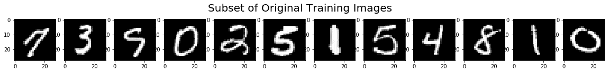

```
def load_data():
    # Read the data and create train, validation and test dataset
    data = pd.read_csv('train.csv')
    # This ensures always 80% of data is training and 
    # rest Validation unlike using np.random
    train = data.sample(frac=0.8, random_state=255) 
    val = data.drop(train.index)
    test = pd.read_csv('test.csv')
    return train, val, test

def create_data(df):
    labels = df.loc[:]['label']
    y_one_hot = pd.get_dummies(labels).astype(np.uint8)
    y = y_one_hot.values # One Hot encode the labels
    x = df.iloc[:,1:].values
    x = x.astype(np.float)
    # Normalize data
    x = np.multiply(x, 1.0 / 255.0)
    x = x.reshape(-1, 28, 28, 1) # return each images as 96 x 96 x 1
    return x,y

train, val, test = load_data()
X_train, y_train = create_data(train)
X_val, y_val = create_data(val)
X_test = (test.iloc[:,:].values).astype(np.float)
X_test = np.multiply(X_test, 1.0 / 255.0)
X_test = X_test.reshape(-1, 28, 28, 1) # return each images as 96 x 96 x 1

# Plot a subset of training data
x_train_subset = X_train[:12]

# visualize subset of training data
fig = plt.figure(figsize=(20,2))
for i in range(0, len(x_train_subset)):
    ax = fig.add_subplot(1, 12, i+1)
    ax.imshow(x_train_subset[i].reshape(28,28), cmap='gray')
fig.suptitle('Subset of Original Training Images', fontsize=20)
plt.show()
```

在这里，我们将训练模型:

我们创建了`LeNet`对象，并根据训练数据对其进行训练。在训练数据集上的获得率为 99.658%，在验证数据集上的获得率为 98.607%；

```
n_train = len(X_train)
# Number of validation examples
n_validation = len(X_val)

# Number of testing examples.
n_test = len(X_test)

# What's the shape of an handwritten digits?
image_shape = X_train.shape[1:-1]

# How many unique classes/labels there are in the dataset.
n_classes = y_train.shape[-1]
print("Number of training examples =", n_train)
print("Number of Validation examples =", n_validation)
print("Number of testing examples =", n_test)
print("Image data shape =", image_shape)
print("Number of classes =", n_classes)

# The result
## &amp;gt;&amp;gt;&amp;gt; Number of training examples = 33600
## &amp;gt;&amp;gt;&amp;gt; Number of Validation examples = 8400 
## &amp;gt;&amp;gt;&amp;gt; Number of testing examples = 28000 
## &amp;gt;&amp;gt;&amp;gt; Image data shape = (28, 28) 
## &amp;gt;&amp;gt;&amp;gt; Number of classes = 10

# Define the data values
d = image_shape[0]
n = n_classes
from sklearn.utils import shuffle
X_train, y_train = shuffle(X_train,y_train)
```

6.  印象深刻！您可以预测测试数据集的输出，并在 Kaggle 提交。

```
# Create the Model
my_model = my_LeNet(d, n)

### Train model  here.
loss, val_loss, train_acc, val_acc = my_model.fit(X_train, y_train, \
    X_val, y_val, epochs=50) 
```

循环神经网络


# 到目前为止，我们所研究的模型只对当前输入做出反应。你给他们一个输入，基于他们所学的，他们给你一个相应的输出。但这不是我们人类的工作方式。当你读一个句子时，你不要单独解释每个单词，你要考虑前面的单词来推断它的语义。

rnn 能够解决这个问题。他们使用反馈回路来保存信息。反馈回路允许信息从先前的步骤传递到现在。下图显示了 RNN 的基本架构，以及反馈如何允许信息从网络的一个步骤传递到下一个步骤(**展开**):

循环神经网络


在上图中， *X* 代表输入。它通过权重 *W [hx]* 连接到隐层的神经元，隐层的输出 *h* 通过权重 *W [hh]* 反馈到隐层，并通过权重 *W [yh]* 贡献给输出 *O、*。我们可以将数学关系写成如下:

其中 *g* 为激活函数， *b [h]* 和 *b [y]* 分别为隐神经元和输出神经元的偏差。在前面的关系中，所有的 *X* 、 *h* 和 *O* 都是向量； *W [hx]* ， *W [hh] ，*和 *W [yh]* 都是矩阵。输入 *X* 和输出 *O* 的尺寸取决于你正在处理的数据集，隐藏层 *h* 的单元数由你决定；你会发现许多论文中研究人员使用了 128 个隐藏单元。前面的架构只显示了一个隐藏层，但是我们可以有任意多的隐藏层。RNNs 已经应用于自然语言处理领域，也已经应用于分析时间序列数据，如股票价格。

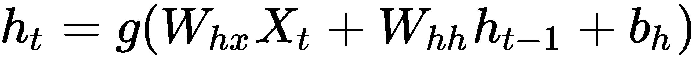

RNNs 通过一种叫做**反向传播** **穿越时间** ( **BPTT** )的算法进行学习，这是一种考虑到数据时间序列性质的反向传播算法的改进。这里，损失定义为在时间 *t* = *1* 到 *t* = *T* (要展开的时间步数)的所有损失函数的总和，例如:

其中 *L ^((t))* 是时间 *t* 处的损失，我们像以前一样应用微分链规则，并导出权重 *W [hx]* 、 *W [hh]* *、*和 *W [yh 的权重更新。]*

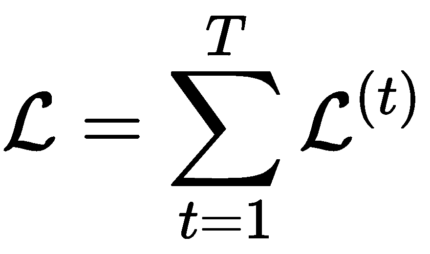

我们不会在本书中推导出权重更新的表达式，因为我们不会对其进行编码。TensorFlow 为 RNN 和 BPTT 提供了一个实现。但是对于对数学细节感兴趣的读者，以下是一些参考资料:

*关于训练循环神经网络的难度，*拉兹万·帕斯卡努，托马斯·米科洛夫，约舒阿·本吉奥([https://arxiv.org/pdf/1211.5063.pdf](https://arxiv.org/pdf/1211.5063.pdf))

*   *学习梯度下降的长期依赖关系是困难的*、约舒阿·本吉奥、帕特里斯·西玛德和保罗·弗拉斯科尼([www.iro.umontreal.ca/~lisa/pointeurs/ieeetrnn94.pdf](http://www.iro.umontreal.ca/~lisa/pointeurs/ieeetrnn94.pdf))
*   此外，不提及科拉赫的博客([http://colah.github.io/posts/2015-08-Understanding-LSTMs/](http://colah.github.io/posts/2015-08-Understanding-LSTMs/))和安德烈·卡帕西的博客([http://karpathy.github.io/2015/05/21/rnn-effectiveness/](http://karpathy.github.io/2015/05/21/rnn-effectiveness/))对 rnn 及其一些很酷的应用的精彩解释是不完整的
*   Also, it will be incomplete not to mention Colah's blog ([http://colah.github.io/posts/2015-08-Understanding-LSTMs/](http://colah.github.io/posts/2015-08-Understanding-LSTMs/)) and Andrej Karpathy's blog ([http://karpathy.github.io/2015/05/21/rnn-effectiveness/](http://karpathy.github.io/2015/05/21/rnn-effectiveness/)) for an excellent explanation of RNNs and some of their cool applications

我们提出每个时间步长一个输入的 RNN，并预测相应的输出。BPTT 的工作方式是展开所有的输入时间步长。对于每个时间步长，误差被计算和累积，稍后网络被回退以更新权重。BPTT 的一个缺点是，当时间步数增加时，计算量也会增加。这使得整个模型的计算成本很高。此外，由于多重梯度乘法，网络容易出现梯度消失问题。

为了解决这个问题，BPTT 的一个修改版本，截断 BPTT 经常被使用。在截断 BPTT 中，一次处理一个时间步长的数据，并且周期性地对固定数量的时间步长执行 BPTT 权重更新。

我们可以列举截断 BPTT 算法的步骤如下:

向网络呈现输入和输出对的 *K [1] 和*时间步长的顺序

1.  通过展开网络，计算并累积跨越*K[2]时间步长的误差*
2.  通过卷起网络来更新权重
3.  算法的性能取决于两个超参数*K[1]和*K[2]。更新之间的前进通过时间步数由*K[1]表示，它影响训练的快慢以及权重更新的频率。 *K [2]****

The performance of the algorithm depends on two hyperparameters *K[1]* and *K[2]*. The number of forwarding pass timesteps between updates is represented by *K[1]*, it affects how fast or slow the training will be training and the frequency of the weight updates. *K[2]* on the other hand, represents the number of timesteps that apply to BPTT, it should be large enough to capture the temporal structure of the input data.

长短期记忆


# Hochreiter 和 Schmidhuber 在 1997 年提出了一个修正的 RNN 模型，称为**长短期记忆** ( **LSTM** )作为克服消失梯度问题的解决方案。RNNs 中的隐藏层由 LSTM 单元代替。
LSTM 单元由三个门组成:遗忘门、输入门和输出门。这些门控制细胞产生和保持的长期记忆和短期记忆的数量。这些门都有`sigmoid`功能，在 *0* 和 *1* 之间截断输入。接下来，我们将看到各种门的输出是如何计算的，如果表达式让您感到畏惧，请不要担心，我们将使用TensorFlow`tf.contrib.rnn.BasicLSTMCell`和`tf.contrib.rnn.static_rnn`来实现 LSTM 单元，如下图所示:

基本的 LSTM 细胞， *x* 是细胞的输入， *h* 是短期记忆， *c* 是长期记忆。下标指的是时间

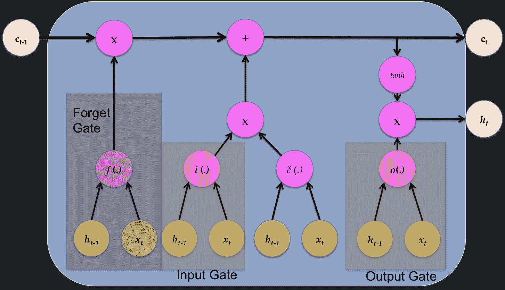

在每个时间步 *t* ，LSTM 池接受三个输入:输入 *x [t]* ，短时记忆*h*[*t-1*]，长时记忆 *c [t-1]* ，输出长时记忆*c[t]* *x* 、 *h、*和 *c* 的下标是指时间步长。

At each time step, *t*, the LSTM cell takes three inputs: the input *x[t]*, the short-term memory *h*[*t-1*], and the long-term memory *c[t-1]*, and outputs the long-term memory *c[t]* at and short-term memory *h[t]*. The subscript to *x*, *h,* and *c* refer to the timestep.

**忘门**忘门*忘门*忘门。)控制短期记忆量， *h* ，以便在当前时间步骤中进一步记忆。数学上我们可以表示忘记门 *f(。)*作:

其中σ代表 sigmoid 激活函数， *W [fx]* 和 *W [fh]* 是控制输入 *x [t] 、*短时记忆*h*[*t*-1]和 *b [f【的权重]*


**输入门** *i* (。)控制影响细胞输出的输入和工作记忆的数量。我们可以这样表达:

**输出门**o 的*(。)控制用于更新短期记忆的信息量，由下式给出:*

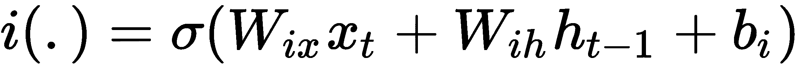

除了这三个门，LSTM 单元还计算候选隐藏状态，它与输入和遗忘门一起用于计算长期记忆量 *c [ t ]* :


圆圈代表元素式乘法。短时记忆的新值计算如下:

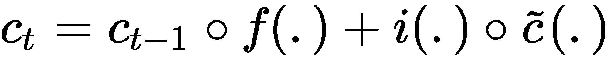

现在，让我们看看如何通过以下步骤在 TensorFlow 中实现 LSTM:


我们正在使用以下模块:

1.  我们定义了一个 LSTM 类，在这个类中，我们在TensorFlow`contrib`的帮助下构建图形并定义 LSTM 层。为了节省内存，我们首先清除默认图形堆栈，并使用`tf.reset_default_graph()`重置全局默认图形。输入直接进入 LSTM 层，有`num_units`个隐藏单元。接下来是一个完全连接的输出层，具有`out_weights`权重和`out_bias`偏差。为输入标签`self.x`和`self.y`创建占位符。输入被整形并馈入 LSTM 单元。为了创建 LSTM 层，我们首先定义带有`num_units`隐藏单元的 LSTM 单元，并忽略设置为`1.0`的偏差。这将偏差添加到遗忘门，以便在训练开始时减少遗忘的规模。重塑 LSTM 图层的输出，并将其提供给完全连接的图层，如下所示:

```
import tensorflow as tf
from tensorflow.contrib import rnn
import numpy as np
```

2.  我们创建了用于训练和预测的方法，如下面的代码所示:

```
 class LSTM:
    def __init__(self, num_units, n_classes, n_input,\
             time_steps, learning_rate=0.001,):    
        tf.reset_default_graph()
        self.steps = time_steps
        self.n = n_input
        # weights and biases of appropriate shape
        out_weights = tf.Variable(tf.random_normal([num_units, n_classes]))
        out_bias = tf.Variable(tf.random_normal([n_classes]))
        # defining placeholders
        # input placeholder
        self.x = tf.placeholder("float", [None, self.steps, self.n])
        # label placeholder
        self.y = tf.placeholder("float", [None, n_classes])
        # processing the input tensor from [batch_size,steps,self.n] to 
        # "steps" number of [batch_size,self.n] tensors
        input = tf.unstack(self.x, self.steps, 1)

        # defining the network
        lstm_layer = rnn.BasicLSTMCell(num_units, forget_bias=1)
        outputs, _ = rnn.static_rnn(lstm_layer, input, dtype="float32")
        # converting last output of dimension [batch_size,num_units] to 
        # [batch_size,n_classes] by out_weight multiplication
        self.prediction = tf.matmul(outputs[-1], out_weights) + out_bias

        # loss_function
        self.loss = tf.reduce_mean(tf.squared_difference(self.prediction, self.y))
        # optimization
        self.opt = tf.train.AdamOptimizer(learning_rate=learning_rate).minimize(self.loss)

        # model evaluation
        correct_prediction = tf.equal(tf.argmax(self.prediction, 1), tf.argmax(self.y, 1))
        self._accuracy = tf.reduce_mean(tf.cast(correct_prediction, tf.float32))

        init = tf.global_variables_initializer()
        gpu_options = tf.GPUOptions(allow_growth=True)

        self.sess = tf.Session(config=tf.ConfigProto(gpu_options=gpu_options))
        self.sess.run(init)
```

3.  在接下来的章节中，我们将使用 RNN 来处理时间序列生成和文本处理。

```
def train(self, X, Y, epochs=100,batch_size=128):
    iter = 1
    #print(X.shape)
    X = X.reshape((len(X),self.steps,self.n))
    while iter &amp;lt; epochs:
        for i in range(int(len(X)/batch_size)):
            batch_x, batch_y = X[i:i+batch_size,:], Y[i:i+batch_size,:]
            #print(batch_x.shape)
            #batch_x = batch_x.reshape((batch_size, self.steps, self.n))    
            #print(batch_x.shape)    
            self.sess.run(self.opt, feed_dict={self.x: batch_x, self.y: batch_y})
            if iter % 10 == 0:
                acc = self.sess.run(self._accuracy, feed_dict={self.x: X, self.y: Y})
                los = self.sess.run(self.loss, feed_dict={self.x: X, self.y: Y})
                print("For iter ", iter)
                print("Accuracy ", acc)
                print("Loss ", los)    
                print("__________________")
            iter = iter + 1

def predict(self,X):
    # predicting the output
    test_data = X.reshape((-1, self.steps, self.n))
    out = self.sess.run(self.prediction, feed_dict={self.x:test_data})
    return out
```

门控循环单元


# **门控循环单元** ( **GRU** )是 RNN 的又一改型。与 LSTM 相比，它具有简化的结构，并且克服了消失梯度问题。它只需要两个输入，在时间 *t* 的输入 *x [t]* 和从时间 *t* -1 开始的存储器 *h [t-1]* 。只有两个门，**更新 G**ate 和**复位门**，如下图所示:


基本 GRU 单元的结构

The architecture of a basic GRU cell

更新门控制保留多少先前的存储器，而复位门决定如何将新输入与先前的存储器组合。我们可以通过以下四个等式来定义完整的 GRU 单元:

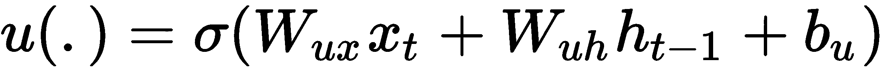

*   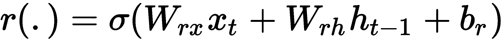
*   
*   
*   GRU 和 LSTM 的表现不相上下，但 GRU 的训练参数较少。

自编码器


# 到目前为止，我们学习的模型是使用监督学习进行学习的。在本节中，我们将了解自编码器。它们是前馈、非循环神经网络，通过无监督学习来学习。它们是最新的热点，还有生成对抗网络，我们可以在图像重建、聚类、机器翻译等领域找到应用。它们最初是由杰弗里·e·辛顿和 PDP 小组([http://www.cs.toronto.edu/~fritz/absps/clp.pdf](http://www.cs.toronto.edu/~fritz/absps/clp.pdf))在 20 世纪 80 年代提出的。

自编码器基本上由两个级联的神经网络组成——第一个网络充当编码器；它获取输入 *x* 并使用变换 *h* 对编码信号 *y* 进行编码，如下式所示:


第二个神经网络使用编码信号 *y* 作为其输入，并执行另一个变换 *f* 以获得重构信号 *r* ，如下所示:


损失函数是具有误差 *e* 的 MSE，定义为原始输入 *x* 和重构信号 *r:* 之间的差


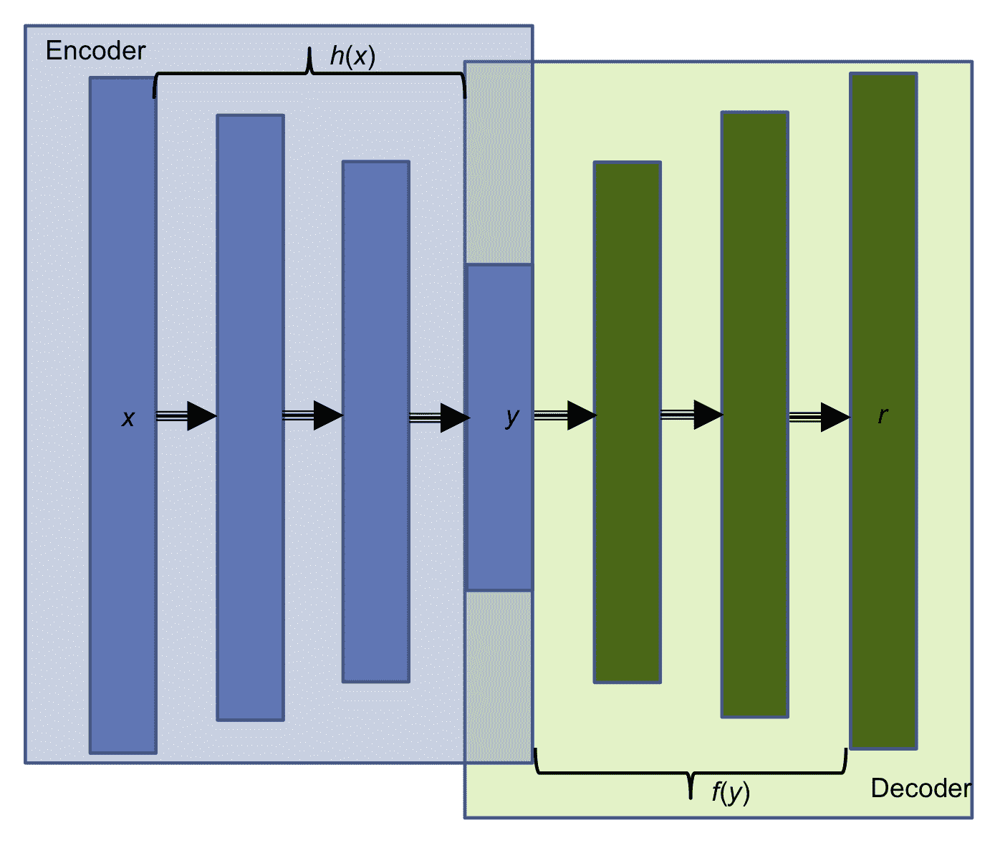

自编码器的基本架构

上图显示了一个自编码器，其中**编码器**和**解码器**分别突出显示。自编码器可以具有权重共享，即解码器和编码器的权重共享。这是通过简单地使它们相互转置来实现的；这有助于网络学习得更快，因为训练参数的数量更少。有很多种自编码器，例如:稀疏自编码器、去噪自编码器、卷积自编码器和变分自编码器。

降噪自编码器


# 去噪自编码器从被破坏的(有噪声的)输入中学习；我们将噪声输入馈送给编码器网络，并将来自解码器的重构图像与原始去噪输入进行比较。这个想法是，这将有助于网络学习如何去噪输入。网络不仅仅进行逐像素的比较，相反，为了对图像去噪，网络还被迫学习相邻像素的信息。

一旦自编码器已经学习了编码特征 *y* ，我们可以移除网络的解码器部分，并且仅使用编码器部分来实现维数减少。维数减少的输入可以被馈送到一些其他分类或回归模型。

可变自编码器


# 另一个非常流行的自编码器是**变型自编码器** ( **VAE** )。它们是两个世界的最佳结合:DL 和贝叶斯推理。

VAEs 有一个附加的随机层；编码器网络之后的这一层使用高斯分布对数据进行采样，解码器网络之后的这一层使用伯努利分布对数据进行采样。

VAEs 可以用来生成图像。VAEs 允许一个人在潜在中设定复杂的先验，并学习强大的潜在表示。我们将在后面的章节中了解更多。

摘要


# 在这一章中，我们介绍了一些基本且有用的深度神经网络模型。我们从单个神经元开始，看到了它的力量和局限性。多层感知器是为回归和分类任务而构建的。介绍了反向传播算法。这一章发展到 CNN，介绍了卷积层和池层。我们了解了一些成功的 CNN，并使用第一个 CNN LeNet 来执行手写数字识别。从前馈 MLPs 和 CNN，我们前进到 RNNs。介绍了 LSTM 和 GRU 网络。我们在 TensorFlow 中建立了自己的 LSTM 网络，并最终了解了自编码器。

在下一章，我们将从一种全新的人工智能模型遗传算法开始。像神经网络一样，它们也受到自然的启发。我们将在本章和后面几章的案例研究中用到我们学到的知识。

In the next chapter, we will start with a totally new type of AI model genetic algorithms. Like neural networks, they too are inspired by nature. We will be using what we learned in this chapter and the coming few chapters in the case studies we'll do in later chapters.*