# 物联网的遗传算法

在前一章，我们看了不同的基于深度学习的算法；这些算法已经在识别、检测、重建领域，甚至在生成视觉、语音和文本数据方面显示了它们的成功。虽然目前，**深度学习** ( **DL** )在应用和就业能力方面都处于领先地位，但它与进化算法有着密切的竞争。算法的灵感来自自然进化过程，世界上最好的优化。是的，甚至我们也是多年基因进化的结果。在这一章中，你将被介绍到进化算法的迷人世界，并更详细地了解一种特定类型的进化算法——遗传算法。在本章中，您将了解以下内容:

*   什么是优化
*   解决优化问题的不同方法
*   理解遗传算法背后的直觉
*   遗传算法的优势
*   理解并实施交叉、变异和适应度函数选择的过程
*   使用遗传算法寻找丢失的密码
*   遗传算法在优化模型中的各种用途
*   Python 遗传算法库中的分布式进化算法


# 最佳化

优化不是一个新词；我们之前已经在机器学习和 DL 算法中使用过它，其中我们使用 TensorFlow 自动微分器，通过一种梯度下降算法找到最佳模型权重和偏差。在这一节中，我们将学习更多关于优化、优化问题和用于执行优化的不同技术的知识。

用最基本的术语来说，**优化**就是让事情变得更好的过程。这个想法是为了找到最佳解决方案，显然，当我们谈论最佳解决方案时，它意味着存在不止一个解决方案。在优化中，我们试图调整我们的可变参数/过程/输入，以便我们可以找到最小或最大输出。通常情况下，变量构成输入，我们有一个函数叫做**目标** **函数**、**损失** **函数**或**适应度** **函数**，作为输出，我们期望成本/损失或适应度。成本或损失应该最小化，如果我们定义适合度，那么它应该最大化。在这里，我们改变输入(变量)以获得期望的(优化的)输出。

我希望你能理解，称之为损失/成本或适应度只是一个选择的问题，计算成本的函数需要最小化，如果我们只是给它加上一个负号，那么我们期望修改后的函数最大化。例如，在区间 *-2 < x < 2* 上最小化 *2 - x ²* 与在相同区间上最大化 *x* ² - 2 是相同的。

我们的日常生活中充满了许多这样的优化任务。去办公室的最佳路线是什么？我应该先做哪个项目？为面试做准备阅读哪些话题可以使你在面试中的成功率最大化。下图显示了**输入变量**、待优化的**函数**和**输出/Cos**T34 之间的基本关系:

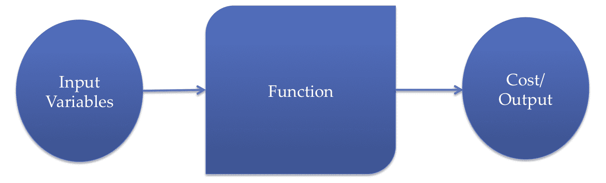

输入、要优化的函数和输出之间的关系

目标是最小化成本，使得输入变量满足由函数指定的约束。成本函数、约束和输入变量之间的数学关系决定了优化问题的复杂性。其中一个关键问题是成本函数和约束条件是凸的还是非凸的。如果成本函数和约束是凸的，我们可以确信确实存在一个可行的解决方案，如果我们在一个足够大的域中搜索，我们会找到一个。下图显示了一个凸成本函数的示例:


凸成本函数。左边的是表面图，右边的是相同成本函数的等高线图。图像中最暗的红点对应于最佳解决方案点。

另一方面，如果成本函数或约束是非凸的，优化问题变得更困难，我们不能确定是否存在解，或者我们甚至能找到一个解。

在数学和计算机编程中有各种各样的方法来解决最优化问题。接下来让我们来了解一下他们。


# 确定性和分析性方法

当目标函数是具有连续二阶导数的光滑函数时，那么我们从微积分的知识中知道，在局部最小值以下是正确的:

*   目标函数在最小值 *x* *处的梯度，即 *f* '( *x** ) = *0*
*   二阶导数(黑森*h*(*x**)=∇²t14】f(*x*))是正定的

在这种情况下，对于某些问题，通过确定梯度的零点和验证 Hessian 矩阵在零点处的正定性，有可能找到解析解。因此，在这些情况下，我们可以迭代地探索目标函数的最小值的搜索空间。有各种搜索方法；让我们看看他们。


# 梯度下降法

我们在前面的章节中学习了梯度下降及其工作原理，我们看到搜索方向是梯度下降的方向，-∇ *f* ( *x* )。它也被称为**柯西** **方法**因为它是柯西在 1847 年给出的，从那时起它就非常流行。我们从目标函数曲面上的任意点开始，沿着梯度的方向改变变量(在前面的章节中，这些是权重和偏差)。在数学上，它表示如下:


这里*α[n]是迭代 *n* 时的步长(变化量/学习率)。梯度下降算法在训练 DL 模型中工作得很好，但是它们有一些严重的缺点:*

*   所使用的优化器的性能很大程度上取决于学习速率和其他常数。如果你稍微改变它们，网络就很有可能不收敛。正因为如此，有时研究人员称训练模特为一门艺术，或炼金术。
*   由于这些方法是基于导数的，它们不适用于离散数据。
*   当目标函数是非凸的时，我们不能可靠地应用它，这是许多 DL 网络中的情况(尤其是使用非线性激活函数的模型)。许多隐藏层的存在会导致许多局部最小值，并且模型很有可能陷入局部最小值。这里，您可以看到一个具有许多局部最小值的目标函数示例:

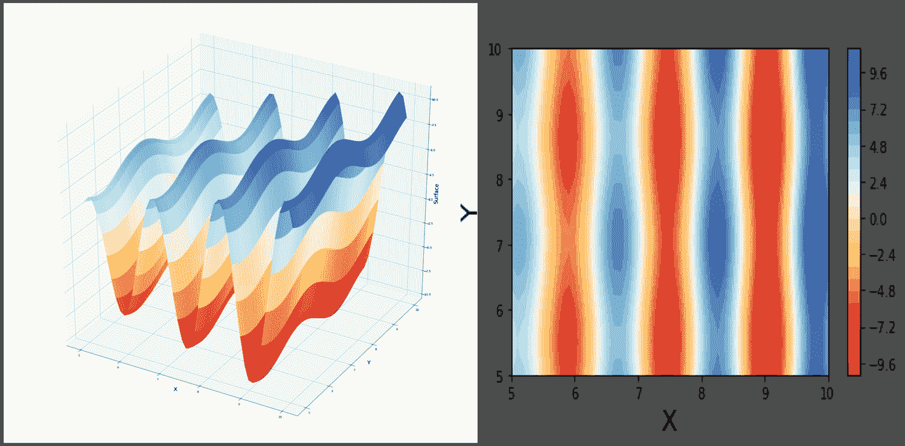

具有许多局部极小值的代价函数。左边的是表面图，右边的是相同成本函数的等高线图。图像中的暗红色点对应最小值。

梯度下降法有许多变体，其中最受欢迎的是张量流优化器，包括以下几种:

*   随机梯度优化器
*   Adam 优化器
*   Adagrad 优化程序
*   RMSProp 优化器

您可以从位于[https://www.tensorflow.org/api_guides/python/train](https://www.tensorflow.org/api_guides/python/train)的 TensorFlow 文档中了解更多关于 TensorFlow 中可用的不同优化器的信息。一个很好的来源是 Sebastian Ruder 的博客([http://Ruder . io/optimizing-gradient-descent optimizationalgorithms](http://ruder.io/optimizing-gradient-descent/index.html#gradientdescentoptimizationalgorithms))，他基于他在[https://arxiv.org/abs/1609.04747](https://arxiv.org/abs/1609.04747)的 arXiv 论文。


# 牛顿-拉夫森方法

该方法基于目标函数 *f* ( *x* )在点 *x ^* :* 附近的二阶泰勒级数展开

**

这里， *x* *是泰勒级数展开的点， *x* 是靠近 *x* *的点，上标 *T* 表示转置， *H* 是海森矩阵，其元素如下:

**

取泰勒级数展开的梯度并等于 **0** ，我们得到:

*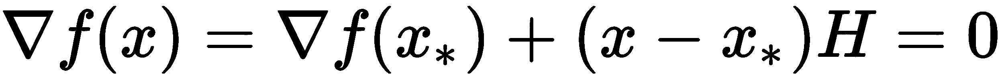*

假设初始猜测为 *x* [0] ，则下一点 *x* [n+1] 可以从前一点 *x* [n] 用这个得到:

**

该方法使用目标函数的一阶和二阶偏导数来寻找最小值。在迭代 *k* 时，通过围绕 *x* ( *k* )的二次函数逼近目标函数，并向其最小值移动。

因为计算 Hessian 矩阵在计算上是昂贵的，并且通常是未知的，所以围绕近似 Hessian 存在大量算法；这些技术被称为**拟牛顿法**。它们可以表示如下:

*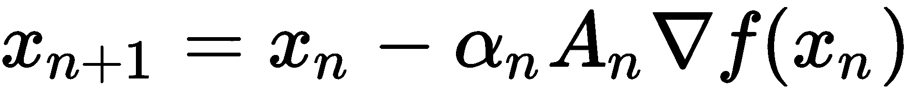*

*α[n]是迭代 *n* 时的步长(变化/学习率)，而*A[n]是迭代 *n* 时对海森矩阵的近似。我们构造了一个对 Hessian 的近似序列，使得以下为真:**

*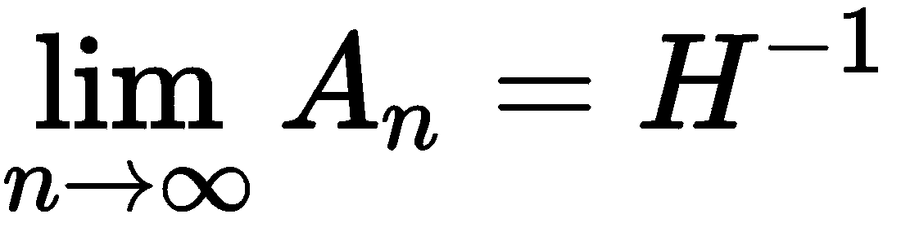*

两种流行的拟牛顿法如下:

*   大卫顿-弗莱彻-鲍威尔算法
*   布罗伊登-弗莱彻-戈德法布-尚诺算法

当对 Hessian 的近似*A[n]为单位矩阵时，牛顿法就变成了梯度下降法。*

牛顿方法的主要缺点是它不能扩展到具有高维输入特征空间的问题。


# 自然优化方法

自然优化方法受到一些自然过程的启发，即存在于自然界中的在优化一些自然现象方面非常成功的过程。这些算法不需要对目标函数求导，因此甚至可以用于离散变量和非连续目标函数。


# 模拟退火

模拟退火是一种随机方法。它的灵感来自退火的物理过程，首先将固体加热到足够高的温度使其熔化，然后慢慢降低温度；这使得固体颗粒能以尽可能低的能量状态排列，从而产生高度结构化的晶格。

我们从给每个变量分配一些随机值开始；这代表初始状态。在每一步，我们随机挑选一个变量(或一组变量)，然后选择一个随机值。如果在将该值赋给变量时，目标函数有所改善，则算法接受该赋值，存在新的当前赋值，并且系统的状态改变。否则，它以某个概率 *P* 接受分配，这取决于温度 *T* 以及当前状态和新状态中目标函数值之间的差异。如果更改未被接受，则当前状态保持不变。我们将从状态 *i* 变为状态 *j* 的概率 *P* 如下:


这里， *T* 表示物理系统中类似于温度的变量。当温度接近 *0* 时，模拟退火算法降低为梯度下降算法。


# 粒子群优化

**粒子群优化算法** ( **PSO** )是由 Edward 和 Kennedy 于 1995 年提出的。它基于动物的社会行为，比如一群鸟。你一定注意到了，在天空中，鸟儿呈 V 字形飞行。那些研究过鸟类行为的人告诉我们，鸟类在寻找食物或更好的位置时会这样飞行，领头的那只离想要的源头最近。

现在，当它们飞行时，领头的鸟不再保持原样；相反，它会随着他们的移动而改变。鸟群中看到食物的鸟发出声音信号，然后所有其他的鸟以 V 字形聚集在那只鸟的周围。这是一个不断重复的过程，几百万年来一直很好地服务于鸟类。

PSO 从这种鸟的行为中获得灵感，并用它来解决优化问题。在 PSO 中，每一个解都是搜索空间中的一只鸟(称为**粒子**)。每个粒子都有一个适应度值，由适应度函数来评价，进行优化；它们也有速度，引导粒子的飞行。粒子通过跟随当前最优粒子在问题搜索空间中飞行。

粒子在两个最佳适应值的指导下在搜索空间中移动，一个是它们自己在搜索空间中的最佳已知位置( **pbest** :粒子最佳)，另一个是整个群体的最佳已知适应值( **gbest** :全局最佳)。当改进的位置被发现时，它们被用来引导粒子群的运动。这一过程不断重复，希望最终能找到最佳解决方案。


# 遗传算法

当我们环顾世界，看到不同的物种时，一个问题自然产生了:为什么这些特征是稳定的，而其他的却不是；为什么大多数动物应该有两条腿或四条腿，而不是三条腿？有没有可能我们今天看到的世界是一个宏大的优化算法中多次迭代的结果？

假设有一个衡量生存能力的代价函数，应该是最大化的。自然界生物的特征符合拓扑景观。生存水平(通过适应来衡量)代表了景观的高度。最高点对应最适合的条件，而约束条件是由环境和不同物种之间的相互作用提供的。

那么，进化的过程可以被认为是一个巨大的优化算法，选择哪些特征产生一个适合生存的生物物种。地貌的顶峰居住着生物。一些峰很宽，包含许多生物的广泛特征，而另一些峰很窄，仅允许非常具体的特征。

我们可以将这种类比扩展到包括分隔不同物种的峰之间的谷。而且，我们可以认为人类可能处于这一景观的全球最高峰，因为我们有智慧和能力改变环境并确保更好的生存能力，即使在极端的环境中。

因此，具有不同生命形式的世界可以被认为是一个大的搜索空间，不同的物种是一个大优化算法多次迭代的结果。这个想法形成了遗传算法的基础。

因为本章的主题是遗传算法，所以让我们深入研究一下。


# 遗传算法导论

根据著名生物学家查尔斯·达尔文的研究，我们今天看到的动物和植物物种是经过数百万年的进化才出现的。进化的过程以*适者生存*的原则为指导，选择生存机会更大的生物。我们今天看到的植物和动物是数百万年来适应环境限制的结果。在任何给定的时间，大量不同的生物可能共存并竞争相同的环境资源。

最有能力获取资源和繁衍后代的生物，其后代将有更多的生存机会。另一方面，能力较弱的生物往往很少或没有后代。随着时间的推移，整个种群将进化，平均包含比前几代更适合的有机体。

是什么让这成为可能？是什么决定了一个人会很高，一株植物会有特定形状的叶子？所有这些都像一套规则一样被编码在生命蓝图的程序中——基因。地球上的每个生物都有这套规则，它们描述了生物是如何被设计(创造)的。基因存在于染色体中。每个生物都有不同数量的染色体，它们包含成千上万的基因。例如，我们智人有 46 条染色体，这些染色体包含大约 20，000 个基因。每个基因代表一个特定的规则:一个人会有蓝色的眼睛，棕色的头发，是女性，等等。这些基因通过繁殖过程从父母传给后代。

基因从父母传给后代有两种方式:

*   **无性繁殖**:在这种情况下，孩子就是父母的复制品。它发生在一个叫做**有丝分裂**的生物过程中；低等生物如细菌和真菌通过有丝分裂繁殖。在这种情况下只需要一个家长:

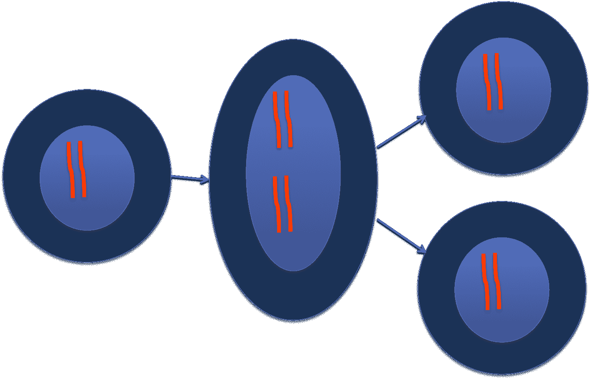

有丝分裂的过程:母体的染色体首先加倍，细胞分裂成两个

*   有性生殖:这是通过一个叫做**减数分裂**的生物过程发生的。在这方面，父母双方最初都参与其中；每个亲代细胞都经历一个交叉过程，其中一条染色体的一部分与另一条染色体的一部分互换。这改变了基因序列；然后细胞分裂成两个，但每个细胞只有一半的染色体。包含来自两个亲本的一半数量染色体(单倍体)的细胞然后相遇形成合子，该合子随后通过有丝分裂和细胞分化产生与亲本相似但不同的**后代**:

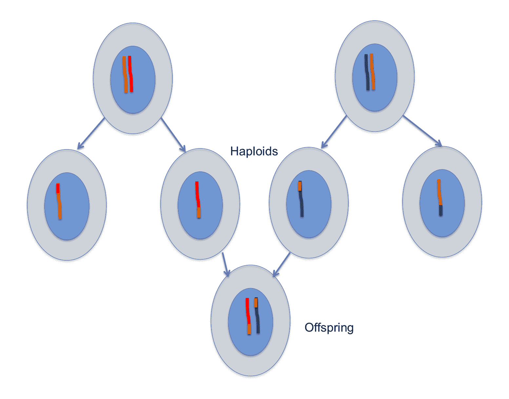

减数分裂的过程:父母的细胞染色体进行交叉，一条染色体的一部分与另一条染色体的一部分重叠并改变位置。然后细胞分裂成两个，每个分裂的细胞只含有一条染色体(单倍体)。然后来自两个亲本的两个单倍体相遇，完成染色体的总数。

在选择和进化的自然过程中发生的另一件有趣的事情是突变现象。在这里，基因经历了一个突然的变化，产生了一个全新的基因，这个基因在双亲中都不存在。这种现象产生了进一步的多样性。

世代间的有性繁殖被认为会带来进化，并确保具有最健康特征的生物会有更多的后代。


# 遗传算法

现在让我们学习如何实现遗传算法。这种方法是霍兰德在 1975 年发明的。他的学生戈德堡(Goldberg)用遗传算法控制天然气管道传输，证明了它可以用来解决优化问题。从那以后，遗传算法一直很受欢迎，并激发了其他各种各样的进化程序。

为了将遗传算法应用于使用计算机解决最优化问题，作为第一步，我们需要**将问题变量编码成基因**。基因可以是一串实数或二进制位串(一系列 0 和 1)。这代表了一个潜在的解决方案(个体)，并且许多这样的解决方案一起形成了在时间 *t* 的群体。例如，考虑一个问题，我们需要找到两个变量 a 和 b，使得这两个变量位于范围(0，255)内。对于二进制基因表示，这两个变量可以用一个 16 位染色体来表示，高 8 位表示基因 a，低 8 位表示基因 b。稍后需要对编码进行解码，以获得变量 a 和 b 的真实值。

遗传算法的第二个重要要求是定义一个合适的**适应度函数**，它计算任何潜在解决方案的适应度分数(在前面的例子中，它应该计算编码染色体的适应度值)。这是我们希望通过找到系统或手头问题的最佳参数集来优化的函数。适应度函数依赖于问题。例如，在进化的自然过程中，适应度函数代表生物体在其环境中操作和生存的能力。

一旦我们决定了问题解决方案在基因中的编码并决定了适应度函数，遗传算法将遵循以下步骤:

1.  **群体初始化**:我们需要创建一个初始群体，其中所有的染色体(通常)都是随机生成的，以产生整个范围的可能解决方案(搜索空间)。有时，解决方案可能被播种在可能找到最优解决方案的区域。群体大小取决于问题的性质，但通常包含数百个编码到染色体中的潜在解决方案。
2.  **亲代选择**:对于每一个连续的世代，基于适应度函数(或随机地)，我们接下来选择一定比例的现有群体。这部分被选中的种群将会繁殖形成新的一代。这是通过锦标赛选择的方法来完成的:随机选择固定数量的个体(锦标赛规模),并选择具有最佳健康分数的个体作为父母之一。

3.  **繁殖**:接下来，我们通过交叉和变异等遗传操作，从步骤 2 中选择的后代中产生下一代。这些遗传操作符最终产生一个子代(下一代)染色体群体，它不同于最初的一代，但同时具有其父母的许多特征。
4.  **评估**:然后使用适应度函数评估产生的后代，它们替换种群中最不适应的个体，以保持种群规模不变。
5.  **终止**:在*评估*步骤中，如果任一后代达到目标适应值或达到最大代数，则遗传算法过程终止。否则，重复步骤 *2* 至 *4* 以产生下一代。

遗传算法成功的两个重要操作是交叉和变异。


# 交叉

为了执行交叉操作，我们在两个父母的染色体上选择一个随机位置，然后以概率*P[x]在他们之间交换遗传信息。这导致了两个新的后代。当交叉发生在随机点上时，称为**单点交叉**(或**单点交叉**)* 

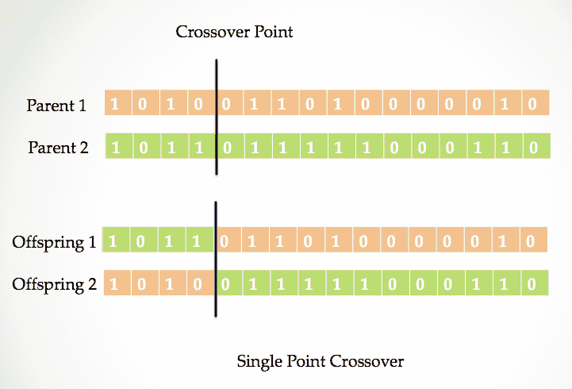

单点交叉:在父代染色体中随机选择一个点，交换相应的基因位

我们也可以有不止一个父母基因互换的点；这被称为**Mult**I 点交叉:


多点交换:双亲的基因交换不止一个点。这是一个两点交叉的例子。

人们尝试了许多交叉方法，例如均匀交叉、基于顺序的交叉和循环交叉。


# 变化

虽然交叉操作确保了多样性并有助于加速搜索，但它不会产生新的解。这是变异算子的工作，它有助于维持和引入种群的多样性。变异算子以概率 *P [m]* 应用于子染色体的某些基因(位)。

我们可以有一点翻转突变。如果我们考虑我们之前的例子，那么在 16 位染色体中，位翻转突变将导致单个位改变其状态(从 *0* 到 *1* 或者从 *1* 到 *0* )。

有一种可能，我们将基因设置为所有可能值的随机值。这叫做**随机复位**。

概率*P[m]起着重要的作用；如果我们给 *P [m] 我们选择一个突变概率，使得算法学会牺牲短期适应度以获得长期适应度。**


# 利弊

遗传算法听起来很酷，对吧！现在，在我们试图围绕它们建立一个代码之前，让我们指出遗传算法的某些优点和缺点。


# 优势

遗传算法提供了一些有趣的优势，并且可以在传统的基于梯度的方法失败时产生结果:

*   它们可用于优化连续或离散变量。
*   与梯度下降不同，我们不需要导数信息，这也意味着适应度函数不需要连续和可微。
*   它可以同时从大范围的成本面中进行搜索。
*   我们可以在不显著增加计算时间的情况下处理大量变量。
*   种群的生成和适应值的计算可以并行进行，因此遗传算法非常适合并行计算机。
*   即使拓扑曲面极其复杂，它们也能工作，因为交叉和变异算子有助于它们跳出局部最小值。
*   它们可以提供不止一个最佳解决方案。
*   我们可以将它们用于数值生成的数据、实验数据，甚至分析函数。它们特别适用于大规模优化问题。


# 不足之处

尽管有前面提到的优势，我们仍然没有发现遗传算法是所有优化问题的普遍解决方案。这是出于以下原因:

*   如果优化函数是性能良好的凸函数，那么基于梯度的方法将给出更快的收敛
*   帮助遗传算法更广泛地覆盖搜索空间的大量解也导致了缓慢的收敛
*   设计一个适应度函数可能是一项艰巨的任务


# 用 Python 编写分布式进化算法的遗传算法

现在我们已经了解了遗传算法是如何工作的，让我们试着用它们来解决一些问题。它们已被用来解决 NP 难问题，如旅行推销员问题。为了使生成种群、执行交叉和执行变异操作的任务变得容易，我们将使用 Python ( **DEAP** )中的**分布式进化算法。它支持多重处理，我们也可以将它用于其他进化算法。您可以使用以下代码直接从 PyPi 下载 DEAP:**

```
pip install deap
```

它与 Python 3 兼容。

要了解更多关于 DEAP 的信息，你可以参考它的 GitHub 库([https://github.com/DEAP/deap](https://github.com/DEAP/deap))和它的用户指南([http://deap.readthedocs.io/en/master/](http://deap.readthedocs.io/en/master/))。


# 猜单词

在这个程序中，我们使用遗传算法来猜测一个单词。遗传算法将知道单词中的字母数量，并将猜测这些字母，直到找到正确的答案。我们决定用一个字母数字字符来表示基因；因此，这些字符串构成了一条染色体。而我们的适应度函数是个体中匹配的字符和正确单词的总和:

1.  作为第一步，我们导入我们需要的模块。我们使用`string`模块和`random`模块从(a—z *、* A—Z *、*和 0—9)中生成随机字符。在 DEAP 模块中，我们使用`creator`、`base`和`tools`:

```
import string
import random

from deap import base, creator, tools
```

2.  在 DEAP，我们从创建一个继承自`deep.base`模块的类开始。我们需要告诉它，我们是要得到函数的最小值还是最大值；这是使用权重参数完成的。值`+1`意味着我们正在最大化(为了最小化，我们给出值`-1.0`)。下面的代码行将创建一个类`FitnessMax`，它将最大化该函数:

```
creator.create("FitnessMax", base.Fitness, weights=(1.0,))  
```

3.  我们还定义了一个`Individual`类，它将继承类列表，并告诉 DEAP 创建器模块将`FitnessMax`指定为它的`fitness`属性:

```
creator.create("Individual", list, fitness=creator.FitnessMax)
```

4.  现在，定义了`Individual`类，我们使用在基本模块中定义的 DEAP 的`toolbox`。我们将使用它来创建一个群体，并定义我们的基因库。从现在开始，我们需要的所有对象——个体、群体、函数、操作符和参数——都存储在一个名为`toolbox`的容器中。我们可以使用`register()`和`unregister()`方法向/从`toolbox`容器中添加或移除内容:

```
toolbox = base.Toolbox()
# Gene Pool
toolbox.register("attr_string", random.choice, \
               string.ascii_letters + string.digits )
```

5.  现在我们已经定义了如何创建基因库，我们通过重复使用`Individual`类创建一个个体，然后创建一个群体。我们将把这个类传递给负责创建一个`N`参数的工具箱，告诉它要产生多少个基因:

```
#Number of characters in word
# The word to be guessed
word = list('hello')
N = len(word)
# Initialize population
toolbox.register("individual", tools.initRepeat, \
         creator.Individual, toolbox.attr_string, N )
toolbox.register("population",tools.initRepeat, list,\
         toolbox.individual)
```

6.  我们定义了`fitness`函数。注意 return 语句中的逗号。这是因为 DEAP 中的适应度函数作为元组返回，以允许多目标`fitness`函数:

```
def evalWord(individual, word):
    return sum(individual[i] == word[i] for i in\
            range(len(individual))),    
```

7.  向容器添加健身功能。另外，添加交叉操作符、变异操作符和父选择操作符。您可以看到，为此，我们使用了 register 函数。在第一个语句中，我们注册了已经定义的适应度函数，以及它将接受的附加参数。下一条语句注册交叉操作；它指定我们在这里使用两点交叉(`cxTwoPoint`)。接下来，我们注册变异算子；我们选择`mutShuffleIndexes`选项，它以概率`indpb=0.05`打乱输入个体的属性。最后，我们定义如何选择亲本；这里，我们将选择方法定义为锦标赛选择，锦标赛规模为`3`:

```
toolbox.register("evaluate", evalWord, word)
toolbox.register("mate", tools.cxTwoPoint)
toolbox.register("mutate", tools.mutShuffleIndexes, indpb=0.05)
toolbox.register("select", tools.selTournament, tournsize=3)
```

8.  现在我们有了所有的成分，所以我们将写下遗传算法的代码，它将以重复的方式执行我们前面提到的步骤:

```
def main():
    random.seed(64)
    # create an initial population of 300 individuals 
    pop = toolbox.population(n=300)
    # CXPB is the crossover probability 
    # MUTPB is the probability for mutating an individual
    CXPB, MUTPB = 0.5, 0.2

    print("Start of evolution")

    # Evaluate the entire population
    fitnesses = list(map(toolbox.evaluate, pop))
    for ind, fit in zip(pop, fitnesses):
        ind.fitness.values = fit

    print(" Evaluated %i individuals" % len(pop))

    # Extracting all the fitnesses of individuals in a list
    fits = [ind.fitness.values[0] for ind in pop]
    # Variable keeping track of the number of generations
    g = 0

    # Begin the evolution
    while max(fits) < 5 and g < 1000:
        # A new generation
        g += 1
        print("-- Generation %i --" % g)

        # Select the next generation individuals
        offspring = toolbox.select(pop, len(pop))
        # Clone the selected individuals
        offspring = list(map(toolbox.clone, offspring))

        # Apply crossover and mutation on the offspring
        for child1, child2 in zip(offspring[::2], offspring[1::2]):
            # cross two individuals with probability CXPB
            if random.random() < CXPB:    
            toolbox.mate(child1, child2)
            # fitness values of the children
            # must be recalculated later
            del child1.fitness.values
            del child2.fitness.values
        for mutant in offspring:
            # mutate an individual with probability MUTPB
            if random.random() < MUTPB:
                toolbox.mutate(mutant)
                del mutant.fitness.values

        # Evaluate the individuals with an invalid fitness
        invalid_ind = [ind for ind in offspring if not ind.fitness.valid]
        fitnesses = map(toolbox.evaluate, invalid_ind)
        for ind, fit in zip(invalid_ind, fitnesses):
        ind.fitness.values = fit

        print(" Evaluated %i individuals" % len(invalid_ind))

        # The population is entirely replaced by the offspring
        pop[:] = offspring

        # Gather all the fitnesses in one list and print the stats
        fits = [ind.fitness.values[0] for ind in pop]

        length = len(pop)
        mean = sum(fits) / length
        sum2 = sum(x*x for x in fits)
        std = abs(sum2 / length - mean**2)**0.5

        print(" Min %s" % min(fits))
        print(" Max %s" % max(fits))
        print(" Avg %s" % mean)
        print(" Std %s" % std)

    print("-- End of (successful) evolution --")

    best_ind = tools.selBest(pop, 1)[0]
    print("Best individual is %s, %s" % (''.join(best_ind),\
             best_ind.fitness.values))
```

9.  在这里，你可以看到这个遗传算法的结果。经过七代人，我们找到了正确的词:


DEAP 可以选择各种交叉工具、不同的变异算子，甚至是锦标赛的选择方式。http://deap.readthedocs.io/en/master/api/tools.html.[提供了 DEAP 提供的所有进化工具及其描述的完整列表](http://deap.readthedocs.io/en/master/api/tools.html#deap.tools.mutFlipBit)


# CNN 架构的遗传算法

在[第 4 章](cb9d27c5-e98d-44b6-a947-691b0bc64766.xhtml)、*物联网深度学习、*中，我们了解了不同的 DL 模式，如 MLP、CNN、RNN 等。现在，我们将看看如何在这些 DL 模型中使用遗传算法。遗传算法可以用来找到优化的权重和偏差，人们已经尝试过了。但是遗传算法在 DL 模型中最常见的用途是寻找最佳超参数。

在这里，我们使用遗传算法来寻找最佳的 CNN 架构。这里的解决方案是基于谢灵犀和([和](https://arxiv.org/abs/1703.01513))的论文*遗传 CNN* 。第一步是找到问题的正确表述。作者提出了网络体系结构的二进制字符串表示。网络的族被编码成固定长度的二进制串。该网络由 *S* 级组成，其中 *s 级*S 级 = *1* 、 *2* 、.... *S* ，包含用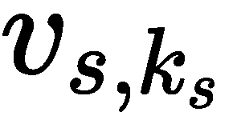表示的*K[S]节点，这里*K[S]=*1*， *2* ，...，*K[s]。每个阶段中的节点都是有序的，为了正确表示，它们只允许从编号较低的节点连接到编号较高的节点。每个节点代表一个卷积层操作，之后是批量归一化和 ReLU 激活。比特串的每个比特表示一个卷积层(节点)和另一个卷积层(节点)之间存在或不存在连接，比特的排序如下:第一个比特表示( *v* [*s* ，1] ， *v* [*s* ，2] )之间的连接，接下来的两个比特表示( *v* 【T70)之间的连接 * v * [*s* ，3] )和(*v*[s]*，2 ，*v*[s]*，3 ，下面三位将( *v* [ *s* ，1]* 以及( *v* [*s* ，2] ， *v* [*s* ，4] )等等。

为了更好地理解它，让我们考虑一个两级网络(每一级将具有相同的滤波器数量和滤波器尺寸)。级*S*1 假设由四个节点组成(即*K[S]= 4)，因此对其进行编码所需的总位数为( *4×3× =* ) 6。级 *1* 中卷积滤波器的数量为 3*2；我们还确保卷积运算不会改变图像的空间维度(例如，填充是相同的)。下图显示了相应的位串编码和相应的卷积层连接。红色的连接是默认连接，不编码在位串中。第一位编码( *a1* 、 *a2* )之间的连接，后两位编码( *a1* 、 *a3* )与( *a2* 、 *a3* )之间的连接，后三位编码( *a1* 、 *a4* )、( *a2* 、*a4*之间的连接****

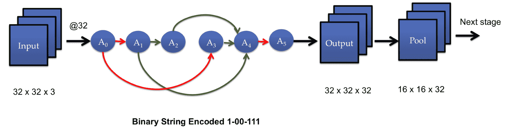

位串编码和相应的卷积层连接

级 *1* 接受一个 **32 × 32 × 3** 输入；这个阶段的所有卷积节点都有 32 个滤波器。红色连接是未编码到位串中的默认连接。绿色连接表示根据编码位串 1-00-111 的连接。级 *1* 的输出到达汇集层，并在空间维度上减半。

第二级有五个节点，因此需要(5×4× =) 10 位。它将从尺寸为 **16 × 16 × 32** 的 *1* 级获取输入。现在，如果我们将级 *2* 中卷积滤波器的数量设为 *64* ，则合并后的输出将为 8 × 8 × 64。

这里展示的代码摘自[https://github.com/aqibsaeed/Genetic-CNN](https://github.com/aqibsaeed/Genetic-CNN)。由于我们需要表示一个图结构，所以使用**有向无环图** ( **DAG** )来构建网络。为了表示 DAG，我们定义了一个类 DAG，在这个类中，我们定义了用于添加新节点、删除现有节点、在两个节点之间添加边(连接)以及删除两个节点之间的边的方法。除此之外，还定义了一些方法来查找节点的前身、它所连接的节点以及图的叶子列表。完整的代码在`dag.py`中，可以通过 GitHub 链接访问。

主代码在`Genetic_CNN.ipynb` Jupyter 笔记本中给出。我们使用 DEAP 库来运行遗传算法，并使用 TensorFlow 从遗传算法构建的图中构建 CNN。适应度函数是准确度。构建代码是为了在 MNIST 数据集(手写数字，我们在[第 4 章](cb9d27c5-e98d-44b6-a947-691b0bc64766.xhtml)、*物联网深度学习*中使用)上找到将给出最高准确度的 CNN 在这里，我们直接从 TensorFlow 库访问它们):

1.  第一步是导入模块。这里，我们将需要 DEAP 和 TensorFlow，我们还将导入我们在`dag.py`中创建的 DAG 类以及标准的 Numpy 和 Random 模块:

```
import random
import numpy as np

from deap import base, creator, tools, algorithms
from scipy.stats import bernoulli
from dag import DAG, DAGValidationError

import tensorflow as tf
from tensorflow.examples.tutorials.mnist import input_data
```

2.  我们直接从 TensorFlow 示例库中读取数据:

```
mnist = input_data.read_data_sets("mnist_data/", one_hot=True)
train_imgs   = mnist.train.images
train_labels = mnist.train.labels
test_imgs    = mnist.test.images
test_labels  = mnist.test.labels

train_imgs = np.reshape(train_imgs,[-1,28,28,1])
test_imgs = np.reshape(test_imgs,[-1,28,28,1])
```

3.  现在，我们构建用于保存网络信息的位数据结构。我们正在设计的网络是一个三级网络，第一级有三个节点(3 位)，第二级有四个节点(6 位)，第三级有五个节点(10 位)。因此，一个个体将由一个 *3 + 6 + 10 = 19* 位的二进制字符串表示:

```
STAGES = np.array(["s1","s2","s3"]) # S
NUM_NODES = np.array([3,4,5]) # K

L =  0 # genome length
BITS_INDICES, l_bpi = np.empty((0,2),dtype = np.int32), 0 # to keep track of bits for each stage S
for nn in NUM_NODES:
    t = nn * (nn - 1)
    BITS_INDICES = np.vstack([BITS_INDICES,[l_bpi, l_bpi + int(0.5 * t)]])
    l_bpi = int(0.5 * t)
    L += t
L = int(0.5 * L)

TRAINING_EPOCHS = 20
BATCH_SIZE = 20
TOTAL_BATCHES = train_imgs.shape[0] // BATCH_SIZE
```

4.  现在到了根据编码的位串构建图形的部分。这将有助于为遗传算法建立种群。首先，我们定义构建 CNN ( `weight_variable`)所需的函数:为卷积节点创建权重变量；`bias_variable`:为卷积节点创建偏差变量；`apply_convolution`:执行卷积运算的函数；`apply_pool`:在每个阶段之后执行汇集操作的函数；最后是使用`linear_layer`函数的最后一个完全连接的层):

```
def weight_variable(weight_name, weight_shape):
    return tf.Variable(tf.truncated_normal(weight_shape, stddev = 0.1),name = ''.join(["weight_", weight_name]))

def bias_variable(bias_name,bias_shape):
    return tf.Variable(tf.constant(0.01, shape = bias_shape),name = ''.join(["bias_", bias_name]))

def linear_layer(x,n_hidden_units,layer_name):
    n_input = int(x.get_shape()[1])
    weights = weight_variable(layer_name,[n_input, n_hidden_units])
    biases = bias_variable(layer_name,[n_hidden_units])
    return tf.add(tf.matmul(x,weights),biases)

def apply_convolution(x,kernel_height,kernel_width,num_channels,depth,layer_name):
    weights = weight_variable(layer_name,[kernel_height, kernel_width, num_channels, depth])
    biases = bias_variable(layer_name,[depth])
    return tf.nn.relu(tf.add(tf.nn.conv2d(x, weights,[1,2,2,1],padding = "SAME"),biases)) 

def apply_pool(x,kernel_height,kernel_width,stride_size):
    return tf.nn.max_pool(x, ksize=[1, kernel_height, kernel_width, 1], 
            strides=[1, 1, stride_size, 1], padding = "SAME")
```

5.  现在，我们可以基于编码的位串来构建网络。因此，我们使用`generate_dag`函数生成 DAG:

```
def generate_dag(optimal_indvidual,stage_name,num_nodes):
    # create nodes for the graph
    nodes = np.empty((0), dtype = np.str)
    for n in range(1,(num_nodes + 1)):
        nodes = np.append(nodes,''.join([stage_name,"_",str(n)]))

    # initialize directed asyclic graph (DAG) and add nodes to it
    dag = DAG()
    for n in nodes:
        dag.add_node(n)

    # split best indvidual found via genetic algorithm to identify vertices connections and connect them in DAG 
    edges = np.split(optimal_indvidual,np.cumsum(range(num_nodes - 1)))[1:]
    v2 = 2
    for e in edges:
        v1 = 1
        for i in e:
            if i:
                dag.add_edge(''.join([stage_name,"_",str(v1)]),''.join([stage_name,"_",str(v2)])) 
            v1 += 1
        v2 += 1

    # delete nodes not connected to anyother node from DAG
    for n in nodes:
        if len(dag.predecessors(n)) == 0 and len(dag.downstream(n)) == 0:
            dag.delete_node(n)
            nodes = np.delete(nodes, np.where(nodes == n)[0][0])

    return dag, nodes
```

6.  生成的图形用于使用`generate_tensorflow_graph`函数构建张量流图形。该功能利用`add_node`功能添加一个卷积层，利用`sum_tensors`功能组合多个卷积层的输入:

```
def generate_tensorflow_graph(individual,stages,num_nodes,bits_indices):
    activation_function_pattern = "/Relu:0"

    tf.reset_default_graph()
    X = tf.placeholder(tf.float32, shape = [None,28,28,1], name = "X")
    Y = tf.placeholder(tf.float32,[None,10],name = "Y")

    d_node = X
    for stage_name,num_node,bpi in zip(stages,num_nodes,bits_indices):
        indv = individual[bpi[0]:bpi[1]]

        add_node(''.join([stage_name,"_input"]),d_node.name)
        pooling_layer_name = ''.join([stage_name,"_input",activation_function_pattern])

        if not has_same_elements(indv):
            # ------------------- Temporary DAG to hold all connections implied by genetic algorithm solution ------------- #  

            # get DAG and nodes in the graph
            dag, nodes = generate_dag(indv,stage_name,num_node) 
            # get nodes without any predecessor, these will be connected to input node
            without_predecessors = dag.ind_nodes() 
            # get nodes without any successor, these will be connected to output node
            without_successors = dag.all_leaves()

            # ----------------------------------------------------------------------------------------------- #

            # --------------------------- Initialize tensforflow graph based on DAG ------------------------- #

            for wop in without_predecessors:
                add_node(wop,''.join([stage_name,"_input",activation_function_pattern]))

            for n in nodes:
                predecessors = dag.predecessors(n)
                if len(predecessors) == 0:
                    continue
                elif len(predecessors) > 1:
                    first_predecessor = predecessors[0]
                    for prd in range(1,len(predecessors)):
                        t = sum_tensors(first_predecessor,predecessors[prd],activation_function_pattern)
                        first_predecessor = t.name
                    add_node(n,first_predecessor)
                elif predecessors:
                    add_node(n,''.join([predecessors[0],activation_function_pattern]))

            if len(without_successors) > 1:
                first_successor = without_successors[0]
                for suc in range(1,len(without_successors)):
                    t = sum_tensors(first_successor,without_successors[suc],activation_function_pattern)
                    first_successor = t.name
                add_node(''.join([stage_name,"_output"]),first_successor) 
            else:
                add_node(''.join([stage_name,"_output"]),''.join([without_successors[0],activation_function_pattern])) 

            pooling_layer_name = ''.join([stage_name,"_output",activation_function_pattern])
            # ------------------------------------------------------------------------------------------ #

        d_node =  apply_pool(tf.get_default_graph().get_tensor_by_name(pooling_layer_name), 
                                 kernel_height = 16, kernel_width = 16,stride_size = 2)

    shape = d_node.get_shape().as_list()
    flat = tf.reshape(d_node, [-1, shape[1] * shape[2] * shape[3]])
    logits = linear_layer(flat,10,"logits")

    xentropy =  tf.nn.softmax_cross_entropy_with_logits(logits = logits, labels = Y)
    loss_function = tf.reduce_mean(xentropy)
    optimizer = tf.train.AdamOptimizer().minimize(loss_function) 
    accuracy = tf.reduce_mean(tf.cast( tf.equal(tf.argmax(tf.nn.softmax(logits),1), tf.argmax(Y,1)), tf.float32))

    return  X, Y, optimizer, loss_function, accuracy

# Function to add nodes
def add_node(node_name, connector_node_name, h = 5, w = 5, nc = 1, d = 1):
    with tf.name_scope(node_name) as scope:
        conv = apply_convolution(tf.get_default_graph().get_tensor_by_name(connector_node_name), 
                   kernel_height = h, kernel_width = w, num_channels = nc , depth = d, 
                   layer_name = ''.join(["conv_",node_name]))

def sum_tensors(tensor_a,tensor_b,activation_function_pattern):
    if not tensor_a.startswith("Add"):
        tensor_a = ''.join([tensor_a,activation_function_pattern])

    return tf.add(tf.get_default_graph().get_tensor_by_name(tensor_a),
                 tf.get_default_graph().get_tensor_by_name(''.join([tensor_b,activation_function_pattern])))

def has_same_elements(x):
    return len(set(x)) <= 1
```

7.  适应度函数评估生成的 CNN 架构的准确性:

```
def evaluateModel(individual):
    score = 0.0
    X, Y, optimizer, loss_function, accuracy = generate_tensorflow_graph(individual,STAGES,NUM_NODES,BITS_INDICES)
    with tf.Session() as session:
        tf.global_variables_initializer().run()
        for epoch in range(TRAINING_EPOCHS):
            for b in range(TOTAL_BATCHES):
                offset = (epoch * BATCH_SIZE) % (train_labels.shape[0] - BATCH_SIZE)
                batch_x = train_imgs[offset:(offset + BATCH_SIZE), :, :, :]
                batch_y = train_labels[offset:(offset + BATCH_SIZE), :]
                _, c = session.run([optimizer, loss_function],feed_dict={X: batch_x, Y : batch_y})

        score = session.run(accuracy, feed_dict={X: test_imgs, Y: test_labels})
        #print('Accuracy: ',score)
    return score,
```

8.  因此，现在我们准备实现遗传算法:我们的适应度函数将是一个最大值函数(`weights=(1.0,)`)，我们使用伯努利分布(`bernoulli.rvs`)初始化二进制字符串，创建长度为`L= 19`的个体，并生成由`20`个个体组成的群体。这次选择了有序交叉，从第一个父代中选取一个子串，复制到相同位置的子代中；剩余的位置从第二个父节点开始填充，确保子字符串中的节点不会重复。我们保留了和以前一样的变异算子，`mutShuffleIndexes`；锦标赛选择方法是`selRoulette`，它使用轮盘赌选择方法进行选择(我们选择`k`个人，并从中选择最适合的个人)。这一次，我们没有对遗传算法进行编码，而是使用了 DEAP eas simple 算法，这是一种基本的遗传算法:

```
population_size = 20
num_generations = 3
creator.create("FitnessMax", base.Fitness, weights = (1.0,))
creator.create("Individual", list , fitness = creator.FitnessMax)
toolbox = base.Toolbox()
toolbox.register("binary", bernoulli.rvs, 0.5)
toolbox.register("individual", tools.initRepeat, creator.Individual, toolbox.binary, n = L)
toolbox.register("population", tools.initRepeat, list , toolbox.individual)
toolbox.register("mate", tools.cxOrdered)
toolbox.register("mutate", tools.mutShuffleIndexes, indpb = 0.8)
toolbox.register("select", tools.selRoulette)
toolbox.register("evaluate", evaluateModel)
popl = toolbox.population(n = population_size)

import time
t = time.time()
result = algorithms.eaSimple(popl, toolbox, cxpb = 0.4, mutpb = 0.05, ngen = num_generations, verbose = True)
t1 = time.time() - t
print(t1)
```

9.  算法需要一些时间；在采用 NVIDIA 1070 GTX GPU 的 i7 上，大约需要 1.5 小时。最佳的三种解决方案如下:

```
best_individuals = tools.selBest(popl, k = 3)
for bi in best_individuals:
    print(bi)
```

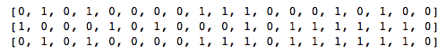


# LSTM 优化的遗传算法

在遗传 CNN 中，我们使用遗传算法来估计最佳 CNN 结构；在遗传 RNN 中，我们现在将使用遗传算法来寻找 RNN 的最佳超参数、窗口大小和隐藏单元的数量。我们将找到降低模型的**均方根误差** ( **RMSE** )的参数。

超参数窗口大小和单元数量再次被编码成二进制串，其中 6 位用于窗口大小，4 位用于单元数量。因此，完整的编码染色体将为 10 位。LSTM 使用 Keras 实现。

我们实现的代码取自 https://github.com/aqibsaeed/Genetic-Algorithm-RNN 的:

1.  导入必要的模块。这一次，我们使用 Keras 来实现 LSTM 模型:

```
import numpy as np
import pandas as pd
from sklearn.metrics import mean_squared_error
from sklearn.model_selection import train_test_split as split

from keras.layers import LSTM, Input, Dense
from keras.models import Model

from deap import base, creator, tools, algorithms
from scipy.stats import bernoulli
from bitstring import BitArray

np.random.seed(1120)
```

2.  我们需要的 LSTM 数据集必须是时间序列数据；我们使用卡格尔([https://www.kaggle.com/c/GEF2012-wind-forecasting/data](https://www.kaggle.com/c/GEF2012-wind-forecasting/data))的风力预测数据:

```
data = pd.read_csv('train.csv')
data = np.reshape(np.array(data['wp1']),(len(data['wp1']),1))

train_data = data[0:17257]
test_data = data[17257:]
```

3.  根据选择的`window_size`定义一个准备数据集的函数:

```
def prepare_dataset(data, window_size):
    X, Y = np.empty((0,window_size)), np.empty((0))
    for i in range(len(data)-window_size-1):
        X = np.vstack([X,data[i:(i + window_size),0]])
        Y = np.append(Y,data[i + window_size,0])   
    X = np.reshape(X,(len(X),window_size,1))
    Y = np.reshape(Y,(len(Y),1))
    return X, Y
```

4.  `train_evaluate`函数为给定个人创建 LSTM 网络，并返回其 RMSE 值(适应度函数):

```
def train_evaluate(ga_individual_solution):   
    # Decode genetic algorithm solution to integer for window_size and num_units
    window_size_bits = BitArray(ga_individual_solution[0:6])
    num_units_bits = BitArray(ga_individual_solution[6:]) 
    window_size = window_size_bits.uint
    num_units = num_units_bits.uint
    print('\nWindow Size: ', window_size, ', Num of Units: ', num_units)

    # Return fitness score of 100 if window_size or num_unit is zero
    if window_size == 0 or num_units == 0:
        return 100, 

    # Segment the train_data based on new window_size; split into train and validation (80/20)
    X,Y = prepare_dataset(train_data,window_size)
    X_train, X_val, y_train, y_val = split(X, Y, test_size = 0.20, random_state = 1120)

    # Train LSTM model and predict on validation set
    inputs = Input(shape=(window_size,1))
    x = LSTM(num_units, input_shape=(window_size,1))(inputs)
    predictions = Dense(1, activation='linear')(x)
    model = Model(inputs=inputs, outputs=predictions)
    model.compile(optimizer='adam',loss='mean_squared_error')
    model.fit(X_train, y_train, epochs=5, batch_size=10,shuffle=True)
    y_pred = model.predict(X_val)

    # Calculate the RMSE score as fitness score for GA
    rmse = np.sqrt(mean_squared_error(y_val, y_pred))
    print('Validation RMSE: ', rmse,'\n')

    return rmse,
```

5.  接下来，我们使用 DEAP 工具来定义个体(同样，由于染色体由二进制编码字符串(10 位)表示，我们使用伯努利分布)，创建群体，使用有序交叉，使用 mutShuffleIndexes 突变，并使用轮盘赌轮选择来选择双亲:

```
population_size = 4
num_generations = 4
gene_length = 10

# As we are trying to minimize the RMSE score, that's why using -1.0\. 
# In case, when you want to maximize accuracy for instance, use 1.0
creator.create('FitnessMax', base.Fitness, weights = (-1.0,))
creator.create('Individual', list , fitness = creator.FitnessMax)

toolbox = base.Toolbox()
toolbox.register('binary', bernoulli.rvs, 0.5)
toolbox.register('individual', tools.initRepeat, creator.Individual, toolbox.binary, n = gene_length)
toolbox.register('population', tools.initRepeat, list , toolbox.individual)

toolbox.register('mate', tools.cxOrdered)
toolbox.register('mutate', tools.mutShuffleIndexes, indpb = 0.6)
toolbox.register('select', tools.selRoulette)
toolbox.register('evaluate', train_evaluate)

population = toolbox.population(n = population_size)
r = algorithms.eaSimple(population, toolbox, cxpb = 0.4, mutpb = 0.1, ngen = num_generations, verbose = False)
```

6.  我们得到最佳解决方案，如下所示:

```
best_individuals = tools.selBest(population,k = 1)
best_window_size = None
best_num_units = None

for bi in best_individuals:
    window_size_bits = BitArray(bi[0:6])
    num_units_bits = BitArray(bi[6:]) 
    best_window_size = window_size_bits.uint
    best_num_units = num_units_bits.uint
    print('\nWindow Size: ', best_window_size, ', Num of Units: ', best_num_units)
```

7.  最后，我们实施最佳 LSTM 解决方案:

```
X_train,y_train = prepare_dataset(train_data,best_window_size)
X_test, y_test = prepare_dataset(test_data,best_window_size)

inputs = Input(shape=(best_window_size,1))
x = LSTM(best_num_units, input_shape=(best_window_size,1))(inputs)
predictions = Dense(1, activation='linear')(x)
model = Model(inputs = inputs, outputs = predictions)
model.compile(optimizer='adam',loss='mean_squared_error')
model.fit(X_train, y_train, epochs=5, batch_size=10,shuffle=True)
y_pred = model.predict(X_test)

rmse = np.sqrt(mean_squared_error(y_test, y_pred))
print('Test RMSE: ', rmse)
```

耶！现在，你有了预测风力的最佳 LSTM 网络。


# 摘要

本章介绍了一个有趣的受自然启发的算法家族:遗传算法。我们讨论了各种标准优化算法，从确定性模型到基于梯度的算法，再到进化算法。通过自然选择进化的生物学过程被包括。然后，我们学习了如何将我们的优化问题转换成适合遗传算法的形式。解释了遗传算法中两个非常重要的操作:交叉和变异。虽然不可能广泛涵盖所有的交叉和变异方法，但我们确实了解了一些流行的方法。

我们将所学应用于三个非常不同的优化问题。我们用它来猜一个单词。这个例子是一个五个字母的单词；如果我们使用简单的蛮力，将需要搜索一个*61⁵搜索空间。我们使用遗传算法来优化 CNN 架构；再次注意，对于 *19* 个可能的比特，搜索空间是*2^(19)27】。然后，我们用它来寻找 LSTM 网络的最佳超参数。**

在下一章，我们将讨论另一个有趣的学习范例:强化学习。这是另一种自然的学习范式，从这个意义上说，在自然界中，我们通常没有监督学习；相反，我们通过与环境的互动来学习。以同样的方式，除了行动后从环境中得到的奖励和惩罚之外，这里没有告诉行动者任何事情。