# 物联网的强化学习

**强化学习** ( **RL** )与监督学习和非监督学习都有很大不同。这是大多数生物学习的方式——与环境互动。在这一章中，我们将研究 RL 使用的不同算法。随着本章的进行，您将执行以下操作:

*   了解什么是 RL，它与监督学习和非监督学习有何不同
*   了解 RL 的不同元素
*   了解 RL 在现实世界中的一些有趣应用
*   了解用于培训 RL 代理的 OpenAI 接口
*   了解 Q-learning 并使用它来培训 RL 代理
*   了解深度 Q 网络，并利用它们来训练代理人玩雅达利
*   了解策略梯度算法，并将其用于


# 介绍

你有没有观察过婴儿，他们是如何学习翻身、坐起、爬行，甚至站立的？你有没有观察过小鸟是如何学习飞翔的——父母把它们扔出鸟巢，它们振翅一段时间，然后慢慢学会飞翔。所有这些学习都包括以下内容:

*   **试错**:宝宝尝试不同的方法，多次不成功，最终成功。
*   目标导向型:所有的努力都是为了达到一个特定的目标。人类婴儿的目标可以是爬行，而幼鸟的目标可以是飞翔。
*   **与环境的互动**:他们得到的唯一反馈来自环境。

这个 YouTube 视频是一个美丽的视频，关于一个孩子学习爬行的过程和中间的阶段[https://www.youtube.com/watch?v=f3xWaOkXCSQ](https://www.youtube.com/watch?v=f3xWaOkXCSQ)。

人类婴儿学习爬行或幼鸟学习飞翔都是自然界中 RL 的例子。

RL(在人工智能中)可以被定义为在一些理想化的条件下，从与环境的交互中进行目标导向的学习和决策的计算方法。让我们详细说明这一点，因为我们将使用各种计算机算法来执行学习——这是一种计算方法。在我们要考虑的所有例子中，代理(学习者)都有一个特定的目标，它试图实现这个目标——这是一种目标导向的方法。RL 中的代理没有得到任何明确的指示，它只能从与环境的交互中学习。如下图所示，这种与环境的相互作用是一个循环过程。**代理**可以感知**环境**的状态，而**代理**可以对**环境**执行特定的明确动作；这导致了两件事:第一，环境状态的改变，第二，奖励产生了(在理想条件下)。这个循环继续下去:

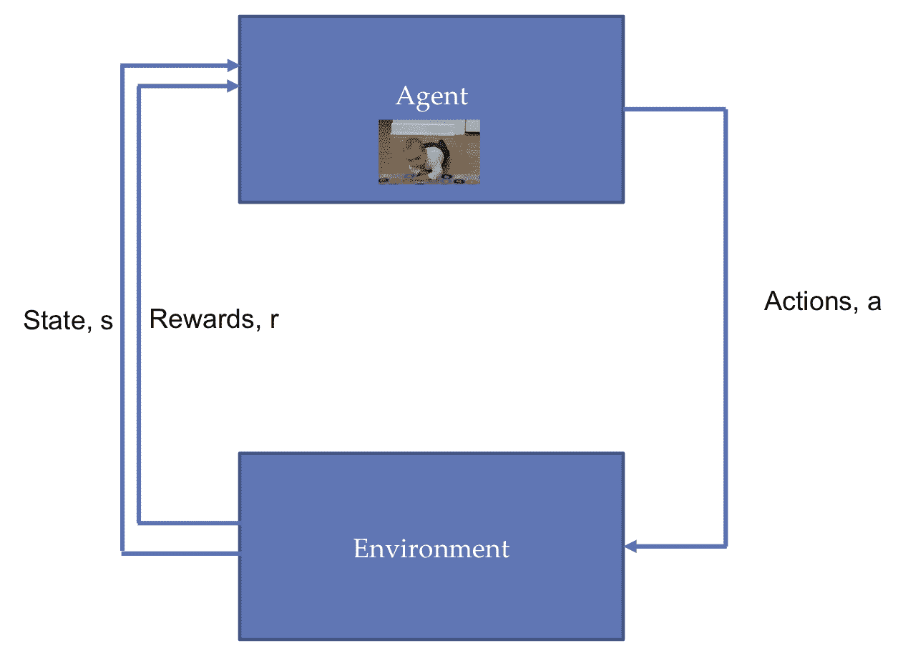

主体与环境的相互作用

与监督学习不同，**代理**没有给出任何例子。**代理**不知道正确的动作是什么。与无监督学习不同，代理的目标不是在输入中找到一些固有的结构(学习可能会找到一些结构，但这不是目标)；相反，它的目标是回报最大化(长期而言)。


# RL 术语

在学习不同的算法之前，让我们习惯于 RL 术语。为了便于说明，让我们考虑两个例子:一个智能体在迷宫中寻找路线，一个智能体驾驶一辆**无人驾驶汽车** ( **SDC** )。下图说明了这两种情况:


两个示例 RL 场景

在继续之前，让我们先熟悉一下常见的 RL 术语:

*   状态:状态可以被认为是一组记号(或表示),可以定义环境可能处于的所有状态。该状态可以是连续的或离散的。例如，在智能体通过迷宫寻找路径的情况下，状态可以用一个 4 × 4 的数组来表示，用 **0** 表示一个空块， **1** 表示被智能体占据的块， **X** 表示不能被占据的状态；这里的州本质上是分散的。对于驾驶方向盘的代理人来说，状态就是 SDC 前面的视图。图像包含连续的有值像素。
*   **动作 *a* ( *s* )** :动作是代理在特定状态下可以做的所有可能的事情的集合。可能动作的集合， ***a*** ，取决于当前状态， ***s*** 。动作可能会也可能不会导致状态的改变。它们可以是离散的或连续的。迷宫中的智能体可以执行五个离散的动作**【上升**，**下降**，**向左**，**向右**，**无变化】**。另一方面，SDC 代理可以在连续的角度范围内转动方向盘。
*   **奖励 *r(s，a，s'* )** :是 agent 选择一个动作时环境返回的标量值。它定义了目标；如果行动使其接近目标，代理人将获得较高的奖励，否则将获得较低的(甚至是负的)奖励。我们如何定义奖励完全取决于我们自己——在迷宫的情况下，我们可以将奖励定义为代理当前位置和目标之间的欧几里得距离。SDC 代理奖励可以是汽车在路上(正奖励)或不在路上(负奖励)。
*   **Policy π( *s* )** :它定义了每个状态和在该状态下要采取的动作之间的映射。策略可以是确定性的，也就是说，对于每个状态都有一个定义明确的策略。类似于迷宫代理，策略可以是如果顶部块是空的，则向上移动。策略也可以是随机的——也就是说，根据某种概率采取行动。它可以被实现为简单的查找表，或者它可以是依赖于当前状态的函数。策略是 RL 代理的核心。在本章中，我们将学习帮助代理学习策略的不同算法。
*   **价值函数 *V* ( *s* )** :定义了一个状态在长期内的美好程度。它可以被认为是从状态 ***s*** 开始，代理可以期望在未来累积的报酬总额。你可以把它看作是长期的好处，而不是奖励的即时好处。你认为报酬最大化和价值函数最大化哪个更重要？是的，你猜对了:就像在国际象棋中，我们有时会在几步之后失去一个棋子来赢得比赛，因此代理人应该试图最大化价值函数。价值函数通常有两种考虑方式:
    *   **价值函数*V*^π(*s*)**:是遵循政策 *π* 的国家善。数学上，在状态 *s* 时，它是遵循该政策的预期累积回报， *π* :


*   **价值-状态函数(或*Q*-函数)*Q*^π(*s*， *a* )** :是一个国家 *s* 的善，采取行动 *a* ，此后遵循政策 *π* 。数学上，我们可以说对于一个状态-行动对( *s* ， *a* )，它是在状态 *s* 采取行动 *a* 然后遵循政策 *π* 的预期累积报酬:

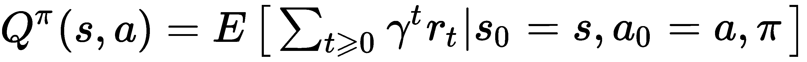

γ是折扣系数，它的值决定了我们给予即时奖励相对于以后获得的奖励的重要性。贴现因子的高值决定了一个代理人能看到多远的未来。在许多成功的 RL 算法中， *γ* 的理想选择是 *0.97* 。

*   **环境模型**:可选元素。它模仿环境的行为，它包含了环境的物理学；换句话说，它定义了环境的行为方式。环境的模型由到下一个状态的转移概率来定义。

一个 RL 问题在数学上被公式化为一个**马尔可夫决策过程** ( **MDP** )，它遵循马尔可夫性质——即*当前状态完全表示了世界的状态*。


# 深度强化学习

基于它们迭代/近似的内容，RL 算法可以分为两类:

*   **基于价值的方法**:在这些方法中，算法采取最大化价值函数的行动。这里的代理学习预测一个给定的状态或行为会有多好。因此，这里的目标是找到最佳值。基于价值的方法的一个例子是 Q-learning。例如，考虑我们在迷宫中的 RL 代理:假设每个状态的值是从那个盒子到达目标所需的步数的负数，那么，在每个时间步，代理将选择将它带到具有最佳值的状态的动作，如下图所示。因此，从值 **-6** 开始，它将移动到 **-5** 、 **-4** 、 **-3** 、 **-2** 、 **-1** ，最终到达值为 **0** 的目标:


迷宫世界与每个盒子的价值

*   **基于策略的方法**:在这些方法中，算法预测最大化价值函数的最佳策略。目的是找到最佳策略。基于策略的方法的一个例子是策略梯度。这里，我们近似策略函数，它允许我们将每个状态映射到最佳的对应动作。

我们可以使用神经网络作为函数逼近器来获得策略或价值的近似值。当我们使用深度神经网络作为政策近似器或价值近似器时，我们称之为**深度强化学习** ( **DRL** )。在最近的过去，DRL 已经取得了非常成功的成果，因此，在这一章中，我们将把重点放在 DRL。


# 一些成功的应用

在过去的几年里，RL 已经成功地应用于各种任务，尤其是游戏和机器人。在学习 RL 的算法之前，让我们先了解一些 RL 的成功案例:

*   **AlphaGo Zero** :由谷歌的 DeepMind 团队开发，AlphaGo Zero *在没有任何人类知识的情况下掌握围棋*，从绝对空白的石板开始( **tabula rasa** )。AlphaGo Zero 使用一个神经网络来近似移动概率和值。该神经网络将原板表示作为输入。它使用由神经网络引导的蒙特卡罗树搜索来选择移动。强化学习算法在训练循环中加入了前瞻搜索。它使用 40 个块的残余 CNN 训练了 40 天，在训练过程中，它玩了大约 2900 万场游戏(这是一个很大的数字！).神经网络在 Google Cloud 上使用 TensorFlow 进行了优化，有 64 个 GPU 工作器和 19 个 CPU 参数服务器。你可以在这里查阅论文:[https://www.nature.com/articles/nature24270](https://www.nature.com/articles/nature24270)。
*   **AI 控制的滑翔机**:微软开发了一个控制器系统，可以在 Pixhawk、Raspberry Pi 3 等许多不同的自动驾驶硬件平台上运行。它可以在不使用发动机的情况下，通过自动寻找和捕捉自然产生的热气流来保持滑翔机在空中飞行。控制器帮助滑翔机自己操作；它探测并利用热气流在没有发动机或人的帮助下行进。他们将它实现为部分可观测的 MDP。他们采用贝叶斯强化学习，并使用蒙特卡罗树搜索来搜索最佳行动。他们将整个系统划分为级别规划器——一个高级规划器根据经验做出决定，一个低级规划器使用贝叶斯强化学习来实时检测和锁定热量。在微软新闻可以看到滑翔机在行动:[https://News . Microsoft . com/features/science-mimics-nature-Microsoft-researchers-test-ai-controlled-sowing-machine/](https://news.microsoft.com/features/science-mimics-nature-microsoft-researchers-test-ai-controlled-soaring-machine/)。
*   **运动行为**:在论文*丰富环境中运动行为的出现*([https://arxiv.org/pdf/1707.02286.pdf](https://arxiv.org/pdf/1707.02286.pdf))中，DeepMind 的研究人员为智能体提供了丰富多样的环境。这些环境提出了一系列不同难度的挑战。代理在增加订单时遇到困难；这导致代理学习复杂的运动技能，而不执行任何奖励工程。


# 模拟环境

由于 RL 涉及试错，所以首先在模拟环境中训练我们的 RL 代理是有意义的。虽然存在大量可用于创建环境的应用程序，但一些流行的应用程序包括:

*   **OpenAI gym** :它包含了一系列我们可以用来训练 RL 代理的环境。在这一章中，我们将使用 OpenAI gym 界面。
*   **Unity ML-Agents SDK** :它允许开发人员将使用 Unity 编辑器创建的游戏和模拟转换到可以通过简单易用的 Python API 使用 DRL、进化策略或其他机器学习方法训练智能代理的环境中。它与 TensorFlow 一起工作，并提供为二维/三维和 VR/AR 游戏训练智能代理的能力。你可以在这里了解更多:[https://github.com/Unity-Technologies/ml-agents](https://github.com/Unity-Technologies/ml-agents)。
*   **Gazebo** :在 Gazebo 中，我们可以用基于物理的模拟来构建三维世界。Gazebo 连同**机器人操作系统** ( **ROS)** 和 OpenAI gym 界面都是 gym-gazebo，可以用来训练 RL 特工。想了解更多，可以参考白皮书:[http://erlerobotics.com/whitepaper/robot_gym.pdf](http://erlerobotics.com/whitepaper/robot_gym.pdf)。
*   **Blender** **学习环境**:是 Blender 游戏引擎的 Python 接口，也可以在 OpenAI gym 上工作。它有它的基本搅拌器。这是一个免费的三维建模软件，集成了游戏引擎，提供了一套简单易用、功能强大的游戏工具。它提供了 Blender 游戏引擎的接口，游戏本身是在 Blender 中设计的。然后，我们可以创建定制的虚拟环境，在特定问题上培训 RL 代理([https://github.com/LouisFoucard/gym-blender](https://github.com/LouisFoucard/gym-blender))。


# 奥鹏健身馆

OpenAI gym 是一个开发和比较 RL 算法的开源工具包。它包含各种模拟环境，可用于训练代理和开发新的 RL 算法。首先，你必须安装`gym`。对于 Python 3.5+，可以使用`pip`安装`gym`:

```
pip install gym
```

OpenAI gym 支持各种环境，从简单的基于文本到三维。最新版本中支持的环境可以分为以下几组:

*   **算法**:它包含执行计算的环境，比如加法。虽然我们可以很容易地在计算机上执行计算，但作为 RL 问题，这些问题的有趣之处在于代理完全通过示例来学习这些任务。
*   雅达利:这个环境提供了各种各样的经典雅达利/街机游戏。
*   **Box2D** :包含二维的机器人任务，比如赛车代理或者双足机器人行走。
*   **经典控制**:这包含了经典的控制理论问题，比如平衡一根推车杆子。
*   MuJoCo :这是专有的(可以获得一个月的免费试用)。它支持各种机器人模拟任务。该环境包括一个物理引擎，因此，它用于训练机器人任务。
*   机器人:这个环境也使用了 MuJoCo 的物理引擎。它模拟了取物机器人和阴影手机器人基于目标的任务。
*   玩具文本:这是一个简单的基于文本的环境——非常适合初学者。

要获得这些组下的环境的完整列表，你可以访问:[https://gym.openai.com/envs/#atari](https://gym.openai.com/envs/#atari)。OpenAI 界面最好的部分是所有的环境都可以用相同的最小界面访问。要获得安装中所有可用环境的列表，可以使用以下代码:

```
from gym import envs
print(envs.registry.all())
```

这将提供所有已安装环境的列表以及它们的环境 ID，这是一个字符串。也可以在`gym`注册表中添加您自己的环境。为了创建一个环境，我们使用`make`命令，并将环境名作为一个字符串传递。例如，使用 Pong 环境创建一个游戏，我们需要的字符串将是`Pong-v0`。`make`命令创建环境，`reset`命令用于激活环境。`reset`命令将环境返回到初始状态。状态表示为一个数组:

```
import gym
env = gym.make('Pong-v0')
obs = env.reset()
env.render()
```

`Pong-v0`的状态空间由一个大小为 210×160×3 的数组给出，它实际上代表了 Pong 游戏的原始像素值。另一方面，如果你创建一个 **Go9×9-v0** 环境，状态由一个 3×9×9 数组定义。我们可以使用`render`命令来可视化环境。下图显示了 **Pong-v0** 和 **Go9x9-v0** 环境在初始状态下的渲染环境:。


Pong-v0 和 Go9x9-v0 的渲染环境

`render`命令弹出一个窗口。如果你想内联显示环境，那么你可以使用 Matplotlib 内联并将`render`命令改为`plt.imshow(env.render(mode='rgb_array'))`。这将在 Jupyter 笔记本中显示环境。

环境包含了`action_space`变量，它决定了环境中可能的动作。我们可以使用`sample()`功能选择一个随机动作。使用`step`功能，所选择的动作可以影响环境。`step`功能对环境执行选定的动作；它返回更改后的状态、奖励、一个通知游戏是否结束的布尔值，以及一些对调试有用的环境信息，但在使用 RL 代理时不会用到。下面的代码显示了一个 Pong 游戏，代理玩随机移动。我们将每个时间步的状态存储在一个数组`frames`中，这样我们以后就可以看到游戏了:

```
frames = [] # array to store state space at each step
for _ in range(300):
    frames.append(env.render(mode='rgb_array'))
    obs,reward,done, _ = env.render(env.action_space.sample())
    if done:
        break
```

借助 Matplotlib 和 IPython 中的动画功能，这些帧可以在 Jupyter 笔记本中显示为连续播放的 GIF 样式的图像:

```
import matplotlib.animation as animation
from JSAnimation.Ipython_display import display_animation
from IPython.display import display

patch = plt.imshow(frames[0])
plt.axis('off')

def animate(i)
    patch.set_data(frames[i])

anim = animation.FuncAnimation(plt.gcf(), animate, \
        frames=len(frames), interval=100)

display(display_animation(anim, default_mode='loop')
```

通常，为了训练一个代理，我们需要大量的步骤，所以在每一步存储状态空间是不可行的。在前面的算法中，我们可以选择在每 500 步(或者你希望的任何其他数字)之后存储。相反，我们可以使用 OpenAI 健身房包装器将游戏保存为视频。为此，我们需要首先导入包装器，然后创建环境，最后使用 Monitor。默认情况下，它会存储 1、8、27、64 等等的视频，然后每 1000^集一次(完美立方体的集号)；默认情况下，每个培训都保存在一个文件夹中。执行此操作的代码如下:

```
import gym
from gym import wrappers
env = gym.make('Pong-v0')
env = wrappers.Monitor(env, '/save-mov', force=True)
# Follow it with the code above where env is rendered and agent
# selects a random action

```

如果你想在下一次训练中使用相同的文件夹，你可以在`Monitor`方法调用中选择`force=True`选项。最后，我们应该使用`close`函数关闭环境:

```
env.close()
```

前面的代码可以在 GitHub 的[第六章](01e534ff-b0a2-4b5e-bc9a-fd65c527ac7d.xhtml)、*物联网强化学习、*文件夹下的`OpenAI_practice.ipynb` Jupyter 笔记本中找到。


# q 学习

1989 年，沃特金斯在他的博士论文《从延迟回报中学习》中提出了 Q 学习的概念。Q-learning 的目标是学习一个最优的行动选择策略。给定一个特定的状态， *s* ，并采取一个特定的动作， *a* ，Q-learning 试图学习状态 *s* 的值。在其最简单的版本中，Q-learning 可以在查找表的帮助下实现。我们为环境中可能的每个状态(行)和动作(列)维护一个值表。该算法试图学习该值，即在给定状态下采取特定行动有多好。

我们首先将 Q 表中的所有条目初始化为*0*；这确保了所有状态的统一(因此机会均等)值。稍后，我们观察通过采取特定行动获得的回报，并基于这些回报，我们更新 Q 表。借助于下面给出的**贝尔曼方程**，动态地执行 Q 值的更新:

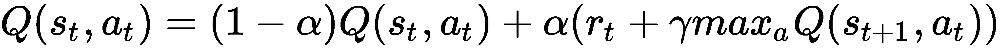

这里， *α* 是学习率。这显示了基本的 Q 学习算法:


简单 Q 学习算法

如果你有兴趣，你可以在这里阅读 240 页的沃特金斯博士论文:[http://www.cs.rhul.ac.uk/~chrisw/new_thesis.pdf](http://www.cs.rhul.ac.uk/~chrisw/new_thesis.pdf)。

在学习结束时，我们会有一个很好的 Q 表，包含最优策略。这里一个重要的问题是:我们如何选择第二步的行动？有两种选择；首先，我们随机选择动作。这允许我们的代理以相等的概率探索所有可能的动作，但是同时忽略它已经学习的信息。第二种方法是我们选择价值最大的行动；最初，所有的动作都有相同的 Q 值，但是，正如代理将了解到的，一些动作将获得高值，而其他的将获得低值。在这种情况下，代理正在利用它已经学到的知识。那么，探索和剥削哪个更好呢？这被称为**勘探-开采权衡**。解决这个问题的一个自然方法是依靠代理所学的知识，但同时有时只是探索。这是通过使用**ε贪婪算法**实现的。基本思想是代理以概率 *ε* 随机选择动作，以概率 *1-ε* 利用前几集学习到的信息。该算法在大多数情况下( *1-ε* )会选择最佳选项(贪婪)，但有时( *ε* )会随机选择。现在让我们尝试在一个简单的问题中实现我们所学的内容。


# 使用 Q 表的出租车落客

简单的 Q-learning 算法包括维护一个大小为 *m* × *n* 的表，其中 *m* 是状态的总数，而 *n* 是可能动作的总数。因此，我们从玩具文本组中选择一个问题，因为它们的`state`空间和`action`空间很小。为了便于说明，我们选择了`Taxi-v2`环境。我们代理人的目标是在一个地点选择乘客，在另一个地点让他们下车。代理人每成功下车一次，将获得 *+20* 点，每走一步，将失去 *1* 点。非法上下车还会被扣 10 分。状态空间有由 **|** 表示的墙壁和四个位置标记，分别为 **R** 、 **G** 、 **Y** 和 **B** 。出租车用方框表示:上下车位置可以是这四个位置标记中的任何一个。上车点是蓝色的，下车点是紫色的。`Taxi-v2`环境有一个大小为 *500* 的状态空间和大小为 *6* 的动作空间，用 *500×6=3000* 条目制作一个 Q 表:


出租车落客环境

在出租车下车环境中，出租车由黄色方框表示。位置标记 R 是上车位置，G 是下车位置:

1.  我们首先导入必要的模块并创建我们的环境。因为，在这里，我们只需要做一个查找表，使用 TensorFlow 就没有必要了。如前所述，`Taxi-v2`环境有 *500 个*可能状态和 *6 个*可能动作:

```
import gym
import numpy as np
env = gym.make('Taxi-v2')
obs = env.reset()
env.render()
```

2.  我们用全零初始化大小为( *300×6* )的 Q 表，并定义超参数: *γ* ，折扣因子，和 *α* ，学习率。我们还设置了最大集数的值(一集意味着从重置到完成= `True`的一次完整运行)以及代理在一集中将学习的最大步数:

```
m = env.observation_space.n # size of the state space
n = env.action_space.n # size of action space
print("The Q-table will have {} rows and {} columns, resulting in \
     total {} entries".format(m,n,m*n))

# Intialize the Q-table and hyperparameters
Q = np.zeros([m,n])
gamma = 0.97
max_episode = 1000
max_steps = 100
alpha = 0.7
epsilon = 0.3
```

3.  现在，对于每一集，我们选择具有最高价值的动作，执行该动作，并使用贝尔曼方程基于收到的奖励和未来状态更新 Q 表:

```
for i in range(max_episode):
    # Start with new environment
    s = env.reset()
    done = False
    for _ in range(max_steps):
        # Choose an action based on epsilon greedy algorithm
        p = np.random.rand()
        if p > epsilon or (not np.any(Q[s,:])):
            a = env.action_space.sample() #explore
        else:
            a = np.argmax(Q[s,:]) # exploit
        s_new, r, done, _ = env.step(a) 
        # Update Q-table
        Q[s,a] = (1-alpha)*Q[s,a] + alpha*(r + gamma*np.max(Q[s_new,:]))
        #print(Q[s,a],r)
        s = s_new
        if done:
            break
```

4.  现在让我们看看有学问的代理是如何工作的:

```
s = env.reset()
done = False
env.render()
# Test the learned Agent
for i in range(max_steps):
 a = np.argmax(Q[s,:])
 s, _, done, _ = env.step(a)
 env.render()
 if done:
 break 
```

下图显示了特定示例中的代理行为。空车显示为黄色方框，载有乘客的车厢显示为绿色方框。您可以看到，在给定的情况下，代理分 11 个步骤接送乘客，并标记了所需位置( **B** )和目的地( **R** ):


代理使用已学习的 Q 表接送乘客

很酷，对吧？完整的代码可以在 GitHub 的`Taxi_drop-off.ipynb`文件中找到。


# q 网络

简单的 Q-learning 算法包括维护一个大小为 *m* × *n* 的表，其中 *m* 是状态的总数，而 *n* 是可能动作的总数。这意味着我们不能把它用于大的状态空间和动作空间。另一种方法是用神经网络代替该表，作为函数逼近器，逼近每个可能动作的 Q 函数。在这种情况下，神经网络的权重存储 Q 表信息(它们将给定状态与相应的动作及其 Q 值相匹配)。当我们用来逼近 Q 函数的神经网络是深度神经网络时，我们称之为**深度 Q 网络** ( **DQN** )。

神经网络将状态作为其输入，并计算所有可能动作的 Q 值。


# 使用 Q-Network 的出租车接送服务

如果我们考虑前面的*滑行下降*的例子，我们的神经网络将由 *500 个*输入神经元(由 *1×500 个*单热向量表示的状态)和 *6 个*输出神经元组成，每个神经元表示给定状态的特定动作的 Q 值。这里，神经网络将近似每个动作的 Q 值。因此，应该训练网络，使得它的近似 Q 值和目标 Q 值相同。从贝尔曼方程获得的目标 Q 值如下:

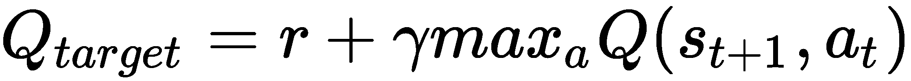

我们训练神经网络，使得目标 *Q* 和预测 *Q* 之间的差的平方误差最小化——也就是说，神经网络最小化以下损失函数:


目的是学习未知 Q [目标]功能。使用反向传播来更新`QNetwork`的权重，以使这种损失最小化。我们用神经网络`QNetwork`来逼近 Q 值。这是一个非常简单的单层神经网络，方法是提供动作和它们的 Q 值(`get_action`)，训练网络(`learnQ`，并获得预测的 Q 值(`Qnew`):

```
class QNetwork:
    def __init__(self,m,n,alpha):
        self.s = tf.placeholder(shape=[1,m], dtype=tf.float32)
        W = tf.Variable(tf.random_normal([m,n], stddev=2))
        bias = tf.Variable(tf.random_normal([1, n]))
        self.Q = tf.matmul(self.s,W) + bias
        self.a = tf.argmax(self.Q,1)

        self.Q_hat = tf.placeholder(shape=[1,n],dtype=tf.float32)
        loss = tf.reduce_sum(tf.square(self.Q_hat-self.Q))
        optimizer = tf.train.GradientDescentOptimizer(learning_rate=alpha)
        self.train = optimizer.minimize(loss)
        init = tf.global_variables_initializer()

        self.sess = tf.Session()
        self.sess.run(init)

    def get_action(self,s):
        return self.sess.run([self.a,self.Q], feed_dict={self.s:s})

    def learnQ(self,s,Q_hat):
        self.sess.run(self.train, feed_dict= {self.s:s, self.Q_hat:Q_hat})

    def Qnew(self,s):
        return self.sess.run(self.Q, feed_dict={self.s:s})

```

我们现在将这个神经网络合并到我们之前的代码中，在那里我们为*出租车下车*问题训练了一个 RL 代理。我们需要做一些改变。首先，在这种情况下，OpenAI step 和 reset 函数返回的状态只是 state 的数字标识，因此我们需要将其转换为一个 hot vector。此外，取代 Q 表更新，我们现在将从`QNetwork`获得新的 Q 预测，找到目标 Q，并训练网络以最小化损失。代码如下:

```
QNN = QNetwork(m,n, alpha)
rewards = []
for i in range(max_episode):
 # Start with new environment
 s = env.reset()
 S = np.identity(m)[s:s+1]
 done = False
 counter = 0
 rtot = 0
 for _ in range(max_steps):
 # Choose an action using epsilon greedy policy
 a, Q_hat = QNN.get_action(S) 
 p = np.random.rand()
 if p > epsilon:
 a[0] = env.action_space.sample() #explore

 s_new, r, done, _ = env.step(a[0])
 rtot += r
 # Update Q-table
 S_new = np.identity(m)[s_new:s_new+1]
 Q_new = QNN.Qnew(S_new) 
 maxQ = np.max(Q_new)
 Q_hat[0,a[0]] = r + gamma*maxQ
 QNN.learnQ(S,Q_hat)
 S = S_new
 #print(Q_hat[0,a[0]],r)
 if done:
 break
 rewards.append(rtot)
print ("Total reward per episode is: " + str(sum(rewards)/max_episode))
```

这应该做得很好，但正如你所见，即使在为*1000*集进行培训后，网络仍有很高的负面回报，如果你检查网络的性能，它似乎只是采取随机步骤。是的，我们的网络什么都没学到；性能比 Q 表差。这也可以从培训时的奖励图中得到验证——理想情况下，奖励应该随着代理的学习而增加，但这里没有发生这种情况；奖励的增加和减少就像在均值附近随机游走一样(这个程序的完整代码在 GitHub 的`Taxi_drop-off_NN.ipynb`文件中):

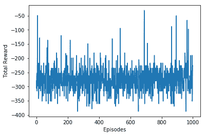

代理学习时获得的每集总奖励

发生了什么事？为什么神经网络学习失败，我们能让它变得更好吗？

考虑这样一个场景，当出租车应该去西边取车，代理人随机选择了西边；代理获得奖励，网络将了解到，在当前状态下(由一个热点向量表示)，向西是有利的。接下来，考虑与此类似的另一个状态(相关状态空间):代理再次让西方移动，但这一次它导致负奖励，所以现在代理将忘记它之前学到的东西。因此，相似的状态动作但不同的目标混淆了学习过程。这叫做**灾难性遗忘**。问题出现在这里，因为连续的状态是高度相关的，所以，如果代理按顺序学习(就像这里一样)，这个高度相关的输入状态空间不会让代理学习。

我们能打破呈现给网络的输入之间的相关性吗？是的，我们可以:我们可以构建一个**重放缓冲区**，在那里我们首先存储每个状态，它对应的动作，以及连续的奖励和结果状态(状态，动作，奖励，新状态)。在这种情况下，动作是完全随机选择的，从而确保了大范围的动作和结果状态。重放缓冲区最终将由这些元组的一个大列表组成( *S* 、 *A* 、 *R* 、 *S'* )。接下来，我们用这些元组随机地(而不是顺序地)呈现网络；这种随机性将破坏连续输入状态之间的相关性。这叫做**体验回放**。它不仅解决了输入状态空间中的相关性问题，还允许我们不止一次地从相同的元组中学习，回忆罕见的事件，并且通常更好地利用经验。在某种程度上，您可以说，通过使用重放缓冲区，我们减少了监督学习的问题(重放缓冲区作为输入输出数据集)，其中输入的随机采样确保了网络能够泛化。

我们方法的另一个问题是，我们正在立即更新目标 Q。这也可能导致有害的相关性。请记住，在 Q 学习中，我们试图将 *Q [目标]* 与当前预测的 *Q* 之间的差异降至最低。这种差异被称为**时间差异** ( **TD** )错误(因此 Q 学习是一种 **TD 学习**)。目前，我们会立即更新我们的 *Q [目标]* ，因此目标和我们正在改变的参数之间存在相关性(权重通过 *Q [pred]* )。这几乎就像追逐一个移动的目标，因此不会给出一个广义的方向。我们可以通过使用**固定的 Q 目标**来解决这个问题，即使用两个网络，一个用于预测 *Q* ，另一个用于目标 *Q* 。就体系结构而言，两者完全相同，预测 Q 网络在每一步都会改变权重，但是目标 Q 网络的权重会在一些固定的学习步骤后更新。这提供了一个更稳定的学习环境。

最后，我们再做一个小改变:现在我们的ε在整个学习过程中有一个固定的值。但是，在现实生活中，情况并非如此。最初，当我们一无所知时，我们探索了很多，但是，随着我们变得熟悉，我们倾向于走学习的道路。在我们的ε-贪婪算法中也可以这样做，在网络学习每一集时改变ε的值，使ε随时间减少。

有了这些小窍门，让我们现在造一个 DQN 来玩雅达利游戏。

Equipped with these tricks, let's now build a DQN to play an Atari game.

DQN 玩一个雅达利游戏


# 我们将在这里学习的 DQN 是基于 DeepMind 的一篇论文([https://web . Stanford . edu/class/psych 209/Readings/mnihetalhassbis 15 naturecontroldeprl . pdf](https://web.stanford.edu/class/psych209/Readings/MnihEtAlHassibis15NatureControlDeepRL.pdf))。DQN 的核心是一个深度卷积神经网络，它将游戏环境的原始像素作为输入(就像任何人类玩家都会看到的)，一次捕获一个屏幕，并作为输出返回每个可能动作的值。具有最大值的操作是所选的操作:

第一步是获取我们需要的所有模块:

1.  我们从 OpenAI Atari 游戏列表中选择了突破游戏——您可以尝试其他 Atari 游戏的代码；您可能需要做的唯一改变是预处理步骤。Breakout 的输入空间——我们的输入空间——由 210×160 个像素组成，每个像素有 128 种可能的颜色。这是一个非常大的输入空间。为了降低复杂度，我们将在图像中选择一个感兴趣的区域，将其转换为灰度，并将其大小调整为 *80×80* 大小的图像。我们使用`preprocess`功能来完成:

```

import gym
import sys
import random
import numpy as np
import tensorflow as tf
import matplotlib.pyplot as plt
from datetime import datetime
from scipy.misc import imresize
```

2.  下面的截图显示了预处理前后的环境:

```
def preprocess(img):
    img_temp = img[31:195] # Choose the important area of the image
    img_temp = img_temp.mean(axis=2) # Convert to Grayscale#
    # Downsample image using nearest neighbour interpolation
    img_temp = imresize(img_temp, size=(IM_SIZE, IM_SIZE), interp='nearest')
    return img_temp
```

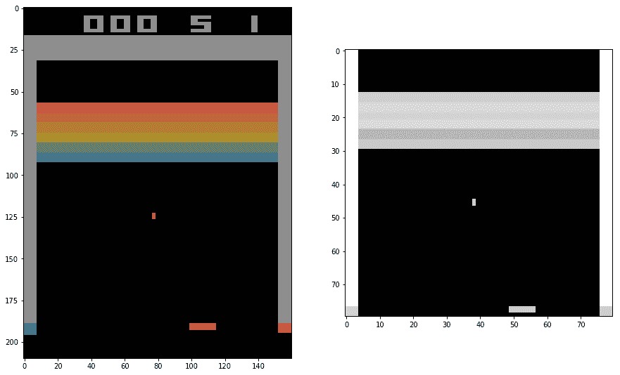

原始环境，大小 210× 160(彩色图像)，处理环境，大小 80×80(灰度)

正如你从上图中所看到的，不可能判断出球是落下还是上升。为了处理这个问题，我们将四个连续的状态(由于四个唯一的动作)合并为一个输入。我们定义了一个函数`update_state`，它将当前环境观察值附加到先前的状态数组中:

3.  As you can see from the preceding diagram, it isn't possible to tell whether the ball is coming down or going up. To deal with this problem, we combine four consecutive states (due to four unique actions) as one input. We define a function, `update_state`, that appends the current environment observation to the previous state array:

```
def update_state(state, obs):
    obs_small = preprocess(obs)
    return np.append(state[1:], np.expand_dims(obs_small, 0), axis=0)
```

该函数将处理后的新状态追加到分片状态，确保网络的最终输入由四个帧组成。在下面的截图中，您可以看到连续的四帧。这是对我们的 DQN 的投入:


输入到 DQN 的四个连续游戏状态(帧)

我们创建了一个 DQN，我们在 DQN 类中定义了它；它由三个卷积层组成，最后一个卷积层的输出是平坦的，然后是两个完全连接的层。与前一种情况一样，网络试图最小化 *Q [目标]和 *Q [预测]之间的差异。在代码中，我们使用 RMSProp 优化器，但是您可以使用其他优化器:**

4.  我们将在以下步骤中讨论该类所需的必要方法:

```
def __init__(self, K, scope, save_path= 'models/atari.ckpt'):
    self.K = K
    self.scope = scope
    self.save_path = save_path
    with tf.variable_scope(scope):
        # inputs and targets
        self.X = tf.placeholder(tf.float32, shape=(None, 4, IM_SIZE, IM_SIZE), name='X')
        # tensorflow convolution needs the order to be:
        # (num_samples, height, width, "color")
        # so we need to tranpose later
        self.Q_target = tf.placeholder(tf.float32, shape=(None,), name='G')
        self.actions = tf.placeholder(tf.int32, shape=(None,), name='actions')
        # calculate output and cost
        # convolutional layers
        Z = self.X / 255.0
        Z = tf.transpose(Z, [0, 2, 3, 1])
        cnn1 = tf.contrib.layers.conv2d(Z, 32, 8, 4, activation_fn=tf.nn.relu)
        cnn2 = tf.contrib.layers.conv2d(cnn1, 64, 4, 2, activation_fn=tf.nn.relu)
        cnn3 = tf.contrib.layers.conv2d(cnn2, 64, 3, 1, activation_fn=tf.nn.relu)
        # fully connected layers
        fc0 = tf.contrib.layers.flatten(cnn3)
        fc1 = tf.contrib.layers.fully_connected(fc0, 512)
        # final output layer
        self.predict_op = tf.contrib.layers.fully_connected(fc1, K)
        Qpredicted = tf.reduce_sum(self.predict_op * tf.one_hot(self.actions, K),
     reduction_indices=[1])
        self.cost = tf.reduce_mean(tf.square(self.Q_target - Qpredicted))
        self.train_op = tf.train.RMSPropOptimizer(0.00025, 0.99, 0.0, 1e-6).minimize(self.cost)
```

我们添加了一个方法来返回预测的 Q 值:

5.  我们需要一种方法来确定具有最大值的动作。在这个方法中，我们还实现了ε-greedy 策略，并且ε的值在主代码中被改变:

```
def predict(self, states):
    return self.session.run(self.predict_op, feed_dict={self.X: states})
```

6.  我们需要一种方法来更新网络的权重，以最小化损失。该函数可以定义如下:

```
def sample_action(self, x, eps):
    """Implements epsilon greedy algorithm"""
    if np.random.random() < eps:
        return np.random.choice(self.K)
    else:
        return np.argmax(self.predict([x])[0])
```

7.  We need a method to update the weights of the network so as to minimize the loss. The function can be defined as follows:

```
 def update(self, states, actions, targets):
     c, _ = self.session.run(
         [self.cost, self.train_op],
         feed_dict={
         self.X: states,
         self.Q_target: targets,
         self.actions: actions
         })
     return c
```

将模型权重复制到固定 Q 网络:

8.  除了这些方法，我们还需要一些帮助函数来保存学习过的网络，加载保存的网络，并设置 TensorFlow 会话:

```
def copy_from(self, other):
    mine = [t for t in tf.trainable_variables() if t.name.startswith(self.scope)]
    mine = sorted(mine, key=lambda v: v.name)
    theirs = [t for t in tf.trainable_variables() if t.name.startswith(other.scope)]
    theirs = sorted(theirs, key=lambda v: v.name)
    ops = []
    for p, q in zip(mine, theirs):
        actual = self.session.run(q)
        op = p.assign(actual)
        ops.append(op)
    self.session.run(ops)
```

9.  Besides these methods, we need some helper functions to save the learned network, load the saved network, and set the TensorFlow session:

```
def load(self):
    self.saver = tf.train.Saver(tf.global_variables())
    load_was_success = True
    try:
        save_dir = '/'.join(self.save_path.split('/')[:-1])
        ckpt = tf.train.get_checkpoint_state(save_dir)
        load_path = ckpt.model_checkpoint_path
        self.saver.restore(self.session, load_path)
    except:
        print("no saved model to load. starting new session")
        load_was_success = False
    else:
        print("loaded model: {}".format(load_path))
        saver = tf.train.Saver(tf.global_variables())
        episode_number = int(load_path.split('-')[-1])

def save(self, n):
    self.saver.save(self.session, self.save_path, global_step=n)
    print("SAVED MODEL #{}".format(n))

def set_session(self, session):
    self.session = session
    self.session.run(tf.global_variables_initializer())
    self.saver = tf.train.Saver()
```

为了实现 DQN 算法，我们使用了一个`learn`函数；它从体验重放缓冲器中选取随机样本，并使用来自目标 Q 网络的目标 Q 来更新 Q 网络:

10.  好了，所有的成分都准备好了，现在让我们决定 DQN 的超参数，并创建我们的环境:

```
def learn(model, target_model, experience_replay_buffer, gamma, batch_size):
    # Sample experiences
    samples = random.sample(experience_replay_buffer, batch_size)
    states, actions, rewards, next_states, dones = map(np.array, zip(*samples))
    # Calculate targets
     next_Qs = target_model.predict(next_states)
     next_Q = np.amax(next_Qs, axis=1)
     targets = rewards +     np.invert(dones).astype(np.float32) * gamma * next_Q
    # Update model
     loss = model.update(states, actions, targets)
     return loss
```

11.  Well, all of the ingredients are ready, so let's now decide the hyperparameters for our DQN and create our environment:

```
# Some Global parameters
MAX_EXPERIENCES = 500000
MIN_EXPERIENCES = 50000
TARGET_UPDATE_PERIOD = 10000
IM_SIZE = 80
K = 4 # env.action_space.n

# hyperparameters etc
gamma = 0.97
batch_sz = 64
num_episodes = 2700
total_t = 0
experience_replay_buffer = []
episode_rewards = np.zeros(num_episodes)
last_100_avgs = []
# epsilon for Epsilon Greedy Algorithm
epsilon = 1.0
epsilon_min = 0.1
epsilon_change = (epsilon - epsilon_min) / 700000

# Create Atari Environment
env = gym.envs.make("Breakout-v0")

# Create original and target Networks
model = DQN(K=K, scope="model")
target_model = DQN(K=K, scope="target_model")
```

最后，下面是调用的代码，然后填充经验重放缓冲区，一步一步地玩游戏，并在每一步和每四步后的`target_model`训练模型网络:

12.  我们可以看到，现在奖励随着剧集的增加而增加，到最后平均奖励为 **20** ，虽然它可以更高，但我们只学习了几千集，甚至我们的重播缓冲区的大小也在(50，000 到 5，000，000)之间:

```
with tf.Session() as sess:
    model.set_session(sess)
    target_model.set_session(sess)
    sess.run(tf.global_variables_initializer())
    model.load()
    print("Filling experience replay buffer...")
    obs = env.reset()
    obs_small = preprocess(obs)
    state = np.stack([obs_small] * 4, axis=0)
    # Fill experience replay buffer
    for i in range(MIN_EXPERIENCES):
        action = np.random.randint(0,K)
        obs, reward, done, _ = env.step(action)
        next_state = update_state(state, obs)
        experience_replay_buffer.append((state, action, reward, next_state, done))
        if done:
            obs = env.reset()
            obs_small = preprocess(obs)
            state = np.stack([obs_small] * 4, axis=0)
        else:
            state = next_state
        # Play a number of episodes and learn
        for i in range(num_episodes):
            t0 = datetime.now()
            # Reset the environment
            obs = env.reset()
            obs_small = preprocess(obs)
            state = np.stack([obs_small] * 4, axis=0)
            assert (state.shape == (4, 80, 80))
            loss = None
            total_time_training = 0
            num_steps_in_episode = 0
            episode_reward = 0
            done = False
            while not done:
                # Update target network
                if total_t % TARGET_UPDATE_PERIOD == 0:
                    target_model.copy_from(model)
                    print("Copied model parameters to target network. total_t = %s, period = %s" % (total_t, TARGET_UPDATE_PERIOD))
                # Take action
                action = model.sample_action(state, epsilon)
                obs, reward, done, _ = env.step(action)
                obs_small = preprocess(obs)
                next_state = np.append(state[1:], np.expand_dims(obs_small, 0), axis=0)
                episode_reward += reward
                # Remove oldest experience if replay buffer is full
                if len(experience_replay_buffer) == MAX_EXPERIENCES:
                    experience_replay_buffer.pop(0)
                    # Save the recent experience
                    experience_replay_buffer.append((state, action, reward, next_state, done))

                # Train the model and keep measure of time
                t0_2 = datetime.now()
                loss = learn(model, target_model, experience_replay_buffer, gamma, batch_sz)
                dt = datetime.now() - t0_2
                total_time_training += dt.total_seconds()
                num_steps_in_episode += 1
                state = next_state
                total_t += 1
                epsilon = max(epsilon - epsilon_change, epsilon_min)
                duration = datetime.now() - t0
                episode_rewards[i] = episode_reward
                time_per_step = total_time_training / num_steps_in_episode
                last_100_avg = episode_rewards[max(0, i - 100):i + 1].mean()
                last_100_avgs.append(last_100_avg)
                print("Episode:", i,"Duration:", duration, "Num steps:", num_steps_in_episode, "Reward:", episode_reward, "Training time per step:", "%.3f" % time_per_step, "Avg Reward (Last 100):", "%.3f" % last_100_avg,"Epsilon:", "%.3f" % epsilon)
                if i % 50 == 0:
                    model.save(i)
                sys.stdout.flush()

#Plots
plt.plot(last_100_avgs)
plt.xlabel('episodes')
plt.ylabel('Average Rewards')
plt.show()
env.close()
```

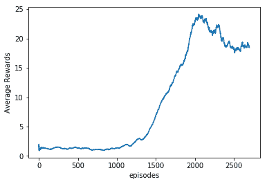

代理学习时的平均奖励

来看看我们的经纪人是怎么玩的，学了 2700 集左右:

13.  你可以在这里看到这位资深特工的视频:[https://www.youtube.com/watch?v=rPy-3NodgCE](https://www.youtube.com/watch?v=rPy-3NodgCE)。

```
env = gym.envs.make("Breakout-v0")
frames = []
with tf.Session() as sess:
    model.set_session(sess)
    target_model.set_session(sess)
    sess.run(tf.global_variables_initializer())
    model.load()
    obs = env.reset()
    obs_small = preprocess(obs)
    state = np.stack([obs_small] * 4, axis=0)
    done = False
    while not done:
        action = model.sample_action(state, epsilon)
        obs, reward, done, _ = env.step(action)
        frames.append(env.render(mode='rgb_array'))
        next_state = update_state(state, obs)
        state = next_state
```

很酷，对吧？在没有告诉它任何事情的情况下，它在仅仅 2700 集之后就学会了玩一个像样的游戏。

有些东西可以帮助你更好地训练代理:

由于训练需要大量的时间，除非你有很强的计算资源，否则最好保存模型，然后重新启动保存的模型。

*   在代码中，我们使用了`Breakout-v0`和 OpenAI gym，在这种情况下，在连续的(随机选择的`1`、`2`、`3`或`4`)帧环境中重复相同的步骤。你可以改为选择`BreakoutDeterministic-v4`，DeepMind 团队用的那个；这里，对恰好四个连续帧重复这些步骤。因此，代理在每四帧后看到并选择动作。
*   双 DQN


# 现在，回想一下，我们使用一个 max 操作符来选择一个操作和评估一个操作。这可能会导致对某个可能并不理想的动作的估值过高。我们可以通过将选择与评估分离来解决这个问题。对于双 DQN，我们有两个不同权重的 Q 网络；两者都通过随机经验来学习，但是一个用于使用ε-贪婪策略来确定动作，另一个用于确定其值(因此，计算目标 Q)。

为了更清楚，让我们先看看 DQN 的情况。选择具有最大 Q 值的动作；设 *W* 为 DQN 的重量，那么我们做的如下:

上标 *W* 表示用于近似 Q 值的权重。在双 DQN 中，等式变为如下:

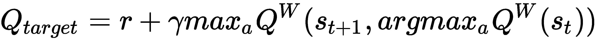

请注意变化:现在使用 Q-网络以权重 *W* 选择动作，并使用 Q-网络以权重*W’预测最大 Q 值。*这减少了高估，有助于我们更快速、更可靠地训练代理。可以在这里访问*双 Q 学习深度强化学习*论文:[https://www . aaai . org/OCS/index . PHP/AAAI/aaai 16/paper/download/12389/11847](https://www.aaai.org/ocs/index.php/AAAI/AAAI16/paper/download/12389/11847)。

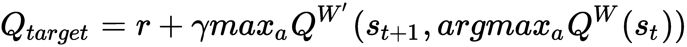

决斗 DQN


# 决斗 DQN 将 Q 函数分解成价值函数和优势函数。价值函数与前面讨论的相同；它代表了独立于行动的国家的价值。另一方面，优势函数提供了在状态 *s:* 下动作 *a* 的效用(优势/良好性)的相对度量

在决斗 DQN 中，相同的卷积用于提取特征，但在后期阶段，它被分成两个独立的网络，一个提供价值，另一个提供优势。稍后，使用聚集层来重新组合这两个阶段，以估计 Q 值。这确保了网络为价值函数和优势函数产生单独的估计。这种价值和优势脱钩背后的直觉是，对许多州来说，没有必要估计每个行动选择的价值。例如，在汽车比赛中，如果前面没有车，则不需要左转或右转的动作，因此不需要估计给定状态下这些动作的值。这允许它学习哪些状态是有价值的，而不必确定每个状态的每个动作的效果。


在聚合层，价值和优势被组合起来，使得从给定的 *Q* 中唯一地恢复 *V* 和 *A* 成为可能。这是通过强制优势函数估计器在所选动作上具有零优势来实现的:

这里， *θ* 是公共卷积特征提取器的参数， *α* 和 *β* 是优势和值估计器网络的参数。决斗 DQN 也是由谷歌的 DeepMind 团队提出的。你可以在*arXiv*:[https://arxiv.org/abs/1511.06581](https://arxiv.org/abs/1511.06581)阅读全文。作者发现，用平均算子改变前面的`max`算子增加了网络的稳定性。在这种情况下，优势的变化速度和均值一样快。因此，在他们的结果中，他们使用了以下给出的骨料层:


下面的截图显示了决斗 DQN 的基本架构:


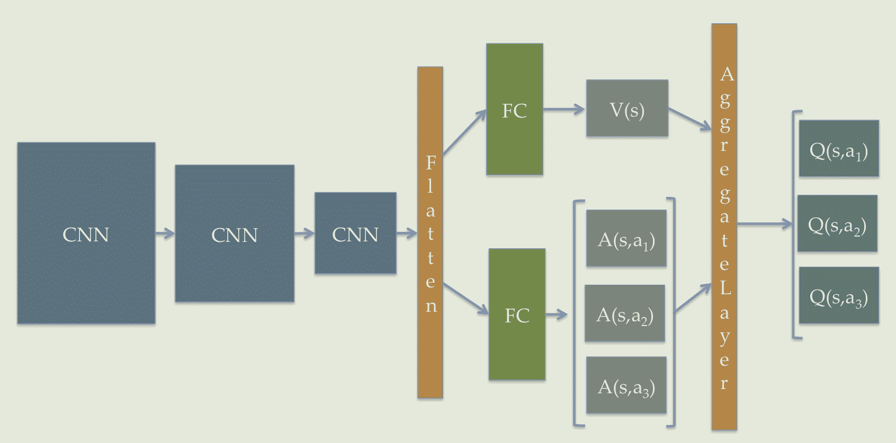

决斗 DQN 的基本架构

政策梯度


# 在基于 Q 学习的方法中，我们在估计值/Q 函数之后生成策略。在基于策略的方法中，例如策略梯度，我们直接近似策略。

如前所述，在这里，我们使用神经网络来近似策略。在最简单的形式中，神经网络通过使用最陡梯度上升调整其权重来学习选择最大化回报的行动的策略，因此被称为策略梯度。

在策略梯度中，策略由神经网络表示，其输入是状态的表示，其输出是动作选择概率。这个网络的权重是我们需要学习的政策参数。自然的问题出现了:我们应该如何更新这个网络的权重？因为我们的目标是最大化回报，所以我们的网络试图最大化每集的预期回报是有意义的:

这里我们采取了一个参数化的随机策略 *π—* 即策略决定了选择一个动作 *a* 给定状态 *s* 的概率，神经网络参数为 *θ* 。代表一集所有奖励的总和。然后使用梯度上升更新网络参数:


这里， *η* 是学习率。使用策略梯度定理，我们得到以下结果:


因此，我们可以使用损失函数作为 log-loss(预期行为和预测行为分别作为标签和 logits ),而不是最大化预期回报，并使用折扣奖励作为权重来训练网络。为了更加稳定，已经发现添加基线有助于方差减少。基线最常见的形式是折扣奖励的总和，结果如下:

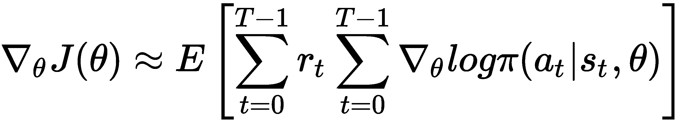

基线*b*(*s[t]*)如下:

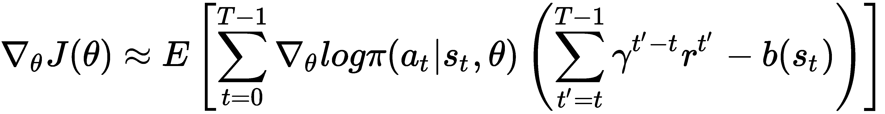

这里， *γ* 是贴现因子。

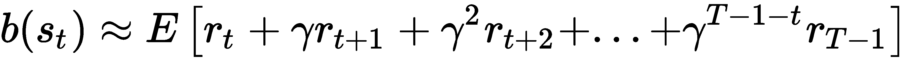

为什么是政策梯度？


# 嗯，首先，策略梯度和其他基于策略的方法一样，直接估计最优策略，不需要存储任何额外的数据(经验重放缓冲)。因此，实现起来很简单。其次，我们可以训练它学习真正的随机政策。最后，它非常适合持续的行动空间。

使用策略梯度的 Pong


# 让我们试着用政策梯度来玩一局乒乓。http://karpathy.github.io/2016/05/31/rl/[的 Andrej Karpathy 博客文章启发了这里的实现。回想一下，在*突围*中，我们使用了堆叠在一起的四个游戏帧作为输入，以便代理知道游戏动态；这里，我们使用两个连续游戏帧之间的差作为网络的输入。因此，我们的代理拥有关于当前状态和先前状态的信息:](http://karpathy.github.io/2016/05/31/rl/)

一如既往，第一步是导入必要的模块。我们为环境导入 TensorFlow、Numpy、Matplotlib 和`gym`:

1.  我们建立我们的神经网络`PolicyNetwork`；它将游戏的状态作为输入，并输出动作选择概率。在这里，我们建立了一个简单的两层感知器，没有偏见。`weights`使用`Xavier`初始化随机初始化。隐藏层使用`ReLU`激活函数，输出层使用`softmax`激活函数。我们使用稍后定义的`tf_discount_rewards`方法来计算基线。最后，我们使用 TensorFlow `tf.losses.log_loss`和计算出的行动概率作为预测，选择一个热门行动向量作为标签，用方差修正的折扣奖励作为权重:

```
import numpy as np
import gym
import matplotlib.pyplot as plt
import tensorflow as tf
from gym import wrappers
%matplotlib inline
```

该类有计算动作概率(`tf_policy_forward`和`predict_UP`)、使用`tf_discount_rewards`计算基线、更新网络权重(`update`)以及最后设置会话(`set_session`)的方法，然后加载并保存模型:

现在`PolicyNetwork`做好了，我们给游戏状态做一个`preprocess`函数；我们不会处理完整的 210×160 状态空间，而是将其简化为 80×80 的二进制状态空间，最后将其展平:

2.  让我们定义一些变量，我们需要这些变量来保持状态、标签、奖励和行动空间大小。我们初始化游戏状态并实例化策略网络:

```
class PolicyNetwork(object):
    def __init__(self, N_SIZE, h=200, gamma=0.99, eta=1e-3, decay=0.99, save_path = 'models1/pong.ckpt' ):
        self.gamma = gamma
        self.save_path = save_path
        # Placeholders for passing state....
        self.tf_x = tf.placeholder(dtype=tf.float32, shape=[None, N_SIZE * N_SIZE], name="tf_x")
        self.tf_y = tf.placeholder(dtype=tf.float32, shape=[None, n_actions], name="tf_y")
        self.tf_epr = tf.placeholder(dtype=tf.float32, shape=[None, 1], name="tf_epr")

        # Weights
        xavier_l1 = tf.truncated_normal_initializer(mean=0, stddev=1\. / N_SIZE, dtype=tf.float32)
        self.W1 = tf.get_variable("W1", [N_SIZE * N_SIZE, h], initializer=xavier_l1)
        xavier_l2 = tf.truncated_normal_initializer(mean=0, stddev=1\. / np.sqrt(h), dtype=tf.float32)
        self.W2 = tf.get_variable("W2", [h, n_actions], initializer=xavier_l2)

        #Build Computation
        # tf reward processing (need tf_discounted_epr for policy gradient wizardry)
        tf_discounted_epr = self.tf_discount_rewards(self.tf_epr)
        tf_mean, tf_variance = tf.nn.moments(tf_discounted_epr, [0], shift=None, name="reward_moments")
        tf_discounted_epr -= tf_mean
        tf_discounted_epr /= tf.sqrt(tf_variance + 1e-6)

        #Define Optimizer, compute and apply gradients
        self.tf_aprob = self.tf_policy_forward(self.tf_x)
        loss = tf.losses.log_loss(labels = self.tf_y,
        predictions = self.tf_aprob,
        weights = tf_discounted_epr)
        optimizer = tf.train.AdamOptimizer()
        self.train_op = optimizer.minimize(loss)
```

3.  现在我们开始策略梯度算法。对于每一集，代理首先玩游戏，存储状态、奖励和选择的动作。一旦游戏结束，它就使用所有存储的数据来训练自己(就像在监督学习中一样)。你想要多少集就重复这个过程:

```
def set_session(self, session):
    self.session = session
    self.session.run(tf.global_variables_initializer())
    self.saver = tf.train.Saver()

def tf_discount_rewards(self, tf_r): # tf_r ~ [game_steps,1]
    discount_f = lambda a, v: a * self.gamma + v;
    tf_r_reverse = tf.scan(discount_f, tf.reverse(tf_r, [0]))
    tf_discounted_r = tf.reverse(tf_r_reverse, [0])
    return tf_discounted_r

def tf_policy_forward(self, x): #x ~ [1,D]
    h = tf.matmul(x, self.W1)
    h = tf.nn.relu(h)
    logp = tf.matmul(h, self.W2)
    p = tf.nn.softmax(logp)
    return p

def update(self, feed):
    return self.session.run(self.train_op, feed)

def load(self):
    self.saver = tf.train.Saver(tf.global_variables())
    load_was_success = True 
    try:
        save_dir = '/'.join(self.save_path.split('/')[:-1])
        ckpt = tf.train.get_checkpoint_state(save_dir)
        load_path = ckpt.model_checkpoint_path
        print(load_path)
        self.saver.restore(self.session, load_path)
    except:
        print("no saved model to load. starting new session")
        load_was_success = False
    else:
        print("loaded model: {}".format(load_path))
        saver = tf.train.Saver(tf.global_variables())
        episode_number = int(load_path.split('-')[-1])

def save(self):
    self.saver.save(self.session, self.save_path, global_step=n)
    print("SAVED MODEL #{}".format(n))

def predict_UP(self,x):
    feed = {self.tf_x: np.reshape(x, (1, -1))}
    aprob = self.session.run(self.tf_aprob, feed);
    return aprob
```

4.  经过 7500 集的训练，它开始赢得一些比赛。在 1200 集之后，胜率有所提高，50%的胜率都在上升。在 20，000 集之后，经纪人赢得了大多数比赛。完整的代码可以在 GitHub 的`Policy gradients.ipynb`文件中找到。而且你可以在这里看到经纪人学了两万集后玩的游戏:[https://youtu.be/hZo7kAco8is](https://youtu.be/hZo7kAco8is)。注意，这个代理学会了围绕它的位置振荡；它还学会了将运动产生的力量传递给球，并学会了只有通过进攻才能击败对方球员。

```
# downsampling
def preprocess(I):
    """ 
    prepro 210x160x3 uint8 frame into 6400 (80x80) 1D float vector 
    """
    I = I[35:195] # crop
    I = I[::2,::2,0] # downsample by factor of 2
    I[I == 144] = 0 # erase background (background type 1)
    I[I == 109] = 0 # erase background (background type 2)
    I[I != 0] = 1 # everything else (paddles, ball) just set to 1
    return I.astype(np.float).ravel()
```

5.  Let's define some variables that we'll require to hold state, labels, rewards, and action space size. We initialize the game state and instantiate the policy network:

```
# Create Game Environment
env_name = "Pong-v0"
env = gym.make(env_name)
env = wrappers.Monitor(env, '/tmp/pong', force=True)
n_actions = env.action_space.n # Number of possible actions
# Initializing Game and State(t-1), action, reward, state(t)
states, rewards, labels = [], [], []
obs = env.reset()
prev_state = None

running_reward = None
running_rewards = []
reward_sum = 0
n = 0
done = False
n_size = 80
num_episodes = 2500

#Create Agent
agent = PolicyNetwork(n_size)
```

6.  演员-评论家算法

```
with tf.Session() as sess:
    agent.set_session(sess)
    sess.run(tf.global_variables_initializer())
    agent.load()
    # training loop
    done = False
    while not done and n< num_episodes:
        # Preprocess the observation
        cur_state = preprocess(obs)
        diff_state = cur_state - prev_state if prev_state isn't None else np.zeros(n_size*n_size)
        prev_state = cur_state

        #Predict the action
        aprob = agent.predict_UP(diff_state) ; aprob = aprob[0,:]
        action = np.random.choice(n_actions, p=aprob)
        #print(action)
        label = np.zeros_like(aprob) ; label[action] = 1

        # Step the environment and get new measurements
        obs, reward, done, info = env.step(action)
        env.render()
        reward_sum += reward

        # record game history
        states.append(diff_state) ; labels.append(label) ; rewards.append(reward)

        if done:
            # update running reward
            running_reward = reward_sum if running_reward is None else         running_reward * 0.99 + reward_sum * 0.01    
            running_rewards.append(running_reward)
            #print(np.vstack(rs).shape)
            feed = {agent.tf_x: np.vstack(states), agent.tf_epr: np.vstack(rewards), agent.tf_y: np.vstack(labels)}
            agent.update(feed)
            # print progress console
            if n % 10 == 0:
                print ('ep {}: reward: {}, mean reward: {:3f}'.format(n, reward_sum, running_reward))
            else:
                print ('\tep {}: reward: {}'.format(n, reward_sum))

            # Start next episode and save model
            states, rewards, labels = [], [], []
            obs = env.reset()
            n += 1 # the Next Episode

            reward_sum = 0
            if n % 50 == 0:
                agent.save()
            done = False

plt.plot(running_rewards)
plt.xlabel('episodes')
plt.ylabel('Running Averge')
plt.show()
env.close()
```

7.  在政策梯度方法中，我们引入了基线来减少差异，但是行动和基线(仔细观察:差异是预期的回报总和，或者换句话说，状态或其价值函数的良好程度)仍然在同时变化。把政策评价和价值评价分开不是更好吗？这就是演员-评论家方法背后的思想。它由两个神经网络组成，一个逼近策略，称为**行动者网络**，另一个逼近值，称为**批评者网络**。我们在政策评估和政策改进步骤之间交替进行，从而获得更稳定的学习。批评家使用状态和动作值来估计一个值函数，该值函数然后被用于更新行动者的策略网络参数，使得整体性能提高。下图显示了演员-评论家网络的基本架构:


# 演员-评论家建筑

In the policy gradient method, we introduced the baseline to reduce variance, but still, both action and baseline (look closely: the variance is the expected sum of rewards, or in other words, the goodness of the state or its value function) were changing simultaneously. Wouldn't it be better to separate the policy evaluation from the value evaluation? That's the idea behind the actor-critic method. It consists of two neural networks, one approximating the policy, called the **actor-network**, and the other approximating the value, called the **critic-network**. We alternate between a policy evaluation and a policy improvement step, resulting in more stable learning. The critic uses the state and action values to estimate a value function, which is then used to update the actor's policy network parameters so that the overall performance improves. The following diagram shows the basic architecture of the actor-critic network:


摘要

在这一章中，我们学习了 RL 以及它与监督学习和非监督学习的区别。本章的重点是 DRL，深度神经网络用于逼近政策函数或价值函数，甚至两者。本章介绍了 OpenAI gym，这是一个提供大量训练 RL 代理的环境的库。我们学习了基于价值的方法，比如 Q-learning，并用它来训练一个代理在出租车上接送乘客。我们还用一个 DQN 来训练一个代理玩雅达利游戏。本章接着介绍了基于政策的方法，特别是政策梯度。我们讨论了策略梯度背后的直觉，并使用该算法训练一个 RL 代理来玩 Pong。

在下一章，我们将探索生成模型，并了解生成对抗网络背后的秘密。


# Summary

In this chapter, we learned about RL and how it's different from supervised and unsupervised learning. The emphasis of this chapter was on DRL, where deep neural networks are used to approximate the policy function or the value function or even both. This chapter introduced OpenAI gym, a library that provides a large number of environments to train RL agents. We learned about the value-based methods such as Q-learning and used it to train an agent to pick up and drop passengers off in a taxi. We also used a DQN to train an agent to play a Atari game . This chapter then moved on to policy-based methods, specifically policy gradients. We covered the intuition behind policy gradients and used the algorithm to train an RL agent to play Pong.

In the next chapter, we'll explore generative models and learn the secrets behind generative adversarial networks.