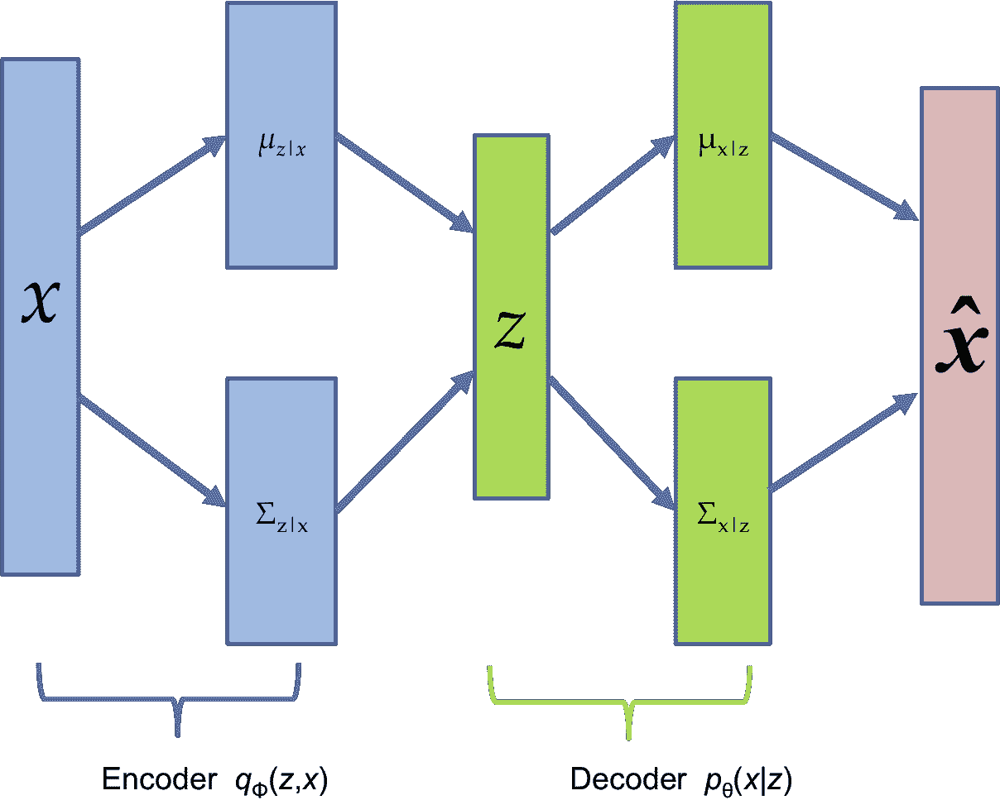
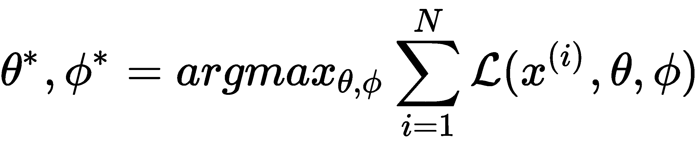
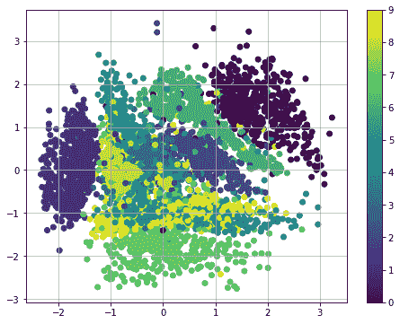
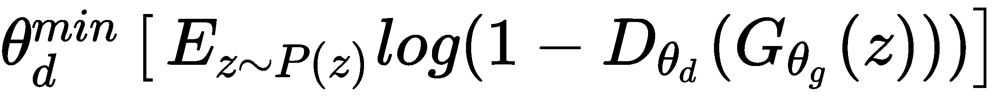
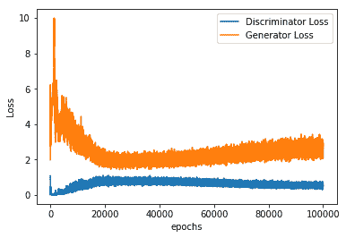
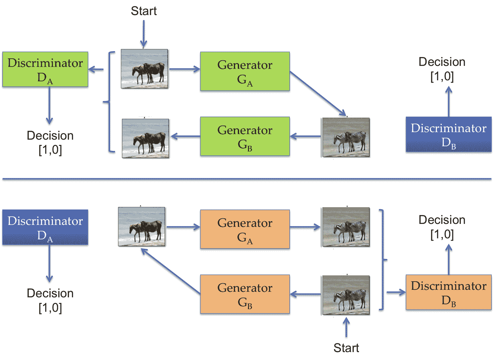
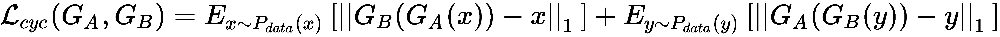

# 七、物联网生成模型

**机器学习**(**ML**)**人工智能** ( **AI** )几乎触及了所有与人类相关的领域。农业、音乐、健康、国防——你不会发现任何一个领域没有人工智能的痕迹。AI/ML 的巨大成功，除了计算能力的存在，还依赖于大量数据的产生。生成的大部分数据是未标记的，因此理解数据的内在分布是一项重要的 ML 任务。正是在这里，生成模型进入了画面。

在过去的几年中，深度生成模型在理解数据分布方面取得了巨大的成功，并被用于各种应用中。最流行的两种生成模型是**变分自编码器** ( **VAEs** )和**生成对抗网络** ( **GANs** )。

在这一章中，我们将学习 VAEs 和 GANs，并使用它们来生成图像。阅读完本章后，您将了解以下内容:

*   了解生成网络和区别网络之间的区别
*   了解 VAEs
*   了解 GANs 的直观功能
*   实现一个普通的 GAN 并使用它来生成手写数字
*   了解 GAN 最流行的变体，深度卷积 GAN
*   深度卷积 GAN 在 TensorFlow 中的实现及其在人脸生成中的应用
*   了解 GANs 的进一步修改和应用


# 介绍

生成模型是深度学习模型的一个令人兴奋的新分支，它通过无监督学习进行学习。主要思想是生成与给定训练数据具有相同分布的新样本；例如，对手写数字进行训练的网络可以创建不在数据集中但与之相似的新数字。形式上，我们可以说，如果训练数据遵循分布 *P* [数据] ( *x* )，那么生成模型的目标就是估计概率密度函数 *P* [模型] ( *x* )，类似于 *P* [数据] ( *x* )。

生成模型可分为两种类型:

*   **显式生成模型**:这里明确定义并求解概率密度函数*P*模型 ( *x* )。密度函数可能是易处理的，如在 PixelRNN/CNN 的情况下，或者是密度函数的近似，如在 VAE 的情况下。
*   **隐式生成模型**:在这些模型中，网络学习从 *P* [模型] ( *x* )中生成一个样本，而无需显式定义它。gan 是这种类型的生成模型的一个例子。

在这一章中，我们将探讨，一个显式生成模型，和甘，一个隐式生成模型。生成模型有助于生成真实的样本，并且可以用于执行超分辨率、彩色化等等。有了时间序列数据，我们甚至可以用它们来进行模拟和规划。最后但同样重要的是，它们还可以帮助我们理解数据的潜在表示。


# 使用 VAEs 生成图像

从[第四章](cb9d27c5-e98d-44b6-a947-691b0bc64766.xhtml)、*IOT 深度学习*，你应该熟悉自编码器及其功能。VAEs 是一种自编码器；在这里，我们保留了(被训练的)**解码器**部分，可以通过馈入随机潜在特征 **z** 来使用它生成与训练数据相似的数据。现在，如果你记得，在自编码器中，**编码器**产生低维特征， **z** :


自编码器的体系结构

VAEs 涉及从潜在特征 *z* 中找到似然函数 *p* ( *x* ):


这是一个难以处理的密度函数，不可能直接优化它；相反，我们通过使用简单的高斯先验 *p* ( *z* )并使**编码器**和**解码器**网络概率化来获得一个下界:



VAE 的建筑

这允许我们定义对数似然性的易处理的下限，由下式给出:


在上文中， *θ* 表示解码器网络参数，而 *φ* 表示编码器网络参数。通过最大化该下限来训练网络:



下限中的第一项负责输入数据的重建，第二项用于使近似后验分布接近先验。一旦经过训练，编码器网络就作为识别或推理网络工作，而解码器网络则作为生成器。

详细推导可以参考 Diederik P Kingma 和 Max Welling 在 2014 年 https://arxiv.org/abs/1312.6114 ICLR([)发表的论文*自编码变分贝叶斯*。](https://arxiv.org/abs/1312.6114)


# TensorFlow中的值

现在让我们看看 VAE 的行动。在这个示例代码中，我们将使用标准的 MNIST 数据集，并训练 VAE 生成手写数字。由于 MNIST 数据集很简单，编码器和解码器网络将只包括完全连接的层；这将使我们能够专注于 VAE 的建筑。如果您计划生成复杂的图像(如 CIFAR-10)，您需要将编码器和解码器网络修改为卷积和去卷积网络:

1.  与前面的所有情况一样，第一步是导入所有必需的模块。这里，我们将使用 TensorFlow 更高的 API，`tf.contrib`，来制作完全连接的层。请注意，这使我们免去了为每一层单独声明权重和偏差的麻烦:

```
import numpy as np
import tensorflow as tf

import matplotlib.pyplot as plt
%matplotlib inline

from tensorflow.contrib.layers import fully_connected
```

2.  我们阅读数据。TensorFlow 教程中提供了 MNIST 数据集，因此我们将直接从那里获取:

```
# Load MNIST data in a format suited for tensorflow.
from tensorflow.examples.tutorials.mnist import input_data
mnist = input_data.read_data_sets('MNIST_data', one_hot=True)
n_samples = mnist.train.num_examples
n_input = mnist.train.images[0].shape[0]
```

3.  我们定义了`VariationalAutoencoder`类；这个类是核心代码。它包含定义编码器和解码器网络的方法。编码器生成潜在特征 *z* 的均值和方差分别为`z_mu`和`z_sigma`。使用这些，一个样品`Z`被采取。潜在特征 *z* 然后被传递到解码器网络以生成`x_hat`。网络使用 Adam 优化器最小化重建损失和潜在损失的总和。该课程还定义了重建、生成、转换(到潜在空间)和训练单个步骤的方法:

```
class VariationalAutoencoder(object):
    def __init__(self,n_input, n_z,
        learning_rate=0.001, batch_size=100):
        self.batch_size = batch_size
        self.n_input = n_input
        self.n_z = n_z

        # Place holder for the input 
        self.x = tf.placeholder(tf.float32, shape = [None, n_input])

        # Use Encoder Network to determine mean and 
        # (log) variance of Gaussian distribution in the latent space
        self.z_mean, self.z_log_sigma_sq = self._encoder_network()
        # Draw a sample z from Gaussian distribution
        eps = tf.random_normal((self.batch_size, n_z), 0, 1, dtype=tf.float32)
        # z = mu + sigma*epsilon
        self.z = tf.add(self.z_mean,tf.multiply(tf.sqrt(tf.exp(self.z_log_sigma_sq)), eps))
        # Use Decoder network to determine mean of
        # Bernoulli distribution of reconstructed input
        self.x_hat = self._decoder_network()

        # Define loss function based variational upper-bound and 
        # corresponding optimizer
        # define generation loss
        reconstruction_loss = \
            -tf.reduce_sum(self.x * tf.log(1e-10 + self.x_hat)
            + (1-self.x) * tf.log(1e-10 + 1 - self.x_hat), 1)
        self.reconstruction_loss = tf.reduce_mean(reconstruction_loss)

        latent_loss = -0.5 * tf.reduce_sum(1 + self.z_log_sigma_sq 
            - tf.square(self.z_mean)- tf.exp(self.z_log_sigma_sq), 1)
        self.latent_loss = tf.reduce_mean(latent_loss)
        self.cost = tf.reduce_mean(reconstruction_loss + latent_loss) 
        # average over batch
        # Define the optimizer
        self.optimizer = tf.train.AdamOptimizer(learning_rate).minimize(self.cost)

        # Initializing the tensor flow variables
        init = tf.global_variables_initializer()
        # Launch the session
        self.sess = tf.InteractiveSession()
        self.sess.run(init)

    # Create encoder network
    def _encoder_network(self):
        # Generate probabilistic encoder (inference network), which
        # maps inputs onto a normal distribution in latent space.
        layer_1 = fully_connected(self.x,500,activation_fn=tf.nn.softplus) 
        layer_2 = fully_connected(layer_1, 500, activation_fn=tf.nn.softplus) 
        z_mean = fully_connected(layer_2,self.n_z, activation_fn=None)
        z_log_sigma_sq = fully_connected(layer_2, self.n_z, activation_fn=None)
        return (z_mean, z_log_sigma_sq)

    # Create decoder network
    def _decoder_network(self):
        # Generate probabilistic decoder (generator network), which
        # maps points in the latent space onto a Bernoulli distribution in the data space.
        layer_1 = fully_connected(self.z,500,activation_fn=tf.nn.softplus) 
        layer_2 = fully_connected(layer_1, 500, activation_fn=tf.nn.softplus) 
        x_hat = fully_connected(layer_2, self.n_input, activation_fn=tf.nn.sigmoid)

        return x_hat

    def single_step_train(self, X):
        _,cost,recon_loss,latent_loss = self.sess.run([self.optimizer,         self.cost,self.reconstruction_loss,self.latent_loss],feed_dict={self.x: X})
        return cost, recon_loss, latent_loss

    def transform(self, X):
        """Transform data by mapping it into the latent space."""
        # Note: This maps to mean of distribution, we could alternatively
        # sample from Gaussian distribution
        return self.sess.run(self.z_mean, feed_dict={self.x: X})

    def generate(self, z_mu=None):
        """ Generate data by sampling from latent space.

        If z_mu isn't None, data for this point in latent space is
        generated. Otherwise, z_mu is drawn from prior in latent 
        space. 
        """
        if z_mu is None:
            z_mu = np.random.normal(size=n_z)
            # Note: This maps to mean of distribution, we could alternatively    
            # sample from Gaussian distribution
        return self.sess.run(self.x_hat,feed_dict={self.z: z_mu})

    def reconstruct(self, X):
        """ Use VAE to reconstruct given data. """
        return self.sess.run(self.x_hat, feed_dict={self.x: X})
```

4.  所有的材料都准备好了，让我们来训练我们的 VAE。我们在`train`功能的帮助下做到这一点:

```
def train(n_input,n_z, learning_rate=0.001,
    batch_size=100, training_epochs=10, display_step=5):
    vae = VariationalAutoencoder(n_input,n_z, 
        learning_rate=learning_rate, 
        batch_size=batch_size)
    # Training cycle
    for epoch in range(training_epochs):
        avg_cost, avg_r_loss, avg_l_loss = 0., 0., 0.
        total_batch = int(n_samples / batch_size)
        # Loop over all batches
        for i in range(total_batch):
            batch_xs, _ = mnist.train.next_batch(batch_size)
            # Fit training using batch data
            cost,r_loss, l_loss = vae.single_step_train(batch_xs)
            # Compute average loss
            avg_cost += cost / n_samples * batch_size
            avg_r_loss += r_loss / n_samples * batch_size
            avg_l_loss += l_loss / n_samples * batch_size
        # Display logs per epoch step
        if epoch % display_step == 0:
            print("Epoch: {:4d} cost={:.4f} Reconstruction loss = {:.4f} Latent Loss = {:.4f}".format(epoch,avg_cost,avg_r_loss,avg_l_loss))
     return vae
```

5.  在下面的屏幕截图中，您可以看到潜在空间大小为 10 的 VAE 的重建数字(左)和生成的手写数字(右):


6.  如前所述，编码器网络降低了输入空间的维度。为了更清楚，我们把潜在空间的维数降低到 2。在下面的内容中，您可以看到每个标签在二维 z 空间中是分开的:



7.  从具有 2 维潜在空间的 VAE 重建和生成的数字如下:


从前面的截图(右)中值得注意的有趣的事情是，改变二维 *z* 的值如何导致不同的笔画和不同的数字。完整的代码在 GitHub 的`Chapter 07`中，在名为`VariationalAutoEncoders_MNIST.ipynb`的文件中:

```
tf.contrib.layers.fully_connected(
    inputs,
    num_outputs,
    activation_fn=tf.nn.relu,
    normalizer_fn=None,
    normalizer_params=None,
    weights_initializer=intializers.xavier_intializer(),
    weights_regularizer= None, 
    biases_initializer=tf.zeros_intializer(),
    biases_regularizer=None,
    reuse=None,
    variables_collections=None,
    outputs_collections=None,
    trainable=True,
    scope=None
)
```

层(contrib)是 TensorFlow 中包含的更高级别的包。它提供了构建神经网络层、正则化、摘要等操作。在前面的代码中，我们使用了在[tensor flow/contrib/layers/python/layers/layers . py](https://www.github.com/tensorflow/tensorflow/blob/r1.10/tensorflow/contrib/layers/python/layers/layers.py)中定义的`tf.contrib.layers.fully_connected()`操作，它添加了一个完全连接的层。默认情况下，它创建代表全连接互连矩阵的权重，默认情况下使用 Xavier 初始化进行初始化。它还会产生初始化为零的偏差。它还提供了选择标准化和激活函数的选项。


# 甘斯

gan 是隐式生成网络。在 Quora 的一次会议上，脸书大学人工智能研究主任、NYU 大学教授 Yann LeCun 将 GANs 描述为过去 10 年中最有趣的想法。目前，GANs 正在进行大量的研究。过去几年召开的主要人工智能/人工智能会议报告了大多数与 GANs 相关的论文。

gan 是由 Ian J. Goodfellow 和 Yoshua Bengio 在 2014 年*的论文*([https://arxiv.org/abs/1406.2661](https://arxiv.org/abs/1406.2661))中提出的。他们受到双人游戏场景的启发。就像游戏中的两个玩家一样，在 GANs 中，两个网络——一个叫做**区别网络**，另一个叫做**生成网络**——相互竞争。生成网络试图生成类似于输入数据的数据，鉴别器网络必须识别它看到的数据是真的还是假的(即由生成器生成)。每当鉴别器发现真实输入和虚假数据的分布之间存在差异时，生成器就会调整其权重以减小差异。总之，判别网络试图学习伪造和真实数据之间的边界，而生成网络试图学习训练数据的分布。当训练结束时，生成器学习产生与输入数据分布完全一样的图像，并且鉴别器不再能够区分两者。GAN 的一般架构如下:


甘斯建筑

Architecture of GANs

现在让我们深入研究甘人是如何学习的。鉴别器和生成器轮流学习。学习可以分为两个步骤:

这里**鉴别器**、 *D* ( *x* )学习。**发生器**、 *G* ( *z* )，用于从随机噪声 **z** (遵循某种**先验**分布 *P* ( *z* )中产生**假图像**。来自**生成器**的**伪图像**和来自训练数据集的**真实图像**都被馈送到**鉴别器**中，它执行监督学习，试图将伪图像与真实图像分开。如果 *P* [数据] ( *x* )是训练数据集分布，那么**鉴别器网络**试图最大化其目标，使得 *D* ( *x* )在输入数据为真时接近 1，在输入数据为假时接近 0。这可以通过对以下目标函数执行梯度上升来实现:

1.  

下一步，**发电机网络**学习。它的目标是骗过**鉴别器网络**以为生成的 *G* ( *z* )是真实的，即迫使*D*(*G*(*z*))接近 1。为此，**发电机网络**最小化目标:

2.  

这两个步骤依次重复。一旦训练结束，鉴别器不再能够区分真实数据和虚假数据，而生成器成为创建与训练数据非常相似的数据的专家。嗯，说起来容易做起来难:当你用 GANs 做实验时，你会发现这种训练不是很稳定。这是一个开放的研究问题，许多 GAN 的变体已经被提出来纠正这个问题。

The two steps are repeated sequentially. Once the training ends, the discriminator is no longer able to discriminate between real and fake data and the generator becomes a pro at creating data very similar to the training data. Well, it's easier said than done: as you experiment with GANs, you'll find that the training isn't very stable. It's an open research issue, and many variants of GAN have been proposed to rectify the problem.

在 TensorFlow 中实现 vanilla GAN


# 在本节中，我们将编写一个 TensorFlow 代码来实现 GAN，正如我们在上一节中所学的那样。我们将使用简单的 MLP 网络作为鉴别器和发生器。为简单起见，我们将使用 MNIST 数据集:

和往常一样，第一步是添加所有必要的模块。由于我们需要交替访问和训练生成器和鉴别器参数，为了清楚起见，我们将在当前代码中定义我们的权重和偏差。使用 Xavier 初始化来初始化权重总是更好，并且偏向全零。因此，我们也从 TensorFlow 导入一个方法来执行 Xavier 初始化，从`tensorflow.contrib.layers import xavier_initializer`:

1.  让我们读取数据并定义超参数:

```
# import the necessaey modules
import tensorflow as tf
import numpy as np
import matplotlib.pyplot as plt
import matplotlib.gridspec as gridspec
import os
from tensorflow.contrib.layers import xavier_initializer
%matplotlib inline
```

2.  我们为生成器和鉴别器定义了训练参数。我们还定义了输入`X`和潜在`Z`的占位符:

```
# Load data
from tensorflow.examples.tutorials.mnist import input_data
data = input_data.read_data_sets('MNIST_data', one_hot=True)

# define hyperparameters
batch_size = 128
Z_dim = 100
im_size = 28
h_size=128
learning_rate_D = .0005
learning_rate_G = .0006
```

3.  现在我们已经有了占位符和权重，我们定义从`Z`生成随机噪声的函数。这里，我们使用均匀分布来产生噪声；人们还试验过使用高斯噪声——为此，你只需将随机函数从`uniform`改为`normal`:

```
#Create Placeholder for input X and random noise Z
X = tf.placeholder(tf.float32, shape=[None, im_size*im_size])
Z = tf.placeholder(tf.float32, shape=[None, Z_dim])
initializer=xavier_initializer()

# Define Discriminator and Generator training variables
#Discriminiator
D_W1 = tf.Variable(initializer([im_size*im_size, h_size]))
D_b1 = tf.Variable(tf.zeros(shape=[h_size]))

D_W2 = tf.Variable(initializer([h_size, 1]))
D_b2 = tf.Variable(tf.zeros(shape=[1]))

theta_D = [D_W1, D_W2, D_b1, D_b2]

#Generator
G_W1 = tf.Variable(initializer([Z_dim, h_size]))
G_b1 = tf.Variable(tf.zeros(shape=[h_size]))

G_W2 = tf.Variable(initializer([h_size, im_size*im_size]))
G_b2 = tf.Variable(tf.zeros(shape=[im_size*im_size]))

theta_G = [G_W1, G_W2, G_b1, G_b2]
```

4.  我们构建鉴别器和发生器网络:

```
def sample_Z(m, n):
    return np.random.uniform(-1., 1., size=[m, n])
```

5.  我们还需要一个助手函数来绘制生成的手写数字。以下函数绘制了在 5×5 网格中生成的 25 个样本:

```
def generator(z):
    """ Two layer Generator Network Z=>128=>784 """
    G_h1 = tf.nn.relu(tf.matmul(z, G_W1) + G_b1)
    G_log_prob = tf.matmul(G_h1, G_W2) + G_b2
    G_prob = tf.nn.sigmoid(G_log_prob)
    return G_prob

def discriminator(x):
    """ Two layer Discriminator Network X=>128=>1 """
    D_h1 = tf.nn.relu(tf.matmul(x, D_W1) + D_b1)
    D_logit = tf.matmul(D_h1, D_W2) + D_b2
    D_prob = tf.nn.sigmoid(D_logit)
    return D_prob, D_logit
```

6.  现在，我们定义 TensorFlow 操作来从生成器生成样本，并从鉴别器为虚假和真实输入数据生成预测:

```
def plot(samples):
    """function to plot generated samples"""
    fig = plt.figure(figsize=(10, 10))
    gs = gridspec.GridSpec(5, 5)
    gs.update(wspace=0.05, hspace=0.05)
    for i, sample in enumerate(samples):
        ax = plt.subplot(gs[i])
        plt.axis('off')
        ax.set_xticklabels([])
        ax.set_yticklabels([])
        ax.set_aspect('equal')
        plt.imshow(sample.reshape(28, 28), cmap='gray')
    return fig
```

7.  接下来，我们定义发生器和鉴频器网络的交叉熵损耗，或者最小化它们，同时保持其他权重参数不变:

```
G_sample = generator(Z)
D_real, D_logit_real = discriminator(X)
D_fake, D_logit_fake = discriminator(G_sample)
```

8.  Next, we define cross-entropy losses for the generator and discriminator network, and alternatively, minimize them, keeping the other weight parameters frozen:

```
D_loss_real = tf.reduce_mean(tf.nn.sigmoid_cross_entropy_with_logits(logits=D_logit_real, labels=tf.ones_like(D_logit_real)))
D_loss_fake = tf.reduce_mean(tf.nn.sigmoid_cross_entropy_with_logits(logits=D_logit_fake, labels=tf.zeros_like(D_logit_fake)))
D_loss = D_loss_real + D_loss_fake
G_loss = tf.reduce_mean(tf.nn.sigmoid_cross_entropy_with_logits(logits=D_logit_fake, labels=tf.ones_like(D_logit_fake)))

D_solver = tf.train.AdamOptimizer(learning_rate=learning_rate_D).minimize(D_loss, var_list=theta_D)
G_solver = tf.train.AdamOptimizer(learning_rate=learning_rate_G).minimize(G_loss, var_list=theta_G)
```

最后，让我们在 TensorFlow 课程中进行培训:

9.  在下面的屏幕截图中，您可以看到生成式和区别式网络的损耗是如何变化的:

```
sess = tf.Session()
sess.run(tf.global_variables_initializer())
GLoss = []
DLoss = []
if not os.path.exists('out/'):
    os.makedirs('out/')

for it in range(100000):
    if it % 100 == 0:
        samples = sess.run(G_sample, feed_dict={Z: sample_Z(25, Z_dim)})
        fig = plot(samples)
        plt.savefig('out/{}.png'.format(str(it).zfill(3)), bbox_inches='tight')
        plt.close(fig)
    X_mb, _ = data.train.next_batch(batch_size)
    _, D_loss_curr = sess.run([D_solver, D_loss], feed_dict={X: X_mb, Z: sample_Z(batch_size, Z_dim)})
    _, G_loss_curr = sess.run([G_solver, G_loss], feed_dict={Z: sample_Z(batch_size, Z_dim)})
    GLoss.append(G_loss_curr)
    DLoss.append(D_loss_curr)
    if it % 100 == 0:
        print('Iter: {} D loss: {:.4} G_loss: {:.4}'.format(it,D_loss_curr, G_loss_curr))

print('Done')
```

10.  

生成网络和判别网络的损失

让我们看看不同时期生成的手写数字:

11.  

手写数字

Handwritten digits

虽然手写数字已经足够好了，但我们可以看到还有很多可以改进的地方。研究人员用来稳定性能的一些方法如下:

将输入图像从(0，1)归一化到(-1，1)。此外，使用正切双曲线激活函数代替 sigmoid 作为发生器最终输出的激活函数。

*   不是最小化发电机损耗最小值`log 1-D`，我们可以最大化损耗最大值`log D`；这可以在 TensorFlow 中通过在训练生成器时简单地翻转标签来实现，例如(将真实转换为虚假，将虚假转换为真实)。
*   另一种方法是存储先前生成的图像，并通过从中随机选择来训练鉴别器。(是的，你猜对了——类似于我们在[第六章](01e534ff-b0a2-4b5e-bc9a-fd65c527ac7d.xhtml)、*物联网强化学习*中学习的经验重放缓冲。)
*   人们还试验过，只有当发生器或鉴别器的损耗高于某个阈值时，才更新它们。
*   代替鉴别器和生成器的隐藏层的 ReLU 激活函数，使用 Leaky ReLU。
*   深度卷积 GANs


# 2016 年，亚历克·拉德福德*等人*提出了一种 GAN 的变体，称为**深度卷积 GAN** ( **DCGAN** )。(全文链接为:[https://arxiv.org/abs/1511.06434](https://arxiv.org/abs/1511.06434)。)他们用卷积层取代了 MLP 层。他们还在发生器和鉴别器网络中增加了批量标准化。我们将在名人图像数据集上实现 DCGAN。你可以从 http://mmlab.ie.cuhk.edu.hk/projects/CelebA.html[下载压缩文件`img_align_celeba.zip`。我们使用我们在](http://mmlab.ie.cuhk.edu.hk/projects/CelebA.html)[第 2 章](4351f888-1bf0-4945-a8a6-ddd71bd464dd.xhtml)、*物联网数据访问和分布式处理、*中制作的`loader_celebA.py`文件来解压缩和读取图像:

我们将为所有需要的模块导入语句:

1.  我们用`loader_celebA.py`拉开`img_align_celeba.zip`。由于图像的数量非常多，我们使用该文件中定义的`get_batches`函数来生成用于训练网络的批次:

```
import loader
import os
from glob import glob
import numpy as np
from matplotlib import pyplot
import tensorflow as tf
%matplotlib inline
```

2.  在下图中，您可以看到数据集图像:

```
loader.download_celeb_a()

# Let's explore the images
data_dir = os.getcwd()
test_images = loader.get_batch(glob(os.path.join(data_dir, 'celebA/*.jpg'))[:10], 56, 56)
pyplot.imshow(loader.plot_images(test_images))
```


我们定义鉴别器网络。它由三个卷积层组成，分别带有`64`、`128`和`256`滤波器，每个滤波器的大小为 5×5。前两层使用跨度`2`，第三卷积层使用跨度`1`。所有三个卷积层都使用`leakyReLU`作为激活函数。每个卷积层后面还有一个批量归一化层。第三卷积层的结果被展平，并通过 sigmoid 激活函数传递到最后一个全连接(密集)层:

3.  发生器网络是鉴别器的反向网络；生成器的输入首先被馈送到具有 2×2×512 个单元的密集层。致密层的输出被重新整形，以便我们可以将其馈送到卷积堆栈。我们使用`tf.layers.conv2d_transpose()`方法获得转置卷积输出。生成器有三个转置卷积层。除了最后一个卷积层之外的所有层都将`leakyReLU`作为激活函数。最后一个转置卷积层使用正切双曲线激活函数，因此输出位于范围(`-1`至`1`)内:

```
def discriminator(images, reuse=False):
    """
    Create the discriminator network
    """
    alpha = 0.2

    with tf.variable_scope('discriminator', reuse=reuse):
        # using 4 layer network as in DCGAN Paper

        # First convolution layer
        conv1 = tf.layers.conv2d(images, 64, 5, 2, 'SAME')
        lrelu1 = tf.maximum(alpha * conv1, conv1)

        # Second convolution layer
        conv2 = tf.layers.conv2d(lrelu1, 128, 5, 2, 'SAME')
        batch_norm2 = tf.layers.batch_normalization(conv2, training=True)
        lrelu2 = tf.maximum(alpha * batch_norm2, batch_norm2)

        # Third convolution layer
        conv3 = tf.layers.conv2d(lrelu2, 256, 5, 1, 'SAME')
        batch_norm3 = tf.layers.batch_normalization(conv3, training=True)
        lrelu3 = tf.maximum(alpha * batch_norm3, batch_norm3)

        # Flatten layer
        flat = tf.reshape(lrelu3, (-1, 4*4*256))

        # Logits
        logits = tf.layers.dense(flat, 1)

        # Output
        out = tf.sigmoid(logits)

        return out, logits
```

4.  我们定义函数来计算模型损耗；它定义了发生器和鉴频器损耗，并返回它们:

```
def generator(z, out_channel_dim, is_train=True):
    """
    Create the generator network
    """
    alpha = 0.2

    with tf.variable_scope('generator', reuse=False if is_train==True else True):
        # First fully connected layer
        x_1 = tf.layers.dense(z, 2*2*512)

        # Reshape it to start the convolutional stack
        deconv_2 = tf.reshape(x_1, (-1, 2, 2, 512))
        batch_norm2 = tf.layers.batch_normalization(deconv_2, training=is_train)
        lrelu2 = tf.maximum(alpha * batch_norm2, batch_norm2)

        # Deconv 1
        deconv3 = tf.layers.conv2d_transpose(lrelu2, 256, 5, 2, padding='VALID')
        batch_norm3 = tf.layers.batch_normalization(deconv3, training=is_train)
        lrelu3 = tf.maximum(alpha * batch_norm3, batch_norm3)

        # Deconv 2
        deconv4 = tf.layers.conv2d_transpose(lrelu3, 128, 5, 2, padding='SAME')
        batch_norm4 = tf.layers.batch_normalization(deconv4, training=is_train)
        lrelu4 = tf.maximum(alpha * batch_norm4, batch_norm4)

        # Output layer
        logits = tf.layers.conv2d_transpose(lrelu4, out_channel_dim, 5, 2, padding='SAME')

        out = tf.tanh(logits)

        return out
```

5.  我们接下来需要定义优化器，使鉴别器和生成器顺序学习。为了实现这一点，我们利用`tf.trainable_variables()`来获得所有训练变量的列表，然后首先仅优化鉴别器训练变量，然后优化生成器训练变量:

```
def model_loss(input_real, input_z, out_channel_dim):
    """
    Get the loss for the discriminator and generator
    """

    label_smoothing = 0.9

    g_model = generator(input_z, out_channel_dim)
    d_model_real, d_logits_real = discriminator(input_real)
    d_model_fake, d_logits_fake = discriminator(g_model, reuse=True)

    d_loss_real = tf.reduce_mean(
        tf.nn.sigmoid_cross_entropy_with_logits(logits=d_logits_real,
                                                labels=tf.ones_like(d_model_real) * label_smoothing))
    d_loss_fake = tf.reduce_mean(
        tf.nn.sigmoid_cross_entropy_with_logits(logits=d_logits_fake,
                                                labels=tf.zeros_like(d_model_fake)))

    d_loss = d_loss_real + d_loss_fake

    g_loss = tf.reduce_mean(
        tf.nn.sigmoid_cross_entropy_with_logits(logits=d_logits_fake,
                                                labels=tf.ones_like(d_model_fake) * label_smoothing))

    return d_loss, g_loss
```

现在，我们已经有了训练 DCGAN 的所有必要材料。关注生成器如何学习总是有好处的，因此我们定义了一个帮助器函数来显示生成器网络在学习时生成的图像:

6.  We next need to define optimizers to make the discriminator and generator learn sequentially. To achieve this, we make use of `tf.trainable_variables()` to get a list of all training variables, and then first optimize only the discriminator training variables, and then the generator training variables:

```
def model_opt(d_loss, g_loss, learning_rate, beta1):
    """
    Get optimization operations
    """
    t_vars = tf.trainable_variables()
    d_vars = [var for var in t_vars if var.name.startswith('discriminator')]
    g_vars = [var for var in t_vars if var.name.startswith('generator')]

    # Optimize
    with tf.control_dependencies(tf.get_collection(tf.GraphKeys.UPDATE_OPS)): 
        d_train_opt = tf.train.AdamOptimizer(learning_rate, beta1=beta1).minimize(d_loss, var_list=d_vars)
        g_train_opt = tf.train.AdamOptimizer(learning_rate, beta1=beta1).minimize(g_loss, var_list=g_vars)

    return d_train_opt, g_train_opt
```

7.  Now, we have all of the necessary ingredients to train the DCGAN. It's always good to keep an eye how the generator has learned, so we define a helper function to display the images generated by the generator network as it learns:

```
def generator_output(sess, n_images, input_z, out_channel_dim):
    """
    Show example output for the generator
    """
    z_dim = input_z.get_shape().as_list()[-1]
    example_z = np.random.uniform(-1, 1, size=[n_images, z_dim])

    samples = sess.run(
        generator(input_z, out_channel_dim, False),
        feed_dict={input_z: example_z})

    pyplot.imshow(loader.plot_images(samples))
    pyplot.show()
```

最后，是训练部分。这里，我们使用之前定义的`ops`来训练 DCGAN，并且图像被成批地馈送到网络:

8.  现在，让我们定义数据的参数并对其进行训练:

```
def train(epoch_count, batch_size, z_dim, learning_rate, beta1, get_batches, data_shape, data_files):
    """
    Train the GAN
    """
    w, h, num_ch = data_shape[1], data_shape[2], data_shape[3]
    X = tf.placeholder(tf.float32, shape=(None, w, h, num_ch), name='input_real') 
    Z = tf.placeholder(tf.float32, (None, z_dim), name='input_z')
    #model_inputs(data_shape[1], data_shape[2], data_shape[3], z_dim)
    D_loss, G_loss = model_loss(X, Z, data_shape[3])
    D_solve, G_solve = model_opt(D_loss, G_loss, learning_rate, beta1)

    with tf.Session() as sess:
        sess.run(tf.global_variables_initializer())
        train_loss_d = []
        train_loss_g = []
        for epoch_i in range(epoch_count):
            num_batch = 0
            lossD, lossG = 0,0
            for batch_images in get_batches(batch_size, data_shape, data_files):

                # values range from -0.5 to 0.5 so we scale to range -1, 1
                batch_images = batch_images * 2
                num_batch += 1

                batch_z = np.random.uniform(-1, 1, size=(batch_size, z_dim))

                _,d_loss = sess.run([D_solve,D_loss], feed_dict={X: batch_images, Z: batch_z})
                _,g_loss = sess.run([G_solve,G_loss], feed_dict={X: batch_images, Z: batch_z})

                lossD += (d_loss/batch_size)
                lossG += (g_loss/batch_size)
                if num_batch % 500 == 0:
                    # After every 500 batches
                    print("Epoch {}/{} For Batch {} Discriminator Loss: {:.4f} Generator Loss: {:.4f}".
                          format(epoch_i+1, epochs, num_batch, lossD/num_batch, lossG/num_batch))

                    generator_output(sess, 9, Z, data_shape[3])
            train_loss_d.append(lossD/num_batch)
            train_loss_g.append(lossG/num_batch)

    return train_loss_d, train_loss_g
```

在每一批之后，您可以看到发电机输出正在提高:

9.  

```
# Data Parameters
IMAGE_HEIGHT = 28
IMAGE_WIDTH = 28
data_files = glob(os.path.join(data_dir, 'celebA/*.jpg'))

#Hyper parameters
batch_size = 16
z_dim = 100
learning_rate = 0.0002
beta1 = 0.5
epochs = 2
shape = len(data_files), IMAGE_WIDTH, IMAGE_HEIGHT, 3
with tf.Graph().as_default():
    Loss_D, Loss_G = train(epochs, batch_size, z_dim, learning_rate, beta1, loader.get_batches, shape, data_files)
```

学习过程中的 DCGAN 发生器输出

氮化镓的变体及其制冷应用

在过去的几年中，已经提出了大量的 GANs 变体。你可以从甘动物园 GitHub:[https://github.com/hindupuravinash/the-gan-zoo](https://github.com/hindupuravinash/the-gan-zoo)获得甘不同变种的完整列表。在这一节中，我们将列出一些更流行和成功的变体。


# 循环 GAN

在 2018 年初，伯克利人工智能研究实验室发表了一篇题为*使用循环一致的对抗网络进行非配对图像到图像的翻译* (arXiv 链接:[https://arxiv.org/pdf/1703.10593.pdf](https://arxiv.org/pdf/1703.10593.pdf))的论文。这篇论文很特别，不仅因为它提出了一种新的架构 CycleGAN，具有更高的稳定性，还因为他们证明了这种架构可以用于复杂的图像变换。下图显示了循环 GAN 的架构；这两个部分突出了**生成器**和**鉴别器**在计算两个对抗性损失中的作用:


# 

CycleGAN 的建筑

CycleGAN 由两个 GAN 组成。分别在两个不同的数据集上进行训练，*x*∾*P*[数据] ( *x* )和*y*∾*P*[数据] (y)。生成器被训练来执行映射，即分别为 *G [A] : x→y* 和 *G [B] : y→x* 。训练每个鉴别器，使得它能够区分图像 *x* 和变换图像 *G [B] (y)* ，因此产生两个变换的对手损失函数，定义如下:


并且，第二个如下:


两个 GANs 的发生器以循环方式相互连接，因此，如果一个的输出被馈送到另一个，并且相应的输出被反馈到第一个，则我们得到相同的数据。我们用一个例子来说清楚一点；假设**发生器 A** ( **G [A]** )被馈入一个图像 *x* ，那么输出就是一个变换 G [A] ( *x* )。这个变换后的图像现在被馈送到**生成器 B**(**G[B]**)*G[B](G[A](x))≈x*，结果应该是初始图像 *x* 。同样，我们会有 G[A](G[B](*y*)≈*y*。这可以通过引入循环损耗项来实现:



因此，净目标函数如下:


这里， *λ* 控制两个目标的相对重要性。他们还在经验缓冲区中保留了以前的图像来训练鉴别者。在下面的屏幕截图中，您可以看到论文中报告的从 CycleGANs 获得的一些结果:


CycleGAN 的结果(摘自原始论文)


作者表明 CycleGANs 可用于以下用途:

**图像变换**:比如把马变成斑马，反之亦然

**提高分辨率**:当由低分辨率和超分辨率图像组成的数据集训练时，CycleGAN 可以在给定低分辨率图像的情况下执行超分辨率

*   **风格转换**:给定一幅图像，可以将其转换成不同的绘画风格
*   氮化镓的应用
*   gan 确实是有趣的网络；除了您已经看到的应用之外，gan 还在许多其他令人兴奋的应用中得到探索。下面，我们列举一些例子:


# **音乐生成**:一种回旋的 GAN——midit，已经被证实可以生成旋律。你可以参考这里的论文:【https://arxiv.org/pdf/1703.10847.pdf[。](https://arxiv.org/pdf/1703.10847.pdf)

**医学异常检测** : AnoGAN 是 Thomas Schlegl 等人*展示的 DCGAN。*了解多种正常解剖变异。他们能够训练网络来标记视网膜光学相干断层扫描图像上的异常。如果你对这项工作感兴趣，你可以在 https://arxiv.org/pdf/1703.05921.pdf[的 arXiv 上看到相关论文。](https://arxiv.org/pdf/1703.05921.pdf)

*   **使用 GANs 对人脸进行矢量运算**:在 Indico Research 和脸书的联合研究论文中，他们展示了使用 GANs 并执行图像运算的可能性。比如*戴眼镜的男人*——*不戴眼镜的男人* + *不戴眼镜的女人* = *戴眼镜的女人*。这是一篇有趣的论文，你可以在 Arxiv([https://arxiv.org/pdf/1511.06434.pdf](https://arxiv.org/pdf/1511.06434.pdf))上读到更多。
*   **文本到图像的合成** : GANs 已经被证明可以从人类书写的文本描述中生成鸟和花的图像。该模型使用 DCGAN 以及混合字符级卷积循环网络。工作的细节在论文中给出，*生成对抗性文本到图像的合成*。论文的链接是 https://arxiv.org/pdf/1605.05396.pdf。[](https://arxiv.org/pdf/1605.05396.pdf)
*   **Vector arithmetic on faces using GANs**: In the joint research paper by Indico Research and Facebook, they demonstrated that it's possible to use GANs and perform image arithmetic. For example, *Man with glasses*—*Man without glasses* + *Woman without glasses* = *Woman with glasses*. It's an interesting paper and you can read more about it on Arxiv ([https://arxiv.org/pdf/1511.06434.pdf](https://arxiv.org/pdf/1511.06434.pdf)).
*   **Text to image synthesis**: GANs have been demonstrated to generate images of birds and flowers from human-written textual descriptions. The model uses DCGAN along with a hybrid character level convolutional recurrent network. The details of the work are given in the paper, *Generative Adversarial Text to Image Synthesis*. The link to the paper is [https://arxiv.org/pdf/1605.05396.pdf](https://arxiv.org/pdf/1605.05396.pdf).[ ](https://arxiv.org/pdf/1605.05396.pdf)

摘要

这是一个有趣的章节，我希望你喜欢读它，就像我喜欢写它一样。这是目前研究的热门话题。本章介绍了生成模型及其分类，即隐式生成模型和显式生成模型。所涉及的第一个生成模型是 VAEs 它们是一个显式的生成模型，试图估计密度函数的下限。VAEs 在 TensorFlow 中实现，用于生成手写数字。


# 本章接着转向一个更流行的显式生成模型:GANs。解释了 GAN 架构，特别是鉴别器网络和生成网络如何相互竞争。我们使用 TensorFlow 实现了一个 GAN 来生成手写数字。本章接着介绍了 GAN 更成功的变体:DCGAN。我们实现了一个 DCGAN 来生成名人图像。本章还介绍了 CycleGAN 的架构细节，这是一种最近提出的 GAN，以及它的一些很酷的应用。

通过这一章，我们标志着本书第一部分的结束。到目前为止，我们集中在不同的 ML 和 DL 模型上，我们需要这些模型来理解我们的数据，并将其用于预测/分类和其他任务。从下一章开始，我们将更多地讨论数据本身，以及我们如何在当前物联网驱动的环境中处理数据。

在下一章中，我们将转向分布式处理，这是处理大量数据的必要条件，并探索两种提供分布式处理的平台。

With this chapter, we mark the end of part one of this book. Till now, we concentrated on different ML and DL models, which we'll require to understand our data and use it for prediction/classification, and other tasks. From the next chapter onward, we'll be talking more about the data itself and how we can process the data in the present IoT-driven environment.

In the next chapter, we'll move toward distributed processing, a necessity when dealing with a large amount of data, and explore two platforms that offer distributed processing.