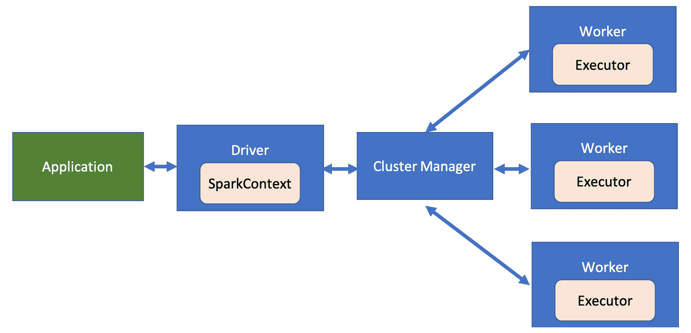
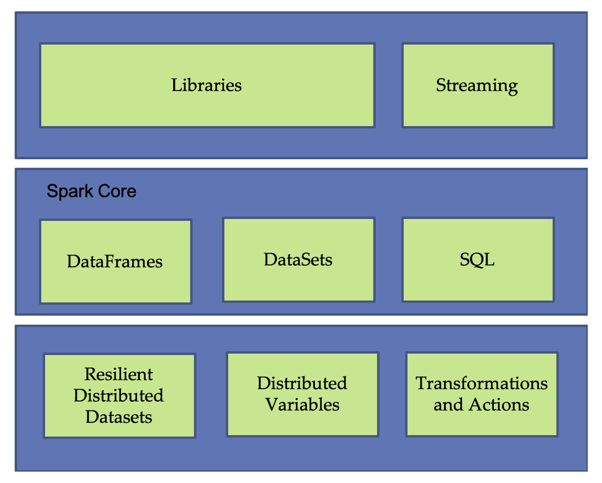
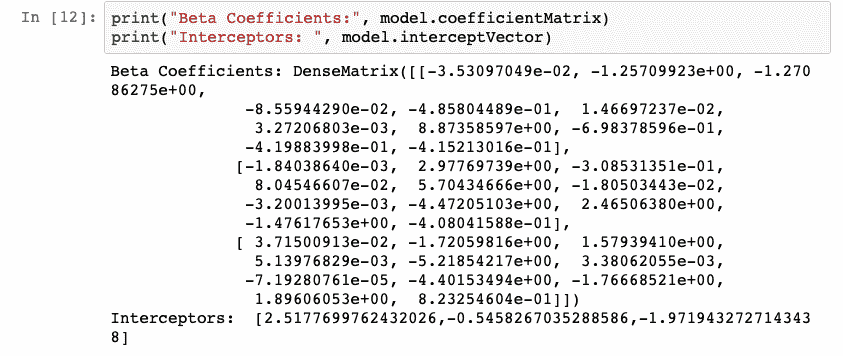
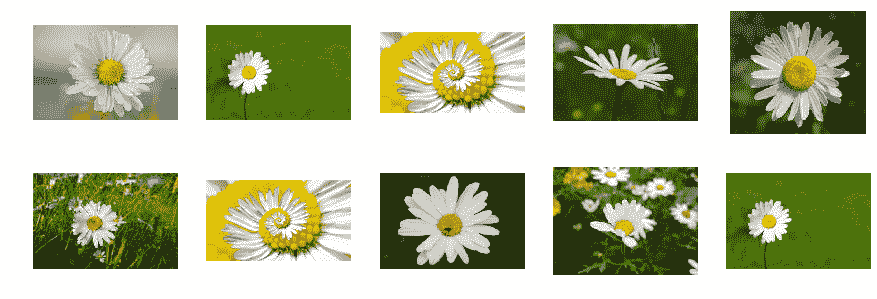
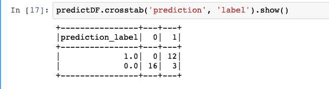
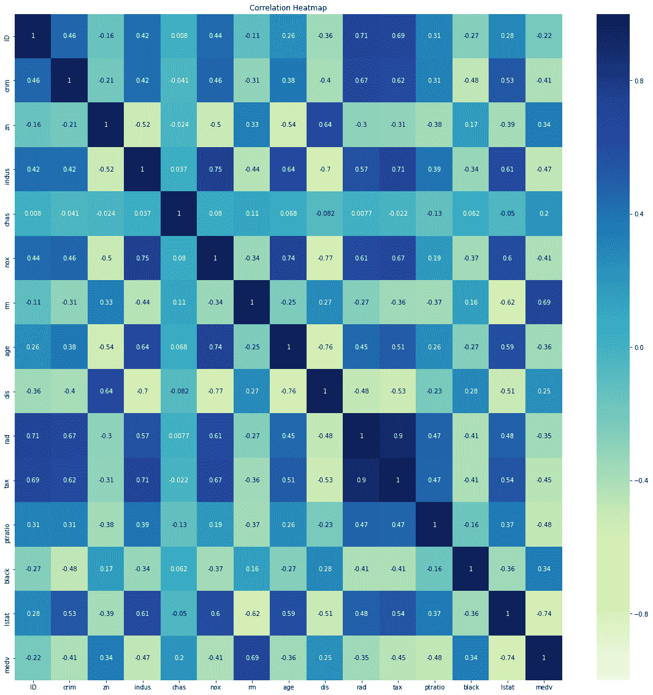
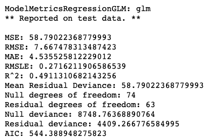
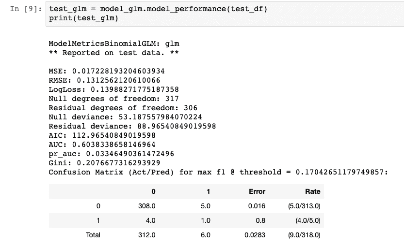
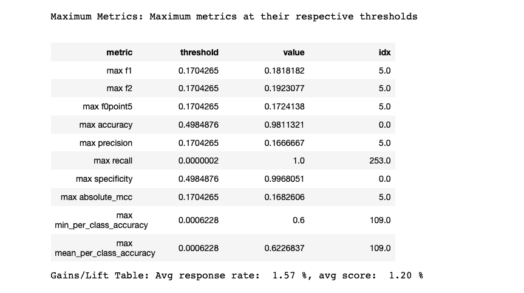
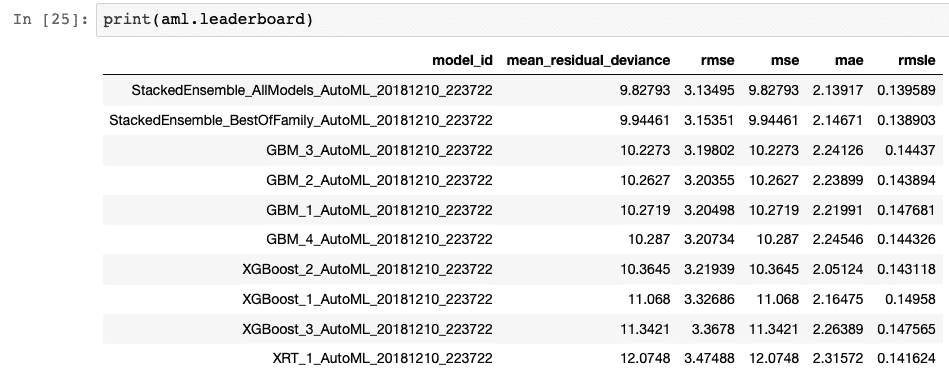

# 面向物联网的分布式人工智能

分布式计算环境的进步和互联网在世界范围内的便利性导致了**分布式人工智能** ( **戴**)的出现。在这一章中，我们将了解两个框架，一个是 Apache 的**机器学习库** ( **MLlib** )，另一个是 H2O.ai，两者都为大型流数据提供分布式和可扩展的**机器学习** ( **ML** )。本章将首先介绍 Apache 的 Spark，即事实上的分布式数据处理系统。本章将涵盖以下主题:

*   Spark 及其在分布式数据处理中的重要性
*   了解 Spark 架构
*   了解 MLlib
*   在深度学习管道中使用 MLlib
*   深入钻研 H2O.ai 平台


# 介绍

物联网系统产生大量数据；虽然在许多情况下可以从容地分析数据，但对于某些任务，如安全、欺诈检测等，这种延迟是不可接受的。在这种情况下，我们需要的是一种在指定时间内处理大数据的方法——解决方案——DAI，集群中的许多机器以分布式方式处理大数据(数据并行)和/或训练深度学习模型(模型并行)。有许多方法可以执行 DAI，大多数方法都是基于或围绕 Apache Spark 构建的。Apache Spark 于 2010 年在 BSD 许可下发布，目前是大数据领域最大的开源项目。它帮助用户创建一个快速通用的集群计算系统。

Spark 运行在 Java 虚拟机上，这使得它可以在任何安装了 Java 的机器上运行，无论是笔记本电脑还是集群。它支持包括 Python、Scala、r 在内的多种编程语言，围绕 Spark 和 TensorFlow 构建了大量的深度学习框架和 API，使 DAI 的任务变得更加简单，例如**TensorFlowOnSpark**(**TFoS**)、Spark MLlib、SparkDl、Hydrogen sparking(H2O . ai 和 Spark 的组合)。


# 火花部件

Spark 采用主从架构，有一个中央协调器(称为 **Spark driver** )和许多分布式工作器(称为 **Spark executors** )。驱动程序进程创建一个`SparkContext`对象，并将用户应用程序划分成更小的执行单元(任务)。这些任务由工人执行。工人之间的资源由一个**集群** **管理者**管理。下图显示了 Spark 的工作原理:



火花工作

现在让我们来看看 Spark 的不同组件。下图显示了构成 Spark 的基本组件:



构成火花的部件

简单地说，让我们看看本章中将要用到的一些组件，如下所示:

*   **弹性分布式数据集** : **弹性分布式数据集** ( **RDDs** )是 Spark 中的主要 API。它们代表不可变的、分区的数据集合，可以并行操作。更高层次的 API 数据帧和数据集建立在 rdd 之上。
*   **分布式变量** : Spark 有两种类型的分布式变量:广播变量和累加器。它们由用户定义的函数使用。累加器用于将来自所有执行者的信息聚集成一个共享的结果。或者，广播变量是在整个集群中共享的变量。
*   这是一个分布式的数据集合，非常像熊猫的数据框架。它们可以读取各种文件格式，并使用单个命令对整个数据帧执行操作。它们分布在整个集群中。
*   **库** : Spark 内置了 MLlib 库和 GraphX 库。在本章中，我们将使用使用 Spark 框架的 MLlib 和 SparkDl。我们将学习如何应用它们进行最大似然预测。

Spark 是一个很大的话题，给出关于 Spark 的进一步细节已经超出了本书的范围。我们推荐感兴趣的读者参考 Spark 文档:[http://spark.apache.org/docs/latest/index.html](http://spark.apache.org/docs/latest/index.html)。


# 阿帕奇 MLlib

Apache Spark MLlib 为 ML 提供了强大的计算环境。它在大规模的基础上提供了一个分布式体系结构，允许人们更快更有效地运行 ML 模型。这还不是全部；它是开源的，有一个不断发展和活跃的社区在不断努力改进和提供最新的特性。它提供了流行的 ML 算法的可伸缩实现。它包括以下算法:

*   **分类**:逻辑回归、线性支持向量机、朴素贝叶斯
*   **回归**:广义线性回归
*   **协同滤波**:交替最小二乘法
*   **聚类** : K 均值
*   **分解**:奇异值分解和主成分分析

事实证明，它比 Hadoop MapReduce 更快。我们可以用 Java、Scala、R 或 Python 编写应用程序。它也可以很容易地与 TensorFlow 集成。


# MLlib 中的回归

Spark MLlib 有内置的回归方法。为了能够使用 Spark 的内置方法，您必须在您的集群(独立或分布式集群)上安装`pyspark`。可以使用以下方法完成安装:

```
pip install pyspark
```

MLlib 库有以下回归方法:

*   线性回归:我们已经在前面的章节中学习了线性回归；我们可以通过在`pyspark.ml.regression`定义的`LinearRegression`类来使用这个方法。默认情况下，它使用正则化的最小平方误差。它支持 L1 和 L2 正则化，以及它们的组合。
*   **广义线性回归**:Spark MLlib 有一个指数族分布的子集，如高斯、泊松等。使用类`GeneralizedLinearRegression`实例化回归。
*   **决策树回归**:使用决策树回归，`DecisionTreeRegressor`类可用于进行预测。
*   **随机森林回归**:流行的 ML 方法之一，在`RandomForestRegressor`类中定义。
*   **梯度提升树回归**:我们可以使用`GBTRegressor`类来集成决策树。

此外，MLlib 还支持使用`AFTSurvivalRegression`和`IsotonicRegression`类的生存回归和保序回归。

在这些类的帮助下，我们可以用少至 10 行代码构建一个 ML 回归模型(或分类，您将在下一节看到)。基本步骤概述如下:

1.  建立 Spark 会话
2.  实现数据加载管道:加载数据文件，指定格式，并将其读入 Spark 数据帧
3.  识别要用作输入和目标的特征(可选择在训练/测试中分割数据集)
4.  实例化所需的类对象
5.  使用`fit()`方法，将训练数据集作为参数
6.  根据所选的回归变量，您可以查看学习参数并评估拟合模型

让我们对波士顿房价预测数据集([https://www . cs . Toronto . edu/~ delve/data/Boston/Boston detail . html](https://www.cs.toronto.edu/~delve/data/boston/bostonDetail.html))使用线性回归，其中数据集的格式为`csv`:

1.  导入必要的模块。我们将使用`LinearRegressor`定义线性回归类，使用`RegressionEvaluator`评估训练后的模型，使用`VectorAssembler`将特征组合为一个输入向量，使用`SparkSession`启动 Spark 会话:

```
from pyspark.ml.regression import LinearRegression as LR
from pyspark.ml.feature import VectorAssembler
from pyspark.ml.evaluation import RegressionEvaluator

from pyspark.sql import SparkSession
```

2.  接下来，使用`SparkSession`类启动 Spark 会话，如下所示:

```
spark = SparkSession.builder \
 .appName("Boston Price Prediction") \
 .config("spark.executor.memory", "70g") \
 .config("spark.driver.memory", "50g") \
 .config("spark.memory.offHeap.enabled",True) \
 .config("spark.memory.offHeap.size","16g") \
 .getOrCreate()
```

3.  让我们现在读取数据；我们首先从给定的路径加载数据，定义我们想要使用的格式，最后，将它读入 Spark 数据帧，如下所示:

```
house_df = spark.read.format("csv"). \
    options(header="true", inferschema="true"). \
    load("boston/train.csv")
```

4.  您可以看到现在加载到内存中的数据帧及其结构，如下面的屏幕截图所示:


5.  像 pandas 数据帧一样，Spark 数据帧也可以用一个命令来处理。让我们更深入地了解一下我们的数据集，如下图所示:


6.  接下来，我们定义我们想要用于训练的特征；为此，我们使用了`VectorAssembler`类。我们将来自`house_df`数据帧的列定义为输入特征向量和相应的输出预测(类似于定义`X_train`、`Y_train`)，然后执行相应的转换，如下所示:

```
vectors = VectorAssembler(inputCols = ['crim', 'zn','indus','chas',
    'nox','rm','age','dis', 'rad', 'tax',
    'ptratio','black', 'lstat'],
    outputCol = 'features')
vhouse_df = vectors.transform(house_df)
vhouse_df = vhouse_df.select(['features', 'medv'])
vhouse_df.show(5)
```


7.  然后，数据集被拆分为训练/测试数据集，如以下代码所示:

```
train_df, test_df = vhouse_df.randomSplit([0.7,0.3])
```

8.  现在我们已经准备好了数据集，我们实例化`LinearRegression`类并使其适合训练数据集，如下所示:

```
regressor = LR(featuresCol = 'features', labelCol='medv',\
    maxIter=20, regParam=0.3, elasticNetParam=0.8)
model = regressor.fit(train_df)
```

9.  我们可以获得线性回归的结果系数，如下所示:

```
print("Coefficients:", model.coefficients)
print("Intercept:", model.intercept)
```


10.  该模型在`21`迭代中的训练数据集上提供了`4.73`的 RMSE 值和`0.71`的`r2`值；

```
modelSummary = model.summary
print("RMSE is {} and r2 is {}"\ 
   .format(modelSummary.rootMeanSquaredError,\
    modelSummary.r2))
print("Number of Iterations is ",modelSummary.totalIterations)
```

11.  接下来，我们在测试数据集上评估我们的模型；我们获得了`5.55`的 RMSE 和`0.68`的 R2 值:

```
model_evaluator = RegressionEvaluator(predictionCol="prediction",\
    labelCol="medv", metricName="r2")
print("R2 value on test dataset is: ",\
    model_evaluator.evaluate(model_predictions))
print("RMSE value is", model.evaluate(test_df).rootMeanSquaredError)
```

一旦工作完成，您应该使用`stop()`方法停止 Spark 会话。完整代码见`Chapter08/Boston_Price_MLlib.ipynb`。低`r2`值和高 RMSE 的原因是，我们将训练数据集中的所有要素都视为输入要素向量，其中许多要素在确定房价时没有发挥重要作用。尝试减少功能，保留与价格高度相关的功能。


# MLlib 中的分类

MLlib 还提供了广泛的分类器；它提供了二项式和多项式逻辑回归。支持决策树分类器、随机森林分类器、梯度增强树分类器、多层感知器分类器、线性支持向量机分类器和朴素贝叶斯分类器。它们中的每一个都在其类中定义；详见[https://spark . Apache . org/docs/2 . 2 . 0/ml-classification-regression . html](https://spark.apache.org/docs/2.2.0/ml-classification-regression.html#naive-bayes)。基本步骤与我们在回归案例中学到的相同；唯一的区别是，现在模型评估的是准确性，而不是 RMSE 或 r2 指标。

本节将向您介绍使用 Spark MLlib 逻辑回归分类器实现的葡萄酒质量分类问题:

1.  对于这个分类问题，我们将使用通过`LogisticRegressor`类可用的逻辑回归。与前面的例子一样，`VectorAssembler`将用于将输入特征合并为一个矢量。在我们已经看到的葡萄酒质量数据集中([第 1 章](fa0444a6-ce5c-4bed-8d9d-ddab846fe571.xhtml)、*物联网和人工智能的原理和基础*)，质量是一个 0-10 之间的整数，我们需要处理它。这里，我们将使用`StringIndexer`进行处理。

Spark 的一个伟大特性是我们可以将所有预处理步骤定义为一个管道。当有大量预处理步骤时，这变得非常有用。这里，我们只有两个预处理步骤，但是为了展示管道是如何形成的，我们将使用`Pipeline`类。我们的第一步是导入所有这些模块，并创建一个 Spark 会话，如以下代码所示:

```
from pyspark.ml.classification import LogisticRegression as LR
from pyspark.ml.feature import VectorAssembler
from pyspark.ml.feature import StringIndexer
from pyspark.ml import Pipeline

from pyspark.sql import SparkSession

spark = SparkSession.builder \
    .appName("Wine Quality Classifier") \
    .config("spark.executor.memory", "70g") \
    .config("spark.driver.memory", "50g") \
    .config("spark.memory.offHeap.enabled",True) \
    .config("spark.memory.offHeap.size","16g") \
    .getOrCreate()
```

2.  我们将加载并读取`winequality-red.csv`数据文件，如下所示:

```
wine_df = spark.read.format("csv"). \
    options(header="true",\
    inferschema="true",sep=';'). \
    load("winequality-red.csv")
```

3.  我们处理给定数据集中的`quality`标签，将其分成三个不同的类，并将其作为新的`quality_new`列添加到现有的 Spark DataFrame 中，如以下代码所示:

```
from pyspark.sql.functions import when
wine_df = wine_df.withColumn('quality_new',\
    when(wine_df['quality']< 5, 0 ).\
    otherwise(when(wine_df['quality']<8,1)\
    .otherwise(2)))
```

4.  虽然修改了质量，`quality_new`已经是一个整数，我们可以直接用它作为我们的标签。在本例中，为了便于说明，我们添加了`StringIndexer`将其转换为数字指数。可以使用`StringIndexer`将字符串标签转换成数字索引。我们还使用`VectorAssembler`将列组合成一个特征向量。使用`Pipeline`将两个阶段结合在一起，如下所示:

```
string_index = StringIndexer(inputCol='quality_new',\
    outputCol='quality'+'Index')
vectors = VectorAssembler(inputCols = \
    ['fixed acidity','volatile acidity',\
    'citric acid','residual sugar','chlorides',\
    'free sulfur dioxide', 'total sulfur dioxide', \
    'density','pH','sulphates', 'alcohol'],\
    outputCol = 'features')

stages = [vectors, string_index]

pipeline = Pipeline().setStages(stages)
pipelineModel = pipeline.fit(wine_df)
pl_data_df = pipelineModel.transform(wine_df)
```

5.  管道后获得的数据然后被分成训练和测试数据集，如下面的代码所示:

```
train_df, test_df = pl_data_df.randomSplit([0.7,0.3])
```

6.  接下来，我们实例化`LogisticRegressor`类，并使用`fit`方法在训练数据集上训练它，如下所示:

```
classifier= LR(featuresCol = 'features', \
    labelCol='qualityIndex',\
    maxIter=50)
model = classifier.fit(train_df)
```

7.  在下面的截图中，我们可以看到学习到的模型参数:



8.  模型的准确率为 94.75%。我们还可以在下面的代码中看到其他评估指标，如`precision`和`recall`、F 度量、真阳性率和假阳性率:

```
modelSummary = model.summary

accuracy = modelSummary.accuracy
fPR = modelSummary.weightedFalsePositiveRate
tPR = modelSummary.weightedTruePositiveRate
fMeasure = modelSummary.weightedFMeasure()
precision = modelSummary.weightedPrecision
recall = modelSummary.weightedRecall
print("Accuracy: {} False Positive Rate {} \
    True Positive Rate {} F {} Precision {} Recall {}"\
    .format(accuracy, fPR, tPR, fMeasure, precision, recall))
```

我们可以看到，使用 MLlib 的葡萄酒质量分类器的性能与我们早期的方法相当。完整的代码可以在 GitHub 资源库的`Chapter08/Wine_Classification_MLlib.pynb`下找到。


# 使用 SparkDL 迁移学习

前几节阐述了如何使用 Spark 框架及其 MLlib 来解决 ML 问题。然而，在大多数复杂的任务中，深度学习模型提供了更好的性能。Spark 支持 SparkDL，这是一个基于 MLlib 的高级 API。它在后端使用 TensorFlow，还需要 TensorFrames、Keras 和 TFoS 模块。

在本节中，我们将使用 SparkDL 对图像进行分类。这将使您熟悉 Spark 对图像的支持。对于图像，正如我们在[第四章](cb9d27c5-e98d-44b6-a947-691b0bc64766.xhtml)、*物联网深度学习*、**卷积神经网络**(**CNN**)是事实上的选择。在[第四章](cb9d27c5-e98d-44b6-a947-691b0bc64766.xhtml)、*面向物联网的深度学习*、*、*我们从零开始构建 CNN，也了解了一些流行的 CNN 架构。CNN 的一个非常有趣的特性是，每个卷积层学会从图像中识别不同的特征，这就是它们充当特征提取器。较低的卷积层过滤掉线条和圆形等基本形状，而较高的卷积层过滤掉更抽象的形状。该属性可用于采用在一组图像上训练的 CNN，通过仅改变顶部完全连接的层来对另一组相似域图像进行分类。这种技术被称为**迁移学习**。根据新数据集图像的可用性和两个域之间的相似性，迁移学习可以极大地帮助减少训练时间和对大数据集的需求。

在 NIPS 2016 教程中，人工智能领域的关键人物之一吴恩达表示，*迁移学习将是商业成功的下一个驱动力*。在图像领域，使用在 ImageNet 数据中训练的 CNN 对其他领域的图像进行分类，在迁移学习方面取得了巨大成功。将迁移学习应用到其他数据领域的大量研究正在进行中。你可以从 Sebastian Ruder 的博客文章[http://ruder.io/transfer-learning/](http://ruder.io/transfer-learning/)中获得关于*迁移学习*的入门知识。

我们将使用由谷歌([https://arxiv.org/pdf/1409.4842.pdf](https://arxiv.org/pdf/1409.4842.pdf))提出的 CNN 架构 InceptionV3，在 ImageNet 数据集([http://www.image-net.org](http://www.image-net.org))上进行训练，以识别道路上的车辆(目前我们仅限于公共汽车和小汽车)。

开始之前，请确保您的工作环境中安装了以下模块:

*   PySpark
*   张量流
*   克拉斯
*   TFoS
*   张量框架
*   包
*   枕头
*   熊猫
*   Py4J
*   SparkDL
*   卡夫卡
*   街霸

这些可以使用`pip install`命令在您的独立机器或集群中的机器上安装。

接下来，您将学习如何使用 Spark 和 SparkDL 进行图像分类。我们已经用谷歌图片搜索对雏菊和郁金香这两种不同的花进行了截图；有 42 个雏菊的图像和 65 个郁金香的图像。在下面的截图中，你可以看到雏菊的样本截图:



以下截图显示了郁金香的样本图像:


我们的数据集太小，因此如果我们从头开始制作 CNN，它将无法提供任何有用的性能。在这种情况下，我们可以利用迁移学习。SparkDL 模块在类`DeepImageFeaturizer`的帮助下，提供了一种使用预训练模型的简单方便的方法。它支持以下 CNN 模型(在 ImageNet 数据集上预先训练([http://www.image-net.org](http://www.image-net.org)):

*   InceptionV3
*   例外
*   ResNet50
*   VGG16
*   VGG19

我们将使用 Google 的 InceptionV3 作为我们的基础模型。完整的代码可以从 GitHub 库的`Chapter08/Transfer_Learning_Sparkdl.ipynb`下获得:

1.  第一步，我们需要为 SparkDL 库指定环境。这是重要的一步；没有它，内核将不知道从哪里加载 SparkDL 包:

```
import os
SUBMIT_ARGS = "--packages databricks:spark-deep-learning:1.3.0-spark2.4-s_2.11 pyspark-shell"
os.environ["PYSPARK_SUBMIT_ARGS"] = SUBMIT_ARGS
```

即使在某些操作系统上使用`pip`安装 SparkDL，也需要指定操作系统环境或 SparkDL。

2.  接下来，让我们初始化一个`SparkSession`，如下面的代码所示:

```
from pyspark.sql import SparkSession
spark = SparkSession.builder \
    .appName("ImageClassification") \
    .config("spark.executor.memory", "70g") \
    .config("spark.driver.memory", "50g") \
    .config("spark.memory.offHeap.enabled",True) \
    .config("spark.memory.offHeap.size","16g") \
    .getOrCreate()
```

3.  我们导入必要的模块并读取数据图像。除了读取图像路径，我们还为 Spark 数据帧中的每个图像分配标签，如下所示:

```
import pyspark.sql.functions as f
import sparkdl as dl
from pyspark.ml.image import ImageSchema
from sparkdl.image import imageIO
dftulips = ImageSchema.readImages('data/flower_photos/tulips').\
    withColumn('label', f.lit(0))
dfdaisy = ImageSchema.readImages('data/flower_photos/daisy').\
    withColumn('label', f.lit(1))
```

4.  接下来，您可以看到两个数据帧的顶五行。第一列包含每个图像的路径，该列显示其标签(是属于雏菊(标签 1)还是属于郁金香(标签 0)):


5.  我们使用`randomSplit`函数将两个图像数据集分成训练集和测试集(这总是一个好的做法)。传统上，人们选择 60%—40%、70%—30%或 80%—20%的测试列车分割。我们在这里选择了 70%—30%的比例。为了训练的目的，我们然后组合在`trainDF`数据帧中的两朵花的训练图像和在`testDF`数据帧中的测试数据集图像，如下:

```
trainDFdaisy, testDFdaisy = dfdaisy.randomSplit([0.70,0.30],\
        seed = 123)
trainDFtulips, testDFtulips = dftulips.randomSplit([0.70,0.30],\
        seed = 122)
trainDF = trainDFdaisy.unionAll(trainDFtulips)
testDF = testDFdaisy.unionAll(testDFtulips)
```

6.  接下来，我们构建流水线，使用`InceptionV3`作为特征提取器，后跟逻辑回归分类器。我们使用`trainDF`数据框架来训练模型:

```
from pyspark.ml.classification import LogisticRegression
from pyspark.ml import Pipeline

vectorizer = dl.DeepImageFeaturizer(inputCol="image",\
        outputCol="features", modelName="InceptionV3")
logreg = LogisticRegression(maxIter=20, labelCol="label")
pipeline = Pipeline(stages=[vectorizer, logreg])
pipeline_model = pipeline.fit(trainDF)
```

7.  现在让我们在测试数据集上评估我们的训练模型。我们可以看到，在测试数据集上，我们使用以下代码获得了 90.32%的准确率:

```
predictDF = pipeline_model.transform(testDF) #predict on test dataset

from pyspark.ml.evaluation import MulticlassClassificationEvaluator as MCE
scoring = predictDF.select("prediction", "label")
accuracy_score = MCE(metricName="accuracy")
rate = accuracy_score.evaluate(scoring)*100
print("accuracy: {}%" .format(round(rate,2)))
```

8.  这是两个类别的混淆矩阵:



在不到 20 行代码中，我们能够训练模型并获得 90.32%的正确率。记住，这里使用的数据集是原始的；通过增加数据集图像并过滤掉低质量的图像，可以提高模型的性能。你可以从 GitHub 官方资源库:[https://github.com/databricks/spark-deep-learning](https://github.com/databricks/spark-deep-learning)了解更多深度学习库 SparkDL。


# H2O.ai 简介

H2O 是一个快速、可扩展的 ML 和深度学习框架，由 H2O.ai 开发，在开源 Apache 许可下发布。根据该公司提供的详细信息，超过 9，000 个组织和 80，000 多名数据科学家使用 H2O 来满足他们的 ML/深度学习需求。它使用内存压缩，这使它能够处理内存中的大量数据，即使是一个小型的机器集群。它有一个用于 R、Python、Java、Scala 和 JavaScript 的接口，甚至还有一个内置的 web 接口。H2O 可以在独立模式下运行，也可以在 Hadoop 或 Spark 集群上运行。

H2O 包括大量的 ML 算法，如广义线性建模、朴素贝叶斯、随机森林、梯度提升和深度学习算法。H2O 最好的部分是，你可以建立数以千计的模型，比较结果，甚至用几行代码进行超参数调整。H2O 也有更好的数据预处理工具。

H2O 需要 Java，因此，请确保您的系统上安装了 Java。您可以使用`PyPi`在 Python 中安装 H2O，如以下代码所示:

```
pip install h2o
```


# H2O 汽车公司

H2O 最令人兴奋的特色之一是自动 ML。这是开发一个非专家也能使用的用户友好的 ML 界面的尝试。H2O 汽车公司自动化了大量候选模型的训练和调整过程。其界面的设计使得用户只需指定他们的数据集、输入和输出特征，以及他们想要的对训练的总模型数量的任何约束，或时间约束。剩下的工作由 AutoML 自己完成；在指定的时间限制内，它会找出表现最佳的型号，并提供排行榜。已经观察到，通常，堆叠集成模型，所有先前训练的模型的集成，占据排行榜的顶部位置。高级用户可以使用大量选项；这些选项及其各种功能的详细信息可在 http://docs.h2o.ai/h2o/latest-stable/h2o-docs/automl.html[获得。](http://docs.h2o.ai/h2o/latest-stable/h2o-docs/automl.html)

想了解更多关于 H2O 的情况，你可以访问他们的网站: [http://h2o.ai](http://h2o.ai) 。


# H2O 的倒退

我们将首先展示如何在 H2O 进行回归。我们将使用与前面使用 MLlib 相同的数据集，即波士顿房价，并预测房屋的成本。完整的代码可以在 GitHub 找到:`Chapter08/boston_price_h2o.ipynb`:

1.  该任务所需的模块如下:

```
import h2o
import time
import seaborn
import itertools
import numpy as np
import pandas as pd
import seaborn as sns
import matplotlib.pyplot as plt
from h2o.estimators.glm import H2OGeneralizedLinearEstimator as GLM
from h2o.estimators.gbm import H2OGradientBoostingEstimator as GBM
from h2o.estimators.random_forest import H2ORandomForestEstimator as RF
%matplotlib inline
```

2.  导入必要的模块后，第一步是启动一个`h2o`服务器。我们使用`h2o.init()`命令来完成这项工作。它首先检查任何现有的`h20`实例，如果没有，它将启动一个。还可以通过将 IP 地址和端口号指定为`init()`函数的参数来连接到现有集群。在下面的截图中，您可以看到`init()`在独立系统上的结果:


3.  接下来，我们使用`h20` `import_file`函数读取数据文件。它把它载入 H2O 数据帧，这个数据帧可以像熊猫的数据帧一样容易处理。使用`cor()`方法，我们可以很容易地找到`h20`数据帧中不同输入特征之间的相关性:

```
boston_df = h2o.import_file("../Chapter08/boston/train.csv", destination_frame="boston_df")

plt.figure(figsize=(20,20))
corr = boston_df.cor()
corr = corr.as_data_frame()
corr.index = boston_df.columns
#print(corr)
sns.heatmap(corr, annot=True, cmap='YlGnBu',vmin=-1, vmax=1)
plt.title("Correlation Heatmap")
```

以下是波士顿房价数据集不同要素之间的关联图输出:



4.  现在，像往常一样，我们将数据集分为训练、验证和测试数据集。定义用作输入特征的特征(`x`):

```
train_df,valid_df,test_df = boston_df.split_frame(ratios=[0.6, 0.2],\
         seed=133)
features =  boston_df.columns[:-1]
```

5.  这项工作一旦完成，流程就非常简单了。我们只是实例化了 H2O 库中可用的回归模型类，并使用带有训练和验证数据集的`train()`作为参数。在`train`函数中，我们还指定了什么是输入特征(`x`)和输出特征(`y`)。在本例中，我们将所有可用的特征作为输入特征，将房价`medv`作为输出特征。我们可以通过使用打印语句来查看训练模型的特征。接下来，您可以看到广义线性回归模型的模型声明，以及在训练和验证数据集上训练后的结果:

```
model_glm = GLM(model_id='boston_glm')
model_glm.train(training_frame= train_df,\
         validation_frame=valid_df, \
         y = 'medv', x=features)
print(model_glm)
```


6.  训练之后，下一步是检查测试数据集的性能，这可以使用`model_performance()`函数轻松完成。我们还可以将它传递给任何数据集:训练、验证、测试或一些新的类似数据集:

```
test_glm = model_glm.model_performance(test_df)
print(test_glm)
```



7.  如果我们要使用梯度增强估计回归，或随机森林回归，我们将实例化各自的类对象；以下步骤将保持不变。变化的是输出参数；对于梯度增强估计器和随机森林，我们还将了解不同输入要素的相对重要性:

```
#Gradient Boost Estimator
model_gbm = GBM(model_id='boston_gbm')
model_gbm.train(training_frame= train_df, \
        validation_frame=valid_df, \
        y = 'medv', x=features)

test_gbm = model_gbm.model_performance(test_df)

#Random Forest
model_rf = RF(model_id='boston_rf')
model_rf.train(training_frame= train_df,\
        validation_frame=valid_df, \
        y = 'medv', x=features)

test_rf = model_rf.model_performance(test_df)
```

8.  机器和深度学习最困难的部分是选择正确的超参数。在 H2O，这个任务在它的`H2OGridSearch`类的帮助下变得相当容易。以下代码片段对先前定义的梯度增强估计器的超参数深度执行网格搜索:

```
from h2o.grid.grid_search import H2OGridSearch as Grid
hyper_params = {'max_depth':[2,4,6,8,10,12,14,16]}
grid = Grid(model_gbm, hyper_params, grid_id='depth_grid')
grid.train(training_frame= train_df,\
        validation_frame=valid_df,\
        y = 'medv', x=features)
```

9.  H2O 最好的部分是使用 AutoML 自动找到最好的模型。让它在 10 个模型中搜索我们，时间约束是 100 秒。AutoML 将使用这些参数构建 10 个不同的模型，不包括堆叠的整体。在训练最终堆叠集合模型之前，它将最多运行 100 秒:

```
from h2o.automl import H2OAutoML as AutoML
aml = AutoML(max_models = 10, max_runtime_secs=100, seed=2)
aml.train(training_frame= train_df, \
        validation_frame=valid_df, \
        y = 'medv', x=features)
```

10.  我们回归任务的排行榜如下:


排行榜中的不同型号可以使用各自的`model_id`进行访问。最佳模型通过 leader 参数访问。在我们的例子中，`aml.leader`代表最好的模型，所有模型的堆叠集合。我们可以使用`h2o.save_model`函数以二进制或 MOJO 格式保存最佳模型。


# H20 中的分类

相同的模型可以用于 H2O 的分类，只有一个变化；我们需要使用`asfactor()`函数将输出特征从数值改为分类值。我们将对红酒的质量进行分类，并使用我们的旧红酒数据库( [第三章](09538353-bf5b-4035-8b98-cc131bcfcf24.xhtml)，*物联网的机器学习*)。我们将需要导入相同的模块，并启动 H2O 服务器。完整代码可在`Chapter08/wine_classification_h2o.ipynb`文件中找到:

1.  下面是导入必要模块和启动 H2O 服务器的代码:

```
import h2o
import time
import seaborn
import itertools
import numpy as np
import pandas as pd
import seaborn as sns
import matplotlib.pyplot as plt
from h2o.estimators.glm import H2OGeneralizedLinearEstimator as GLM
from h2o.estimators.gbm import H2OGradientBoostingEstimator as GBM
from h2o.estimators.random_forest import H2ORandomForestEstimator as RF

%matplotlib inline

h2o.init()
```

2.  下一步是读取数据文件。我们首先修改输出特性以说明两个类别(好酒和坏酒),然后使用`asfactor()`函数将其转换为分类变量。这是 H2O 迈出的重要一步；因为我们对回归和分类使用相同的类对象，所以它们要求回归的输出标签为数字，分类的输出标签为分类，如代码块所示:

```
wine_df = h2o.import_file("../Chapter08/winequality-red.csv",\
        destination_frame="wine_df")    
features = wine_df.columns[:-1]
print(features)
wine_df['quality'] = (wine_df['quality'] > 7).ifelse(1,0)
wine_df['quality'] = wine_df['quality'].asfactor()
```

3.  接下来，将数据分成训练、验证和测试数据集。我们将训练和验证数据集馈送到广义线性估计器，其中有一个变化；我们指定了`family=binomial`参数，因为在这里，我们只有两个分类，好酒或坏酒。如果您有两个以上的类，请使用`family=multinomial`。记住，指定参数是可选的；H2O 自动检测输出特性:

```
train_df,valid_df,test_df = wine_df.split_frame(ratios=[0.6, 0.2],\
        seed=133)    

model_glm = GLM(model_id='wine_glm', family = 'binomial')
model_glm.train(training_frame= train_df, \
        validation_frame=valid_df,\
        y = 'quality', x=features)
print(model_glm)
```

4.  经过训练后，您可以看到模型在所有性能指标上的表现:准确度、精确度、召回率、F1 值和 AUC，甚至是混淆指标。您可以为所有三个数据集(训练、验证和测试)获取它们。以下是从广义线性估计量中获得的测试数据集的指标:





5.  在不改变之前代码的情况下，我们可以执行超调并使用 H2O 的 AutoML 来获得更好的模型:

```
from h2o.automl import H2OAutoML as AutoML
aml = AutoML(max_models = 10, max_runtime_secs=100, seed=2)
aml.train(training_frame= train_df, \
        validation_frame=valid_df, \
        y = 'quality', x=features)
```



我们看到，对于葡萄酒质量分类，最好的模型是 XGBoost。


# 摘要

随着物联网的无处不在，产生的数据正以指数级的速度增长。这些数据大多是非结构化的，并且数量庞大，通常被称为大数据。已经提出了大量的框架和解决方案来处理大量的数据。一个有前途的解决方案是 DAI，它在机器集群中分发模型或数据。我们可以使用分布式 TensorFlow 或 TFoS 框架来执行分布式模型训练。近年来，已经提出了一些易于使用的开源解决方案。最受欢迎和最成功的两个解决方案是 Apache Spark 的 MLlib 和 H2O.ai 的 H2O。在这一章中，我们展示了如何在 MLlib 和 H2O 中为回归和分类训练 ML 模型。Apache Spark MLlib 支持 SparkDL，它为图像分类和检测任务提供了出色的支持。本章使用 SparkDL 通过预训练的 InceptionV3 对花卉图像进行分类。另一方面，H2O.ai 的 H2O 可以很好地处理数值和表格数据。它提供了一个有趣而有用的 AutoML 功能，即使是非专家也可以在大量的 ML/深度学习模型中进行调整和搜索，只需用户提供非常少的细节。本章介绍了一个如何使用 AutoML 进行回归和分类任务的例子。

当在机器集群上工作时，可以充分利用这些分布式平台。随着计算和数据以可承受的速度转移到云，将 ML 的任务转移到云是有意义的。因此，接下来的一章，你将了解不同的云平台，以及如何使用它们来分析物联网设备生成的数据。