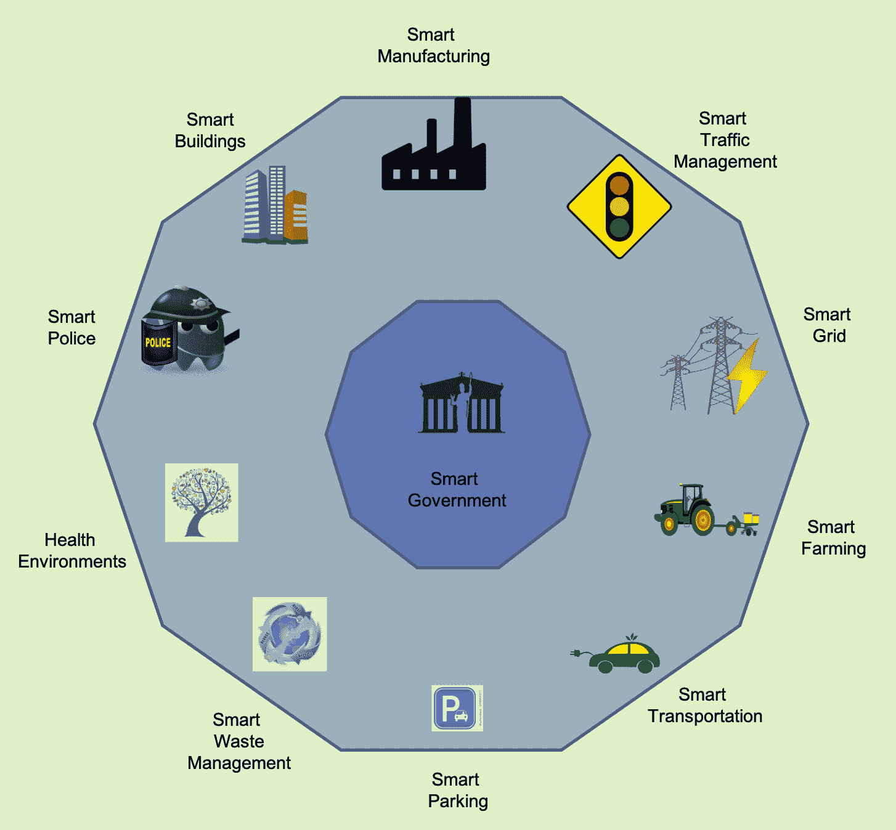
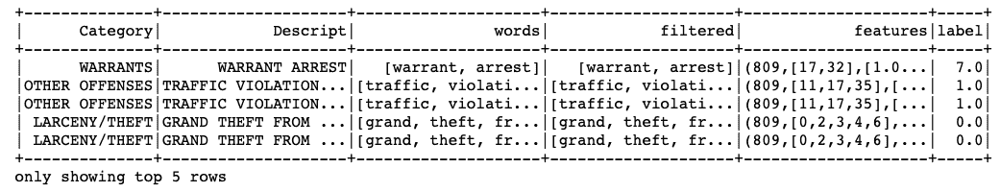

<title>AI for Smart Cities IoT</title>   

# 智能城市物联网的人工智能

本章向读者介绍了智能城市。案例研究将用于展示如何将本书中所学的概念应用于开发各种智能城市组件。阅读本章时，您将了解以下内容:

*   什么是智慧城市
*   智慧城市的基本要素
*   实施智能解决方案的全球城市
*   建设智能城市的挑战
*   编写代码以从旧金山犯罪数据中检测犯罪描述

<title>Why do we need smart cities?</title>   

# 我们为什么需要智慧城市？

联合国数据([https://population.un.org/wup/DataQuery/](https://population.un.org/wup/DataQuery/))显示，2050 年底世界人口将达到 97 亿(9.7 × 10 ⁹ )。据推测，几乎 70%的人口将是城市人口，许多城市的居民超过 1000 万。这是一个巨大的数字，随着数字的增长，我们不仅面临着新的机遇，还面临着许多独特的挑战:


预测的世界人口(数据来自联合国)

最困难的挑战是向所有居民提供资源和能源，同时避免环境恶化。目前，城市消耗了全球 75%的资源和能源，产生了 80%的温室气体；虽然有使用绿色能源的趋势，但我们都知道地球上的资源，比如食物和水，是有限的。另一个关键挑战是行政和管理；随着人口的增长，需要制定战略来预防卫生问题、缓解交通拥堵和阻止犯罪。

许多这些问题都可以通过使用人工智能支持的物联网来解决。可以利用技术进步为城市居民带来新的体验，让他们的日常生活更加舒适和安全。这催生了智慧城市的概念。

根据 techopedia([https://www.techopedia.com/definition/31494/smart-city](https://www.techopedia.com/definition/31494/smart-city))的说法，**智慧城市**是指利用信息和通信技术来提高城市服务(如能源和交通)的质量和性能，从而减少资源消耗、浪费和总体成本的城市。Deakin 和 AI Waer 列出了有助于定义智能城市的四个因素:

*   在城市基础设施中广泛使用电子和数字技术
*   利用**信息和通信技术** ( **ICT** )改变生活和工作环境
*   将信息和通信技术嵌入政府系统
*   实施将人和信通技术结合在一起的做法和政策，以促进创新并增强它们提供的知识

因此，智能城市将是一个不仅拥有信通技术，而且以积极影响居民的方式利用技术的城市。

Deakin 和 AI Waer 的论文定义了智能城市，并重点关注了所需的过渡:
Deakin，m .和 Al Waer，H. (2011)。*从智能到智慧城市。* *智能建筑国际，3* *(3)，140-152* 。

**人工智能** ( **AI** )与物联网一起，有可能解决城市人口过多带来的关键挑战；它们可以帮助解决交通管理、医疗保健、能源危机和许多其他问题。物联网数据和人工智能技术可以改善居住在智能城市的市民和企业的生活。

<title>Components of a smart city</title>   

# 智慧城市的组成部分

智能城市有许多人工智能支持的物联网技术的用例，从维护更健康的环境到增强公共交通和安全。在下图中，您可以看到智能城市的一些使用案例:



智能城市组件

在本节中，我们将概述最受欢迎的使用案例，其中一些已经在世界各地的智能城市中实施。

<title>Smart traffic management</title>   

# 智能交通管理

人工智能和物联网可以实施智能交通解决方案，以确保智能城市的居民尽可能安全高效地从城市的一个点到达另一个点。

洛杉矶是世界上最拥堵的城市之一，它实施了智能交通解决方案来控制交通流量。它安装了路面传感器和闭路电视摄像机，将交通流量的实时更新发送到中央交通管理系统。来自传感器和摄像头的数据被分析，并通知用户拥堵和交通信号故障。2018 年 7 月，该市进一步在各路口安装了**先进交通控制器** ( **ATC** )机柜。通过**车辆到基础设施** ( **V2I** )通信和 5G 连接，这使他们能够与具有交通灯信息功能的汽车进行通信，如奥迪 A4 或 Q7。你可以从他们的网站([https://dpw.lacounty.gov/TNL/ITS/](https://dpw.lacounty.gov/TNL/ITS/))了解更多关于洛杉矶智能交通系统的信息。

嵌入传感器的自动化车辆的发射可以提供车辆的位置和速度；它们可以直接与智能交通灯通信，防止拥堵。此外，使用历史数据，可以预测未来的交通并用于防止任何可能的拥堵。

<title>Smart parking</title>   

# 智能停车

任何生活在城市的人一定都感受过寻找停车位的艰难，尤其是在假期。智能停车可以缓解这种矛盾。智能停车解决方案将路面传感器嵌入停车点的地面，可以确定停车点是空闲还是被占用，并创建实时停车地图。

阿德莱德市在 2018 年 2 月安装了智能停车系统，他们还推出了一款手机应用程序:Park Adelaide，它将为用户提供准确和实时的停车信息。该应用程序可以为用户提供远程定位、支付甚至延长停车时间的能力。它还会给出可用停车位的方向，停车控制的信息，以及停车时段即将到期时的警报。阿德莱德市的智能停车系统旨在改善交通流量，减少交通拥堵，减少碳排放。智能停车系统的详细信息可在阿德莱德市网站上获得([https://www . cityofadelaide . com . au/city-business/why-Adelaide/Adelaide-smart-city/smart-parking](https://www.cityofadelaide.com.au/city-business/why-adelaide/adelaide-smart-city/smart-parking))。

旧金山市交通局实施了智能停车系统，旧金山市交通局实施了智能停车系统。他们使用无线传感器来检测咪表车位的实时占用率。SFpark 于 2013 年推出，减少了 25%的工作日温室气体排放，交通量下降，司机的搜索时间减少了 50%。SAFTA 报告的另一个好处是，通过使人们更容易支付停车费，减少了因停车计时器损坏而造成的损失，因此与停车相关的收入增加了约 190 万美元。

在伦敦，威斯敏斯特市([https://io tuk . org . uk/smart-parking/# 1463069773359-c 0 d6f 90 f-4d ca](https://iotuk.org.uk/smart-parking/#1463069773359-c0d6f90f-4dca))也在 2014 年联合玛奇纳研究公司([https://machinaresearch.com/login/?next=/forecasts/usecase/](https://machinaresearch.com/login/?next=/forecasts/usecase/))建立了智能停车系统。早些时候，司机平均要等 12 分钟，导致拥堵和污染，但自从安装了智能停车系统，就没有必要再等了；司机可以使用手机找到一个可用的停车位。这不仅减少了拥堵和污染，还增加了收入。

<title>Smart waste management</title>   

# 智能废物管理

废物收集及其适当的管理和处置是一项重要的城市服务。城市人口的增加要求采用更好的垃圾管理方法。智能城市应该全面解决垃圾管理问题。采用人工智能进行智能回收和废物管理可以提供一个可持续的废物管理系统。2011 年，一家芬兰公司 Zen robotics([https://zenrobotics.com/](https://zenrobotics.com/))展示了如何使用计算机视觉和人工智能(机器人)来训练从移动的传送带上分拣和挑选回收材料。自那时以来，我们走过了漫长的道路；许多公司提供智能废物管理解决方案，城市和建筑正在采用它们。领导者和社区建设者越来越意识到部署智能城市基础设施的潜在好处。

巴塞罗那的垃圾管理系统([http://a juntament . Barcelona . cat/ecologiaurbana/en/services/the-city-works/maintenance-of-public-areas/waste-management-and-cleaning-services/home-waste-collection](http://ajuntament.barcelona.cat/ecologiaurbana/en/services/the-city-works/maintenance-of-public-areas/waste-management-and-cleaning-services/household-waste-collection))是一个很好的案例研究。他们在垃圾箱上安装了传感器和设备，可以向当局发送警报通知，一旦垃圾箱即将装满，当局就会派出垃圾收集车。他们在每个地方都为纸张、塑料、玻璃和废弃食品准备了单独的垃圾箱。巴塞罗那当局建立了一个与地下真空管相连的容器网络，可以吸走垃圾，并将其留在处理单元中；这消除了垃圾车收集垃圾的需要。

另一个很好的案例研究是丹麦的废物管理([https://www . smartbin . com/TDC-Denmark-Cisco-showcase-the-future-of-smart-city-waste-collection/](https://www.smartbin.com/tdc-denmark-cisco-showcase-the-future-of-smart-city-waste-collection/))，由 smart bin 提供。SmartBin 与丹麦最大的电信服务公司 TDC 和思科合作，在一系列集装箱上安装了传感器，这些传感器与城市数字平台集成在一起。此外，灯柱和交通灯也安装了传感器，将数据发送到市政厅的控制台。从这些传感器获得的实时数据有助于清洁服务更有效地规划垃圾收集路线；他们只需要去需要清空的地方。

在阿拉伯联合酋长国的沙迦安装了 10 个配有 Wi-Fi 装置的太阳能大肚子垃圾箱；他们计划在不久的将来部署数百个这样的智能垃圾箱，以实现可持续发展目标。

<title>Smart policing</title>   

# 智能警务

不幸的是，犯罪无处不在。每个城市都有警察部队试图抓捕罪犯并降低犯罪率。智能城市还需要警务:智能警务，执法机构采用基于证据的数据驱动战略，这些战略有效、高效且经济。智能警务的概念在 2009 年出现，主要是由于有限的预算限制。赫尔曼·戈尔茨坦(威斯康星大学，1979 年)提出了推动智能警务概念的基本思想。他认为，警方不应该将犯罪事件视为孤立的事件，而应该将其视为有历史和未来的问题的公开系统。

在美国，**司法援助局** ( **BJA** )资助了许多**智能警务倡议** ( **SPI** )，根据其调查结果，这些倡议已经导致暴力犯罪显著减少。SPI 侧重于警方-研究伙伴关系，其中研究伙伴提供持续的数据收集和分析，监控数据，参与解决方案开发，并评估其影响。这些举措帮助警方查明了以下情况:

*   犯罪热点
*   多产罪犯

新加坡也启动了智能国家倡议。这个城市的几乎每个角落都安装了摄像头和传感器网络。他们使用从他们那里获得的信息来识别人们在禁止吸烟区的什么地方吸烟，或者在高层住宅里闲逛。这些摄像头使当局能够监控人群密度、公共场所的清洁度，甚至跟踪所有注册车辆的准确移动。摄像头的图像被传送到一个名为**虚拟新加坡**的在线平台上，该平台实时提供关于这座城市的信息。

<title>Smart lighting</title>   

# 智能照明

路灯是必须的，但是很耗能。智能照明系统有助于提高路灯的能效。除此之外，灯柱还可以安装额外的传感器，或作为 Wi-Fi 网络热点。

一项可以帮助在任何城市安装智能照明的发明是 city sense([https://www.tvilight.com/citysense/](https://www.tvilight.com/citysense/))，一种屡获殊荣的路灯运动传感器；它集成了无线照明控制。CitySense 专为恶劣的外部环境而设计，提供按需自适应照明。这些灯可以根据行人、骑自行车的人或汽车的存在来调节亮度。它采用实时网状网络来触发邻近的灯光，并在人类居住者周围创建一个安全的光环。它有智能过滤器，可以过滤掉小动物或移动树木造成的干扰。该系统可以自动检测任何灯故障并触发维护呼叫。荷兰的梵高村已经将 CitySense 应用于他们的智能街道照明系统。

还值得一提的是巴塞罗那的照明总体规划倡议；据报道，街灯的耗电量显著减少。大约在 2014 年，该市的大多数灯柱都安装了 LED 灯，并安装了物联网传感器。当街道空无一人时，传感器会自动将灯光调暗，这有助于降低能耗。此外，这些灯柱还充当 Wi-Fi 网络热点，并装有传感器来监测空气质量。

<title>Smart governance</title>   

# 智能治理

智能城市的主要目的是为其居民创造舒适便捷的生活。因此，没有智慧治理，智慧城市基础设施就不完整。智能治理意味着智能地使用信息和通信技术，通过不同利益相关者(包括政府和公民)之间更好的协作来改进决策。智能治理可以被视为智能、开放和参与性政府的基础。这需要重塑政府、公民和其他社会参与者的角色，以及探索新技术来构建新的治理模式，包括新关系、新流程和新政府结构。智能治理将能够使用数据、证据和其他资源来改善决策，并能够交付满足公民需求的结果。这将加强决策过程，提高公共服务的质量。

<title>Adapting IoT for smart cities and the necessary steps</title>   

# 让物联网适应智能城市和必要步骤

建设智慧城市不是一日之功，也不是一个人或一个组织的工作。它需要许多战略伙伴、领导人甚至公民的合作。这种合作的动态超出了本书的范围，但是，因为这本书是为人工智能爱好者和工程师编写的，所以让我们探索人工智能社区可以做什么，哪些领域为我们提供了职业或创业机会。任何物联网平台都必须具备以下条件:

*   用于收集数据的智能设备(传感器、摄像机、执行器等)网络
*   现场(云)网关，可以从低功耗物联网设备收集数据，存储数据，并将其安全转发到云
*   流式数据处理器，用于聚合大量数据流，并将它们分发到数据湖和控制应用程序
*   存储所有原始数据的数据湖，甚至是那些看起来没有价值的数据
*   可以清理和结构化收集的数据的数据仓库
*   用于分析和可视化传感器收集的数据的工具
*   基于长期数据分析实现城市服务自动化的人工智能算法和技术，以及提高控制应用程序性能的方法
*   用于向物联网执行器发送命令的控制应用
*   连接智能事物和市民的用户应用

除此之外，还会有关于安全和隐私的问题，服务提供商必须确保这些智能服务不会对公民的福祉构成任何威胁。服务本身应该易于使用，以便公民能够采用。

正如你所看到的，这提供了一系列的工作机会，特别是对人工智能工程师来说。物联网生成的数据需要处理，要真正从中受益，我们需要超越监控和基本分析。人工智能工具将需要识别传感器数据中的模式和隐藏的相关性。使用 ML/AI 工具分析历史传感器数据有助于识别趋势，并基于这些趋势创建预测模型。然后，这些模型可以被控制应用程序用来向物联网设备的执行器发送命令。

建设智慧城市的过程将是一个迭代的过程，每次迭代都会增加更多的处理和分析。考虑智能交通灯的情况，让我们看看我们如何迭代地改进它。

与传统的交通信号灯相比，我们的智能交通信号灯可以根据交通状况调整信号定时。我们可以使用历史交通数据来训练模型，以揭示交通模式并调整信号定时，以最大化平均车速，从而避免拥堵。这种孤立的智能交通灯是好的，但还不够。假设一个地区出现了拥堵，那么如果路上的司机被告知避开那条路线，那就太好了。现在要做到这一点，我们可以增加一个额外的处理系统；它使用交通灯传感器数据识别拥堵，并使用车辆或司机智能手机上的 GPS，通知拥堵区域附近的司机避开该路线。

下一步，交通灯可以添加更多的传感器，如可以监测空气质量的传感器，然后训练模型，以确保在达到临界空气质量之前发出警报。

<title>Cities with open data</title>   

# 开放数据的城市

在过去的十年里，世界上许多城市都建立了开放数据门户。这些开放的数据门户不仅有助于公民保持知情，而且对人工智能编码人员来说也是福音，因为数据驱动人工智能。让我们看看一些有趣的数据门户和它们提供的数据。

《福布斯》上的这篇文章列出了美国 90 个拥有开放数据的城市:[https://www . Forbes . com/sites/meta brown/2018/04/29/city-governments-making-public-data-easy-to-get-90-municipal-open-data-portals/# 4542 e 6 f 95 a0d](https://www.forbes.com/sites/metabrown/2018/04/29/city-governments-making-public-data-easier-to-get-90-municipal-open-data-portals/#4542e6f95a0d)。

<title>Atlanta city Metropolitan Atlanta Rapid Transit Authority data</title>   

# 亚特兰大市大都会亚特兰大捷运局数据

**亚特兰大大都会快速交通管理局** ( **MARTA** )发布实时公共交通数据，旨在为开发者提供开发定制 web 和移动应用的机会。MARTA 平台为开发人员提供访问数据的资源，并使用数据开发应用程序([https://www.itsmarta.com/app-developer-resources.aspx](https://www.itsmarta.com/app-developer-resources.aspx))。

**通用中转馈电规范** ( **GTFS** )格式用于提供数据。GTFS 是公共交通时刻表和地理信息的标准格式。它由一系列文本文件组成，每个文件模拟交通信息的一个特定方面:站点、路线、行程和类似的预定数据。

MARTA 还通过 RESTful APIs 提供数据。要访问 API，您需要安装 MARTA-Python，这是用于访问 MARTA 实时 API 的 Python 库。可以使用`pip`安装 Python 库:

```
pip install tox
```

在使用 API 之前，您需要注册并注册 API 密钥([https://www.itsmarta.com/developer-reg-rtt.aspx](https://www.itsmarta.com/developer-reg-rtt.aspx))。API 密钥将存储在`MARTA_API_KEY`环境变量中。要设置`MARTA_API_KEY`,您可以使用以下命令:

在 Windows 上，使用以下内容:

```
set MARTA_API_KEY=<your_api_key_here>
```

在 Linux/MAC 上，使用以下命令:

```
export MARTA_API_KEY=<your_api_key_here>
```

它提供了两个主要的包装函数`get_buses()`和`get_trains()`，这两个函数都采用关键字参数来过滤结果:

```
from marta.api import get_buses, get_trains

# To obtain list of all buses
all_buses = get_buses()

# To obtain a list of buses by route
buses_route = get_buses(route=1)

# To obtain list of all trains
trains = get_trains()

# To obtain list of trains specified by line
trains_red = get_trains(line='red')

# To obtain list of trains by station
trains_station = get_trains(station='Midtown Station')

# To obtain list of trains by destination
trains_doraville = get_trains(station='Doraville')

# To obtain list of trains by line, station, and destination
trains_all = get_trains(line='blue', 
            station='Five Points Station', 
            destination='Indian Creek')
```

`get_buses()`和`get_trains()`函数分别返回`Bus`和`Train`字典对象。

<title>Chicago Array of Things data</title>   

# 芝加哥物联网数据阵列

2016 年启动的**物联网** ( **AoT** )项目包括在灯柱上安装传感器盒网络。这些传感器收集大量关于周围环境和城市活动的实时数据。开发人员和爱好者可以通过批量下载和 API 获得生成的数据。

传感器被部署在几个地理区域，每个部署区域被命名为**项目**，其中最大的部署在芝加哥，属于名为芝加哥的项目。

部署的物理设备被称为**节点**节点**节点**，每个节点通过其唯一的序列号 VSN 来标识。这些节点连接在一起构成一个网络。这些节点包含**传感器**，这些传感器观察环境的各个方面，如温度、湿度、光强和颗粒物。传感器记录的信息称为**观察值**。

观察结果具有冗余性，可以通过 API 以原始形式获得。节点和观测值、传感器和观测值之间存在一对多的关系。项目、节点和传感器之间也存在多对多的关系。AoT 项目的完整数据和细节可以从芝加哥市开放数据门户[https://data.cityofchicago.org/](https://data.cityofchicago.org/)获得。

<title>Detecting crime using San Francisco crime data</title>   

# 使用旧金山犯罪数据检测犯罪

旧金山市也有一个开放的数据门户([https://datasf.org/opendata/](https://datasf.org/opendata/))，在线提供不同部门的数据。在这一部分中，我们采用提供旧金山所有社区大约 12 年(从 2003 年 1 月到 2015 年 5 月)犯罪报告的数据集，并训练一个模型来预测发生的犯罪类别。有 39 个谨慎的犯罪类别，因此这是一个多类分类问题。

我们将利用 Apache 的 PySpark，并使用其易于使用的文本处理特性来处理这个数据集。因此，第一步是创建一个 Spark 会话:

1.  第一步是导入必要的模块并创建一个 Spark 会话:

```
from pyspark.ml.classification import LogisticRegression as LR
from pyspark.ml.feature import RegexTokenizer as RT
from pyspark.ml.feature import StopWordsRemover as SWR
from pyspark.ml.feature import CountVectorizer
from pyspark.ml.feature import OneHotEncoder, StringIndexer, VectorAssembler
from pyspark.ml import Pipeline
from pyspark.sql.functions import col
from pyspark.sql import SparkSession

spark = SparkSession.builder \
        .appName("Crime Category Prediction") \
        .config("spark.executor.memory", "70g") \
        .config("spark.driver.memory", "50g") \
        .config("spark.memory.offHeap.enabled",True) \
        .config("spark.memory.offHeap.size","16g") \
        .getOrCreate()
```

2.  我们加载一个`csv`文件中可用的数据集:

```
data = spark.read.format("csv"). \
        options(header="true", inferschema="true"). \
        load("sf_crime_dataset.csv")

data.columns
```


3.  数据包含九列:`[Dates, Category, Descript, DayOfWeek, PdDistrict, Resolution, Address, X, Y]`，我们将只需要`Category`和`Descript`字段用于训练和测试数据集:

```
drop_data = ['Dates', 'DayOfWeek', 'PdDistrict', 'Resolution', 'Address', 'X', 'Y']
data = data.select([column for column in data.columns if column not in drop_data])

data.show(5)
```


4.  现在我们的数据集有了文本数据，所以我们需要执行文本处理。三个重要的文本处理步骤是:对数据进行标记，移除停用词，并将词向量化成向量。我们将使用`RegexTokenizer`，它将使用正则表达式将句子标记为单词列表，因为标点符号或特殊字符不会增加任何意义，我们只保留包含字母数字内容的单词。有一些像`the`这样的词，它们会很常见地出现在文本中，但不会给上下文增加任何意义。我们可以使用内置的`StopWordsRemover`类删除这些单词(也称为**停止单词**)。我们使用标准的停止字`["http","https","amp","rt","t","c","the"]`。最后使用`CountVectorizer`，我们将单词转换成数字向量(特征)。这些数字特征将被用作训练模型的输入。我们数据的输出是`Category`列，但是它也是包含 36 个不同类别的文本，因此，我们需要将其转换为一个热编码向量；PySpark 的`StringIndexer`可以很容易地用于它。我们将所有这些转换添加到我们的数据中`Pipeline`:

```
# regular expression tokenizer
re_Tokenizer = RT(inputCol="Descript", 
            outputCol="words", pattern="\\W")    

# stop words
stop_words = ["http","https","amp","rt","t","c","the"] 
stop_words_remover = SWR(inputCol="words", 
            outputCol="filtered").setStopWords(stop_words)

# bag of words count
count_vectors = CountVectorizer(inputCol="filtered",
         outputCol="features", vocabSize=10000, minDF=5)

#One hot encoding the label
label_string_Idx = StringIndexer(inputCol = "Category", 
                outputCol = "label")

# Create the pipeline
pipeline = Pipeline(stages=[re_Tokenizer, stop_words_remover,
             count_vectors, label_string_Idx])

# Fit the pipeline to data.
pipeline_fit = pipeline.fit(data)
dataset = pipeline_fit.transform(data)

dataset.show(5)
```



5.  现在，数据已经准备好了，我们将它分成训练和测试数据集:

```
# Split the data randomly into training and test data sets.
(trainingData, testData) = dataset.randomSplit([0.7, 0.3], seed = 100)
print("Training Dataset Size: " + str(trainingData.count()))
print("Test Dataset Size: " + str(testData.count()))
```

6.  让我们为它拟合一个简单的逻辑回归模型。在测试数据集上，它提供了 97%的准确率。雅虎！：

```
# Build the model
logistic_regrssor = LR(maxIter=20, 
                regParam=0.3, elasticNetParam=0)
# Train model with Training Data
model = logistic_regrssor.fit(trainingData)

# Make predictions on Test Data
predictions = model.transform(testData)

# evaluate the model on test data set
evaluator = MulticlassClassificationEvaluator(predictionCol="prediction")
evaluator.evaluate(predictions)
```

完整的代码可以在 GitHub 资源库`Chapter11/SF_crime_category_detection.ipynb` Jupyter 笔记本中找到。

<title>Challenges and benefits</title>   

# 挑战和优势

人工智能正在改变城市运营、交付和维护公共设施的方式，从照明和交通到连接和健康服务。然而，如果选择的技术不能有效地与其他城市服务协同工作或集成，则采用可能会受到阻碍。因此，考虑改造解决方案很重要。

另一件需要注意的重要事情是协作。要让城市真正从智能城市提供的潜力中受益，需要改变思维方式。当局应该跨多个部门制定更长远的计划。每个人——技术专家、地方政府、企业、环保人士和公众——都必须共同努力，让城市成功转型为智能城市。

虽然预算可能是一个大问题，但世界不同城市成功实施智能城市组件的结果表明，通过适当的实施，智能城市更加经济。智能城市转型不仅能创造就业机会，还能帮助保护环境、减少能源支出并创造更多收入。巴塞罗那市就是一个最好的例子；通过实施物联网系统，它创造了约 47，000 个工作岗位，为€节省了 4，250 万英镑的水费，并通过智能停车每年额外产生 3，650 万英镑的€。我们很容易看到，城市可以从利用人工智能支持的物联网解决方案的技术进步中受益匪浅。

<title>Summary</title>   

# 摘要

人工智能驱动的物联网解决方案可以帮助连接城市，管理多种基础设施和公共服务。本章涵盖了智能城市的各种使用案例，从智能照明和道路交通到互联公共交通和废物管理。从成功的案例研究中，我们还了解到，智能城市可以降低能源成本，优化自然资源的使用，建设更安全的城市和更健康的环境。这一章列出了一些开放的城市数据门户和那里可用的信息。我们使用本书中学到的工具对旧金山 12 年间的犯罪报告数据进行分类。最后，本章讨论了智慧城市建设中的一些挑战和益处。