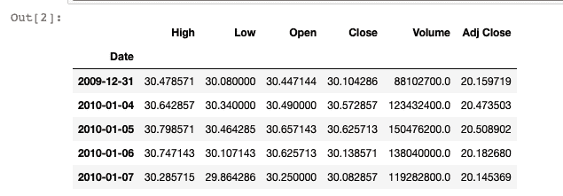
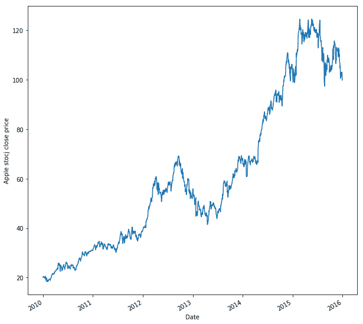
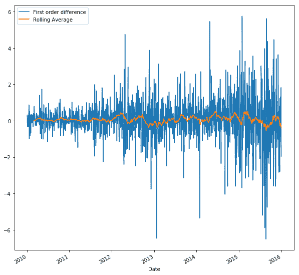
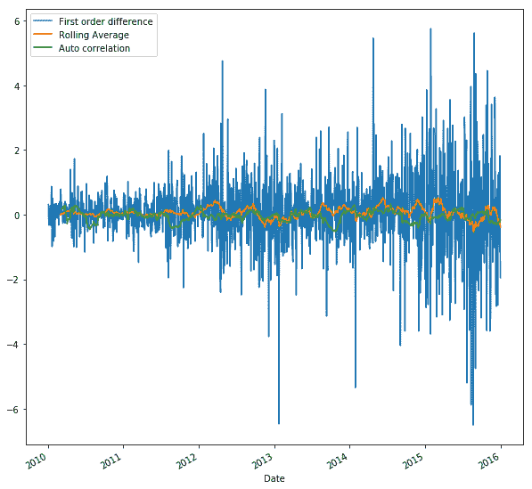
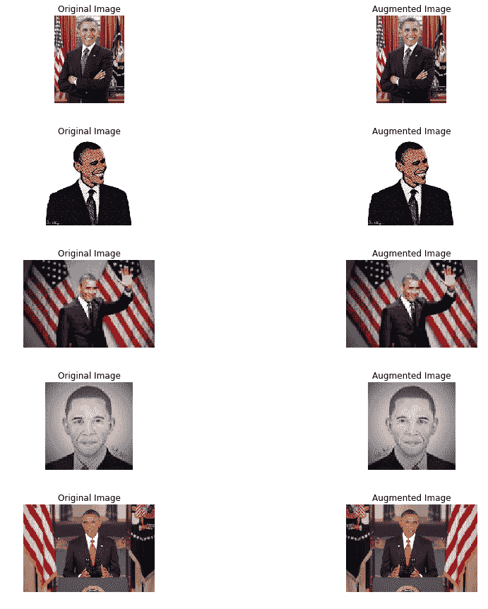
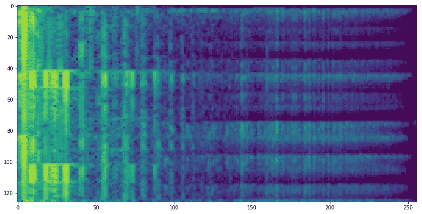

<title>Combining It All Together</title>   

# 将所有这些结合在一起

现在我们已经理解并实现了不同的**人工智能** ( **AI** )/ **机器学习** ( **ML** )算法，是时候将它们全部结合在一起，了解哪种类型的数据最适合每一种，同时，了解每种类型的数据所需的基本预处理。本章结束时，您将了解以下内容:

*   可以提供给模型的不同类型的数据
*   如何处理时间序列数据
*   文本数据的预处理
*   可以对图像数据进行的不同变换
*   如何处理视频文件
*   如何处理语音数据
*   云计算选项

<title>Processing different types of data</title>   

# 处理不同类型的数据

数据有各种形状、大小和形式:推文、每日股票价格、每分钟心跳信号、相机拍摄的照片、闭路电视拍摄的视频、音频记录等等。它们中的每一个都包含信息，当正确处理和使用正确的模型时，我们可以分析数据，并获得关于底层模式的高级信息。在这一节中，我们将介绍每种类型的数据在被提供给模型之前所需的基本预处理，以及可用于该数据的模型。

<title>Time series modeling</title>   

# 时间序列建模

时间是许多有趣的人类行为的基础，因此，由人工智能驱动的物联网系统知道如何处理与时间相关的数据非常重要。时间可以显式地表示，例如，在时间标记也是数据的一部分的情况下以规则的间隔捕获数据，或者隐式地表示，例如，在语音或书面文本中。允许我们捕捉时间相关数据中固有模式的方法称为**时间序列建模**。

定期捕获的数据是时间序列数据，例如，股票价格数据就是时间序列数据。我们来看看苹果股价数据；这些数据可以从纳斯达克网站([https://www.nasdaq.com/symbol/aapl/historical](https://www.nasdaq.com/symbol/aapl/historical))下载。或者，您可以使用`pandas_datareader`模块通过指定数据源直接下载数据。要在您的工作环境中安装`pandas_datareader`，请使用以下方法:

```
pip install pandas_datareader
```

1.  下面的代码从雅虎财经下载了从 2010 年 1 月 1 日^(到 2015 年 12 月 31 日^(的苹果公司股票价格:))

```
import datetime
from pandas_datareader import DataReader
%matplotlib inline

Apple = DataReader("AAPL", "yahoo", 
        start=datetime.datetime(2010, 1, 1), 
        end=datetime.datetime(2015,12,31)) 
Apple.head()
```

2.  下载的数据帧提供了每个工作日的`High`、`Low`、`Open`、`Close`、`Volume`和`Adj Close`值:



3.  现在让我们绘制它，如下所示:

```
close = Apple['Adj Close']
plt.figure(figsize= (10,10))
close.plot()
plt.ylabel("Apple stocj close price")
plt.show()
```



为了能够对时间序列数据进行建模，我们需要确定一些事情:趋势、季节性和平稳性。

4.  **趋势**是指发现测量值平均来说是否会随着时间的推移而减少(或增加)。寻找趋势最常见的方法是绘制移动平均线，如下所示:

```
moving_average = close.rolling(window=20).mean()

plt.figure(figsize= (10,10))
close.plot(label='Adj Close')
moving_average.plot(label='Moving Average Window 20')
plt.legend(loc='best')
plt.show()
```


5.  我们可以看到，窗口为 20 时，上升和下降趋势。对于时间序列建模，我们应该去趋势数据。可以通过从原始信号中减去趋势(移动平均)来消除趋势。另一种流行的方法是使用一阶差分法，即取连续数据点之间的差值:

```
fod = close.diff()
plt.figure(figsize= (10,10))
fod.plot(label='First order difference')
fod.rolling(window=40).mean().\
        plot(label='Rolling Average')
plt.legend(loc='best')
plt.show()
```



6.  **季节性**是与时间相关的高点和低点的有规律的重复模式(例如，正弦序列)。最简单的方法是在数据中找到自相关。一旦找到季节性，就可以通过将数据与季节长度相对应的时间延迟进行差分来消除季节性:

```
# Autocorrelation
plt.figure(figsize= (10,10))
fod.plot(label='First order difference')
fod.rolling(window=40).mean().\
        plot(label='Rolling Average')
fod.rolling(window=40).corr(fod.shift(5)).\
        plot(label='Auto correlation')
plt.legend(loc='best')
plt.show()
```



7.  最后要保证数列是否**平稳**，即数列的均值不再是时间的函数。数据的平稳性对于时间序列建模至关重要。我们通过去除数据中存在的任何趋势或季节性来实现平稳性。一旦数据稳定，我们就可以使用回归模型对其建模。

传统上，时间序列数据使用自回归和移动平均模型建模，如 ARMA 和 ARIMA 模型。要了解更多关于时间序列建模的知识，有兴趣的读者可以参考这些书籍:

*   潘迪特和吴(1983)。*时间序列与系统分析及应用*(第三卷)。纽约:威利。

*   布罗克韦尔，P. J .，戴维斯，R. A .，和考尔德，M. V. (2002)。*时间序列与预测概论*(下册)。纽约:斯普林格。

平稳性是任何时间序列数据的一个重要属性，无论您是使用传统的时间序列建模还是深度学习模型。这是因为，如果一个序列具有平稳性(即使它是弱平稳性)，那么它意味着数据在时间上具有相同的分布，因此，可以在时间上进行估计。如果您计划使用深度学习模型，如 RNN 或 LSTM，那么在确认时间序列的平稳性之后，您还需要对数据进行归一化，并使用滑动窗口变换将序列转换为可以进行回归的输入输出对。使用 scikit-learn 库和 NumPy 可以非常容易地做到这一点:

1.  让我们标准化`close`数据帧。标准化确保数据位于`0`和`1`之间。注意到下面的图与前面的*步骤 3* 中的`close`数据框的图相同，但是 *y* 轴刻度现在不同了:

```
# Normalization
from sklearn.preprocessing import MinMaxScaler
def normalize(data):
    x = data.values.reshape(-1,1)
    pre_process = MinMaxScaler()
    x_normalized = pre_process.fit_transform(x)
    return x_normalized

x_norm = normalize(close)

plt.figure(figsize= (10,10))
pd.DataFrame(x_norm, index = close.index).plot(label="Normalized Stock prices")
plt.legend(loc='best')
plt.show()
```


2.  我们定义了一个`window_transform()`函数，它将把数据序列转换成一系列输入输出对。例如，您希望构建一个 RNN，它将前五个值作为输出，并预测第六个值。然后，你选择`window_size = 5`:

```
# Create window from the normalized data
def window_transform(series, window_size):
    X = []
    y = []

    # Generate a sequence input/output pairs from series
    # x= <s1,s2,s3,s4,s5,... s_n> y = s_n+1 and so on
    for i in range(len(series) - window_size):
    X.append(series[i:i+window_size])
    y.append(series[i+window_size])

    # reshape each 
    X = np.asarray(X)
    X.shape = (np.shape(X)[0:2])
    y = np.asarray(y)
    y.shape = (len(y),1)

    return X,y

window_size = 7
X,y = window_transform(x_norm,window_size = window_size)
```

请参考 GitHub 库`Chapter-12/time_series_data_preprocessing.ipynb`，获取本节的完整代码。

<title>Preprocessing textual data</title>   

# 预处理文本数据

语言在我们的日常生活中起着非常重要的作用。对于我们来说，阅读一篇书面文字是非常自然的，但是计算机呢？他们能看懂吗？我们可以让我们的深度学习模型基于旧模式生成新文本吗？例如，如果我说，“昨天，我在星巴克吃了 ____ ”,我们大多数人都能猜到空白处是咖啡，但我们的深度学习模型能做到吗？答案是肯定的；我们可以训练我们的深度学习模型来猜测下一个单词(或字符)。但是深度学习模型运行在计算机上，计算机只懂二进制，只懂 0 和 1。因此，我们需要一种方法来处理文本数据，以便将其转换为计算机易于处理的形式。此外，虽然 cat 或 Cat 或 CAT 具有不同的 ASCII 表示，但它们的意思是相同的；这对于我们来说很容易理解，但是为了让模型将它们视为相同，我们需要对文本数据进行预处理。本节将列出文本数据的必要预处理步骤，您将学习如何在 Python 中进行预处理:

1.  在这一部分，我们将考虑一小段来自我最喜欢的科幻小说《T20 基金会》和艾萨克·阿西莫夫的《T21》的文字。文本在`foundation.txt`文件中。第一步是，我们在课文中读到:

```
f = open('foundation.txt')
text = f.read()
print(text)
```

2.  文本处理的下一步是清理数据。我们只保留文本中相关的部分。在大多数情况下，标点符号不会给文本增加任何额外的意义，因此我们可以安全地删除它:

```
# clean data
import re
# remove Punctuation
text = re.sub(r"[^a-zA-Z0-9]", " ", text) 
print(text)
```

3.  清理完数据后，我们需要对文本进行规范化。在文本处理中，规范化文本意味着将所有文本转换成相同的大小写，小写或大写。按照惯例，小写是首选，因此我们将文本转换为小写:

```
# Normalize text
# Convert to lowercase
text = text.lower() 
print(text)
```

4.  一旦文本被规范化，下一步就是标记文本。我们可以用单词标记或句子标记来标记文本。为此，您可以使用 split 函数或者使用强大的 NLTK 模块。如果您的系统中没有安装 NLTK，您可以使用`pip install nltk`来完成。下面，我们使用 NLTK 的单词标记器来完成这项任务:

```
import os
import nltk
nltk.download('punkt') 
from nltk.tokenize import word_tokenize

# Split text into words using NLTK
words_nltk = word_tokenize(text)
print(words_nltk)
```

5.  根据你的文本类型和你正在做的工作，你需要删除停用词。停用词是出现在大多数文本样本中的词，因此不会给文本的上下文或含义添加任何信息。例如，和。您可以声明自己的停用词或使用 NLTK 提供的停用词。这里，我们从文本中删除了`english`语言的`stopwords`:

```
from nltk.corpus import stopwords
nltk.download('stopwords')
#Remove stop words
words = [w for w in words \
        if w not in stopwords.words("english")]

```

6.  可以对文本数据执行的另一件事是词干化和词汇化。这些用于将单词转换成规范形式:

```
from nltk.stem.porter import PorterStemmer

# Reduce words to their stems
stemmed = [PorterStemmer().stem(w) for w in words]
print(stemmed)

from nltk.stem.wordnet import WordNetLemmatizer

# Reduce words to their root form
lemmed = [WordNetLemmatizer().lemmatize(w) for w in words]
print(lemmed)
```

你可以在 GitHub: `Chapter12/text_processing.ipynb`用这个代码访问笔记本。

<title>Data augmentation for images</title>   

# 图像的数据扩充

Python 有 OpenCV，对图像提供了非常好的支持。OpenCV 可以从 Conda 频道和 PyPi 下载安装。一旦使用 OpenCV `imread()`函数读取了图像，图像就被表示为一个数组。如果图像是彩色的，频道按 BGR 顺序存储。数组的每个元素代表相应像素值的强度(值在 0 到 255 的范围内)。

假设你训练了一个模型来识别一个球:你给它一个网球，它就把它识别为一个球。我们展示的下一张球的图像是放大后拍摄的:我们的模型还能识别它吗？模型就像它被训练的数据集一样好，因此，如果模型在训练时看到了重新缩放的图像，它将很容易将缩放的球识别为球。确保此类图像在数据集中可用的一种方法是隐式包含此类可变图像，但是，由于图像表示为数组，因此我们可以执行数学变换来重新缩放、翻转、旋转，甚至更改强度。对现有训练图像执行这些变换以生成新图像的过程被称为**数据扩充**。使用数据扩充的另一个优势是，您可以增加训练数据集的大小(当与数据生成器一起使用时，我们可以获得无限的图像)。

大多数深度学习库都有标准的 API 来执行数据增强。在 Keras([https://keras.io/preprocessing/image/](https://keras.io/preprocessing/image/)，有`ImageDataGenerator`，在 TensorFlow-TfLearn，我们有`ImageAugmentation`。TensorFlow 还具有执行图像转换和变换的操作([https://www.tensorflow.org/api_guides/python/image](https://www.tensorflow.org/api_guides/python/image))。在这里，我们将看到如何使用 OpenCV 强大的库进行数据扩充，并创建我们自己的数据生成器:

1.  我们导入了必要的模块:OpenCV 用于读取和处理图像，`numpy`用于矩阵操作，Matplotlib 用于可视化图像，`shuffle`来自 scikit-learn 用于随机调整数据，Glob 用于在目录中查找文件:

```
import cv2 # for image reading and processsing
import numpy as np
from glob import glob
import matplotlib.pyplot as plt
from sklearn.utils import shuffle
%matplotlib inline
```

2.  我们阅读必要的文件。在这个例子中，我们从谷歌图片搜索下载了一些美国前总统巴拉克·奥巴马的图片:

```
img_files = np.array(glob("Obama/*"))
```

3.  我们创建了一个函数，它可以在图像中随机引入以下任何失真:在 0-50 度范围内随机旋转，随机改变强度，随机水平和垂直移动图像多达 50 个像素，或者随机翻转图像:

```
def distort_image(img, rot = 50, shift_px = 40):
    """
    Function to introduce random distortion: brightness, flip,
    rotation, and shift 
    """
    rows, cols,_ = img.shape
    choice = np.random.randint(5)
    #print(choice)
    if choice == 0: # Randomly rotate 0-50 degreee
        rot *= np.random.random() 
        M = cv2.getRotationMatrix2D((cols/2,rows/2), rot, 1)
        dst = cv2.warpAffine(img,M,(cols,rows))
    elif choice == 1: # Randomly change the intensity
        hsv = cv2.cvtColor(img, cv2.COLOR_RGB2HSV)
        ratio = 1.0 + 0.4 * (np.random.rand() - 0.5)
        hsv[:, :, 2] = hsv[:, :, 2] * ratio
        dst = cv2.cvtColor(hsv, cv2.COLOR_HSV2RGB)
    elif choice == 2: # Randomly shift the image in horizontal and vertical direction
        x_shift,y_shift = np.random.randint(-shift_px,shift_px,2)
        M = np.float32([[1,0,x_shift],[0,1,y_shift]])
        dst = cv2.warpAffine(img,M,(cols,rows))
    elif choice == 3: # Randomly flip the image
        dst = np.fliplr(img)
    else:
        dst = img

    return dst
```

4.  在下图中，您可以看到上述函数对从我们的数据集中随机选择的图像的结果:



5.  最后，您可以使用 Python `yield`创建一个数据生成器来生成任意多的图像:

```
# data generator
def data_generator(samples, batch_size=32, validation_flag = False):
    """
    Function to generate data after, it reads the image files, 
    performs random distortions and finally 
    returns a batch of training or validation data
    """
    num_samples = len(samples)
    while True: # Loop forever so the generator never terminates
 shuffle(samples)
        for offset in range(0, num_samples, batch_size):
            batch_samples = samples[offset:offset+batch_size]
            images = []

            for batch_sample in batch_samples:
                if validation_flag: # The validation data consists only of center image and without distortions
                    image = cv2.imread(batch_sample)
                    images.append(image)
                    continue
                else: # In training dataset we introduce distortions to augment it and improve performance
                    image = cv2.imread(batch_sample)
                    # Randomly augment the training dataset to reduce overfitting
                    image = distort_image(image)
                    images.append(image)

        # Convert the data into numpy arrays
        X_train = np.array(images)

        yield X_train 

train_generator = data_generator(img_files,  batch_size=32)
```

`Chapter12/data_augmentation.ipynb`文件包含这个部分的代码。

<title>Handling videos files</title>   

# 处理视频文件

视频只不过是静止图像(帧)的集合，因此，如果我们可以从视频中提取图像，我们就可以在其上应用我们可信的 CNN 网络。唯一需要做的事情是将视频转换成帧列表:

1.  我们首先导入的是必要的模块。我们将需要 OpenCV 来读取视频并将其转换为帧。我们还需要用于基本数学运算的`math`模块和用于可视化框架的 Matplotlib:

```
import cv2 # for capturing videos
import math # for mathematical operations
import matplotlib.pyplot as plt # for plotting the images
%matplotlib inline
```

2.  我们使用 OpenCV 函数读取视频文件，并通过使用属性标识符`5`([https://docs . OpenCV . org/2.4/modules/high GUI/doc/reading _ and _ writing _ images _ and _ video . html # video capture-get](https://docs.opencv.org/2.4/modules/highgui/doc/reading_and_writing_images_and_video.html#videocapture-get))获取其帧速率:

```
videoFile = "video.avi" # Video file with complete path
cap = cv2.VideoCapture(videoFile) # capturing the video from the given path
frameRate = cap.get(5) #frame rate
```

3.  我们使用`read()`函数逐个循环视频的所有帧。虽然我们一次只读取一帧，但是每秒只保存第一帧。这样，我们可以覆盖整个视频，同时减少数据量:

```
count = 0
while(cap.isOpened()):
    frameId = cap.get(1) #current frame number
    ret, frame = cap.read()
    if (ret != True):
        break
    if (frameId % math.floor(frameRate) == 0):
        filename ="frame%d.jpg" % count
        count += 1
        cv2.imwrite(filename, frame)

cap.release()
print ("Finished!")
```

4.  让我们想象一下我们保存的第五帧:

```
img = plt.imread('frame5.jpg') # reading image using its name
plt.imshow(img)
```


这段代码的视频文件来自伊万·拉普捷夫和芭芭拉·卡普托([http://www.nada.kth.se/cvap/actions/](http://www.nada.kth.se/cvap/actions/))维护的网站。代码可在 GitHub: `Chapter12/Video_to_frames.ipynb`获得。

使用 CNN 对视频进行分类的最佳论文之一是 Andrej Karpathy 等人的*使用卷积神经网络的大规模视频分类*..可以在这里访问:[https://www . cv-foundation . org/open access/content _ cvpr _ 2014/html/Karpathy _ Large-scale _ Video _ class ification _ 2014 _ CVPR _ paper . html](https://www.cv-foundation.org/openaccess/content_cvpr_2014/html/Karpathy_Large-scale_Video_Classification_2014_CVPR_paper.html)。

<title>Audio files as input data</title>   

# 音频文件作为输入数据

另一种有趣的数据类型是音频文件。将语音转换为文本或对音频声音进行分类的模型将音频文件作为输入。如果你想处理音频文件，那么你需要`librosa`模块。有许多方法可以处理音频文件；我们可以将其转换为时间序列，并使用递归网络。另一种给出良好结果的方法是将它们用作一维或二维模式，并训练一个 CNN 来对它们进行分类。一些采用这种方法的优秀论文如下:

*   Hershey，s .，Chaudhuri，s .，Ellis，D. P .，Gemmeke，J. F .，Jansen，a .，Moore，R. C .，和斯莱尼，M. (2017 年 3 月)。*用于大规模音频分类的 CNN 架构。*在声学、语音和信号处理(ICASSP)，2017 IEEE 国际会议上(第 131-135 页)。IEEE。

*   Palaz 博士、Magimai-Doss 博士和 Collobert 博士(2015 年)。*使用原始语音作为输入的基于 CNN 的语音识别系统的分析*。国际语言交流协会第十六届年会。

*   张 h，I，宋 y(2015 年 4 月)。*使用卷积神经网络的稳健声音事件识别*。声学、语音和信号处理(ICASSP)，2015 年 IEEE 国际会议论文集(第 559-563 页)。IEEE。

*   科斯塔，Y. M .，奥利维拉，L. S .，和小西拉，C. N. (2017)。*使用频谱图评估用于音乐分类的卷积神经网络*。应用软件计算，52，28–38。

我们将使用`librosa`模块读取一个音频文件，并将其转换为一维声音模式和二维声谱图。您可以使用以下命令在 Anaconda 环境中安装`librosa`:

```
pip install librosa
```

1.  这里我们将导入`numpy`、`matplotlib`和`librosa`。我们将从`librosa`数据集中选取示例音频文件:

```
import librosa
import numpy as np
import matplotlib.pyplot as plt
%matplotlib inline
# Get the file path to the included audio example
filename = librosa.util.example_audio_file()
```

2.  `librosa` load 函数将音频数据作为时间序列返回，表示为一维 NumPy 浮点数组。我们可以用它们作为时间序列，甚至作为 CNN 的一维模式:

```
input_length=16000*4
def audio_norm(data):
    # Function to Normalize
    max_data = np.max(data)
    min_data = np.min(data)
    data = (data-min_data)/(max_data-min_data) 
    return data

def load_audio_file(file_path, 
            input_length=input_length):
    # Function to load an audio file and 
    # return a 1D numpy array 
    data, sr = librosa.load(file_path, sr=None)

    max_offset = abs(len(data)-input_length)
    offset = np.random.randint(max_offset)
    if len(data)>input_length:
        data = data[offset:(input_length+offset)]
    else:
        data = np.pad(data, (offset, 
            input_size - len(data) - offset), 
            "constant")    

    data = audio_norm(data)
    return data
```

3.  在下图中，您可以看到标准化后的一维音频波形:

```
data_base = load_audio_file(filename)
fig = plt.figure(figsize=(14, 8))
plt.title('Raw wave ')
plt.ylabel('Amplitude')
plt.plot(np.linspace(0, 1, input_length), data_base)
plt.show()
```


4.  `librosa`还有一个`melspectrogram`功能，我们可以用它来形成 mel 光谱图，它可以作为 CNN 的二维图像:

```
def preprocess_audio_mel_T(audio, sample_rate=16000, 
        window_size=20, #log_specgram
        step_size=10, eps=1e-10):

    mel_spec = librosa.feature.melspectrogram(y=audio,
             sr=sample_rate, n_mels= 256)
    mel_db = (librosa.power_to_db(mel_spec,
         ref=np.max) + 40)/40
    return mel_db.T

def load_audio_file2(file_path,
             input_length=input_length):
    #Function to load the audio file  
    data, sr = librosa.load(file_path, sr=None)

    max_offset = abs(len(data)-input_length)
    offset = np.random.randint(max_offset)
    if len(data)>input_length:
        data = data[offset:(input_length+offset)]
    else:
        data = np.pad(data, (offset, 
            input_size - len(data) - offset),
            "constant")

    data = preprocess_audio_mel_T(data, sr)
    return data
```

5.  以下是同一音频信号的 mel 声谱图:

```
data_base = load_audio_file2(filename)
print(data_base.shape)
fig = plt.figure(figsize=(14, 8))
plt.imshow(data_base)
```



您可以在 GitHub 存储库中的`Chapter12/audio_processing.ipynb`文件下找到示例的代码文件。

<title>Computing in the cloud</title>   

# 云计算

将人工智能算法应用于物联网生成的数据需要计算资源。随着大量以有竞争力的价格提供服务的云平台的出现，云计算提供了一种经济高效的解决方案。在当今众多可用的云平台中，我们将谈论占据大部分市场份额的三个主要云平台提供商:**亚马逊 Web 服务** ( **AWS** )、**谷歌云平台** ( **GCP** )和微软 Azure。

<title>AWS</title>   

# 自动警报系统

亚马逊几乎提供了云下的所有功能，从云数据库到云计算资源，甚至是云分析。它甚至为构建安全的数据湖提供了空间。其物联网核心允许用户将设备连接到云。它提供了一个单一的仪表板，可用于控制您登录的服务。它的服务按小时收费。近 15 年来，它一直在提供这些服务。亚马逊不断升级服务，提供更好的用户体验。你可以从 AWS 的网站了解更多信息:[https://aws.amazon.com/](https://aws.amazon.com/)。

它允许新用户在一整年内免费使用它的许多服务。

<title>Google Cloud Platform</title>   

# 谷歌云平台

谷歌云平台([https://cloud.google.com/](https://cloud.google.com/))也提供了无数的服务。它提供云计算、数据分析、数据存储，甚至云人工智能产品，为用户提供预先训练的模型和服务，以生成他们自己定制的模型。平台允许你按分钟付费。它提供企业级的安全服务。谷歌云控制台是访问和控制所有 GCP 服务的一站式平台。GCP 第一年提供 300 美元的信用额度，让你可以免费使用它的所有服务。

<title>Microsoft Azure</title>   

# 微软 Azure

微软 Azure 也提供各种各样的云服务。微软云服务([https://azure.microsoft.com/en-in/](https://azure.microsoft.com/en-in/))最棒的地方在于它的易用性；您可以轻松地将其与可用的微软工具集成。它声称比 AWS 便宜五倍。像 AWS 和 GCP 一样，Azure 也提供价值 200 美元的一年免费试用。

您可以使用这些云服务来开发、测试和部署您的应用程序。

<title>Summary</title>   

# 摘要

本章重点为读者提供处理不同类型数据的工具，以及如何为深度学习模型做准备。我们从时间序列数据开始。本章接下来详细说明了文本数据需要如何预处理。本章展示了如何执行数据扩充，这是一种用于图像分类和对象检测的重要技术。接下来我们继续处理视频；我们展示了如何从视频中形成图像帧。接下来，本章讲述了音频文件；我们从一个音频文件中形成了一个时间序列和 mel 谱图。最后，我们谈到了云平台，并讨论了三大云服务提供商提供的功能和服务。